# 🚀 Project: EVE-NG

## 👤 Authors

- [@alfaXphoori](https://www.github.com/alfaXphoori)

---

## ⚙️ Environment Variables

- **VMware Workstation Pro** [Download Here](https://drive.google.com/file/d/1bxlDTs__T3jXgVUE330gMokMCemzCkCg/view?usp=sharing)
- **EVE-NG ISO** [Download Here](https://www.eve-ng.net/)

---

## 📥 Installation Guide

### 💻 Virtualization Settings (Intel or AMD)

- Ensure **Virtualization Technology (VT-x/AMD-V)** is enabled in BIOS.
- 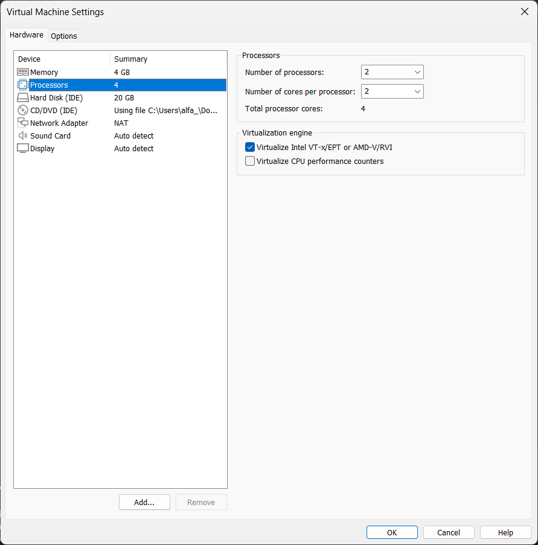

### 🛠 Disable Hypervisor Launch Type

- Open **PowerShell** as Administrator and execute:

```bash
bcdedit /set hypervisorlaunchtype off
```
- 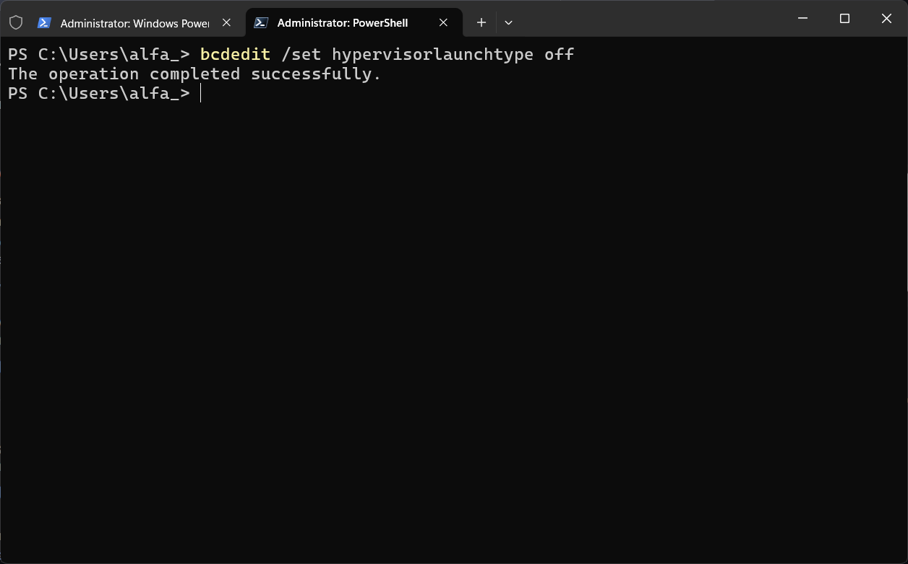

### 🔹 Disable Group Policy Restrictions

- Open **Edit Group Policy**
- Navigate to:
  - **Computer Configuration** → **Administrative Templates** → **System** → **Device Guard**
  - Disable **Deploy App Guard**
- 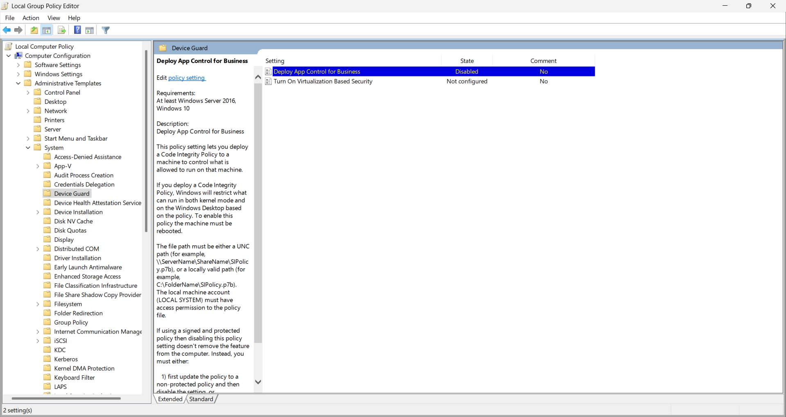

### 🔹 Turn Off Memory Integrity

- Go to **Settings** → **Privacy & Security** → **Windows Security** → **Device Security**
- **Turn Off Memory Integrity**
- 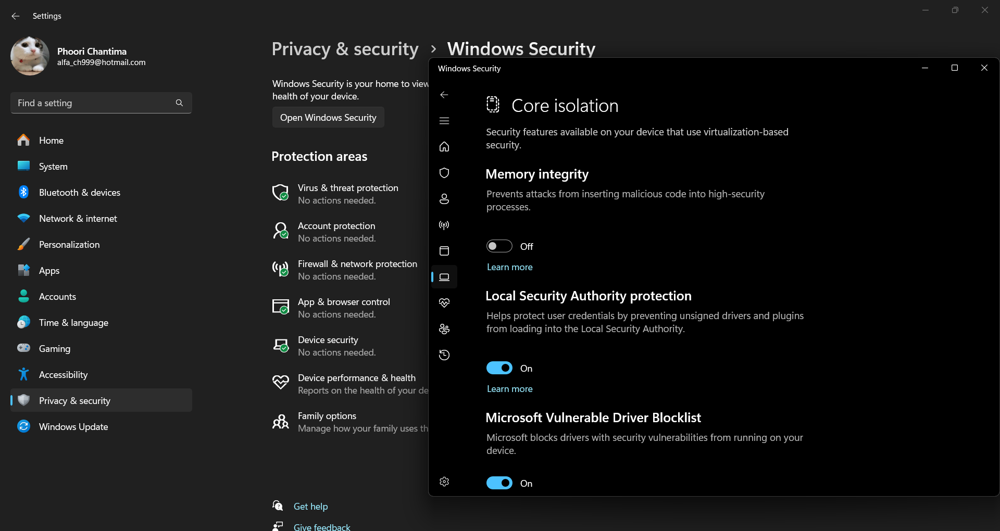

### 🔹 Disable Windows Features

- Open **Turn Windows Features On or Off**
- **Disable**:
  - **Hyper-V**
  - **Virtual Machine Platform**
  - **Windows Hypervisor Platform**
- 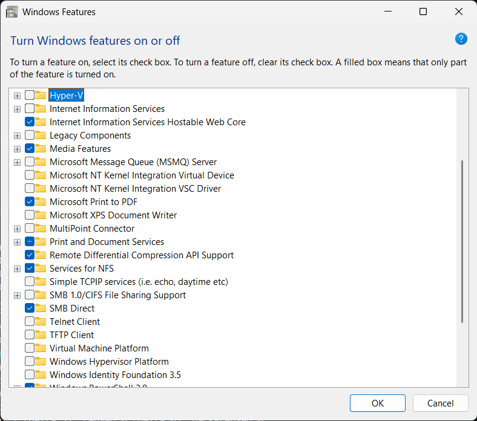

---

## 🔹 1. Login to EVE-NG

- **Username:** `root`
- **Password:** `eve`
- 

## 🔹 2. Change the EVE-NG Root Password

- 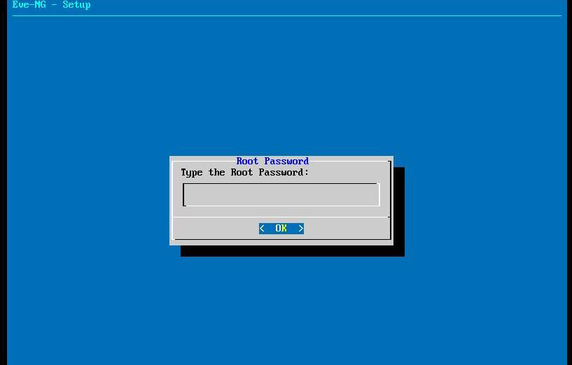

## 🔹 3. Configure DNS Domain Name

- 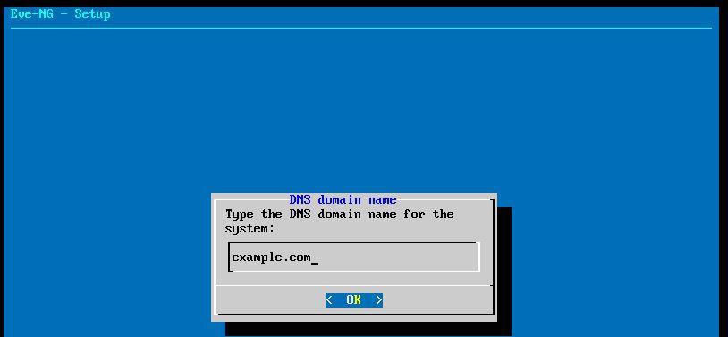

## 🔹 4. Configure IP Address

- **Using DHCP**
- 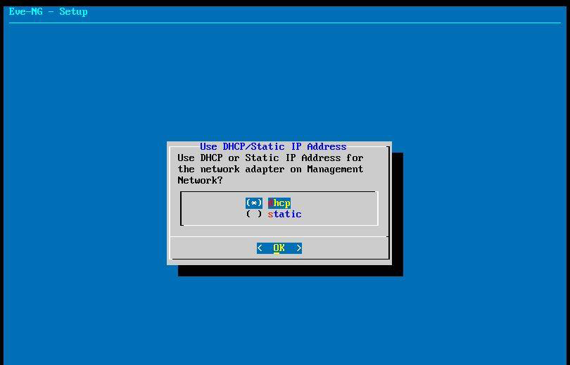

## 🔹 5. Configure NTP Server

- **Default is blank**
- 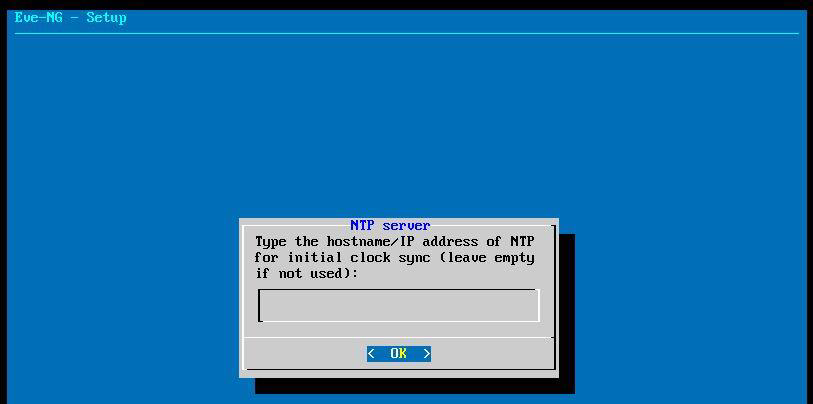

## 🔹 6. Configure Network Connection

- **Direct Connection**
- 

## 🔹 7. Complete Installation

- 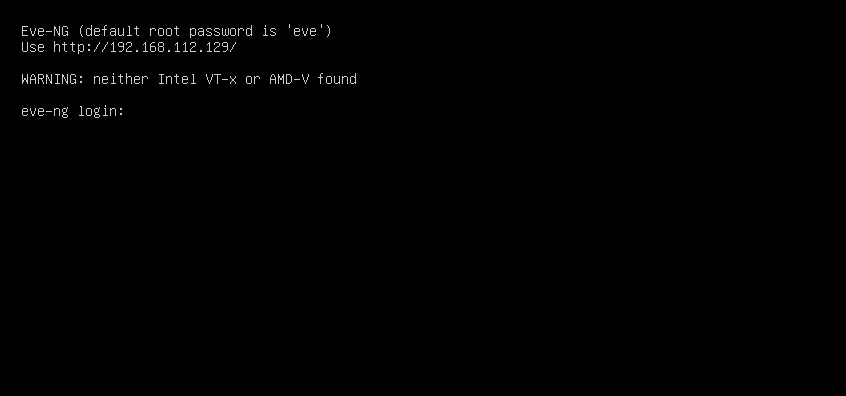

## 🔹 8. Access EVE-NG Web GUI

- Open a **browser** and enter the **EVE-NG server IP address**.
  - **Username:** `admin`
  - **Password:** `eve`
- 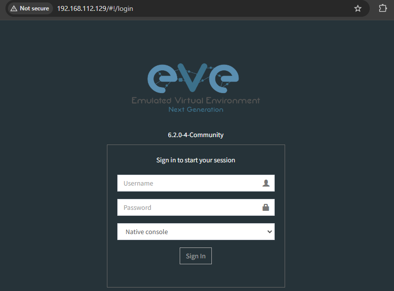

## 🔹 9. Install Windows Client Side

- Download and install the **Windows Client Side** from [EVE-NG Downloads](https://www.eve-ng.net/index.php/download/).
- 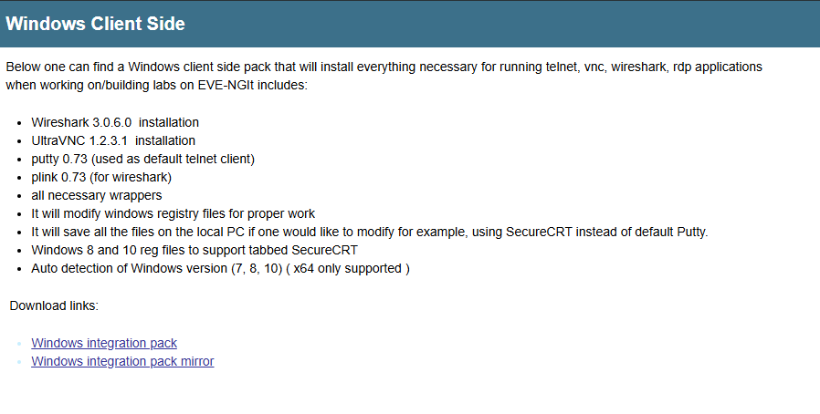

✅ **Installation and setup completed successfully!** 🚀
