# 🚀 EVE-NG Installation Guide

> Complete step-by-step guide to install and configure EVE-NG (Emulated Virtual Environment - Network Graphical) for network labs and simulations.

## 👤 Author

- [@alfaXphoori](https://www.github.com/alfaXphoori)

---

## 📋 Table of Contents

1. [Prerequisites & Downloads](#prerequisites--downloads)
2. [Windows Environment Setup](#windows-environment-setup)
3. [Virtual Machine Setup](#virtual-machine-setup)
4. [EVE-NG Installation](#eve-ng-installation)
5. [Post-Installation Configuration](#post-installation-configuration)
6. [Web Interface Access](#web-interface-access)

---

## 📥 Prerequisites & Downloads

Before starting the installation, download the required software:

| Software | Purpose | Link |
|----------|---------|------|
| **VMWare** | Hypervisor for running virtual machines | [Download](https://drive.google.com/file/d/149EBZ2zX4P6vws69DXrD-YWwnsTeMJZw/view?usp=sharing)|
| **EVE-NG ISO** | Network lab environment OS image | [Download](https://www.eve-ng.net/index.php/download/) |

> **⚠️ Important:** Ensure you have at least 8 GB RAM and 60 GB free disk space on your computer.

---

## 🖥️ Windows Environment Setup

> **Purpose:** Disable conflicting Windows features that interfere with VMware and virtualization.

### Step 0: Turn ON Virtualization in BIOS

**What:** Enable hardware virtualization support in your BIOS/UEFI.

**How to:**
1. Restart your computer
2. Enter BIOS settings (usually by pressing **F2**, **F10**, **Del**, or **Esc** during boot)
3. Look for **Virtualization Technology** (Intel VT-x) or **SVM Mode** (AMD-V)
4. **Enable** the virtualization option
5. Save changes and exit BIOS

> **💡 Tip:** If you can't find the setting, consult your motherboard manual or search online for your specific model.

---

### Step 1: Disable Hypervisor Launch Type

**What:** Disable Windows Hypervisor to avoid conflicts with VMware.

**How to:**
1. Press **Windows Key + X** and select **Windows PowerShell (Admin)**
2. Copy and paste this command:
```bash
bcdedit /set hypervisorlaunchtype off
```
3. Press **Enter**
4. Restart your computer


> **Note:** You'll need to restart your computer for this change to take effect.

---

### Step 2: Disable Group Policy Restrictions

**What:** Remove Device Guard security policies that restrict virtualization.

**How to:**
1. Press **Windows Key + R**
2. Type `gpedit.msc` and press **Enter**
3. Navigate to: **Computer Configuration** → **Administrative Templates** → **System** → **Device Guard**
4. Find and **Disable**:
   - **Deploy App Control for Business**
   - **Turn On Virtualization Base Security**
5. Click **Apply** and **OK**


> **Note:** If you don't have Home edition of Windows, you may not have Group Policy Editor. Skip this step if unavailable.

---

### Step 3: Turn Off Memory Integrity

**What:** Disable Kernel DMA Protection that can interfere with VM performance.

**How to:**
1. Press **Windows Key** and type `core isolation`
2. Select **Core isolation** from the results
3. Click **Core isolation details**
4. Toggle **Memory integrity** to **OFF**


> **⚠️ Warning:** This reduces security, only do it if needed for VM performance.

---

### Step 4: Disable Windows Features

**What:** Turn off Hyper-V and related features to avoid conflicts.

**How to:**
1. Press **Windows Key + R**
2. Type `optionalfeatures` and press **Enter**
3. Uncheck the following (if present):
   - ☐ **Hyper-V**
   - ☐ **Virtual Machine Platform**
   - ☐ **Windows Hypervisor Platform**
4. Click **OK**
5. Restart your computer when prompted


> **✅ Checkpoint:** After completing all Windows setup steps, restart your computer before proceeding.

---

## 🔧 Virtual Machine Setup

> **Purpose:** Create and configure a virtual machine in VMware with proper resources for EVE-NG.

### Step 0: Create New Virtual Machine

**What:** Create a new virtual machine container.

**How to:**
1. Open **VMware Workstation**
2. Click **File** → **New Virtual Machine** or press **Ctrl+N**
3. Select **Typical** configuration
4. Proceed to the next step

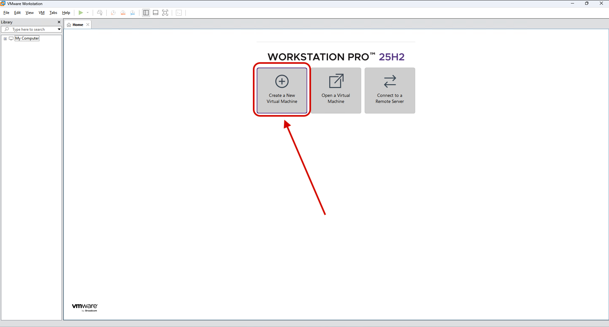

---

### Step 1: Set Virtual Machine Name and Type

**What:** Name your VM and select the operating system type.

**How to:**
1. Select **Installer disc image file (iso)** and browse to your EVE-NG ISO
2. Click **Next**
3. Select guest operating system: **Other**
4. Select version: **Other 64-bit**
5. Set the VM name: **EVE-NG**
6. Click **Next**


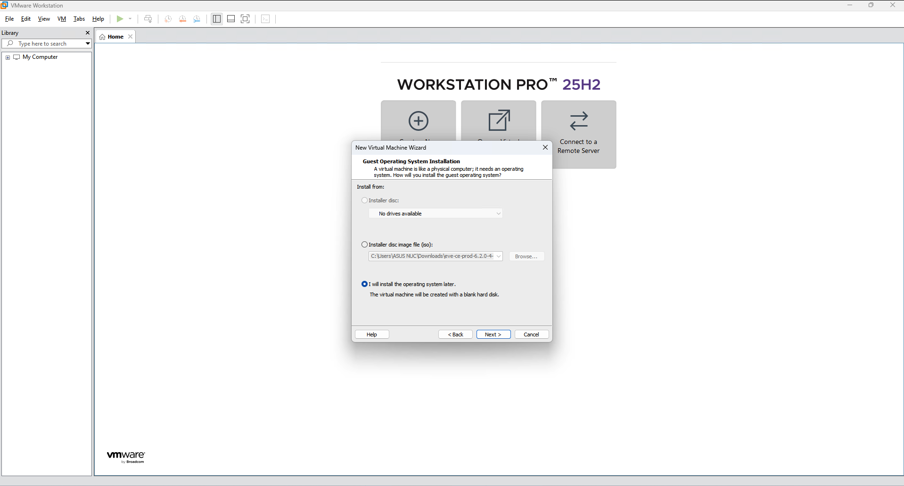

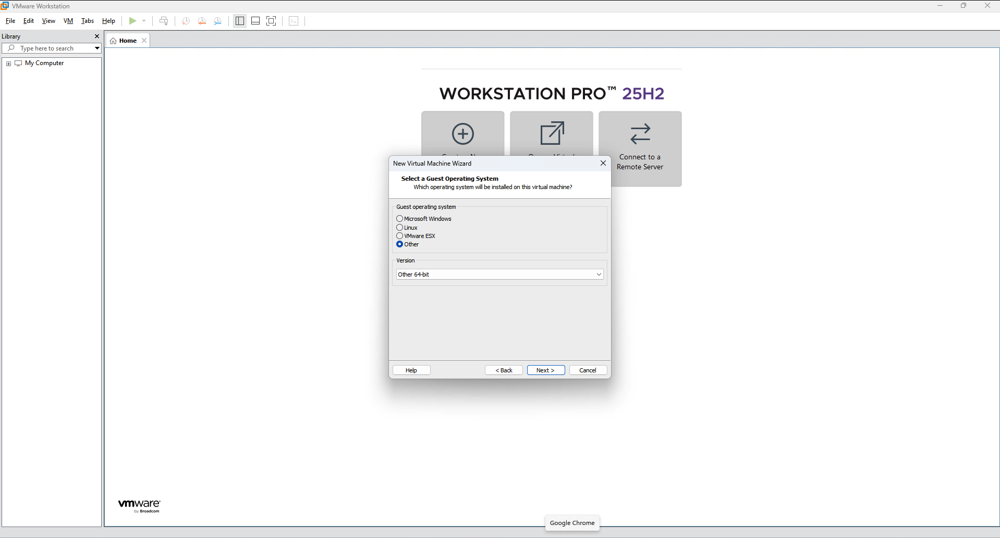

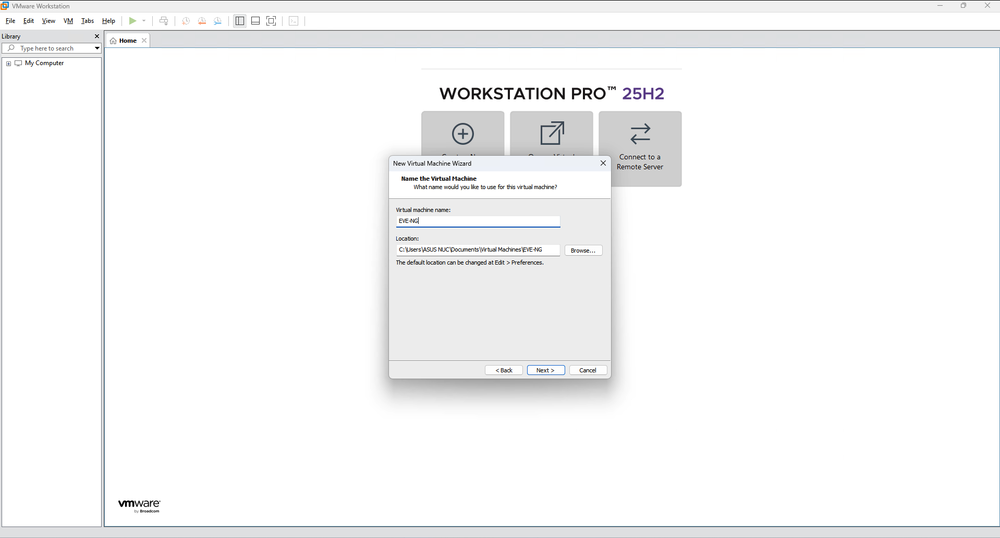

---

### Step 2: Go to Settings

**What:** Configure VM disk size during creation wizard.

**How to:**
1. Specify disk capacity: **50-60 GB** recommended
2. Select **Store virtual disk as a single file**
3. Click **Next**
4. Review settings and click **Finish**
5. After creation, right-click the VM and select **Settings** for additional configuration


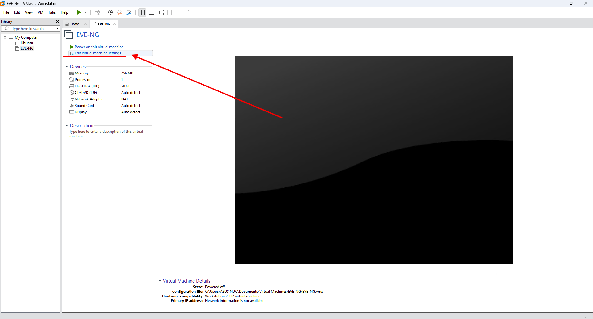

---

### Step 3: Add CPU and RAM

**What:** Allocate sufficient memory and processing power.

**Configuration:**
- Go to **Hardware** tab → **Memory**
- Set **Memory for this virtual machine**: **4096 MB (4 GB minimum)**
- Go to **Processors**
- Set **Number of processors**: **1**
- Set **Number of cores per processor**: **2-4** (depending on your host)

> **Recommended:**
> - RAM: 4-8 GB
> - CPU: 2-4 cores
> - Adjust based on your host computer's resources


---

### Step 4: Enable VT-x/AMD-V

**What:** Enable hardware virtualization acceleration.

**How to:**
1. Go to **Hardware** tab → **Processors**
2. Check **Virtualize Intel VT-x/EPT or AMD-V/RVI**
3. Check **Virtualize CPU performance counters** (optional)
4. This should be available if BIOS virtualization is enabled


---

### Step 5: Configure CD/DVD Drive

**What:** Attach the EVE-NG ISO file to the virtual CD/DVD drive.

**How to:**
1. Go to **Hardware** tab → **CD/DVD (SATA)**
2. Check **Connect at power on**
3. Select **Use ISO image file** and browse to the **EVE-NG ISO file**
4. Click **OK** to save settings


---

### Step 6: Configure Network

**What:** Set up network connectivity.

**How to:**
1. Go to **Hardware** tab → **Network Adapter**
2. Set **Network connection**: **Bridged: Connected directly to the physical network**
3. Check **Replicate physical network connection state**
4. Click **OK** to save

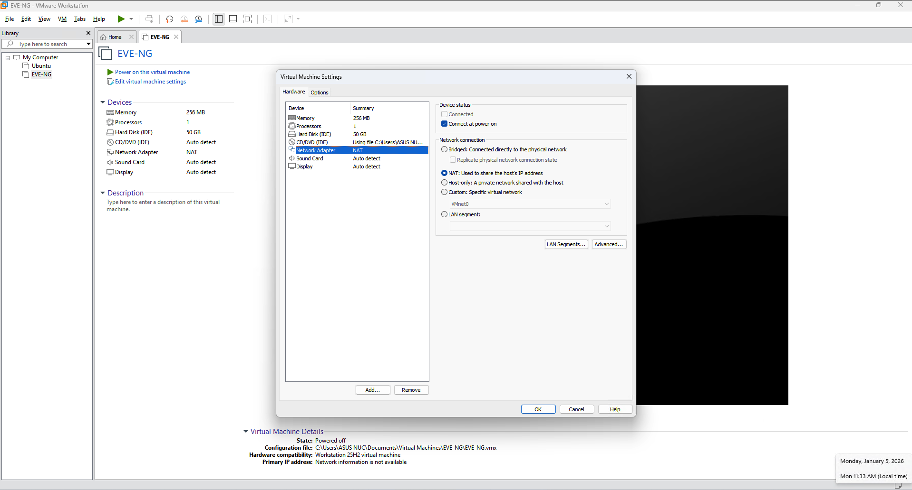

> **ℹ️ Note:** Bridged mode allows the VM to appear on your local network with its own IP address.

---

## 📦 EVE-NG Installation

> **Purpose:** Install the EVE-NG operating system on the virtual machine.

### Step 7: Start Virtual Machine

**What:** Boot the VM and begin the installation.

**How to:**
1. In VMware Workstation, select the **EVE-NG** VM from the library
2. Click **Power on this virtual machine** or press **Ctrl+B**

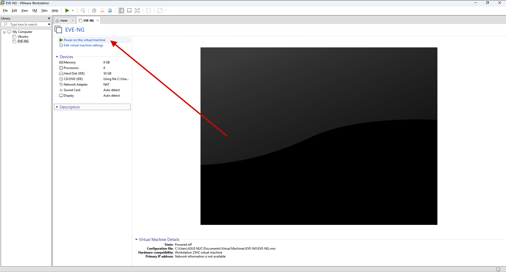

---

### Step 8: Choose Language

**What:** Select installation language.

**How to:**
1. When the bootloader appears, select your preferred language
2. **English** is recommended (easier to follow guides)


---

### Step 9: Proceed with Installation

**What:** Begin the EVE-NG system installation.

**How to:**
1. Select **Install** from the menu
2. Follow the on-screen prompts

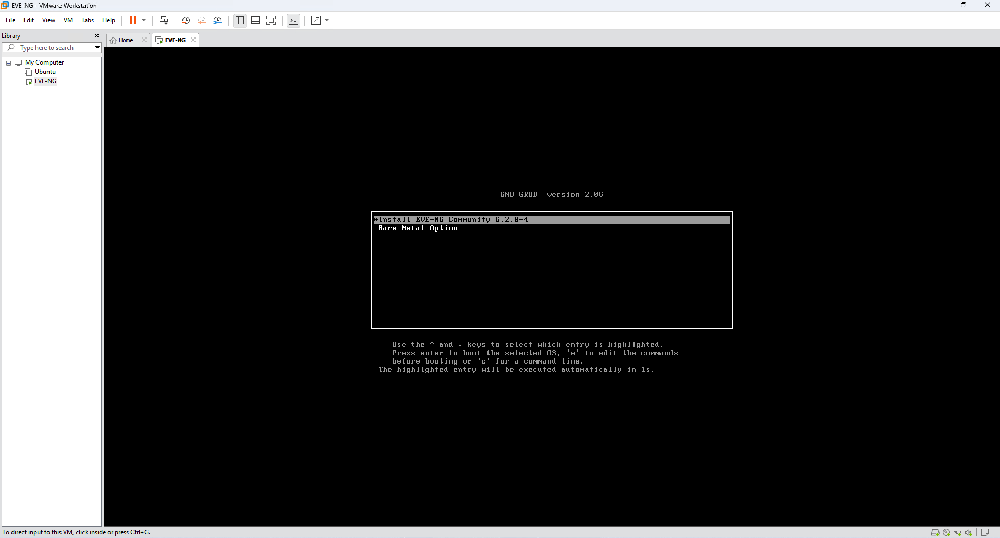

---

### Step 10: Complete Installation

**What:** Wait for the installation process to finish.

**How to:**
1. The installer will copy files and configure the system
2. This may take 5-10 minutes
3. When prompted, click **Continue**
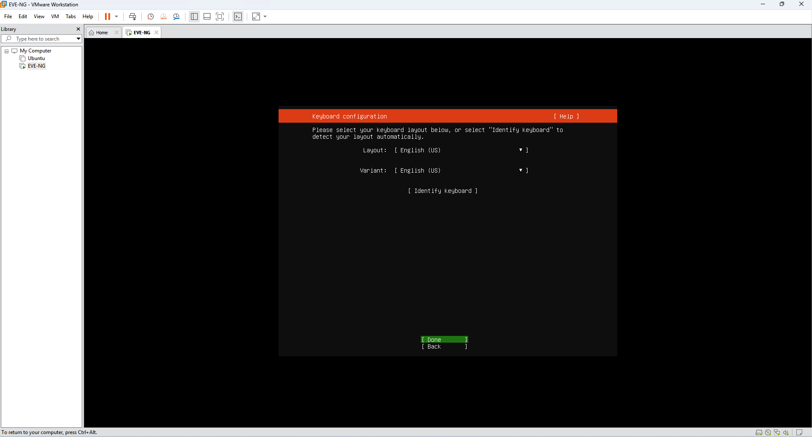


---

### Step 11: Remove Installation Media

**What:** Disconnect the ISO file after installation completes.

**How to:**
1. After the installation finishes and system reboots
2. Go to **VM** menu → **Removable Devices** → **CD/DVD** → **Disconnect** → **Yes**
3. Or simply power off the VM and remove the ISO from settings


---

### Step 12: Reboot the Virtual Machine

**What:** Restart the VM to boot into the installed EVE-NG system.

**How to:**
1. If the VM doesn't reboot automatically, power it off
2. Then power it back on to start the newly installed system

---

## ⚙️ Post-Installation Configuration

> **Purpose:** Configure EVE-NG system settings on first boot.

### Step 13: First Login

**What:** Log in to EVE-NG for the first time.

**Credentials:**
- **Username**: `root`
- **Password**: `eve`

**How to:**
1. Restart the VM (it should boot automatically)
2. At the login prompt, enter the credentials above

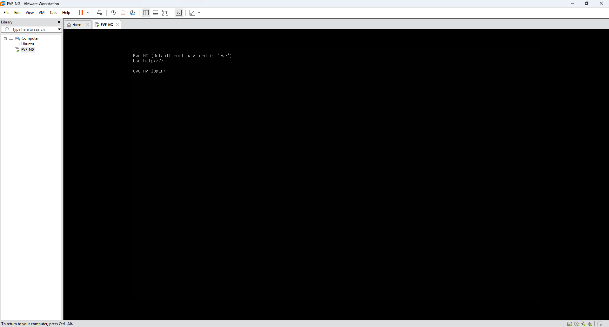

---

### Step 14: Change Root Password

**What:** Set a secure password for the root user.

**How to:**
1. You'll be prompted to change the root password
2. Enter a new secure password
3. Remember this password for future logins

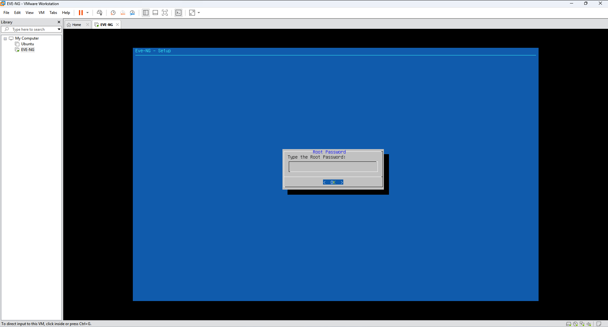

> **Security Tip:** Use a strong password with uppercase, lowercase, numbers, and special characters.

---

### Step 15: Confirm Password

**What:** Verify the new password.

**How to:**
1. Re-enter the new password to confirm
2. Press **Enter**

---

### Step 16: Set Hostname

**What:** Give your EVE-NG system a network name.

**How to:**
1. Enter a hostname (e.g., `eve-ng-lab`, `networking-lab`)
2. Press **Enter**


> **ℹ️ Note:** The hostname is used for network identification.

---

### Step 17: Configure DNS Domain Name

**What:** Set the DNS domain for your system.

**How to:**
1. Enter your DNS domain (e.g., `lab.local`, or leave blank)
2. Press **Enter**

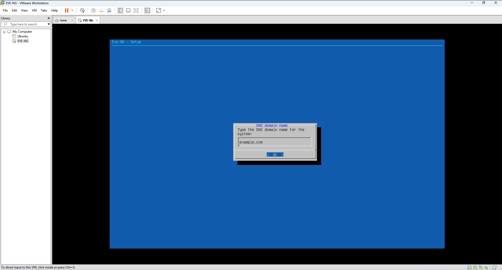

> **⚠️ Optional:** You can leave this blank if you don't have a specific domain.

---

### Step 18: Configure IP Address (DHCP)

**What:** Set up network connectivity.

**How to:**
1. Choose **DHCP** for automatic IP assignment (recommended for beginners)
2. Or configure a **Static IP** if your network requires it
3. Press **Enter**

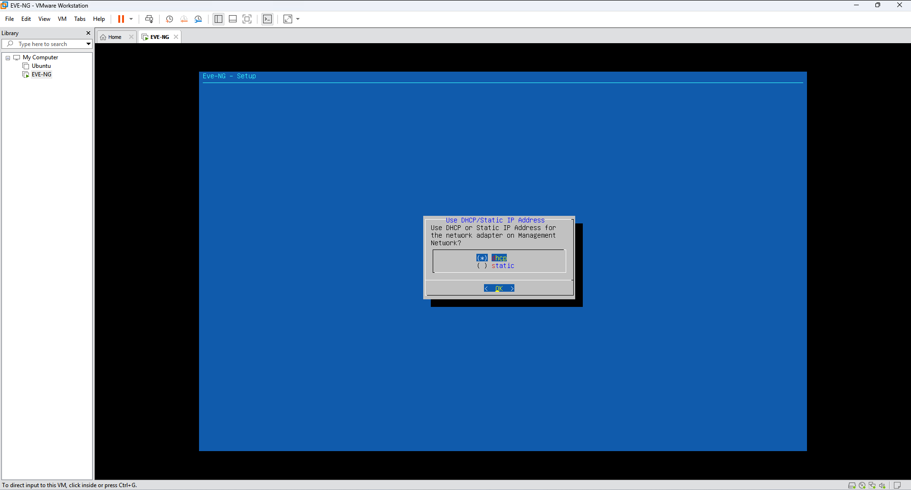

> **💡 Tip:** DHCP is easier and works well for lab environments.

---

### Step 19: Configure NTP Server

**What:** Set up time synchronization.

**How to:**
1. Enter an NTP server (e.g., `pool.ntp.org`) or leave blank
2. Press **Enter**


> **✅ Default:** Leaving blank uses system default NTP settings.

---

### Step 20: Configure Proxy

**What:** Set up proxy if your network requires it.

**How to:**
1. If your network requires a proxy, enter the proxy address
2. Otherwise, leave blank and press **Enter**
3. Select **Direct Connection** option


---

## 🌐 Network Configuration

> **Purpose:** Understand and configure the network setup for EVE-NG to ensure proper connectivity.

### EVE-NG Network Overview

**What:** EVE-NG can be accessed from your host machine or other devices on the network.

**Network Architecture:**
- **VMware Bridged Network**: VM appears on local network with its own IP
- **Host-Only Network**: Access only from host machine (VMnet1)
- **NAT Network**: VM can access external networks through host (VMnet8)

**Step-by-Step Network Configuration:**

> **Step 1 - Go to Network Settings:**
> Click on **Edit** → **Virtual Network Editor** from the VMware menu to access network configuration options.

> **Step 2 - Configure Network Adapter:**
> In the Virtual Network Editor, you can configure VMnet adapters. VMnet0 is bridged, VMnet1 is host-only, and VMnet8 is NAT.

> **Step 3 - Verify Network Adapter:**
> The network adapters are pre-configured in VMware. Verify the settings match your network requirements.

> **Step 4 - Configure Adapter Settings:**
> For Host-Only adapter (VMnet1), configure the subnet. For Bridged adapter (VMnet0), it will use your physical network settings automatically.

> **Step 5 - Final Configuration:**
> For Host-Only network (VMnet1), configure DHCP if needed. Typical configuration:
> - **Subnet IP**: 192.168.137.0
> - **Subnet mask**: 255.255.255.0
> - **DHCP Range**: Configure in DHCP Settings tab

**Configuration Options:**

| Option | Benefit | Use Case |
|--------|---------|----------|
| **Bridged (VMnet0)** | VM gets IP from network | Access from any device on network |
| **Host-Only (VMnet1)** | Isolated to host machine | Secure, local-only access |
| **NAT (VMnet8)** | VM can access internet | External connectivity needed |

**Network Adapter Configuration (From VMware Virtual Network Editor):**


---

### Step 21: Configuration Complete

**What:** System configuration is finished.

**Status:** All configuration steps are now complete.


> **✅ Checkpoint:** Your EVE-NG system is now configured and ready to use.

---

## 🌐 Web Interface Access

### Step 22: Access EVE-NG Web Interface

**What:** Connect to EVE-NG using a web browser.

**How to:**
1. Open a web browser on your host machine (not the VM)
2. Enter the EVE-NG IP address in the address bar
   - You can find the IP by running `ifconfig` or `ip addr` in the EVE-NG terminal
3. Default address pattern: `http://192.168.x.x` (depends on your network)

**Credentials:**
- **Username**: `admin`
- **Password**: `eve`

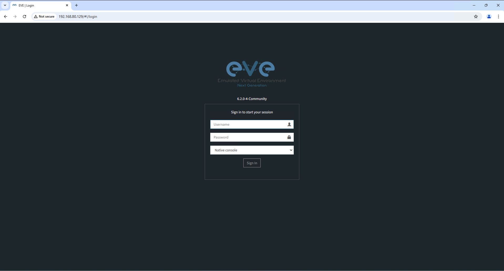

> **💡 Tip:** The web interface is where you'll create and manage your network labs.

---

### Step 23: Install Windows Client Side (Optional)

**What:** Install client tools for enhanced integration with Windows.

**How to:**
1. Download **Windows Client Side** from [EVE-NG Downloads](https://www.eve-ng.net/index.php/download/)
2. Run the installer on your Windows host machine
3. This enables better console integration and performance


> **ℹ️ Note:** This is optional but recommended for better integration.

---

## ✅ Summary & Next Steps

**Congratulations!** You have successfully:
- ✅ Configured Windows for virtualization
- ✅ Created and configured a VMware virtual machine
- ✅ Installed EVE-NG operating system
- ✅ Configured network and system settings
- ✅ Accessed the EVE-NG web interface

### What's Next?

1. **Create Your First Lab:**
   - Log in to the web interface
   - Create network nodes (routers, switches, etc.)
   - Start building your network topology

2. **Load Network Images:**
   - Upload router and switch images (Cisco, Juniper, etc.)
   - These are required to run network devices in your labs

3. **Explore Documentation:**
   - Visit [EVE-NG Documentation](https://www.eve-ng.net/)
   - Join the [community forums](https://www.eve-ng.net/index.php/community)

4. **Practice Labs:**
   - Start with basic routing configurations
   - Progress to advanced protocols (OSPF, BGP, MPLS)
   - Build real-world network scenarios

---

## 🆘 Troubleshooting

| Issue | Solution |
|-------|----------|
| **Can't access VM** | Check if VM is running; restart VMware Workstation |
| **Network not working** | Verify Bridged network is selected in VM settings |
| **VM is slow** | Increase RAM/CPU allocation in VM settings |
| **Can't access web interface** | Find VM IP with `ifconfig`; ensure firewall allows traffic |
| **Login fails** | Use default credentials: `admin/eve` or `root/eve` |

---

## 📚 Useful Resources

- [EVE-NG Official Website](https://www.eve-ng.net/)
- [VMware Workstation Documentation](https://docs.vmware.com/en/VMware-Workstation-Pro/)
- [Network Lab Basics](https://www.eve-ng.net/index.php/documentation/)
- [Community Forum](https://www.eve-ng.net/index.php/community)

---

✅ **Installation and configuration completed successfully!** 🚀

**Happy Labbing! 🎓**


