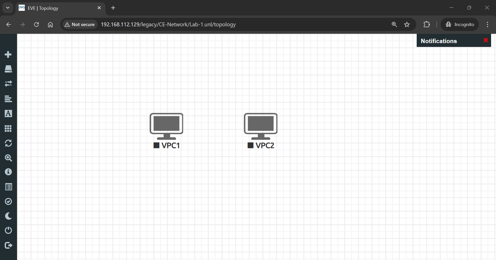
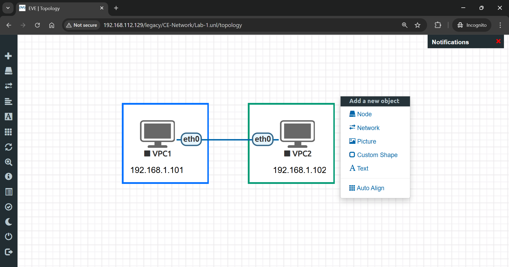

# 🌐 EVE-NG Web GUI & First Lab

> Complete guide to accessing EVE-NG web interface and creating your first network lab with virtual PCs.

## 👤 Author

- [@alfaXphoori](https://www.github.com/alfaXphoori)

---

## 📋 Table of Contents

1. [Web Interface Overview](#web-interface-overview)
2. [Creating Your First Lab](#creating-your-first-lab)
3. [Configuring Virtual PCs](#configuring-virtual-pcs)
4. [Testing Connectivity](#testing-connectivity)
5. [Summary & Next Steps](#summary--next-steps)
6. [Troubleshooting](#troubleshooting)
7. [Useful Commands](#useful-commands-for-vpcs)

---

## 🖥️ Web Interface Overview

> **Purpose:** Understand the EVE-NG web dashboard and its main functions.

### Section 1: Main - File Manager

**What:** The file manager displays and manages all your network labs and configurations.

**How to:**
1. Log in to EVE-NG web interface with `admin/eve`
2. This is the main dashboard where labs are created and stored
3. Browse your folder structure and lab files


---

### Section 2: Management - User Management

**What:** Add and manage user accounts with different privilege levels.

**How to:**
1. Click on **Management** tab
2. Select **Users**
3. Add new users or modify existing user permissions
4. Set user roles (admin, user, etc.)


---

### Section 3: System - Status & Logs

**What:** Monitor system health, status, and view system logs.

**Features:**
- View system status and resource usage
- Check running nodes
- View system logs for troubleshooting
- Stop all running nodes from this panel
- Monitor uptime and performance


> **💡 Tip:** Use this section to stop all labs before shutting down EVE-NG.

---

### Section 4: Information - EVE-NG Details

**What:** Display system information about your EVE-NG installation.

**Includes:**
- EVE-NG version
- System information
- Installed network images
- System configuration details


---

## 🛠️ Creating Your First Lab

> **Purpose:** Create a new network lab and add network nodes.

### Step 1: Add Folder

**What:** Organize your labs by creating folders.

**How to:**
1. Right-click in the main area
2. Select **Add Folder**
3. Enter a **folder name** (e.g., "Learning Labs", "CE-Network")
4. Click **Add**


> **ℹ️ Note:** Folders help organize multiple labs logically.

---

### Step 2: Add New Lab

**What:** Create a new lab within a folder.

**How to:**

1️⃣ **Enter Lab Name**
   - Right-click in the folder
   - Select **Add New Lab**
   - Enter lab name (e.g., "CE-Network")


2️⃣ **Fill Lab Information**
   - Add lab description
   - Set notes (optional)
   - Configure lab settings


3️⃣ **Lab Created**
   - Lab is now ready for devices
   - You can now add nodes and connections


> **✅ Checkpoint:** Your first lab is now created and ready for network devices.

---

### Step 3: Add Network Nodes

**What:** Add virtual devices (PCs, routers, switches) to your lab.

**How to:**

1️⃣ **Open Node Menu**
   - Right-click in the lab canvas
   - Select **Node**


2️⃣ **Choose Device Type**
   - Select **Virtual PC** (for this lab)
   - Other options include routers, switches, etc.


3️⃣ **Configure Node**
   - Change the node name (e.g., PC1, PC2)
   - Select an icon
   - Specify number of nodes (e.g., 2)
   - Click **Add**


4️⃣ **Nodes Created**
   - Two Virtual PCs are now displayed on the canvas



---

### Step 4: Connect Nodes

**What:** Create network connections between devices.

**How to:**

1️⃣ **Create Connection**
   - Click the **orange plug** (connection tool) on one PC
   - Drag it to the other PC


2️⃣ **Configure Connection**
   - A configuration dialog appears
   - Select interface from each PC
   - Choose connection type
   - Click **Confirm**


> **✅ Checkpoint:** Two PCs are now connected via network cable.

---

### Step 5: Customize Lab

**What:** Add visual elements to enhance lab documentation.

**How to:**
- Right-click and select **Text** to add labels
- Add **Shapes** for visual grouping
- Insert **Pictures** for documentation
- Use different colors and styling



> **💡 Tip:** Good labeling makes labs easier to understand and remember.

---

## ⚙️ Configuring Virtual PCs

> **Purpose:** Set up network addresses and verify connectivity.

### Step 1: Start the Lab

**What:** Boot up all network devices.

**How to:**
1. Right-click each PC
2. Select **Start**
3. Wait for devices to initialize


---

### Step 2: Open Console Session

**What:** Access the command line of a virtual PC.

**How to:**
1. Click the **PC icon** once started
2. A **remote session window** opens
3. Click **Open SSH** or **Console**
4. You can now enter commands


> **ℹ️ Note:** SSH provides remote access to the PC.

---

### Step 3: Configure IP Address

**What:** Assign a network address to the PC.

**How to:**
1. In the PC console, enter:

```bash
ip 192.168.1.101 255.255.255.0 192.168.1.1
```

2. Format: `ip <IP> <netmask> <gateway>`
3. Press Enter to apply


**Configuration Breakdown:**
- **IP Address**: 192.168.1.101
- **Subnet Mask**: 255.255.255.0
- **Gateway**: 192.168.1.1

---

## 🔍 Testing Connectivity

> **Purpose:** Verify that network connections are working correctly.

### Step 1: Ping the Other PC

**What:** Test connectivity using ping command.

**How to:**
1. From PC1 console, type:

```bash
ping 192.168.1.102
```

2. Press Enter
3. Observe the results


**Interpretation:**
- ✅ **Replies**: Network connection is working
- ❌ **No replies**: Connection problem exists

> **💡 Tip:** Ping shows latency (milliseconds) for each packet round trip.

---

### Step 2: Configure PC2 Similarly

**What:** Set up the second PC with an IP address.

**How to:**
1. Open PC2 console
2. Enter:

```bash
ip 192.168.1.102 255.255.255.0 192.168.1.1
```

3. Press Enter

---

### Step 3: Verify Bidirectional Connectivity

**What:** Test both directions of communication.

**How to:**
1. From PC1: `ping 192.168.1.102`
2. From PC2: `ping 192.168.1.101`
3. Both should succeed

---

## ✅ Summary & Next Steps

**Congratulations!** You have:
- ✅ Accessed the EVE-NG web interface
- ✅ Created your first lab
- ✅ Added virtual PCs
- ✅ Connected network devices
- ✅ Configured IP addresses
- ✅ Tested network connectivity

### What's Next?

1. **Explore More Devices:**
   - Add routers to your labs
   - Add switches for VLAN configurations
   - Build more complex topologies

2. **Learn Configuration:**
   - Configure router interfaces
   - Set up routing protocols (RIP, OSPF, EIGRP)
   - Implement VLANs and Inter-VLAN routing

3. **Advanced Topics:**
   - Access Control Lists (ACLs)
   - Network Address Translation (NAT)
   - BGP routing protocol
   - Quality of Service (QoS)

---

## 🆘 Troubleshooting

| Issue | Solution |
|-------|----------|
| **Nodes won't start** | Check if images are installed; restart EVE-NG |
| **Ping fails** | Verify IP addresses; check cable connections |
| **Console won't open** | Try clicking the node icon again; check firewall |
| **Lab runs slowly** | Stop other labs; reduce number of running devices |

---

## 📚 Useful Commands for VPCS

```bash
# Set IP address
ip <IP> <netmask> <gateway>

# Test connectivity
ping <destination-ip>

# Show network configuration
show ip

# Show interface status
show interfaces

# Save configuration
save

# Clear configuration
clear ip
```

---

✅ **Lab creation and testing completed successfully!** 🚀

**Happy Labbing! 🎓**
