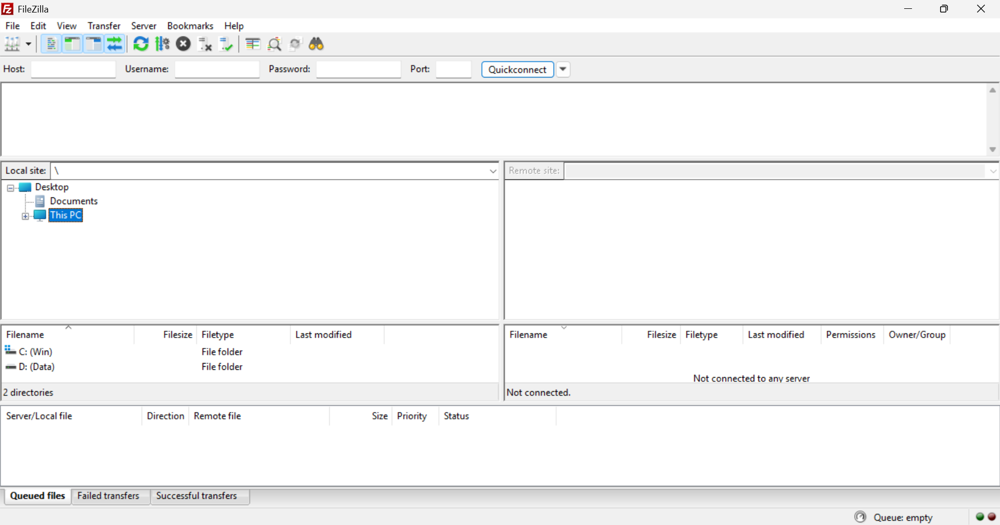
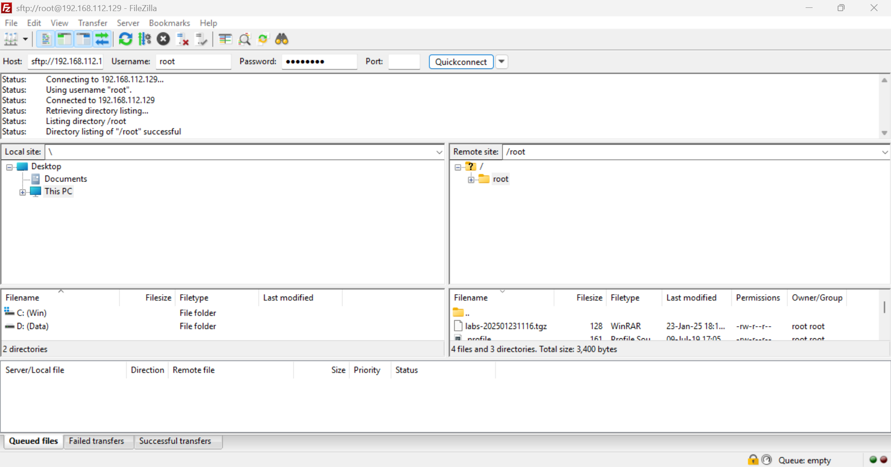
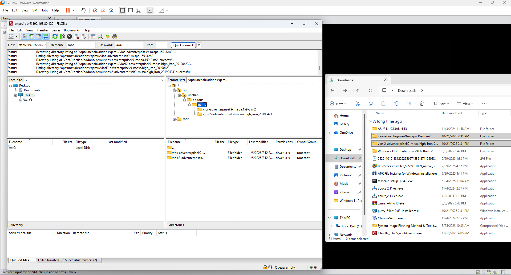
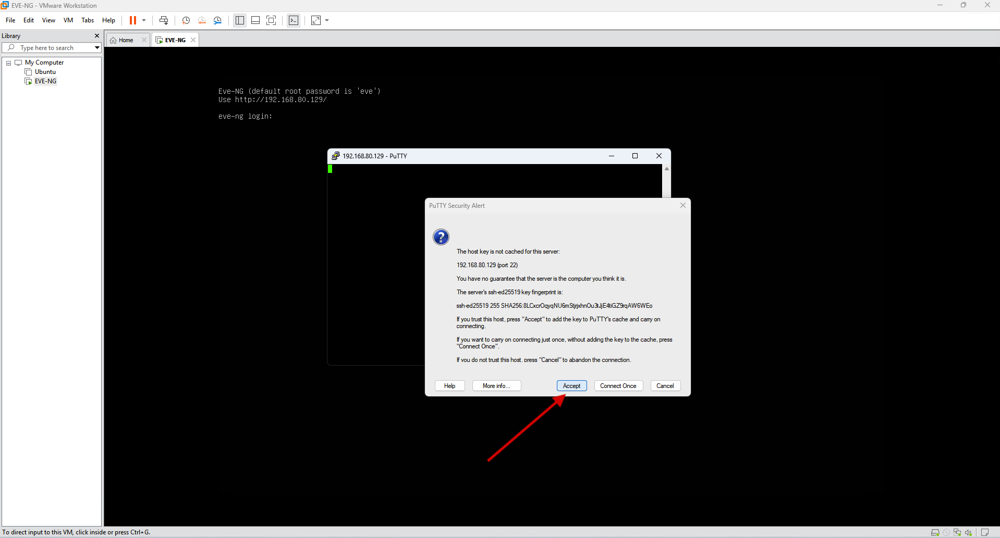
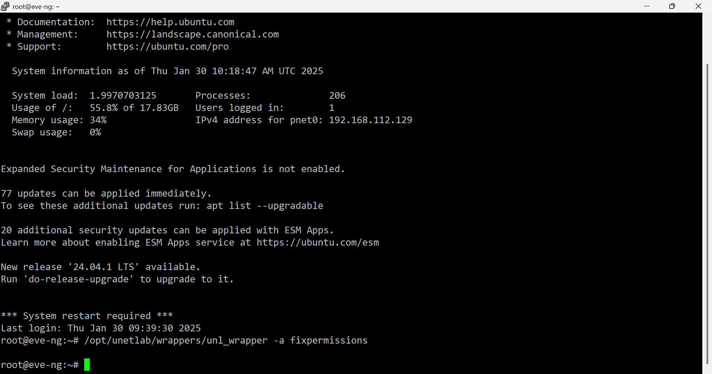
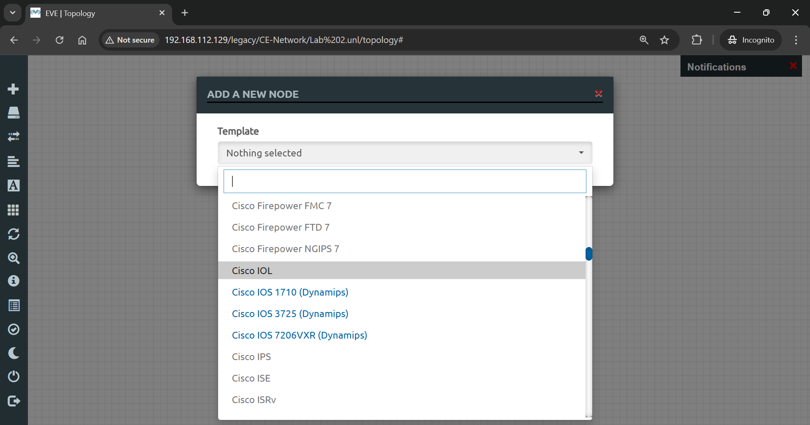
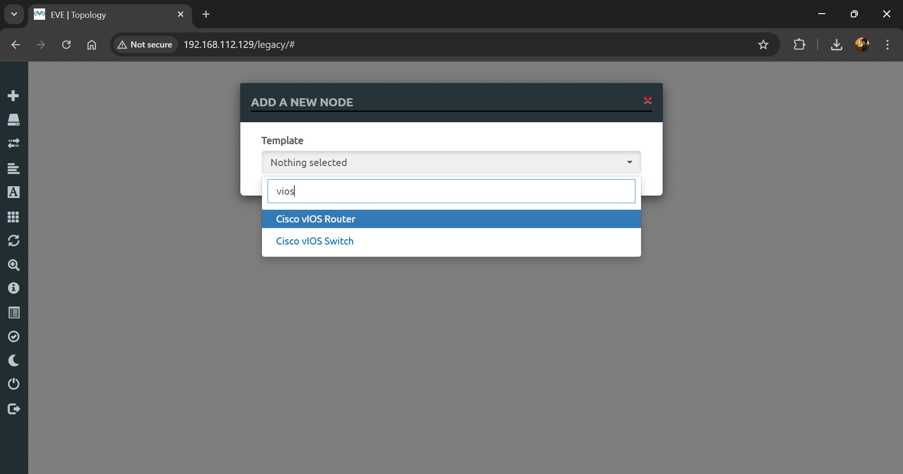

# 🖧 Add Router & Switch to EVE-NG

> Complete guide to download, upload, and configure Cisco router and switch images in EVE-NG for network simulations.

## 👤 Author

- [@alfaXphoori](https://www.github.com/alfaXphoori)

---

## 📋 Table of Contents

1. [Prerequisites](#prerequisites)
2. [Downloading Network Images](#downloading-network-images)
3. [Uploading Images to EVE-NG](#uploading-images-to-eve-ng)
4. [Configuring Permissions](#configuring-permissions)
5. [Verifying Installation](#verifying-installation)
6. [Summary & Next Steps](#summary--next-steps)
7. [Troubleshooting](#troubleshooting)

---

## ✅ Prerequisites

> **Purpose:** Ensure your system and EVE-NG are properly configured before adding network images.

### Step 0: Verify Virtualization is Enabled

**What:** Confirm that hardware virtualization (VT-x/AMD-V) is enabled in BIOS.

**How to:**
1. Check BIOS settings for **Intel VT-x** or **AMD-V/RVI**
2. Ensure virtualization is **enabled**
3. This allows EVE-NG to run router and switch simulations


> **⚠️ Important:** Without virtualization enabled, router and switch images won't run.

---

### Step 1: Download & Install FTP Software

**What:** Install FileZilla to transfer image files to EVE-NG server.

**How to:**
1. Download **FileZilla** from [FileZilla Project](https://filezilla-project.org)
2. Install on your Windows host machine
3. This is your file transfer client



> **ℹ️ Note:** FileZilla is free and widely used for SFTP file transfers.

---

### Step 2: Download Network Images

**What:** Get Cisco router and switch image files for use in labs.

**How to:**
1. Download from the following resource:
   - 📥 [Network Images Drive](https://drive.google.com/drive/folders/14ENNfWrLGDTylXUmcRXCpSXpMo0-dni5?usp=sharing)
2. Download both **router images** and **switch images**
3. Unzip the downloaded files

> **💡 Tip:** Keep these files organized in a dedicated folder on your computer.

---

## 📤 Uploading Images to EVE-NG

> **Purpose:** Transfer network image files to the EVE-NG server using SFTP.

### Step 3: Connect to EVE-NG via SFTP

**What:** Establish a secure file transfer connection to your EVE-NG server.

**How to:**
1. Open **FileZilla**
2. Enter the **EVE-NG IP address** in the Host field
3. Use **port 22** (SFTP port)
4. Enter **username**: `root`
5. Enter **password**: (your EVE-NG root password)
6. Click **Connect**



> **Security Note:** SFTP (port 22) is secure and encrypted.

---

### Step 4: Upload Router and Switch Files

**What:** Transfer image files to the correct EVE-NG directory.

**How to:**

1️⃣ **Navigate to Correct Directory**
   - On the remote site (right panel), go to:
   ```bash
   /opt/unetlab/addons/qemu
   ```

2️⃣ **Upload Files**
   - From your local machine (left panel), select router and switch image files
   - Drag and drop them to the remote directory
   - Wait for upload to complete



> **✅ Checkpoint:** All image files are now uploaded to EVE-NG server.

---

## ⚙️ Configuring Permissions

> **Purpose:** Set correct file permissions so EVE-NG can access the uploaded images.

### Step 5: Connect via SSH and Fix Permissions

**What:** Execute a command to fix file permissions on the EVE-NG server.

**How to:**

1️⃣ **Open SSH Connection**
   - Download and open **PuTTY** (SSH client)
   - Enter **EVE-NG IP address**
   - Port: **22**
   - Connection type: **SSH**


   - Click **Open**
   - If prompted with a security alert, click **Yes** to accept the SSH key


2️⃣ **Log in to EVE-NG**
   - Username: `root`
   - Password: (your EVE-NG root password)


3️⃣ **Execute Permission Fix Command**
   - Copy and paste this command:
   ```bash
   /opt/unetlab/wrappers/unl_wrapper -a fixpermissions
   ```
   - Press **Enter**
   - Wait for the command to complete



> **ℹ️ Note:** This command ensures EVE-NG has proper access to all image files.

---

## ✔️ Verifying Installation

> **Purpose:** Confirm that router and switch images are properly installed and available.

### Step 6: Verify Images in Web Interface

**What:** Check that Cisco router and switch images appear in the node selection menu.

**How to:**

1️⃣ **Access EVE-NG Web Interface**
   - Open web browser
   - Navigate to `http://<EVE-NG-IP>`
   - Log in with `admin/eve`


2️⃣ **Create a New Lab**
   - Create a test lab (or use existing one)

3️⃣ **Add a Node**
   - Right-click on lab canvas
   - Select **Add New Node**

4️⃣ **Check for Router Images**
   - Look for **Cisco IOL** and **Cisco IOS** entries
   - These should be highlighted in **blue** (available for use)
   - **Grayed out** entries mean images are missing or not installed





> **✅ Checkpoint:** If images appear in blue, installation is successful!

---

## ✅ Summary & Next Steps

**Congratulations!** You have:
- ✅ Verified virtualization is enabled
- ✅ Downloaded network image files
- ✅ Connected to EVE-NG via SFTP
- ✅ Uploaded router and switch images
- ✅ Fixed file permissions
- ✅ Verified images in web interface

### What's Next?

1. **Create a Routing Lab:**
   - Add routers to a new lab
   - Configure router interfaces
   - Test connectivity between routers

2. **Create a Switching Lab:**
   - Add switches and PCs
   - Configure VLAN interfaces
   - Set up Inter-VLAN routing

3. **Advanced Topics:**
   - Configure routing protocols (RIP, OSPF, EIGRP, BGP)
   - Implement Network Address Translation (NAT)
   - Set up Access Control Lists (ACLs)
   - Build complete network topologies

---

## 🆘 Troubleshooting

| Issue | Solution |
|-------|----------|
| **Images grayed out in menu** | Check upload location; re-run `unl_wrapper -a fixpermissions` |
| **Can't connect via SFTP** | Verify EVE-NG IP; check port 22 is open; verify credentials |
| **Upload is very slow** | Check network connection; try uploading smaller files first |
| **Permission denied errors** | SSH to EVE-NG; run fixpermissions command again |
| **Images not appearing** | Restart EVE-NG web interface; clear browser cache |

---

## 📚 Useful Commands

```bash
# Fix permissions for all images
/opt/unetlab/wrappers/unl_wrapper -a fixpermissions

# List installed images
ls -la /opt/unetlab/addons/qemu/

# Check EVE-NG service status
systemctl status eve-ng

# Restart EVE-NG service
systemctl restart eve-ng

# SSH to EVE-NG
ssh root@<EVE-NG-IP>
```

---

✅ **Router and switch images installed successfully!** 🚀

**Ready to build your first routing lab! 🎓**
