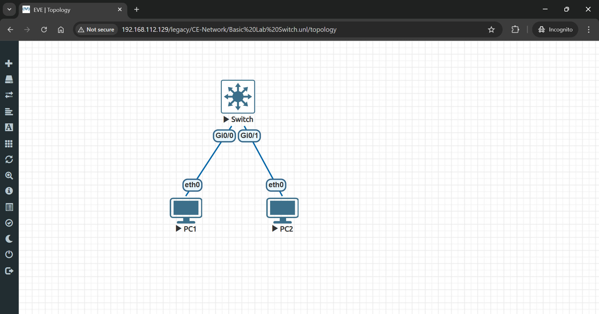
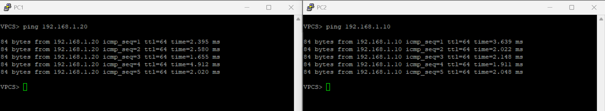

# 🖧 Basic Lab: Connecting PC1 & PC2 to Switch1 in EVE-NG

## 🎯 Lab Objectives

- 📌 **Connect two PCs (PC1 & PC2) to a switch (SW1)**  
- 📌 **Assign IP addresses to PCs**  
- 📌 **Test connectivity using ping**

---

## 🛠 Step 1: Set Up the Lab in EVE-NG

- 1️⃣ **Open EVE-NG**.
- 2️⃣ **Create a New Lab** (e.g., "Basic_Switch_Lab").
- 3️⃣ **Add Devices**:
  - 🖥 **One Cisco Switch (SW1)**
  - 🖥 **Two Virtual PCs (PC1 & PC2)**
- 4️⃣ **Connect Devices**:
  - 🔌 **PC1 → SW1 (GigabitEthernet 0/0)**
  - 🔌 **PC2 → SW1 (GigabitEthernet 0/1)**
- 5️⃣ **Diagram**:
- 

---

## ⚙️ Step 2: Configure the Switch (SW1)

### 🔹 1️⃣ Access SW1 and Set a Hostname

```bash
enable
configure terminal
hostname SW1
```

### 🔹 2️⃣ Enable Ports for PC1 and PC2

```bash
interface gigabitEthernet 0/0
no shutdown
exit

interface gigabitEthernet 0/1
no shutdown
exit
```

✅ **Ports are now active for the PCs.**

---

## 🌐 Step 3: Assign IP Addresses to PCs

### 🖥 **On PC1**

```bash
ip 192.168.1.10 255.255.255.0 192.168.1.1
```

### 🖥 **On PC2**

```bash
ip 192.168.1.20 255.255.255.0 192.168.1.1
```

✅ **Both PCs are now in the same network (192.168.1.0/24).**

---

## 🔍 Step 4: Test Connectivity

From **PC1**, ping PC2:

```bash
ping 192.168.1.20
```

- 
✅ **If the ping is successful, the network is working!**

---
