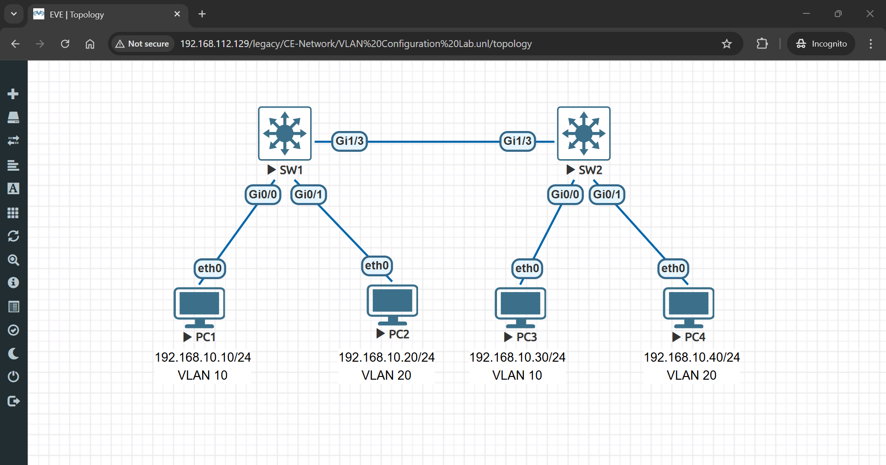
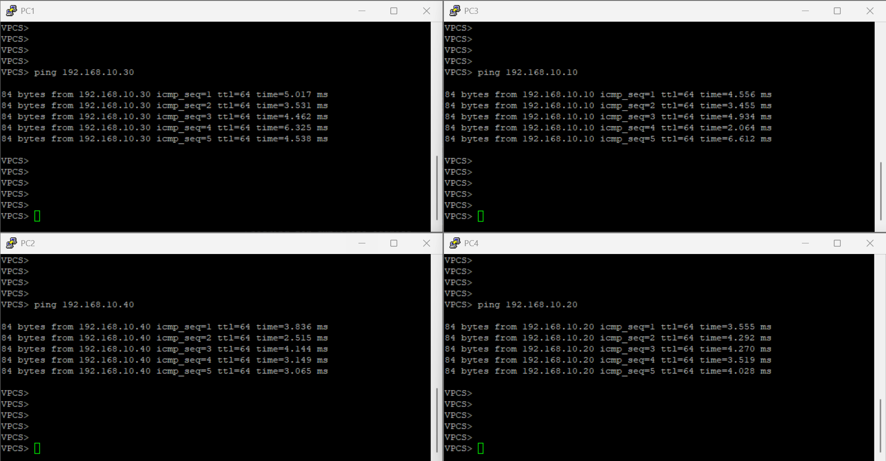
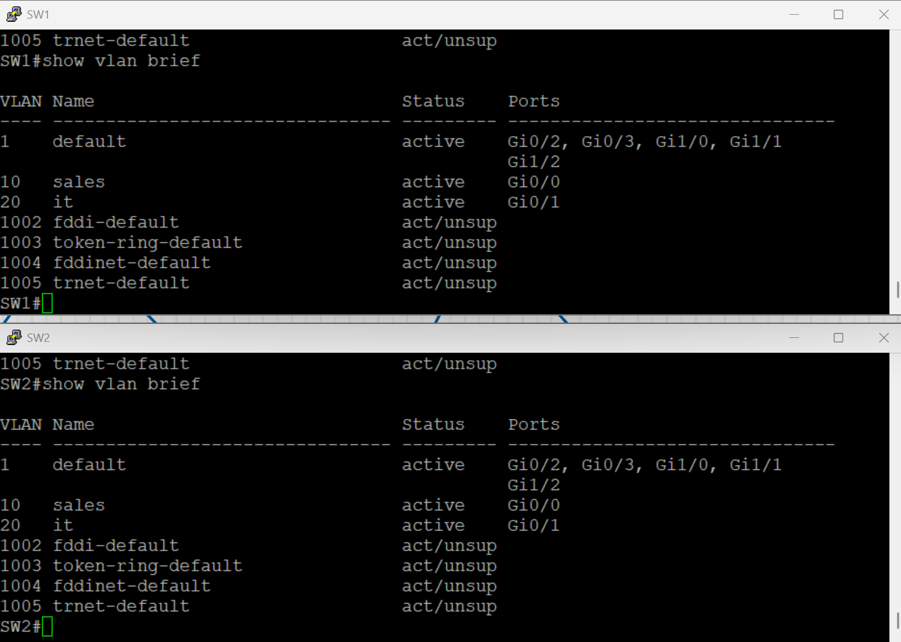
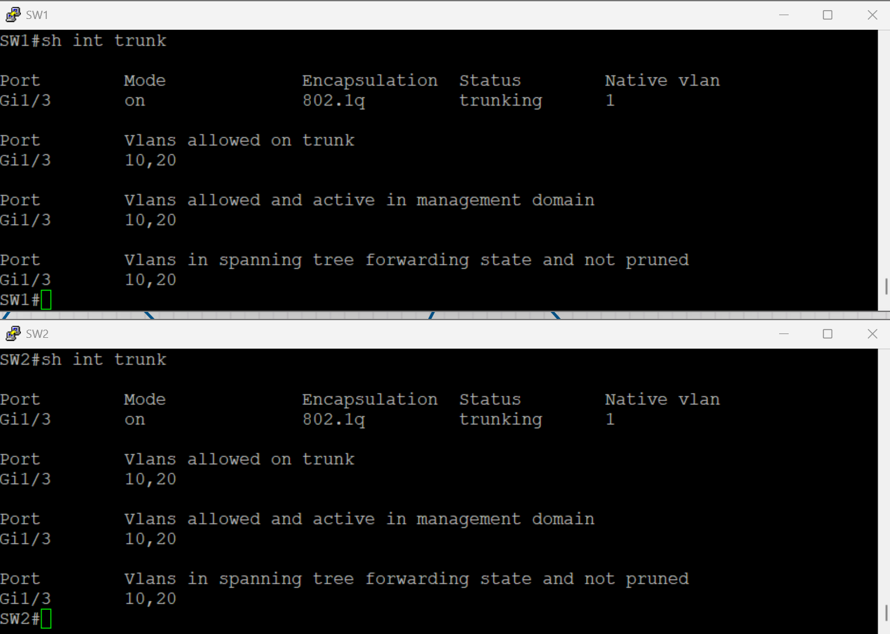

# 🖧 VLAN Configuration Lab

> Complete hands-on lab to configure VLANs on switches, establish trunk links between switches, and verify network segmentation and VLAN isolation.

## 👤 Author

- [@alfaXphoori](https://www.github.com/alfaXphoori)

---

## 📋 Table of Contents

1. [Lab Objectives](#lab-objectives)
2. [Prerequisites](#prerequisites)
3. [Lab Topology](#lab-topology)
4. [Creating the Lab](#creating-the-lab)
5. [VLAN Configuration](#vlan-configuration)
6. [Trunk Configuration](#trunk-configuration)
7. [PC Configuration](#pc-configuration)
8. [Testing Connectivity](#testing-connectivity)
9. [Verification](#verification)
10. [Troubleshooting](#troubleshooting)
11. [Summary & Next Steps](#summary--next-steps)

---

## 🎯 Lab Objectives

> **Purpose:** Master VLAN creation, port assignment, and trunk link configuration for network segmentation.

### By the end of this lab, you will:

- ✅ Create multiple VLANs on Cisco switches
- ✅ Assign switch ports to specific VLANs in access mode
- ✅ Configure trunk links between switches using 802.1Q encapsulation
- ✅ Assign IP addresses to PCs in different VLANs
- ✅ Test intra-VLAN connectivity (same VLAN communication)
- ✅ Verify VLAN isolation (blocking inter-VLAN communication without a router)
- ✅ Understand the role of trunk ports in multi-switch environments

---

## ✅ Prerequisites

> **Purpose:** Ensure you have all necessary knowledge and resources.

### Required Knowledge

| Topic | Why It Matters | Reference |
|-------|---------------|---------  |
| **Basic Switching** | Understand how switches forward frames | 04_Basic Switch Lab |
| **IP Addressing** | Assign IPs within VLAN subnets | 04_Basic Switch Lab |
| **CLI Commands** | Navigate Cisco switch configuration | 03_Switch Config Lab |
| **Ping Testing** | Verify connectivity between devices | 04_Basic Switch Lab |

### Required Resources

- ✅ EVE-NG installed and running
- ✅ Cisco switch images available
- ✅ Virtual PC (VPCS) images available
- ✅ Access to EVE-NG web interface
- ✅ Completed previous labs (04_Basic Switch recommended)

---

## 📊 Lab Topology

> **Purpose:** Visualize the network structure you'll create.



### Topology Details

| Device | VLAN | IP Address | Subnet Mask | Role |
|--------|------|-----------|-------------|------|
| **PC1** | 10 (Sales) | 192.168.10.10 | 255.255.255.0 | Access device |
| **PC2** | 20 (IT) | 192.168.20.20 | 255.255.255.0 | Access device |
| **PC3** | 10 (Sales) | 192.168.10.30 | 255.255.255.0 | Access device |
| **PC4** | 20 (IT) | 192.168.20.40 | 255.255.255.0 | Access device |
| **SW1** | N/A | N/A | N/A | Layer 2 Switch |
| **SW2** | N/A | N/A | N/A | Layer 2 Switch |

---

## 🔧 Creating the Lab

> **Purpose:** Set up the multi-switch VLAN topology in EVE-NG.

### Step 1: Create a New Lab

**What:** Create the lab project for VLAN configuration.

**How to:**
1. Log into EVE-NG web interface
2. Click **Add Lab**
3. Enter lab details:
   - **Lab Name**: `VLAN_Lab`
   - **Lab Description**: `Multi-Switch VLAN Configuration and Segmentation`
   - **Lab Version**: `1.0`
4. Click **Create**

> **💡 Tip:** Use descriptive names for better organization of your labs.

---

### Step 2: Add Switch Nodes

**What:** Add two Cisco switches to the lab.

**How to:**
1. In the lab view, click **Add Node**
2. Select **Cisco** → **IOSv** (or similar)
3. Configure first switch:
   - **Node Name**: `SW1`
   - **Quantity**: `1`
4. Click **Add**
5. Repeat for second switch:
   - **Node Name**: `SW2`
   - **Quantity**: `1`

> **ℹ️ Note:** Both switches will use the same image and configuration capabilities.

---

### Step 3: Add Virtual PC Nodes

**What:** Add four virtual PCs to the lab.

**How to:**
1. Click **Add Node**
2. Select **VPCS** (Virtual PC Simulator)
3. Configure:
   - **Node Name**: `PC1`
   - **Quantity**: `4` (to create PC1-PC4 together)
4. Click **Add**

---

### Step 4: Connect Devices - Access Links

**What:** Create connections from PCs to switches.

**How to:**
1. Click **Add Link** or drag cables
2. Create these connections:
   - PC1 → SW1 Gi0/0 (VLAN 10 connection)
   - PC2 → SW1 Gi0/1 (VLAN 20 connection)
   - PC3 → SW2 Gi0/0 (VLAN 10 connection)
   - PC4 → SW2 Gi0/1 (VLAN 20 connection)

**Connection Visualization:**
```
PC1 ──── SW1 Gi0/0
PC2 ──── SW1 Gi0/1
PC3 ──── SW2 Gi0/0
PC4 ──── SW2 Gi0/1
```

---

### Step 5: Connect Switches - Trunk Link

**What:** Create trunk connection between switches.

**How to:**
1. Click **Add Link**
2. Connect: SW1 Gi1/3 ↔ SW2 Gi1/3

> **ℹ️ Important:** The trunk link connects the same interface numbers (Gi1/3 on both switches) for symmetry.

---

### Step 6: Start the Lab

**What:** Power on all devices.

**How to:**
1. Right-click on lab name
2. Select **Start Lab** or start devices individually
3. Wait for switch boot (2-3 minutes)
4. Verify all devices show green status

---

## ⚙️ VLAN Configuration

> **Purpose:** Create VLANs and assign ports to segment the network.

### Step 7: Access SW1 Console

**What:** Connect to the first switch.

**How to:**
1. Right-click on **SW1**
2. Select **Console**
3. Press **Enter** to see the prompt

---

### Step 8: Enter Configuration Mode on SW1

**What:** Access global configuration settings.

**Commands:**
```bash
enable
configure terminal
```

**Expected Output:**
```
Switch#configure terminal
Enter configuration commands, one per line. End with CNTL/Z.
Switch(config)#
```

---

### Step 9: Create VLANs on SW1

**What:** Create two VLANs: VLAN 10 for Sales and VLAN 20 for IT.

**Commands:**
```bash
vlan 10
name Sales
exit

vlan 20
name IT
exit
```

**Expected Output:**
```
Switch(config)#vlan 10
Switch(config-vlan)#name Sales
Switch(config-vlan)#exit
Switch(config)#vlan 20
Switch(config-vlan)#name IT
Switch(config-vlan)#exit
Switch(config)#
```

| VLAN ID | VLAN Name | Purpose |
|---------|-----------|---------|
| **10** | Sales | Sales department devices |
| **20** | IT | IT department devices |

---

### Step 10: Assign Ports to VLANs on SW1

**What:** Configure switch ports as access ports in specific VLANs.

**Commands for Port Gi0/0 (Sales - VLAN 10):**
```bash
interface gigabitEthernet 0/0
switchport mode access
switchport access vlan 10
description PC1-Sales
no shutdown
exit
```

**Commands for Port Gi0/1 (IT - VLAN 20):**
```bash
interface gigabitEthernet 0/1
switchport mode access
switchport access vlan 20
description PC2-IT
no shutdown
exit
```

**Expected Output:**
```
Switch(config)#interface gigabitEthernet 0/0
Switch(config-if)#switchport mode access
Switch(config-if)#switchport access vlan 10
Switch(config-if)#description PC1-Sales
Switch(config-if)#no shutdown
Switch(config-if)#exit
Switch(config)#
```

| Command | Purpose |
|---------|---------|
| `switchport mode access` | Set port to access mode (not trunk) |
| `switchport access vlan 10` | Assign port to VLAN 10 |
| `description PC1-Sales` | Label the port for documentation |
| `no shutdown` | Activate the port |

---

### Step 11: Create Same VLANs on SW2

**What:** Create matching VLANs on the second switch.

**Commands:**
```bash
vlan 10
name Sales
exit

vlan 20
name IT
exit
```

> **ℹ️ Important:** VLANs must have the same IDs on all switches for trunk communication.

---

### Step 12: Assign Ports to VLANs on SW2

**What:** Configure access ports on SW2 the same way as SW1.

**Commands for Port Gi0/0:**
```bash
interface gigabitEthernet 0/0
switchport mode access
switchport access vlan 10
description PC3-Sales
no shutdown
exit
```

**Commands for Port Gi0/1:**
```bash
interface gigabitEthernet 0/1
switchport mode access
switchport access vlan 20
description PC4-IT
no shutdown
exit
```

> **✅ Checkpoint:** All access ports are now configured and ready for PCs.

---

## 🔄 Trunk Configuration

> **Purpose:** Configure trunk links to carry multiple VLANs between switches.

### Step 13: Configure Trunk Port on SW1

**What:** Set up Gi1/3 as a trunk port using 802.1Q encapsulation.

**Commands (on SW1):**
```bash
interface gigabitEthernet 1/3
switchport trunk encapsulation dot1q
switchport mode trunk
switchport trunk allowed vlan 10,20
description Trunk-to-SW2
no shutdown
exit
```

**Expected Output:**
```
Switch(config)#interface gigabitEthernet 1/3
Switch(config-if)#switchport trunk encapsulation dot1q
Switch(config-if)#switchport mode trunk
Switch(config-if)#switchport trunk allowed vlan 10,20
Switch(config-if)#description Trunk-to-SW2
Switch(config-if)#no shutdown
Switch(config-if)#exit
Switch(config)#
```

| Command | Purpose |
|---------|---------|
| `switchport trunk encapsulation dot1q` | Use 802.1Q tagging protocol |
| `switchport mode trunk` | Set port to trunk mode |
| `switchport trunk allowed vlan 10,20` | Only allow VLANs 10 and 20 on trunk |
| `description Trunk-to-SW2` | Label for documentation |

---

### Step 14: Configure Trunk Port on SW2

**What:** Configure matching trunk settings on SW2.

**Commands (on SW2):**
```bash
interface gigabitEthernet 1/3
switchport trunk encapsulation dot1q
switchport mode trunk
switchport trunk allowed vlan 10,20
description Trunk-to-SW1
no shutdown
exit
```

> **ℹ️ Note:** Trunk configuration should be identical on both sides for proper communication.

---

### Step 15: Save Configuration on Both Switches

**What:** Persist all VLAN and trunk settings.

**Commands:**
```bash
end
write memory
```

**Expected Output:**
```
Switch(config)#end
Switch#write memory
Building configuration...
[OK]
```

> **✅ Checkpoint:** All switch configuration is saved and will persist after reboot.

---

## 🌐 PC Configuration

> **Purpose:** Assign IP addresses to virtual PCs in their respective VLANs.

### Step 16: Configure PC1 (VLAN 10 - Sales)

**What:** Assign IP address to PC1.

**How to:**
1. Right-click on **PC1** in topology
2. Select **Console**
3. Enter IP configuration

**Commands:**
```bash
ip 192.168.10.10 255.255.255.0 192.168.10.1
```

**Verification:**
```bash
show ip
```

**Expected Output:**
```
PC1> show ip
NAME        : PC1
IP/MASK     : 192.168.10.10/24
GATEWAY     : 192.168.10.1
```

---

### Step 17: Configure PC2 (VLAN 20 - IT)

**Commands:**
```bash
ip 192.168.20.20 255.255.255.0 192.168.20.1
```

---

### Step 18: Configure PC3 (VLAN 10 - Sales)

**Commands:**
```bash
ip 192.168.10.30 255.255.255.0 192.168.10.1
```

> **Note:** PC3 is on SW2 but same VLAN 10 as PC1 on SW1.

---

### Step 19: Configure PC4 (VLAN 20 - IT)

**Commands:**
```bash
ip 192.168.20.40 255.255.255.0 192.168.20.1
```

---

## 🔍 Testing Connectivity

> **Purpose:** Verify VLAN configuration and test network segmentation.

### Step 20: Test Intra-VLAN Connectivity (Same VLAN)

**What:** PCs in the same VLAN should communicate successfully.

**Test 1: PC1 (VLAN 10) → PC3 (VLAN 10)**

**Commands (from PC1):**
```bash
ping 192.168.10.30
```

**Expected Output:**
```
PC1>ping 192.168.10.30
Type escape sequence to abort.
Sending 5, 100-byte ICMP Echoes to 192.168.10.30, timeout is 2 seconds:
!!!!!
Success rate is 100 percent (5/5), roundtrip min/avg/max = 1/1/2 ms
```



> **✅ Success:** Intra-VLAN communication working!

---

### Step 21: Test Inter-VLAN Connectivity (Different VLANs)

**What:** Without a router, PCs in different VLANs should NOT communicate (VLAN isolation).

**Test 2: PC1 (VLAN 10) → PC2 (VLAN 20)**

**Commands (from PC1):**
```bash
ping 192.168.20.20
```

**Expected Output:**
```
PC1>ping 192.168.20.20
Type escape sequence to abort.
Sending 5, 100-byte ICMP Echoes to 192.168.20.20, timeout is 2 seconds:
.....
Success rate is 0 percent (0/5)
```

> **✅ Expected Behavior:** Ping fails - this proves VLAN isolation is working! VLANs block traffic between different segments.

---

### Step 22: Complete Connectivity Test Matrix

**What:** Verify all connectivity scenarios.

**Test Results:**

| Source | Destination | VLAN Status | Expected | Result |
|--------|-------------|------------|----------|--------|
| PC1 (10) | PC3 (10) | Same VLAN | ✅ Success | Communicates |
| PC2 (20) | PC4 (20) | Same VLAN | ✅ Success | Communicates |
| PC1 (10) | PC2 (20) | Different VLAN | ❌ Blocked | No communication |
| PC3 (10) | PC4 (20) | Different VLAN | ❌ Blocked | No communication |
| PC1 (10) | PC4 (20) | Different VLAN | ❌ Blocked | No communication |
| PC2 (20) | PC3 (10) | Different VLAN | ❌ Blocked | No communication |

> **💡 Key Insight:** VLANs act as virtual firewalls between network segments at Layer 2.

---

## ✔️ Verification

> **Purpose:** Confirm the lab configuration is correct.

### Step 23: Verify VLANs on SW1

**What:** Check that VLANs are created correctly.

**Commands:**
```bash
show vlan brief
```

**Expected Output:**
```
SW1#show vlan brief

VLAN Name                             Status    Ports
---- -------------------------------- --------- ------
1    default                          active    Fa0/2,Fa0/3,Fa0/4...
10   Sales                            active    Gi0/0
20   IT                               active    Gi0/1
```



---

### Step 24: Verify VLAN Port Assignments

**What:** Confirm ports are assigned to correct VLANs.

**Commands:**
```bash
show interfaces gigabitEthernet 0/0 switchport
```

**Expected Output:**
```
Administrative Mode: static access
Operational Mode: static access
Negotiation of Trunking: Off
Access Mode VLAN: 10 (Sales)
```

---

### Step 25: Verify Trunk Configuration

**What:** Check trunk port settings and allowed VLANs.

**Commands:**
```bash
show interfaces trunk
```

**Expected Output:**
```
Port        Mode         Encapsulation  Status        Native vlan
Gi1/3       on           802.1q         trunking      1

Port        Vlans allowed on trunk
Gi1/3       10,20
```



---

### Step 26: Verify Trunk Status on Both Switches

**What:** Ensure trunk is active on both ends.

**Commands (on SW2):**
```bash
show interfaces trunk
```

**Expected Output (should match SW1):**
```
Port        Mode         Encapsulation  Status        Native vlan
Gi1/3       on           802.1q         trunking      1
```

> **✅ Checkpoint:** Trunk is active and passing both VLANs between switches.

---

## 🆘 Troubleshooting

| 🔴 Issue | 🔧 Diagnosis | ✅ Solution |
|---------|-----------|-----------|
| **Trunk shows down** | Physical link not connected or port disabled | Check cable; use `no shutdown`; verify interface numbers match |
| **VLAN doesn't appear** | VLAN not created on switch | Use `vlan 10` → `name Sales` → `exit` to create |
| **PC can't ping same VLAN** | Port not in correct VLAN or no IP config | Verify with `show interfaces Gi0/0 switchport`; check PC IP with `show ip` |
| **Inter-VLAN communication succeeds** | VLAN isolation not working | This is abnormal - verify ports are in access mode, not trunk mode |
| **Trunk not carrying VLAN** | VLAN not allowed on trunk | Use `switchport trunk allowed vlan 10,20` on trunk port |
| **MAC table shows no entries** | Devices haven't communicated yet | Send ping or traffic to populate MAC table |

### Quick Verification Commands

```bash
# Check if VLAN exists
show vlan id 10

# Verify port is in access mode
show interfaces Gi0/0 switchport

# Check MAC address table
show mac address-table vlan 10

# Verify trunk allowed VLANs
show interfaces trunk brief

# Check interface status
show interfaces brief
```

---

## ✅ Summary & Next Steps

### Lab Completion

**Congratulations!** You have successfully:

- ✅ Created two VLANs (Sales-10, IT-20) on two switches
- ✅ Configured access ports on each switch for VLAN assignment
- ✅ Established a trunk link between switches using 802.1Q
- ✅ Assigned IP addresses to PCs in different VLANs
- ✅ Verified intra-VLAN connectivity (same VLAN devices can communicate)
- ✅ Confirmed VLAN isolation (different VLAN devices cannot communicate)
- ✅ Tested trunk link functionality across switch domains

### Key Concepts Learned

| Concept | Description | Key Takeaway |
|---------|-------------|--------------|
| **VLAN Segmentation** | Logically dividing Layer 2 into multiple broadcast domains | Improves security and performance |
| **Access Ports** | Ports connected to end devices, tagged with single VLAN | Simplifies configuration for PCs/servers |
| **Trunk Ports** | Ports carrying multiple VLANs between switches | Enables VLAN communication across switches |
| **802.1Q Tagging** | Standard protocol for VLAN identification on trunk | Allows switches to route frames to correct VLAN |
| **VLAN Isolation** | VLANs block inter-VLAN traffic without routing | Essential network segmentation security feature |
| **Trunk Allowed VLANs** | Limiting which VLANs traverse trunk link | Improves performance and security |

### VLAN Configuration Reference

```bash
# Create VLAN
vlan 10
name Sales
exit

# Assign access port to VLAN
interface Gi0/0
switchport mode access
switchport access vlan 10
exit

# Configure trunk port
interface Gi1/3
switchport trunk encapsulation dot1q
switchport mode trunk
switchport trunk allowed vlan 10,20
exit

# Verify configuration
show vlan brief
show interfaces trunk
show interfaces Gi0/0 switchport
```

### What's Next?

**Choose your next learning path:**

1. **🔀 Inter-VLAN Routing (Next Lab):**
   - Configure a router-on-a-stick (RoaS)
   - Create subinterfaces for each VLAN
   - Enable communication between VLANs
   - Test traffic routing between departments

2. **🔐 Advanced VLAN Features:**
   - Implement Voice VLAN (VoIP)
   - Configure protected/isolated ports
   - Set up VLAN access control lists (VACLs)
   - Learn about private VLANs

3. **🌳 Network Redundancy:**
   - Configure Spanning Tree Protocol (STP)
   - Add redundant trunk links
   - Prevent Layer 2 loops
   - Implement RSTP for faster convergence

4. **🔄 Dynamic VLAN Assignment:**
   - Set up VLAN Trunking Protocol (VTP)
   - Configure 802.1X port-based authentication
   - Implement RADIUS/AAA for dynamic VLANs

---

## 📚 Useful Resources

- [Cisco VLAN Configuration Guide](https://www.cisco.com/c/en/us/td/docs/switches/lan/catalyst9200/software/release/17_3_1/configuration_guide/b_c9200_cg_173_1/configuring_vlans.pdf)
- [802.1Q Trunking Standard](https://en.wikipedia.org/wiki/IEEE_802.1Q)
- [VLAN Best Practices](https://www.cisco.com/c/en/us/support/docs/lan-switching/vlan/23016-200.html)
- [Inter-VLAN Routing Guide](https://www.cisco.com/c/en/us/td/docs/switches/lan/catalyst9200/software/release/16_11/configuration_guide/b_c9200_cg_16_11/configuring_inter_vlan_routing.pdf)
- [EVE-NG VLAN Documentation](https://www.eve-ng.net/index.php/documentation/)

---

## 💡 Best Practices & Tips

### ✅ Configuration Best Practices

- **Use Meaningful VLAN Names:** Makes documentation and troubleshooting easier
- **Document VLAN Scheme:** Keep a record of all VLANs and their purposes
- **Consistent IP Addressing:** Use predictable ranges (10.0.x.x for VLAN 10, etc.)
- **Describe Ports:** Add descriptions to ports for future reference
- **Test After Changes:** Always verify connectivity after VLAN modifications
- **Trunk Pruning:** Only allow necessary VLANs on trunk links

### 🔐 Security Tips

- **Protect Native VLAN:** Change default native VLAN from VLAN 1
- **Disable Unused Ports:** Shut down ports not in use
- **VoIP VLAN Separation:** Use dedicated VLAN for VoIP traffic
- **Guest VLAN Isolation:** Create separate VLAN for guest access
- **Monitor VLAN Traffic:** Use NetFlow or sFlow for visibility

### ⚡ Performance Optimization

- **Optimize Trunk Bandwidth:** Limit VLANs on trunk links
- **Equal Load Sharing:** Distribute VLANs across multiple trunks
- **Reduce VLAN Count:** Consolidate small VLANs when possible
- **QoS Configuration:** Prioritize critical VLAN traffic

---

✅ **VLAN configuration lab completed successfully!** 🎓

**Ready to implement Inter-VLAN Routing and multi-department communication! 🚀**