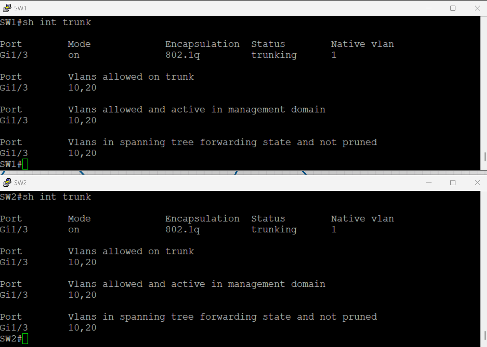
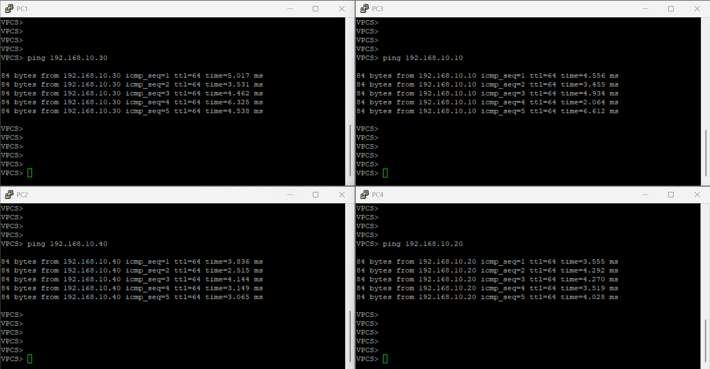

# 🖧 VLAN Configuration Lab

> Configure VLANs on switches, set up trunk links, and verify VLAN segmentation.

## 👤 Author

- [@alfaXphoori](https://www.github.com/alfaXphoori)

---

## 📋 Table of Contents

1. [Lab Objectives](#lab-objectives)
2. [Lab Setup](#lab-setup)
3. [VLAN Configuration](#vlan-configuration)
4. [Trunk Configuration](#trunk-configuration)
5. [Testing Connectivity](#testing-connectivity)
6. [Summary & Next Steps](#summary--next-steps)

---

## 🎯 Lab Objectives

> **Purpose:** Learn to segment networks using VLANs and establish trunk links.

- ✅ Create VLANs on switches
- ✅ Assign ports to VLANs
- ✅ Configure trunk links between switches
- ✅ Verify VLAN configuration and connectivity

---

## 🛠️ Lab Setup

> **Purpose:** Create a multi-switch VLAN topology.

### Step 1: Create Lab Topology

**What:** Set up devices and connections for VLAN testing.

**How to:**
1. Create a new lab named "VLAN_Lab"
2. Add devices: Two Cisco Switches (SW1, SW2), Four Virtual PCs (PC1, PC2, PC3, PC4)
3. Connect: PC1→SW1(Gi0/0), PC2→SW1(Gi0/1), PC3→SW2(Gi0/0), PC4→SW2(Gi0/1), SW1→SW2(Gi1/3-Trunk)


> **✅ Checkpoint:** Topology created.

---

## ⚙️ VLAN Configuration

### Step 2: Configure VLANs on SW1

```bash
enable
configure terminal
vlan 10
name Sales
exit
vlan 20
name IT
exit

interface gigabitEthernet 0/0
switchport mode access
switchport access vlan 10
exit

interface gigabitEthernet 0/1
switchport mode access
switchport access vlan 20
exit
```

### Step 3: Configure VLANs on SW2

```bash
enable
configure terminal
vlan 10
name Sales
exit
vlan 20
name IT
exit

interface gigabitEthernet 0/0
switchport mode access
switchport access vlan 10
exit

interface gigabitEthernet 0/1
switchport mode access
switchport access vlan 20
exit
```

---

## 🔄 Trunk Configuration

### Step 4: Configure Trunk Between SW1 and SW2

**On SW1:**
```bash
interface gigabitEthernet 1/3
switchport trunk encapsulation dot1q
switchport mode trunk
switchport trunk allowed vlan 10,20
exit
```

**On SW2:**
```bash
interface gigabitEthernet 1/3
switchport trunk encapsulation dot1q
switchport mode trunk
switchport trunk allowed vlan 10,20
exit
```

---

## 🔍 Testing Connectivity

### Step 5: Verify VLAN Configuration

```bash
show vlan brief
show interfaces trunk
```




### Step 6: Test Connectivity

**PC Configuration:**
- PC1: `ip 192.168.10.10 255.255.255.0 192.168.10.1`
- PC3: `ip 192.168.10.30 255.255.255.0 192.168.10.1`
- PC2: `ip 192.168.20.20 255.255.255.0 192.168.20.1`
- PC4: `ip 192.168.20.40 255.255.255.0 192.168.20.1`

**Test Results:**
- PC1 ↔ PC3 (VLAN 10): ✅ Success
- PC2 ↔ PC4 (VLAN 20): ✅ Success  
- PC1 ↔ PC2 (Different VLAN): ❌ Should fail



---

## ✅ Summary & Next Steps

**Accomplished:**
- ✅ Created VLANs on switches
- ✅ Assigned ports to VLANs
- ✅ Configured trunk links
- ✅ Verified VLAN isolation

**Next:** Inter-VLAN Routing, Advanced Features, Network Segmentation

---

## 🆘 Troubleshooting

| Issue | Solution |
|-------|----------|
| Trunk not carrying VLANs | Verify trunk mode and allowed VLANs |
| VLAN doesn't appear | Check VLAN creation and port assignment |
| Ports show as down | Use `no shutdown`; verify connections |
| Can't ping across VLANs | Normal - need router for inter-VLAN routing |

---

✅ **VLAN configuration lab completed! 🚀**
