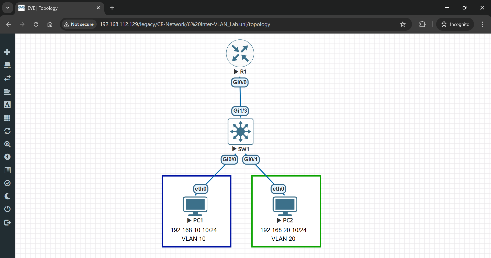
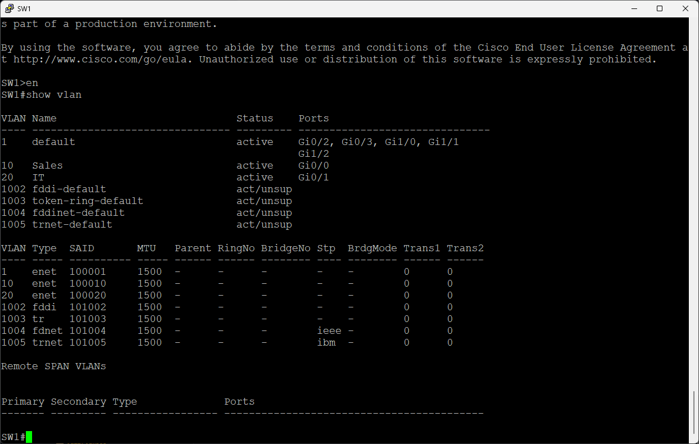
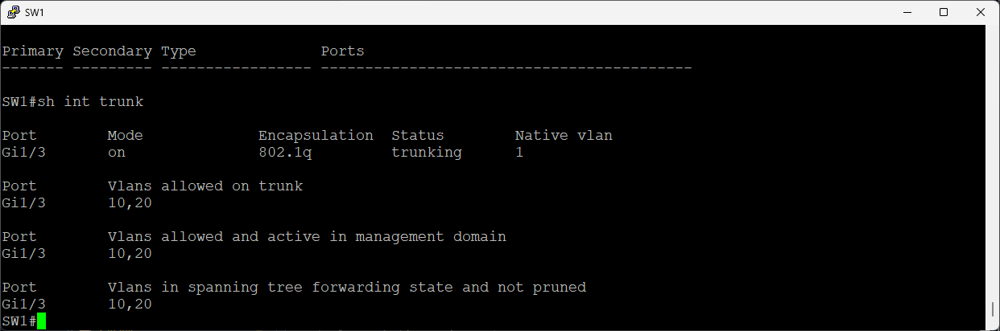
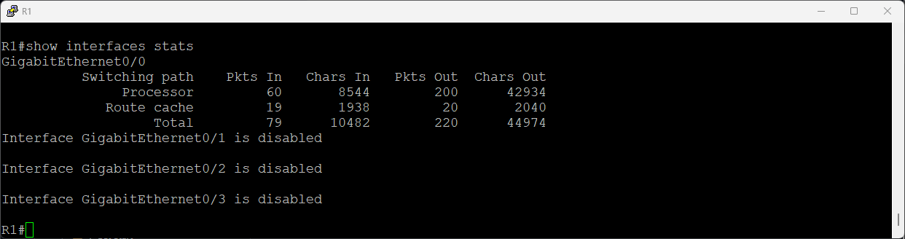
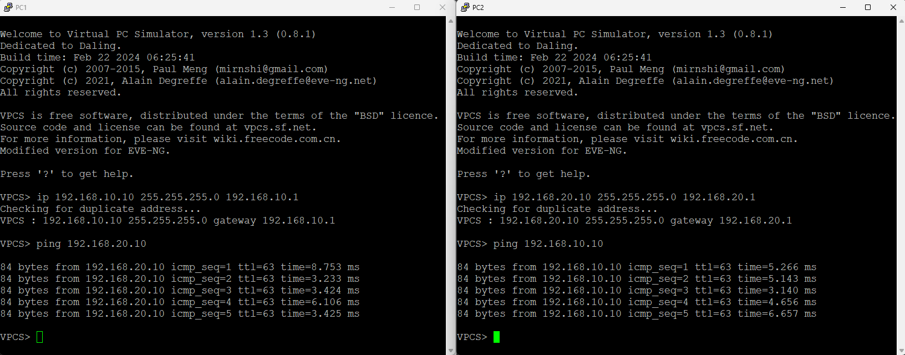

# 🚀 Inter-VLAN Routing Lab

> Complete hands-on lab to configure router-on-a-stick (RoaS) to enable communication between different VLANs using subinterfaces and 802.1Q encapsulation.

## 👤 Author

- [@alfaXphoori](https://www.github.com/alfaXphoori)

---

## 📋 Table of Contents

1. [Lab Objectives](#lab-objectives)
2. [Prerequisites](#prerequisites)
3. [Lab Topology](#lab-topology)
4. [Creating the Lab](#creating-the-lab)
5. [Switch VLAN Configuration](#switch-vlan-configuration)
6. [Router-on-a-Stick Configuration](#router-on-a-stick-configuration)
7. [PC Configuration](#pc-configuration)
8. [Testing Connectivity](#testing-connectivity)
9. [Verification](#verification)
10. [Troubleshooting](#troubleshooting)
11. [Summary & Next Steps](#summary--next-steps)

---

## 🎯 Lab Objectives

> **Purpose:** Master inter-VLAN routing using router-on-a-stick (RoaS) architecture.

### By the end of this lab, you will:

- ✅ Create multiple VLANs on a Cisco switch
- ✅ Configure a trunk link between switch and router
- ✅ Implement router-on-a-stick (RoaS) using subinterfaces
- ✅ Configure 802.1Q VLAN tagging on router subinterfaces
- ✅ Assign gateway IPs for each VLAN on the router
- ✅ Configure PC IP addresses with proper gateway settings
- ✅ Test inter-VLAN connectivity and verify traffic routing
- ✅ Understand the difference between intra-VLAN and inter-VLAN communication

---

## ✅ Prerequisites

> **Purpose:** Ensure you have completed foundational knowledge and resources.

### Required Knowledge

| Topic | Why It Matters | Reference |
|-------|---------------|---------  |
| **VLAN Configuration** | Know how to create and assign VLANs | 05_VLAN Lab |
| **Trunk Ports** | Understand 802.1Q tagging | 05_VLAN Lab |
| **IP Addressing** | Assign IPs within subnets | 04_Basic Switch Lab |
| **Router CLI** | Navigate Cisco router configuration | 03_Switch Config Lab |
| **Ping Testing** | Verify connectivity | 04_Basic Switch Lab |

### Required Resources

- ✅ EVE-NG installed and running
- ✅ Cisco switch image available
- ✅ Cisco router image available (IOSv or similar)
- ✅ Virtual PC (VPCS) images available
- ✅ Completed 05_VLAN lab (highly recommended)

---

## 📊 Lab Topology

> **Purpose:** Visualize the network structure for inter-VLAN routing.



### Topology Details

| Device | VLAN | IP Address | Subnet Mask | Role |
|--------|------|-----------|-------------|------|
| **PC1** | 10 (Sales) | 192.168.10.10 | 255.255.255.0 | Access device |
| **PC2** | 20 (IT) | 192.168.20.10 | 255.255.255.0 | Access device |
| **SW1 Gi0/0** | 10 | N/A | N/A | Access port |
| **SW1 Gi0/1** | 20 | N/A | N/A | Access port |
| **SW1 Gi1/3** | Trunk | N/A | N/A | Trunk to router |
| **R1 Gi0/0.10** | 10 | 192.168.10.1 | 255.255.255.0 | VLAN 10 Gateway |
| **R1 Gi0/0.20** | 20 | 192.168.20.1 | 255.255.255.0 | VLAN 20 Gateway |

---

## 🔧 Creating the Lab

> **Purpose:** Set up the inter-VLAN routing topology in EVE-NG.

### Step 1: Create a New Lab

**What:** Create the lab project for inter-VLAN routing.

**How to:**
1. Log into EVE-NG web interface
2. Click **Add Lab**
3. Enter lab details:
   - **Lab Name**: `Inter_VLAN_Lab`
   - **Lab Description**: `Router-on-a-Stick Inter-VLAN Routing`
   - **Lab Version**: `1.0`
4. Click **Create**

> **💡 Tip:** This lab builds on the VLAN lab, so keep similar naming conventions.

---

### Step 2: Add Router Node

**What:** Add a Cisco router for inter-VLAN routing.

**How to:**
1. Click **Add Node**
2. Select **Cisco** → **IOSv** (router, not switch)
3. Configure:
   - **Node Name**: `R1`
   - **Quantity**: `1`
4. Click **Add**

> **ℹ️ Note:** Make sure to select the router image, not the switch image.

---

### Step 3: Add Switch Node

**What:** Add a Cisco switch for VLAN configuration.

**How to:**
1. Click **Add Node**
2. Select **Cisco** → **IOSv** (switch image)
3. Configure:
   - **Node Name**: `SW1`
   - **Quantity**: `1`
4. Click **Add**

---

### Step 4: Add Virtual PC Nodes

**What:** Add two virtual PCs in different VLANs.

**How to:**
1. Click **Add Node**
2. Select **VPCS** (Virtual PC Simulator)
3. Configure:
   - **Node Name**: `PC1`
   - **Quantity**: `2` (creates PC1 and PC2)
4. Click **Add**

---

### Step 5: Connect Devices - Access Links

**What:** Connect PCs to switch access ports.

**How to:**
1. Click **Add Link** or drag cables
2. Create these connections:
   - PC1 → SW1 Gi0/0 (VLAN 10)
   - PC2 → SW1 Gi0/1 (VLAN 20)

---

### Step 6: Connect Switch to Router - Trunk Link

**What:** Create trunk connection between switch and router.

**How to:**
1. Click **Add Link**
2. Connect: SW1 Gi1/3 ↔ R1 Gi0/0 (trunk link)

> **⚠️ Important:** This trunk link carries all VLAN traffic to the router for inter-VLAN routing.

---

### Step 7: Start the Lab

**What:** Power on all devices.

**How to:**
1. Right-click on lab name
2. Select **Start Lab**
3. Wait for router and switch to boot (3-5 minutes)
4. Verify all devices show green status

---

## ⚙️ Switch VLAN Configuration

> **Purpose:** Create VLANs and configure trunk link on the switch.

### Step 8: Access SW1 Console

**What:** Connect to the switch.

**How to:**
1. Right-click on **SW1**
2. Select **Console**
3. Press **Enter** to see the prompt

---

### Step 9: Enter Configuration Mode

**What:** Access global configuration settings.

**Commands:**
```bash
enable
configure terminal
```

---

### Step 10: Create VLANs

**What:** Create two VLANs for Sales and IT departments.

**Commands:**
```bash
vlan 10
name Sales
exit

vlan 20
name IT
exit
```

| VLAN ID | VLAN Name | Purpose |
|---------|-----------|---------|
| **10** | Sales | Sales department devices |
| **20** | IT | IT department devices |

---

### Step 11: Assign Ports to VLANs

**What:** Configure access ports for each VLAN.

**Commands for Port Gi0/0 (VLAN 10):**
```bash
interface gigabitEthernet 0/0
switchport mode access
switchport access vlan 10
description PC1-Sales
no shutdown
exit
```

**Commands for Port Gi0/1 (VLAN 20):**
```bash
interface gigabitEthernet 0/1
switchport mode access
switchport access vlan 20
description PC2-IT
no shutdown
exit
```

---

### Step 12: Configure Trunk Port to Router

**What:** Set up trunk link carrying both VLANs to router.

**Commands:**
```bash
interface gigabitEthernet 1/3
switchport trunk encapsulation dot1q
switchport mode trunk
switchport trunk allowed vlan 10,20
description Trunk-to-R1
no shutdown
exit
```

**Expected Output:**
```
Switch(config-if)#interface gigabitEthernet 1/3
Switch(config-if)#switchport trunk encapsulation dot1q
Switch(config-if)#switchport mode trunk
Switch(config-if)#switchport trunk allowed vlan 10,20
Switch(config-if)#exit
```

---

### Step 13: Verify Switch Configuration

**What:** Confirm VLANs and trunk are properly configured.

**Commands:**
```bash
show vlan brief
```

**Expected Output:**
```
VLAN Name                             Status    Ports
---- -------------------------------- --------- ------
10   Sales                            active    Gi0/0
20   IT                               active    Gi0/1
```



**Verify Trunk:**
```bash
show interfaces trunk
```

**Expected Output:**
```
Port        Mode         Encapsulation  Status
Gi1/3       on           802.1q         trunking
```



> **✅ Checkpoint:** Switch is ready to pass VLAN-tagged traffic to router.

---

## 🔀 Router-on-a-Stick Configuration

> **Purpose:** Configure router subinterfaces to route between VLANs.

### Step 14: Access R1 Console

**What:** Connect to the router.

**How to:**
1. Right-click on **R1**
2. Select **Console**
3. Press **Enter** to see the prompt

---

### Step 15: Enter Configuration Mode

**What:** Access global configuration settings.

**Commands:**
```bash
enable
configure terminal
```

---

### Step 16: Configure Subinterface for VLAN 10

**What:** Create subinterface 0/0.10 for VLAN 10 with gateway IP.

**Commands:**
```bash
interface gigabitEthernet 0/0.10
encapsulation dot1Q 10
ip address 192.168.10.1 255.255.255.0
description VLAN10-Sales
no shutdown
exit
```

**Command Breakdown:**

| Command | Purpose |
|---------|---------|
| `interface gigabitEthernet 0/0.10` | Create subinterface .10 for VLAN 10 |
| `encapsulation dot1Q 10` | Enable 802.1Q VLAN tagging for VLAN 10 |
| `ip address 192.168.10.1 255.255.255.0` | Assign gateway IP for VLAN 10 |
| `no shutdown` | Activate the subinterface |

---

### Step 17: Configure Subinterface for VLAN 20

**What:** Create subinterface 0/0.20 for VLAN 20 with gateway IP.

**Commands:**
```bash
interface gigabitEthernet 0/0.20
encapsulation dot1Q 20
ip address 192.168.20.1 255.255.255.0
description VLAN20-IT
no shutdown
exit
```

---

### Step 18: Activate Physical Interface

**What:** Enable the parent physical interface (Gi0/0).

**Commands:**
```bash
interface gigabitEthernet 0/0
no shutdown
exit
```

> **ℹ️ Important:** The parent interface must be up for subinterfaces to work.

---

### Step 19: Save Router Configuration

**What:** Persist all routing configuration.

**Commands:**
```bash
end
write memory
```

---

### Step 20: Verify Router Configuration

**What:** Confirm subinterfaces are configured correctly.

**Commands:**
```bash
show ip interface brief
```

**Expected Output:**
```
Interface              IP-Address      OK? Method Status                Protocol
GigabitEthernet0/0     unassigned      YES unset  up                    up
GigabitEthernet0/0.10  192.168.10.1    YES manual up                    up
GigabitEthernet0/0.20  192.168.20.1    YES manual up                    up
```



> **✅ Checkpoint:** Router is now configured to route between VLANs using subinterfaces.

---

## 🌐 PC Configuration

> **Purpose:** Assign IP addresses to PCs in their respective VLANs.

### Step 21: Configure PC1 (VLAN 10 - Sales)

**What:** Assign IP address and gateway to PC1.

**How to:**
1. Right-click on **PC1** in topology
2. Select **Console**

**Commands:**
```bash
ip 192.168.10.10 255.255.255.0 192.168.10.1
```

**Verification:**
```bash
show ip
```

**Expected Output:**
```
PC1> show ip
NAME        : PC1
IP/MASK     : 192.168.10.10/24
GATEWAY     : 192.168.10.1
```

> **💡 Note:** Gateway is set to the router's subinterface IP (192.168.10.1).

---

### Step 22: Configure PC2 (VLAN 20 - IT)

**What:** Assign IP address and gateway to PC2.

**How to:**
1. Right-click on **PC2** in topology
2. Select **Console**

**Commands:**
```bash
ip 192.168.20.10 255.255.255.0 192.168.20.1
```

> **ℹ️ Note:** Gateway points to router's VLAN 20 subinterface (192.168.20.1).

---

## 🔍 Testing Connectivity

> **Purpose:** Verify inter-VLAN routing is working correctly.

### Step 23: Test PC1 to PC2 (Inter-VLAN)

**What:** Ping from PC1 (VLAN 10) to PC2 (VLAN 20).

**Commands (from PC1):**
```bash
ping 192.168.20.10
```

**Expected Output:**
```
PC1>ping 192.168.20.10
Type escape sequence to abort.
Sending 5, 100-byte ICMP Echoes to 192.168.20.10, timeout is 2 seconds:
!!!!!
Success rate is 100 percent (5/5), roundtrip min/avg/max = 2/3/5 ms
```



> **✅ Success:** Inter-VLAN communication working! Different VLANs can now communicate through the router.

---

### Step 24: Test PC2 to PC1 (Reverse Direction)

**What:** Verify bidirectional communication.

**Commands (from PC2):**
```bash
ping 192.168.10.10
```

**Expected Output:**
```
PC2>ping 192.168.10.10
Type escape sequence to abort.
Sending 5, 100-byte ICMP Echoes to 192.168.10.10, timeout is 2 seconds:
!!!!!
Success rate is 100 percent (5/5), roundtrip min/avg/max = 2/3/5 ms
```

> **✅ Confirmed:** Bidirectional inter-VLAN routing is functional!

---

## ✔️ Verification

> **Purpose:** Confirm the complete inter-VLAN routing setup.

### Step 25: Verify Router Subinterfaces

**What:** Check all subinterfaces are up and configured.

**Commands (on R1):**
```bash
show interfaces dot1Q
```

**Expected Output:**
```
GigabitEthernet0/0 is up, line protocol is up
  Encapsulation ARPA, loopback not set

GigabitEthernet0/0.10 is up, line protocol is up
  Encapsulation 802.1Q, single tagged vlan 10

GigabitEthernet0/0.20 is up, line protocol is up
  Encapsulation 802.1Q, single tagged vlan 20
```

---

### Step 26: Check Router Routing Table

**What:** Verify routing entries for both VLANs.

**Commands:**
```bash
show ip route
```

**Expected Output:**
```
C   192.168.10.0/24 is directly connected, GigabitEthernet0/0.10
C   192.168.20.0/24 is directly connected, GigabitEthernet0/0.20
```

---

### Step 27: Trace Route Between VLANs

**What:** Visualize the path packets take.

**Commands (from PC1):**
```bash
trace 192.168.20.10
```

**Expected Output:**
```
PC1>trace 192.168.20.10
trace to 192.168.20.10, 8 hops max, press Ctrl+C to stop
 1   192.168.10.1      3.521 ms  2.318 ms  2.456 ms
 2   192.168.20.10     5.127 ms  3.892 ms  4.156 ms
```

> **ℹ️ Note:** First hop is the router's VLAN 10 gateway, second hop is PC2.

---

## 🆘 Troubleshooting

| 🔴 Issue | 🔧 Diagnosis | ✅ Solution |
|---------|-----------|-----------|
| **Inter-VLAN ping fails** | Subinterface not configured or IP mismatch | Verify with `show ip interface brief`; check subinterface IPs |
| **Subinterface shows down** | Encapsulation error or parent interface down | Use `no shutdown` on both subinterface and parent; verify dot1Q |
| **Router receives VLAN traffic but doesn't forward** | Routing table missing VLAN networks | Verify `show ip route`; ensure subinterfaces are up |
| **PC can't reach gateway IP** | Gateway IP not assigned or VLAN mismatch | Verify PC IP and gateway with `show ip`; check switch VLAN assignment |
| **Asymmetric routing (one direction works)** | Configuration incomplete on one side | Check both PC configurations and both router subinterfaces |
| **Slow inter-VLAN response** | High router load or performance issue | Check router CPU/memory; optimize configuration if needed |

### Quick Verification Commands

```bash
# Router subinterface status
show interfaces gigabitEthernet 0/0.10
show interfaces gigabitEthernet 0/0.20

# Verify 802.1Q encapsulation
show interfaces gigabitEthernet 0/0 encapsulation

# Check routing table
show ip route

# Test connectivity from router
ping 192.168.10.10
ping 192.168.20.10

# PC verification
show ip
ping <destination>
```

---

## ✅ Summary & Next Steps

### Lab Completion

**Congratulations!** You have successfully:

- ✅ Created two VLANs (Sales-10, IT-20) on a switch
- ✅ Configured a trunk link between switch and router
- ✅ Implemented router-on-a-stick using subinterfaces
- ✅ Configured 802.1Q VLAN tagging on router
- ✅ Set up gateway IPs for inter-VLAN routing
- ✅ Assigned PC IPs with proper gateway configuration
- ✅ Verified inter-VLAN communication works in both directions
- ✅ Tested and confirmed routing between different VLANs

### Key Concepts Learned

| Concept | Description | Key Takeaway |
|---------|-------------|--------------|
| **Router-on-a-Stick** | Single router interface routing multiple VLANs | Cost-effective inter-VLAN routing solution |
| **Subinterfaces** | Virtual interfaces on single physical port | Each subinterface serves one VLAN |
| **802.1Q Tagging** | VLAN identification on trunk links | Router recognizes and routes based on VLAN ID |
| **Gateway IPs** | Router IP addresses in each VLAN subnet | PCs use these to route beyond their VLAN |
| **Inter-VLAN Routing** | Routing between different VLAN subnets | Enables communication across VLAN boundaries |
| **Trunk Encapsulation** | Protocol for carrying multiple VLANs | dot1Q (802.1Q) is industry standard |

### Router-on-a-Stick Configuration Reference

```bash
# Configure subinterface for VLAN
interface Gi0/0.10
encapsulation dot1Q 10
ip address 192.168.10.1 255.255.255.0
no shutdown
exit

# Configure parent interface
interface Gi0/0
no shutdown
exit

# Verify configuration
show ip interface brief
show ip route
```

### What's Next?

**Choose your next learning path:**

1. **🌳 Spanning Tree Protocol (STP):**
   - Configure STP to prevent Layer 2 loops
   - Learn about root bridge and port roles
   - Test failover scenarios with redundant links

2. **🔐 Network Security:**
   - Configure port security on switches
   - Implement ACLs on router interfaces
   - Set up 802.1X authentication

3. **⚡ Advanced Routing:**
   - Configure static routes
   - Implement RIP (Routing Information Protocol)
   - Learn about OSPF for dynamic routing

4. **🏗️ Complex Topologies:**
   - Add multiple routers and switches
   - Configure multiple trunk links
   - Implement route redundancy

---

## 📚 Useful Resources

- [Cisco Router-on-a-Stick Guide](https://www.cisco.com/c/en/us/support/docs/lan-switching/inter-vlan-routing/41860-69.html)
- [Subinterface Configuration](https://www.cisco.com/c/en/us/td/docs/routers/access/3200/software/configuration/guide/b_3200_cg_chapter05.pdf)
- [802.1Q VLAN Tagging](https://www.cisco.com/c/en/us/td/docs/switches/lan/catalyst9200/software/release/17_3_1/configuration_guide/b_c9200_cg_173_1/configuring_vlans.pdf)
- [Inter-VLAN Routing Best Practices](https://www.cisco.com/c/en/us/support/docs/ip/routing-information-protocol-rip/13788-3.html)
- [EVE-NG Documentation](https://www.eve-ng.net/index.php/documentation/)

---

## 💡 Best Practices & Tips

### ✅ Configuration Best Practices

- **Use Consistent Numbering:** Match subinterface number to VLAN ID (.10 for VLAN 10)
- **Descriptive Names:** Add descriptions to subinterfaces for documentation
- **Test Each VLAN:** Verify connectivity for each VLAN before integration
- **Document Gateway IPs:** Keep record of which IPs serve which VLANs
- **Verify Trunk Settings:** Ensure allowed VLANs match on both switch and router

### 🔐 Security Considerations

- **Native VLAN:** Change from default VLAN 1 for security
- **ACLs on Subinterfaces:** Restrict traffic between VLANs as needed
- **Router Authentication:** Enable SSH and disable Telnet
- **Protect VLAN 1:** Avoid using default VLAN for production traffic

### ⚡ Performance Optimization

- **Optimize Trunk Bandwidth:** Only allow necessary VLANs on trunk
- **Router Resource Allocation:** Monitor CPU during inter-VLAN traffic
- **Quality of Service (QoS):** Prioritize critical traffic between VLANs
- **VLAN Scalability:** Plan for future VLAN growth

---

✅ **Inter-VLAN routing lab completed successfully!** 🎓

**Ready to implement network redundancy and advanced routing! 🚀**
