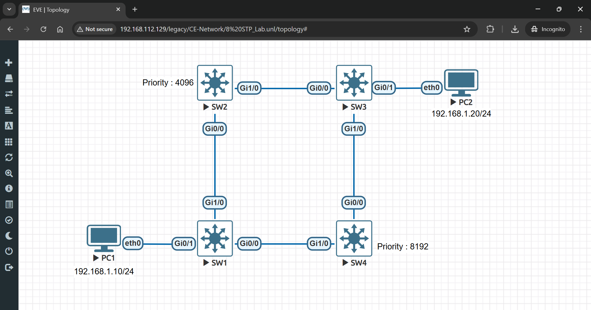
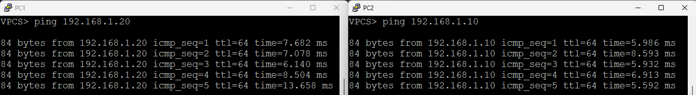

# 🌳 Spanning Tree Protocol (STP) Lab

> Complete hands-on lab to configure Spanning Tree Protocol to prevent Layer 2 loops and ensure optimal network topology in switched networks.

## 👤 Author

- [@alfaXphoori](https://www.github.com/alfaXphoori)

---

## 📋 Table of Contents

1. [Lab Objectives](#lab-objectives)
2. [Prerequisites](#prerequisites)
3. [Lab Topology](#lab-topology)
4. [Creating the Lab](#creating-the-lab)
5. [STP Configuration](#stp-configuration)
6. [Root Bridge Configuration](#root-bridge-configuration)
7. [STP Verification](#stp-verification)
8. [Loop Prevention Testing](#loop-prevention-testing)
9. [PC Configuration](#pc-configuration)
10. [Testing Connectivity](#testing-connectivity)
11. [Troubleshooting](#troubleshooting)
12. [Summary & Next Steps](#summary--next-steps)

---

## 🎯 Lab Objectives

> **Purpose:** Master Spanning Tree Protocol to prevent broadcast storms and Layer 2 loops in switched networks.

### By the end of this lab, you will:

- ✅ Understand the need for loop prevention in switched networks
- ✅ Create a network topology with redundant connections
- ✅ Enable Spanning Tree Protocol (STP) on multiple switches
- ✅ Configure Rapid PVST+ (Per-VLAN Spanning Tree Plus)
- ✅ Set root bridge priority to control STP behavior
- ✅ Identify blocked ports and active spanning tree paths
- ✅ Verify STP convergence and topology changes
- ✅ Test network failover and redundancy

---

## ✅ Prerequisites

> **Purpose:** Ensure you have necessary knowledge and resources.

### Required Knowledge

| Topic | Why It Matters | Reference |
|-------|---------------|---------  |
| **Basic Switching** | Understand switch forwarding | 04_Basic Switch Lab |
| **VLAN Concepts** | VLANs affect STP behavior | 05_VLAN Lab |
| **CLI Commands** | Navigate switch configuration | 03_Switch Config Lab |
| **Network Topology** | Visualize switch mesh topology | 06_Inter_VLAN Lab |

### Required Resources

- ✅ EVE-NG installed and running
- ✅ Cisco switch images available (IOSv recommended)
- ✅ Virtual PC (VPCS) images available
- ✅ Access to EVE-NG web interface
- ✅ Completed 05_VLAN lab (recommended for foundation)

---

## 📊 Lab Topology

> **Purpose:** Visualize the redundant switch topology with loop connections.



### Topology Details

| Device | Role | Purpose |
|--------|------|---------|
| **SW1** | Access switch | Connects PC1 to network |
| **SW2** | Core switch | Designated as Root Bridge |
| **SW3** | Access switch | Connects PC2 to network |
| **SW4** | Backup switch | Designated as Secondary Root |
| **PC1** | End device | Tests connectivity |
| **PC2** | End device | Tests connectivity |

### Network Connections

| Link | Devices | Purpose | Status |
|------|---------|---------|--------|
| **Link 1** | SW1 ↔ SW2 | Primary path | Active |
| **Link 2** | SW2 ↔ SW3 | Secondary path | Active |
| **Link 3** | SW3 ↔ SW4 | Tertiary path | Active |
| **Link 4** | SW4 ↔ SW1 | Redundant loop | **Blocked by STP** |

> **ℹ️ Key Point:** Link 4 would create a broadcast storm without STP. STP blocks this link to prevent loops.

---

## 🔧 Creating the Lab

> **Purpose:** Set up the redundant switch topology in EVE-NG.

### Step 1: Create a New Lab

**What:** Create the lab project for STP configuration.

**How to:**
1. Log into EVE-NG web interface
2. Click **Add Lab**
3. Enter lab details:
   - **Lab Name**: `STP_Lab`
   - **Lab Description**: `Spanning Tree Protocol Loop Prevention`
   - **Lab Version**: `1.0`
4. Click **Create**

---

### Step 2: Add Switch Nodes

**What:** Add four Cisco switches for redundant topology.

**How to:**
1. Click **Add Node**
2. Select **Cisco** → **IOSv** (switch)
3. Configure:
   - **Node Name**: `SW1`
   - **Quantity**: `4` (to create SW1-SW4 together)
4. Click **Add**

---

### Step 3: Add Virtual PC Nodes

**What:** Add two virtual PCs for connectivity testing.

**How to:**
1. Click **Add Node**
2. Select **VPCS** (Virtual PC Simulator)
3. Configure:
   - **Node Name**: `PC1`
   - **Quantity**: `2` (creates PC1 and PC2)
4. Click **Add**

---

### Step 4: Connect PCs to Switches

**What:** Connect end devices to access switches.

**How to:**
1. Click **Add Link** or drag cables
2. Create these connections:
   - PC1 → SW1 Gi0/1 (access port)
   - PC2 → SW3 Gi0/1 (access port)

---

### Step 5: Connect Switches for Redundancy

**What:** Create mesh topology with redundant links.

**How to:**
1. Click **Add Link**
2. Create these trunk connections:
   - SW1 Gi1/0 ↔ SW2 Gi0/0 (Link 1)
   - SW2 Gi1/0 ↔ SW3 Gi0/0 (Link 2)
   - SW3 Gi1/0 ↔ SW4 Gi0/0 (Link 3)
   - SW4 Gi1/0 ↔ SW1 Gi0/0 (Link 4 - will be blocked by STP)

> **ℹ️ Important:** These create multiple paths between switches. STP will disable Link 4 to prevent loops.

---

### Step 6: Start the Lab

**What:** Power on all devices.

**How to:**
1. Right-click on lab name
2. Select **Start Lab**
3. Wait for all switches to boot (3-5 minutes)
4. Verify all devices show green status

---

## ⚙️ STP Configuration

> **Purpose:** Enable Spanning Tree Protocol on all switches to prevent loops.

### Step 7: Configure STP on SW1

**What:** Enable Rapid PVST+ on the first switch.

**How to:**
1. Right-click on **SW1**
2. Select **Console**
3. Press **Enter** to see the prompt

**Commands:**
```bash
enable
configure terminal
spanning-tree mode rapid-pvst
exit
```

**Expected Output:**
```
Switch(config)#spanning-tree mode rapid-pvst
Switch(config)#exit
Switch#
```

> **ℹ️ Note:** Rapid PVST+ is faster than standard PVST and provides per-VLAN spanning tree.

---

### Step 8: Configure STP on SW2

**What:** Enable Rapid PVST+ on the second switch.

**Commands:**
```bash
enable
configure terminal
spanning-tree mode rapid-pvst
exit
```

---

### Step 9: Configure STP on SW3

**What:** Enable Rapid PVST+ on the third switch.

**Commands:**
```bash
enable
configure terminal
spanning-tree mode rapid-pvst
exit
```

---

### Step 10: Configure STP on SW4

**What:** Enable Rapid PVST+ on the fourth switch.

**Commands:**
```bash
enable
configure terminal
spanning-tree mode rapid-pvst
exit
```

> **✅ Checkpoint:** All switches now have STP enabled. They will automatically elect a root bridge.

---

## 👑 Root Bridge Configuration

> **Purpose:** Manually configure root bridge priority to control STP topology.

### Step 11: Configure SW2 as Root Bridge

**What:** Set SW2 as the primary root bridge with lowest priority.

**How to (on SW2):**
1. Access console on SW2
2. Enter configuration mode

**Commands:**
```bash
enable
configure terminal
spanning-tree vlan 1 priority 4096
exit
```

**Command Breakdown:**

| Command | Purpose |
|---------|---------|
| `spanning-tree vlan 1 priority 4096` | Set VLAN 1 priority to 4096 (lower = becomes root) |
| Priority values | 0, 4096, 8192, 12288... in increments of 4096 |
| Default priority | 32768 |

> **💡 Tip:** Lowest priority value becomes root bridge. Default is 32768, so 4096 ensures SW2 becomes root.

---

### Step 12: Configure SW4 as Secondary Root Bridge

**What:** Set SW4 as backup root bridge with second-lowest priority.

**How to (on SW4):**
1. Access console on SW4

**Commands:**
```bash
enable
configure terminal
spanning-tree vlan 1 priority 8192
exit
```

> **ℹ️ Note:** If SW2 fails, SW4 (with priority 8192) becomes the new root bridge.

---

### Step 13: Save Configuration on All Switches

**What:** Persist STP configuration.

**Commands (on each switch):**
```bash
write memory
```

> **✅ Checkpoint:** STP topology is now configured with SW2 as root and SW4 as backup.

---

## ✔️ STP Verification

> **Purpose:** Confirm STP is working and topology is correct.

### Step 14: Verify STP Status on SW1

**What:** Check STP information from a non-root switch.

**Commands:**
```bash
show spanning-tree
```

**Expected Output:**
```
VLAN0001
  Spanning tree enabled protocol rstp
  Root ID    Priority    4096
             Address     0050.0ff3.0000
             This bridge is a designated bridge
  Bridge ID  Priority    32768
             Address     0050.0ff3.1111
             
Root port is Gi0/0, cost is 4
```

| Output Item | Meaning |
|-------------|---------|
| **Root ID Priority** | Root bridge priority (4096 = SW2) |
| **Root Address** | MAC address of root bridge |
| **This bridge** | Your current switch's role |
| **Root port** | Interface toward root bridge |
| **Cost** | Path cost to root (lower is better) |

---

### Step 15: Check Root Bridge Election

**What:** Verify SW2 is elected as root.

**Commands (on SW2):**
```bash
show spanning-tree
```

**Expected Output:**
```
VLAN0001
  Spanning tree enabled protocol rstp
  Root ID    Priority    4096
             Address     0050.0ff3.0000  (SW2's MAC)
             This bridge is the root
```

> **✅ Confirmed:** SW2 is the root bridge!

---

### Step 16: Identify Blocked Ports

**What:** Find which STP ports are blocked to prevent loops.

**Commands (on any switch):**
```bash
show spanning-tree blockedports
```

**Alternative:**
```bash
show spanning-tree interface brief
```

**Expected Output:**
```
Interface   Role        Sts Cost      Prio Type
Gi0/0       designated  fwd 4        128  P2p
Gi0/1       designated  fwd 4        128  P2p
Gi1/0       alternate   blk 4        128  P2p
```

| Port Status | Meaning |
|-------------|---------|
| **fwd** | Forwarding (actively passing traffic) |
| **blk** | Blocking (blocked to prevent loop) |
| **dis** | Disabled (port shut down) |

> **ℹ️ Note:** Blocked ports become active if active links fail (automatic failover).

---

### Step 17: Check STP Convergence Time

**What:** Verify rapid convergence is enabled.

**Commands:**
```bash
show spanning-tree detail | include hello
```

**Expected Output:**
```
  Forward delay 15 sec, Hello time 2 sec, Max age 20 sec
```

| Timer | Purpose | Value |
|-------|---------|-------|
| **Hello time** | BPDUs sent every X seconds | 2 sec |
| **Forward delay** | Time to learn MAC addresses | 15 sec |
| **Max age** | Max time to wait for BPDU | 20 sec |

> **ℹ️ Note:** Rapid PVST+ converges faster than standard STP (typically < 6 seconds).

---

## 🔄 Loop Prevention Testing

> **Purpose:** Verify STP is preventing broadcast storms and loops.

### Step 18: Simulate Link Failure

**What:** Disconnect an active link to test STP failover.

**How to:**
1. In EVE-NG, right-click on the **Link 1** connection (SW1 ↔ SW2)
2. Select **Stop** or **Remove**

---

### Step 19: Observe STP Convergence

**What:** Watch STP adjust topology when link fails.

**Commands (on SW1):**
```bash
show spanning-tree
```

**Expected Changes:**
- Root port may change
- Port costs might be updated
- Previously blocked port becomes active (failover)

**Convergence Timeline:**
- **0 sec**: Link fails
- **2 sec**: Missing BPDU detected
- **6 sec**: STP converges (Rapid PVST+)
- **~8 sec**: Network fully operational

> **✅ Checkpoint:** Network automatically reroutes traffic around failed link!

---

### Step 20: Restore Link and Verify Recovery

**What:** Reconnect the link and verify topology returns to optimal state.

**How to:**
1. In EVE-NG, right-click on the disconnected link
2. Select **Start** to restore

**Commands:**
```bash
show spanning-tree
```

> **ℹ️ Note:** STP should gradually shift traffic back to optimal paths after link recovery.

---

## 🌐 PC Configuration

> **Purpose:** Assign IP addresses to PCs for connectivity testing.

### Step 21: Configure PC1

**What:** Assign IP address to first PC.

**How to:**
1. Right-click on **PC1**
2. Select **Console**

**Commands:**
```bash
ip 192.168.1.10 255.255.255.0 192.168.1.1
```

**Verification:**
```bash
show ip
```

---

### Step 22: Configure PC2

**What:** Assign IP address to second PC.

**How to:**
1. Right-click on **PC2**
2. Select **Console**

**Commands:**
```bash
ip 192.168.1.20 255.255.255.0 192.168.1.1
```

> **ℹ️ Note:** Both PCs in same network (192.168.1.0/24) for direct communication.

---

## 🔍 Testing Connectivity

> **Purpose:** Verify network communication through STP-protected topology.

### Step 23: Test PC1 to PC2 (Over STP Network)

**What:** Ping from PC1 to PC2 through the STP-protected switch mesh.

**Commands (from PC1):**
```bash
ping 192.168.1.20
```

**Expected Output:**
```
PC1>ping 192.168.1.20
Type escape sequence to abort.
Sending 5, 100-byte ICMP Echoes to 192.168.1.20, timeout is 2 seconds:
!!!!!
Success rate is 100 percent (5/5), roundtrip min/avg/max = 1/1/2 ms
```



> **✅ Success:** Traffic successfully routes through STP-protected topology!

---

### Step 24: Test PC2 to PC1 (Bidirectional)

**What:** Verify reverse direction connectivity.

**Commands (from PC2):**
```bash
ping 192.168.1.10
```

**Expected Output:**
```
PC2>ping 192.168.1.10
Type escape sequence to abort.
Sending 5, 100-byte ICMP Echoes to 192.168.1.10, timeout is 2 seconds:
!!!!!
Success rate is 100 percent (5/5), roundtrip min/avg/max = 1/1/2 ms
```

> **✅ Confirmed:** Bidirectional communication working through redundant topology!

---

## 🆘 Troubleshooting

| 🔴 Issue | 🔧 Diagnosis | ✅ Solution |
|---------|-----------|-----------|
| **All ports blocked** | Mismatched STP modes or priority issues | Verify `show spanning-tree mode` on all switches; check priorities |
| **No root bridge elected** | STP not enabled or timing issue | Enable STP with `spanning-tree mode rapid-pvst` on all switches |
| **Connectivity fails** | Loop exists or blocked port blocks needed path | Verify `show spanning-tree blockedports`; check topology |
| **STP takes too long to converge** | Using standard PVST instead of Rapid | Change to Rapid PVST+ with `spanning-tree mode rapid-pvst` |
| **PC can't ping through switches** | VLAN or trunk issue | Verify ports are in VLAN 1 or configured trunk; check `show vlan` |
| **Blocked port doesn't failover** | Link failure not detected | Verify BPDU sending with `debug spanning-tree events` |

### Quick Verification Commands

```bash
# Show complete STP information
show spanning-tree

# Show STP detail for specific VLAN
show spanning-tree vlan 1

# Show STP bridge priorities
show spanning-tree bridge

# Show blocked and forwarding ports
show spanning-tree interface brief

# Show root bridge information
show spanning-tree root

# Check STP mode
show spanning-tree mode

# Trace STP calculation
debug spanning-tree cstp
```

---

## ✅ Summary & Next Steps

### Lab Completion

**Congratulations!** You have successfully:

- ✅ Created a redundant switch topology with loop connections
- ✅ Enabled Spanning Tree Protocol on all switches
- ✅ Configured Rapid PVST+ for fast convergence
- ✅ Set root bridge and backup root bridge priorities
- ✅ Identified blocked ports preventing broadcast storms
- ✅ Verified STP topology and port roles
- ✅ Tested network failover and automatic recovery
- ✅ Confirmed connectivity through STP-protected mesh network

### Key Concepts Learned

| Concept | Description | Key Takeaway |
|---------|-------------|--------------|
| **Loop Prevention** | Blocks redundant paths to prevent broadcast storms | Essential for network stability |
| **Root Bridge** | Lowest priority switch becomes topology center | Other switches reference it for paths |
| **Designated Ports** | Ports that forward traffic on each link | Chosen based on priority and cost |
| **Blocked Ports** | Redundant ports disabled to prevent loops | Activate automatically if active link fails |
| **BPDU** | Bridge Protocol Data Units for STP communication | Sent every 2 seconds (hello time) |
| **Rapid PVST+** | Fast spanning tree per VLAN | Converges in ~6 seconds vs 30+ for standard STP |
| **STP Modes** | PVST+, Rapid PVST+, MSTP | Rapid PVST+ best for most networks |

### STP Configuration Reference

```bash
# Enable Rapid PVST+
spanning-tree mode rapid-pvst

# Set priority (root bridge)
spanning-tree vlan 1 priority 4096

# Check STP status
show spanning-tree

# Show blocked ports
show spanning-tree blockedports

# Monitor STP activity
debug spanning-tree events
```

### What's Next?

**Choose your next learning path:**

1. **🔀 Multiple Spanning Tree (MSTP):**
   - Configure MSTP for multiple VLAN groups
   - Load-balance traffic across multiple regions
   - Reduce STP instance overhead

2. **⚡ EtherChannel (Link Aggregation):**
   - Combine multiple physical links logically
   - Increase bandwidth and redundancy
   - Configure LACP or PAgP

3. **🔐 Network Security:**
   - Configure port security (MAC limiting)
   - Implement BPDU Guard to protect topology
   - Set up STP Root Guard

4. **🏗️ Advanced Redundancy:**
   - Configure Virtual Router Redundancy Protocol (VRRP)
   - Implement First Hop Redundancy Protocol (FHRP)
   - Build highly resilient network infrastructure

---

## 📚 Useful Resources

- [Cisco STP Configuration Guide](https://www.cisco.com/c/en/us/td/docs/switches/lan/catalyst9200/software/release/17_3_1/configuration_guide/b_c9200_cg_173_1/configuring_spanning_tree_protocol.pdf)
- [Rapid PVST+ Best Practices](https://www.cisco.com/c/en/us/support/docs/lan-switching/spanning-tree-protocol/24062-147.html)
- [STP Priority and Path Cost](https://www.cisco.com/c/en/us/support/docs/lan-switching/spanning-tree-protocol/12013-5.html)
- [BPDU Guard Configuration](https://www.cisco.com/c/en/us/support/docs/lan-switching/spanning-tree-protocol/10586-12.html)
- [EVE-NG Documentation](https://www.eve-ng.net/index.php/documentation/)

---

## 💡 Best Practices & Tips

### ✅ STP Configuration Best Practices

- **Use Rapid PVST+:** Faster convergence than standard PVST
- **Plan Root Bridge:** Choose stable, centrally located switch
- **Set Backup Root:** Configure secondary root for failover
- **Document Priority:** Keep records of priority assignments
- **Monitor BPDU Activity:** Watch for unexpected topology changes
- **Test Failover Regularly:** Verify failover works before emergency

### 🔐 STP Security

- **Enable BPDU Guard:** Prevent unauthorized topology changes
- **Implement Root Guard:** Protect root bridge from being usurped
- **Configure Loop Guard:** Detect unidirectional link failures
- **Disable STP on access ports:** Use portfast for end devices
- **Monitor for rogue devices:** Alert on topology changes

### ⚡ STP Optimization

- **Tune timers carefully:** Don't make convergence too fast
- **Adjust port costs:** Balance load across multiple paths
- **Use MST for many VLANs:** Reduces protocol overhead
- **Implement EtherChannel:** Provides faster failover
- **Monitor convergence times:** Aim for < 10 seconds

---

✅ **Spanning Tree Protocol lab completed successfully!** 🎓

**Ready to implement advanced redundancy and network resilience! 🚀**
