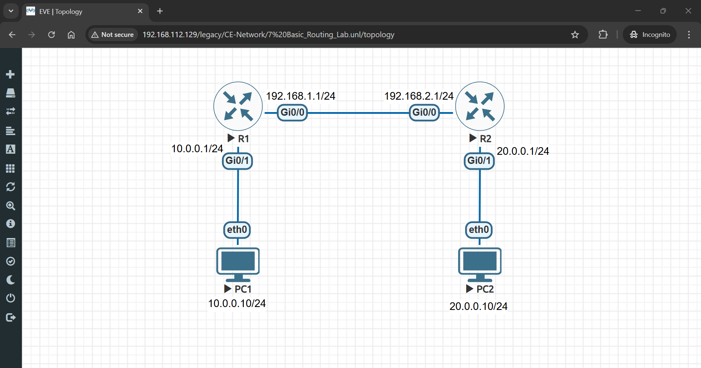
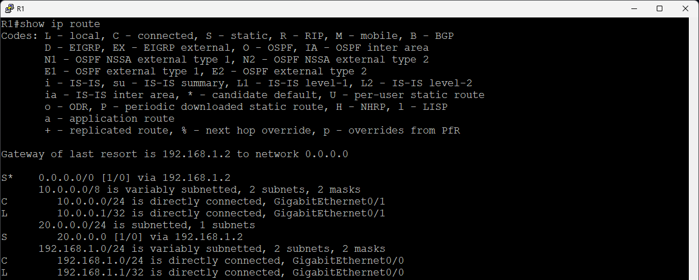
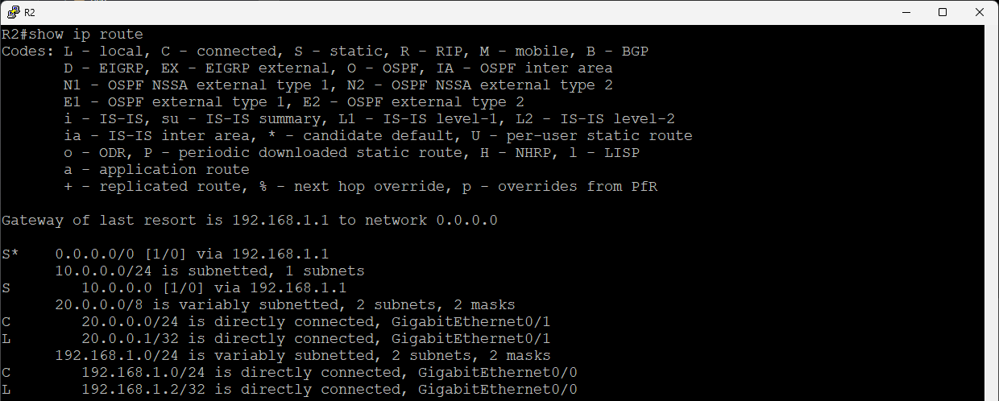
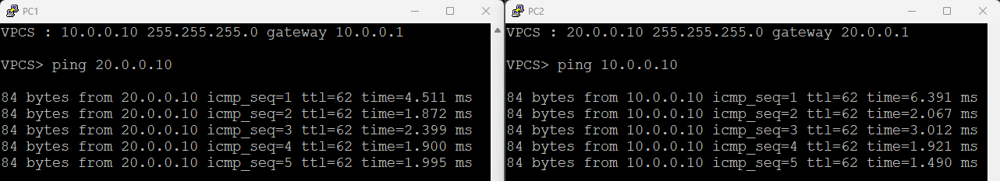

# 🚀 Basic Routing Lab (Static & Default Routes) in EVE-NG

## 🔹 Lab Objectives

- **Set up static routes**  
- **Configure a default route to the internet**  
- **Verify routing with `show ip route`**

---

## 🛠 Step 1: Set Up the Lab in EVE-NG

- 1️⃣ Open **EVE-NG**.
- 2️⃣ Create a **New Lab** (e.g., "Basic_Routing_Lab").
- 3️⃣ **Add Devices**:
   - **Two Cisco Routers (R1 & R2)**
   - **Two Virtual PCs (PC1 & PC2)**
- 4️⃣ **Connect Devices**:
   - 🔌 **PC1 → R1 (GigabitEthernet 0/1)**
   - 🔌 **PC2 → R2 (GigabitEthernet 0/1)**
   - 🔌 **R1 → R2 (GigabitEthernet 0/0 to GigabitEthernet 0/0)**
- 5️⃣ **Diagram**:
   - 

---

## 🔹 Step 2: Configure IP Addresses

### 🖧 **On Router R1**
```bash
enable
configure terminal
interface gigabitEthernet 0/0
ip address 192.168.1.1 255.255.255.0
no shutdown
exit

interface gigabitEthernet 0/1
ip address 10.0.0.1 255.255.255.0
no shutdown
exit
```

### 🖧 **On Router R2**
```bash
enable
configure terminal
interface gigabitEthernet 0/0
ip address 192.168.1.2 255.255.255.0
no shutdown
exit

interface gigabitEthernet 0/1
ip address 20.0.0.1 255.255.255.0
no shutdown
exit
```

✅ **Now, both routers have IPs assigned.**

---

## 🔹 Step 3: Configure Static Routes

### 🛣 **On Router R1** (To reach PC2 network via R2)
```bash
ip route 20.0.0.0 255.255.255.0 192.168.1.2
```

### 🛣 **On Router R2** (To reach PC1 network via R1)
```bash
ip route 10.0.0.0 255.255.255.0 192.168.1.1
```

✅ **Now, R1 and R2 can route traffic between networks.**

---

## 🔹 Step 4: Configure a Default Route (Internet Access)

### 🛜 **On Router R1**
```bash
ip route 0.0.0.0 0.0.0.0 192.168.1.2
```

### 🛜 **On Router R2**
```bash
ip route 0.0.0.0 0.0.0.0 192.168.1.1
```

✅ **This enables default routing to an external network.**

---

## 🔹 Step 5: Verify Routing

### 📋 **Check Routing Table on R1 & R2**
```bash
show ip route
```
- 
- 

✅ **This should display static and default routes.**

---

## 🔹 Step 6: Assign IP Addresses to PCs

### 🖥 **On PC1**
```bash
ip 10.0.0.10 255.255.255.0 10.0.0.1
```

### 🖥 **On PC2**
```bash
ip 20.0.0.10 255.255.255.0 20.0.0.1
```

✅ **PCs are assigned their respective IP addresses.**

---

## 🔹 Step 7: Test Connectivity

1️⃣ **From PC1, ping PC2**:
```bash
ping 20.0.0.10
```

2️⃣ **From PC2, ping PC1**:
```bash
ping 10.0.0.10
```

- 
✅ **If successful, routing is working correctly!**

---