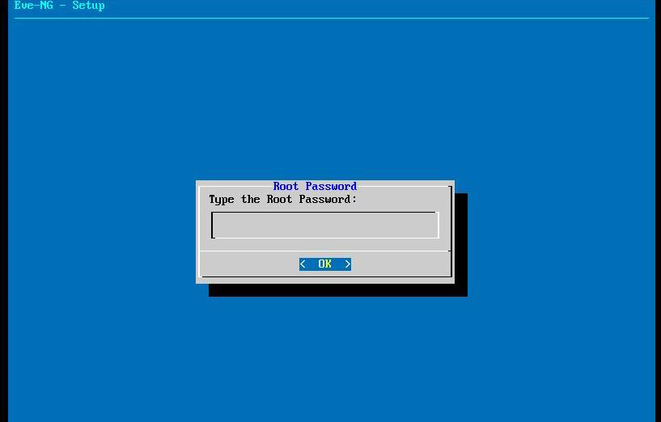
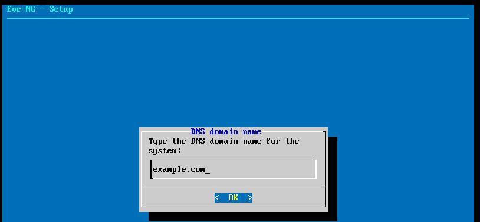
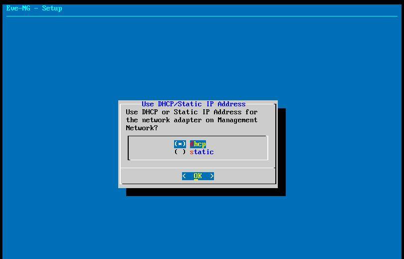
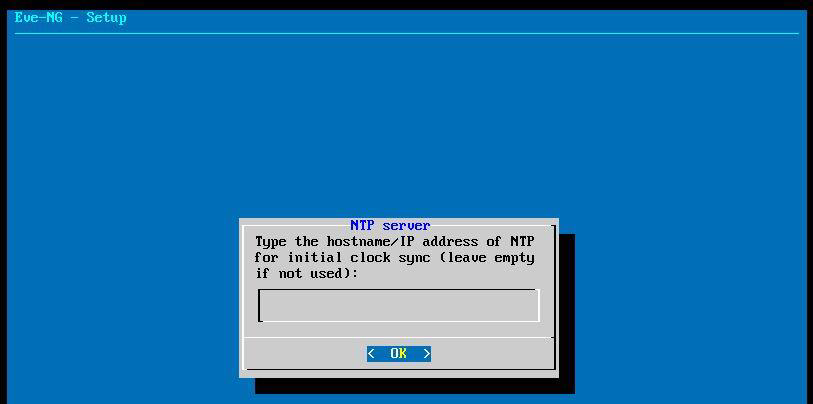
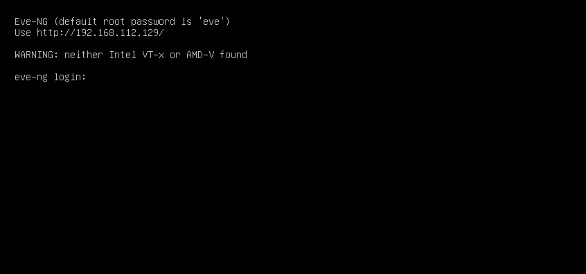
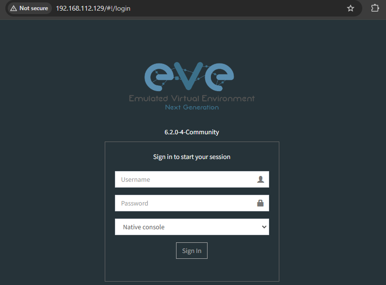

# 🚀 Project: EVE-NG

## 👤 Authors
- [@alfaXphoori](https://www.github.com/alfaXphoori)

---

## ⚙️ Environment Variables
- **VMware Workstation Pro**
- **EVE-NG ISO** [Download Here](https://www.eve-ng.net/)

---

## 📥 Installation Guide

### 🔹 1. Login to EVE-NG
- **Username:** root
- **Password:** eve
- 

### 🔹 2. Change the Password for EVE-NG
- 

### 🔹 3. Configure DNS Domain Name
- 

### 🔹 4. Configure IP Address
- **Using DHCP**
- 

### 🔹 5. Configure NTP Server
- **Default is blank**
- 

### 🔹 6. Configure Network Connection
- **Direct Connection**
- 

### 🔹 7. Complete Installation
- 

### 🔹 8. Access EVE-NG Web GUI
- Open a **browser** and enter the **EVE-NG server IP address**.
  - **Username:** admin
  - **Password:** eve
- 

### 🔹 9. Install Windows Client Side
- Download and install the **Windows Client Side** from [EVE-NG Downloads](https://www.eve-ng.net/index.php/download/).
- 

✅ **Installation and setup completed successfully!** 🚀