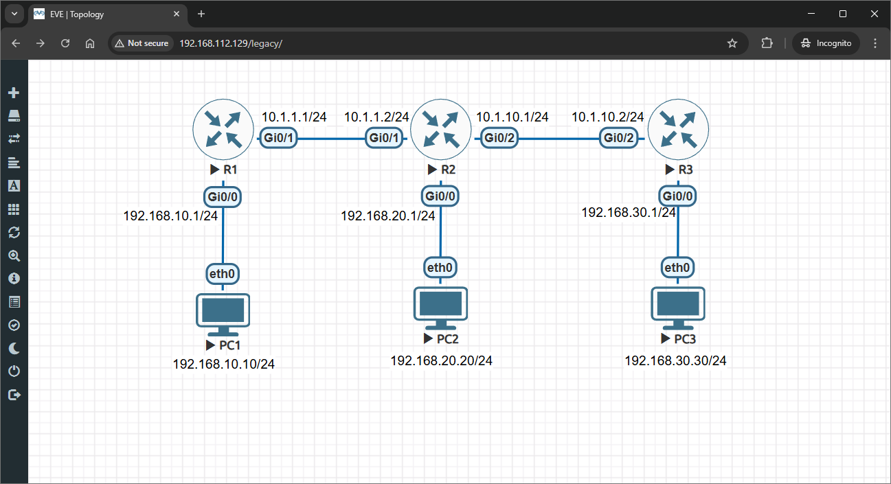
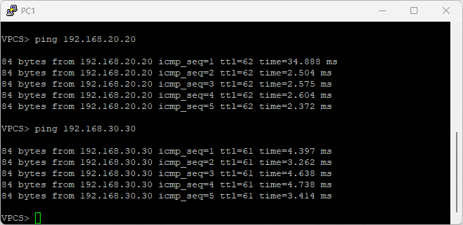

# 🏆 OSPF Routing Lab

> Complete hands-on lab to configure Open Shortest Path First (OSPF) for advanced dynamic routing with link-state protocols and optimized path selection.

## 👤 Author

- [@alfaXphoori](https://www.github.com/alfaXphoori)

---

## 📋 Table of Contents

1. [Lab Objectives](#lab-objectives)
2. [Prerequisites](#prerequisites)
3. [Lab Topology](#lab-topology)
4. [Creating the Lab](#creating-the-lab)
5. [Router IP Configuration](#router-ip-configuration)
6. [OSPF Protocol Configuration](#ospf-protocol-configuration)
7. [OSPF Adjacency & Optimization](#ospf-adjacency--optimization)
8. [PC Configuration](#pc-configuration)
9. [Testing Connectivity](#testing-connectivity)
10. [Verification](#verification)
11. [Troubleshooting](#troubleshooting)
12. [Summary & Next Steps](#summary--next-steps)

---

## 🎯 Lab Objectives

> **Purpose:** Master link-state dynamic routing using OSPF protocol for scalable networks.

### By the end of this lab, you will:

- ✅ Understand link-state routing protocol fundamentals
- ✅ Configure OSPF v2 on multiple routers
- ✅ Establish OSPF adjacencies and become neighbors
- ✅ Understand OSPF cost calculation and metric selection
- ✅ Verify OSPF database and routing tables
- ✅ Implement OSPF in single-area topology
- ✅ Test multi-hop connectivity through OSPF network
- ✅ Troubleshoot OSPF adjacency and routing issues
- ✅ Compare OSPF vs RIP advantages

---

## ✅ Prerequisites

> **Purpose:** Ensure you have necessary knowledge and resources.

### Required Knowledge

| Topic | Why It Matters | Reference |
|-------|---------------|---------  |
| **RIP Fundamentals** | Understand advantages of OSPF | 09_RIP_Lab |
| **IP Addressing** | Assign IPs to router interfaces | 04_Basic Switch Lab |
| **Router CLI** | Navigate router configuration | 03_Switch Config Lab |
| **Ping Testing** | Verify connectivity | 04_Basic Switch Lab |
| **Link-State Concepts** | Understand OSPF algorithm | Basic networking knowledge |

### Required Resources

- ✅ EVE-NG installed and running
- ✅ Cisco router images available (IOSv)
- ✅ Virtual PC (VPCS) images available
- ✅ Access to EVE-NG web interface
- ✅ Completed 09_RIP_Lab (recommended)

---

## 📊 Lab Topology

> **Purpose:** Visualize the multi-router OSPF network topology with area 0.



### Topology Details

| Device | Interface | IP Address | Subnet Mask | Role |
|--------|-----------|-----------|-------------|------|
| **R1** | Gi0/0 | 192.168.10.1 | 255.255.255.0 | Access network |
| **R1** | Gi0/1 | 10.1.1.1 | 255.255.255.0 | Link to R2 |
| **R2** | Gi0/0 | 192.168.20.1 | 255.255.255.0 | Access network |
| **R2** | Gi0/1 | 10.1.1.2 | 255.255.255.0 | Link to R1 |
| **R2** | Gi0/2 | 10.1.10.1 | 255.255.255.0 | Link to R3 |
| **R3** | Gi0/0 | 192.168.30.1 | 255.255.255.0 | Access network |
| **R3** | Gi0/2 | 10.1.10.2 | 255.255.255.0 | Link to R2 |
| **PC1** | eth0 | 192.168.10.10 | 255.255.255.0 | Access device |
| **PC2** | eth0 | 192.168.20.20 | 255.255.255.0 | Access device |
| **PC3** | eth0 | 192.168.30.30 | 255.255.255.0 | Access device |


---

## 🔧 Creating the Lab

> **Purpose:** Set up the three-router OSPF network topology in EVE-NG.

### Step 1: Create a New Lab

**What:** Create the lab project for OSPF dynamic routing.

**How to:**
1. Log into EVE-NG web interface
2. Click **Add Lab**
3. Enter lab details:
   - **Lab Name**: `OSPF_Lab`
   - **Lab Description**: `OSPF Link-State Dynamic Routing Configuration`
   - **Lab Version**: `1.0`
4. Click **Create**

---

### Step 2: Add Router Nodes

**What:** Add three Cisco routers for OSPF topology.

**How to:**
1. Click **Add Node**
2. Select **Cisco** → **IOSv** (router)
3. Configure:
   - **Node Name**: `R1`
   - **Quantity**: `1`
4. Click **Add**
5. Repeat for R2 and R3:
   - **Node Name**: `R2`
   - **Node Name**: `R3`

> **ℹ️ Note:** All three routers will run OSPF and exchange link-state information.

---

### Step 3: Add Virtual PC Nodes

**What:** Add three virtual PCs in different access networks.

**How to:**
1. Click **Add Node**
2. Select **VPCS** (Virtual PC Simulator)
3. Configure:
   - **Node Name**: `PC1`
   - **Quantity**: `3` (creates PC1, PC2, PC3)
4. Click **Add**

---

### Step 4: Connect Devices

**What:** Create all necessary links between devices.

**How to:**
1. **Connect PC1 to R1:**
   - PC1 → R1 Gi0/0 (access network 192.168.10.0/24)

2. **Connect PC2 to R2:**
   - PC2 → R2 Gi0/0 (access network 192.168.20.0/24)

3. **Connect PC3 to R3:**
   - PC3 → R3 Gi0/0 (access network 192.168.30.0/24)

4. **Connect R1 to R2:**
   - R1 Gi0/1 ↔ R2 Gi0/1 (backbone link 10.1.1.0/24)

5. **Connect R2 to R3:**
   - R2 Gi0/2 ↔ R3 Gi0/2 (backbone link 10.1.10.0/24)

> **⚠️ Important:** Ensure all backbone links are properly connected for OSPF adjacency.

---

### Step 5: Start the Lab

**What:** Power on all devices.

**How to:**
1. Right-click on lab name
2. Select **Start Lab**
3. Wait for routers to boot (3-5 minutes)
4. Verify all devices show green status

---

## ⚙️ Router IP Configuration

> **Purpose:** Configure IP addresses on all router interfaces for the OSPF network.

### Step 6: Access R1 Console

**What:** Connect to the first router.

**How to:**
1. Right-click on **R1**
2. Select **Console**
3. Press **Enter** to see the prompt

---

### Step 7: Configure R1 Interfaces

**What:** Assign IP addresses to R1's access and backbone interfaces.

**Commands:**
```bash
enable
configure terminal
interface gigabitEthernet 0/0
ip address 192.168.10.1 255.255.255.0
no shutdown
exit

interface gigabitEthernet 0/1
ip address 10.1.1.1 255.255.255.0
no shutdown
exit
end
```

**Expected Output:**
```
Router(config)#interface gigabitEthernet 0/0
Router(config-if)#ip address 192.168.10.1 255.255.255.0
Router(config-if)#no shutdown
Router(config-if)#exit
Router(config)#interface gigabitEthernet 0/1
Router(config-if)#ip address 10.1.1.1 255.255.255.0
Router(config-if)#no shutdown
Router(config-if)#exit
Router(config)#end
```

> **ℹ️ Note:** R1 has access network (Gi0/0) and backbone link to R2 (Gi0/1).

---

### Step 8: Configure R2 Interfaces

**What:** Assign IP addresses to R2's interfaces (central router).

**Commands:**
```bash
enable
configure terminal
interface gigabitEthernet 0/0
ip address 192.168.20.1 255.255.255.0
no shutdown
exit

interface gigabitEthernet 0/1
ip address 10.1.1.2 255.255.255.0
no shutdown
exit

interface gigabitEthernet 0/2
ip address 10.1.10.1 255.255.255.0
no shutdown
exit
end
```

> **ℹ️ Note:** R2 connects to both R1 and R3 through two backbone interfaces.

---

### Step 9: Configure R3 Interfaces

**What:** Assign IP addresses to R3's access and backbone interfaces.

**Commands:**
```bash
enable
configure terminal
interface gigabitEthernet 0/0
ip address 192.168.30.1 255.255.255.0
no shutdown
exit

interface gigabitEthernet 0/2
ip address 10.1.10.2 255.255.255.0
no shutdown
exit
end
```

> **✅ Checkpoint:** All router interfaces are now configured with IP addresses.

---

## 🔄 OSPF Protocol Configuration

> **Purpose:** Configure OSPF on all routers to enable link-state dynamic routing.

### Step 10: Enable OSPF on R1

**What:** Start OSPF process and advertise connected networks.

**Commands (on R1):**
```bash
configure terminal
router ospf 1
network 192.168.10.0 0.0.0.255 area 0
network 10.1.1.0 0.0.0.255 area 0
exit
end
```

**Command Breakdown:**

| Command | Purpose |
|---------|---------|
| **router ospf 1** | Start OSPF process (ID = 1) |
| **network 192.168.10.0** | Advertise connected network |
| **0.0.0.255** | Inverse subnet mask (wildcard) |
| **area 0** | Backbone area (must be area 0) |

> **ℹ️ Explanation:** OSPF will send hello packets on these networks to find neighbors.

---

### Step 11: Enable OSPF on R2

**What:** Configure R2 as central OSPF router.

**Commands (on R2):**
```bash
configure terminal
router ospf 1
network 192.168.20.0 0.0.0.255 area 0
network 10.1.1.0 0.0.0.255 area 0
network 10.1.10.0 0.0.0.255 area 0
exit
end
```

> **ℹ️ Note:** R2 advertises three networks to connect R1, R3, and its own access network.

---

### Step 12: Enable OSPF on R3

**What:** Configure R3 with OSPF for link-state routing.

**Commands (on R3):**
```bash
configure terminal
router ospf 1
network 192.168.30.0 0.0.0.255 area 0
network 10.1.10.0 0.0.0.255 area 0
exit
end
```

> **✅ Checkpoint:** OSPF is now running on all three routers. Wait 30-60 seconds for adjacency.

---

## 🔒 OSPF Adjacency & Optimization

> **Purpose:** Verify OSPF neighbors and optimize network parameters.

### Step 13: Verify OSPF Neighbors on R1

**What:** Check that R1 has established adjacency with R2.

**Commands:**
```bash
show ip ospf neighbor
```

**Expected Output:**
```
Neighbor ID     Pri   State           Dead Time   Address         Interface
10.1.1.2          1   FULL/BDR        38          10.1.1.2        GigabitEthernet0/1
```

| Field | Meaning |
|-------|---------|
| **Neighbor ID** | Router ID of R2 |
| **Pri** | Priority (1 = normal) |
| **State** | FULL = adjacency established |
| **Dead Time** | When to consider neighbor dead |
| **Address** | Neighbor's interface IP |

> **ℹ️ Note:** State should be FULL, not EXSTART or EXCHANGE.

---

### Step 14: Verify OSPF Neighbors on R2

**What:** Check that R2 has adjacency with both R1 and R3.

**Commands:**
```bash
show ip ospf neighbor
```

**Expected Output:**
```
Neighbor ID     Pri   State           Dead Time   Address         Interface
10.1.1.1          1   FULL/DR         38          10.1.1.1        GigabitEthernet0/1
10.1.10.2         1   FULL/BDR        38          10.1.10.2       GigabitEthernet0/2
```

> **ℹ️ Note:** R2 should see both R1 and R3 as OSPF neighbors.

---

### Step 15: Verify OSPF Neighbors on R3

**What:** Check that R3 has established adjacency with R2.

**Commands:**
```bash
show ip ospf neighbor
```

> **✅ Checkpoint:** All OSPF adjacencies established in FULL state!

---

## 🌐 PC Configuration

> **Purpose:** Assign IP addresses to PCs in their respective access networks.

### Step 16: Configure PC1

**What:** Assign IP address to first PC with R1 as gateway.

**How to:**
1. Right-click on **PC1**
2. Select **Console**

**Commands:**
```bash
ip 192.168.10.10 255.255.255.0 192.168.10.1
```

**Verification:**
```bash
show ip
```

---

### Step 17: Configure PC2

**What:** Assign IP address to second PC with R2 as gateway.

**How to:**
1. Right-click on **PC2**
2. Select **Console**

**Commands:**
```bash
ip 192.168.20.20 255.255.255.0 192.168.20.1
```

---

### Step 18: Configure PC3

**What:** Assign IP address to third PC with R3 as gateway.

**How to:**
1. Right-click on **PC3**
2. Select **Console**

**Commands:**
```bash
ip 192.168.30.30 255.255.255.0 192.168.30.1
```

> **✅ Checkpoint:** All PCs are configured with correct gateways.

---

## 🔍 Testing Connectivity

> **Purpose:** Verify OSPF routing is working correctly across all networks.

### Step 19: Test PC1 to PC2 (Through R1 and R2)

**What:** Ping from PC1 across OSPF network to PC2.

**Commands (from PC1):**
```bash
ping 192.168.20.20
```

**Expected Output:**
```
PC1>ping 192.168.20.20
Type escape sequence to abort.
Sending 5, 100-byte ICMP Echoes to 192.168.20.20, timeout is 2 seconds:
!!!!!
Success rate is 100 percent (5/5), roundtrip min/avg/max = 3/4/6 ms
```



> **✅ Success:** Packets traverse: PC1 → R1 → R2 → PC2

---

### Step 20: Test PC1 to PC3 (Through R1, R2, and R3)

**What:** Ping from PC1 across full OSPF topology to PC3.

**Commands (from PC1):**
```bash
ping 192.168.30.30
```

**Expected Output:**
```
PC1>ping 192.168.30.30
Type escape sequence to abort.
Sending 5, 100-byte ICMP Echoes to 192.168.30.30, timeout is 2 seconds:
!!!!!
Success rate is 100 percent (5/5), roundtrip min/avg/max = 4/6/9 ms
```

> **✅ Success:** Packets traverse: PC1 → R1 → R2 → R3 → PC3

---

### Step 21: Test PC2 to PC3 (Through R2 and R3)

**What:** Verify connectivity between PC2 and PC3.

**Commands (from PC2):**
```bash
ping 192.168.30.30
```

**Expected Output:**
```
PC2>ping 192.168.30.30
Type escape sequence to abort.
Sending 5, 100-byte ICMP Echoes to 192.168.30.30, timeout is 2 seconds:
!!!!!
Success rate is 100 percent (5/5), roundtrip min/avg/max = 3/4/7 ms
```

> **✅ Confirmed:** All OSPF connectivity working!

---

## ✔️ Verification

> **Purpose:** Confirm OSPF routing tables are correct.

### Step 22: Check R1 Routing Table

**What:** Verify R1 learned routes via OSPF.

**Commands:**
```bash
show ip route
show ip route ospf
```

**Expected Output:**
```
Codes: C - connected, S - static, R - RIP, M - mobile, B - BGP
       D - EIGRP, EX - EIGRP external, O - OSPF

C    10.1.1.0/24 is directly connected, GigabitEthernet0/1
C    192.168.10.0/24 is directly connected, GigabitEthernet0/0
O    192.168.20.0/24 [110/2] via 10.1.1.2, 00:01:45, GigabitEthernet0/1
O    192.168.30.0/24 [110/3] via 10.1.1.2, 00:01:45, GigabitEthernet0/1
O    10.1.10.0/24 [110/2] via 10.1.1.2, 00:01:45, GigabitEthernet0/1
```

| Route | Code | Cost | Learned Via |
|-------|------|------|-------------|
| **10.1.1.0/24** | C | - | Direct |
| **192.168.10.0/24** | C | - | Direct |
| **192.168.20.0/24** | O | 2 | R2 (R1→R2) |
| **192.168.30.0/24** | O | 3 | R2 (R1→R2→R3) |
| **10.1.10.0/24** | O | 2 | R2 (R1→R2→R3) |

> **ℹ️ Note:** OSPF uses cost metric (lower = better path).

---

### Step 23: Check OSPF Database on R2

**What:** Verify OSPF link-state database (topology).

**Commands:**
```bash
show ip ospf database
show ip ospf database router
```

**Expected Output:**
```
            OSPF Router with ID (10.1.1.2) (Process ID 1)
Router Link States (Area 0)
LS age: 123
Options: (No TOS-capability, No DC)
LS Type: Router Links
Link State ID: 10.1.1.1
Advertising Router: 10.1.1.1
LS Seq Number: 0x80000001
Checksum: 0x1234
Length: 60
 Number of Links: 2
```

> **ℹ️ Note:** OSPF maintains full topology database on each router (link-state).

---

### Step 24: Check R3 Routing Table

**What:** Verify R3 learned remote networks via OSPF.

**Commands:**
```bash
show ip route ospf
```

**Expected Output:**
```
O    192.168.10.0/24 [110/3] via 10.1.10.1, 00:02:10, GigabitEthernet0/2
O    192.168.20.0/24 [110/2] via 10.1.10.1, 00:02:10, GigabitEthernet0/2
O    10.1.1.0/24 [110/2] via 10.1.10.1, 00:02:10, GigabitEthernet0/2
```

> **✅ Checkpoint:** All routers have complete OSPF routing tables!

---

## 🆘 Troubleshooting

| 🔴 Issue | 🔧 Diagnosis | ✅ Solution |
|---------|-----------|-----------|
| **No OSPF routes in table** | OSPF not enabled or neighbors down | Check `show ip ospf neighbor`; verify `network` commands |
| **Neighbors stuck in EXSTART** | MTU mismatch or timer mismatch | Check `show ip ospf interface`; verify hello/dead timers |
| **Only seeing some networks** | Missing network statements | Add all connected networks to OSPF config |
| **High routing costs** | Interface cost not optimized | Adjust with `ip ospf cost` on backbone links |
| **OSPF not converging** | SPF calculation delay | Wait 2-3 minutes; check router memory/CPU |
| **Asymmetric routing** | One-way link or cost mismatch | Verify all links bidirectional; check costs on both ends |

### Debugging Commands

```bash
# View OSPF process information
show ip ospf

# Check OSPF neighbor adjacency
show ip ospf neighbor detail

# View OSPF interface status
show ip ospf interface

# Check link-state database
show ip ospf database

# Debug OSPF adjacency
debug ip ospf adj

# View routing table
show ip route ospf

# Check specific route
show ip route 192.168.30.0

# Turn off debugging
undebug all
```

---

## ✅ Summary & Next Steps

### Lab Completion

**Congratulations!** You have successfully:

- ✅ Configured OSPF v2 on three routers
- ✅ Established OSPF adjacencies in FULL state
- ✅ Verified OSPF link-state database
- ✅ Tested multi-hop connectivity through OSPF network
- ✅ Verified routing tables with OSPF learned routes
- ✅ Calculated OSPF cost metrics for path selection
- ✅ Traced packet paths through OSPF topology

### Key Concepts Learned

| Concept | Description | Key Takeaway |
|---------|-------------|--------------|
| **Link-State Routing** | Routers exchange entire network topology | More accurate path selection |
| **OSPF Metric (Cost)** | Based on bandwidth (not hop count) | Better than RIP distance-vector |
| **Adjacency** | OSPF relationship between neighbors | Requires FULL state for routing |
| **Area 0 (Backbone)** | Core OSPF domain | All other areas must connect |
| **Convergence Time** | Typically 10-30 seconds | Much faster than RIP |
| **Administrative Distance** | OSPF has AD of 110 | Higher priority than RIP (120) |
| **Hello/Dead Timers** | 10/40 seconds by default | Must match between neighbors |

### OSPF Configuration Reference

```bash
# Enable OSPF process
router ospf 1

# Advertise networks (use wildcard mask)
network 192.168.10.0 0.0.0.255 area 0
network 10.1.1.0 0.0.0.255 area 0

# Set interface cost (lower = preferred)
interface Gi0/1
ip ospf cost 50

# Adjust hello interval
ip ospf hello-interval 10

# Check neighbors
show ip ospf neighbor
```

### What's Next?

**Choose your next learning path:**

1. **🔀 OSPF Enhancements:**
   - Configure multiple OSPF areas for scalability
   - Implement area summarization
   - Configure OSPF authentication (MD5)
   - Set interface priorities for DR/BDR election

2. **🔄 EIGRP (Enhanced Interior Gateway Routing Protocol):**
   - Configure EIGRP for faster convergence
   - Understand DUAL algorithm
   - Configure feasible successors and backup routes
   - Implement EIGRP route summarization

3. **🌐 BGP (Border Gateway Protocol):**
   - Configure external routing between autonomous systems
   - Understand path attributes and policy-based routing
   - Learn AS path prepending
   - Configure BGP communities

4. **⚡ Hybrid Routing:**
   - Configure multiple protocols in same network
   - Use redistribution between OSPF and EIGRP
   - Implement protocol preferences

---

## 📚 Useful Resources

- [Cisco OSPF Configuration Guide](https://www.cisco.com/c/en/us/td/docs/routers/access/800/software/configuration/guide/b_800_cg/b_800_cg_chapter_012.pdf)
- [OSPF Protocol Overview](https://www.cisco.com/c/en/us/support/docs/ip/open-shortest-path-first-ospf/7039-1.html)
- [OSPF Neighbor Adjacency States](https://www.cisco.com/c/en/us/support/docs/ip/open-shortest-path-first-ospf/13685-14.html)
- [OSPF Cost Calculation](https://www.cisco.com/c/en/us/support/docs/ip/open-shortest-path-first-ospf/7412-1.html)
- [RFC 2328 - OSPF v2 Specification](https://tools.ietf.org/html/rfc2328)
- [EVE-NG Documentation](https://www.eve-ng.net/index.php/documentation/)

---

## 💡 Best Practices & Tips

### ✅ OSPF Best Practices

- **Use Single Area 0:** Start with single-area topology (Area 0)
- **Set Network Statements:** Include all interfaces in OSPF process
- **Use Wildcard Masks:** Use inverse subnet masks (0.0.0.255 for /24)
- **Verify Adjacency:** Ensure neighbors reach FULL state before routing
- **Monitor Convergence:** OSPF should converge in < 1 minute
- **Document Areas:** Record which interfaces are in which areas
- **Consistent Timers:** Ensure hello/dead timers match on links

### 🔐 OSPF Security Considerations

- **Enable OSPF Authentication:** Use MD5 for link-state database integrity
- **Control DR/BDR Election:** Set priority values to manage topology
- **Implement Access Control:** Use route filters to limit route advertising
- **Monitor Database Size:** Large link-state databases impact memory
- **Validate Neighbor IDs:** Ensure neighbors are legitimate routers
- **Use Separate Backbone:** Isolate area 0 from edge networks

### ⚡ OSPF Performance Optimization

- **Optimize Interface Costs:** Adjust bandwidth-based costs appropriately
- **Use Route Summarization:** Reduce routing table size with aggregation
- **Tune Timers Carefully:** Faster timers = faster convergence but more overhead
- **Monitor SPF Calculations:** Excessive recalculations indicate instability
- **Plan For Growth:** Understand 15-hop area scaling limits
- **Use Virtual Links:** Connect discontiguous areas through backbone

### 🔧 OSPF Troubleshooting Tips

- **Check Timers First:** Mismatched hello/dead timers prevent adjacency
- **Verify Network Statements:** Missing interfaces = no OSPF routing
- **Compare Router IDs:** Each router must have unique OSPF router ID
- **Check MTU Settings:** MTU mismatch prevents database synchronization
- **Enable Debugging:** Use `debug ip ospf adj` for adjacency issues
- **Verify Area Numbers:** All networks in same area must match
- **Check Link Connectivity:** OSPF requires bidirectional links

---

✅ **OSPF dynamic routing lab completed successfully!** 🎓

**Ready to explore more advanced routing protocols! 🚀**
