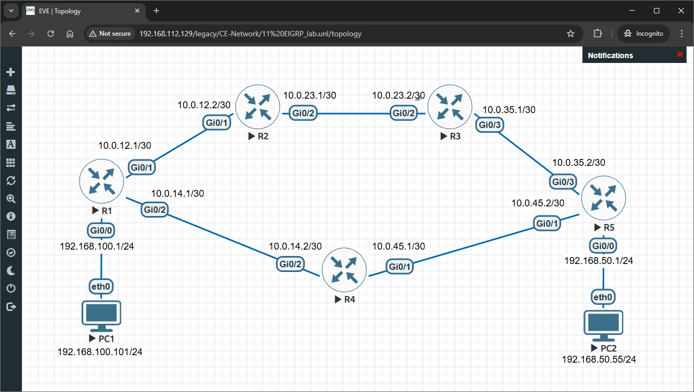
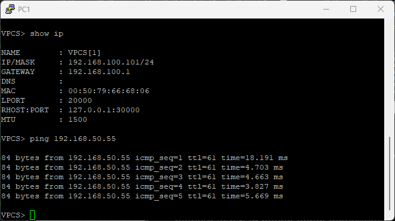

# ⚡ EIGRP Routing Lab

> Complete hands-on lab to configure Enhanced Interior Gateway Routing Protocol (EIGRP) for enterprise networks with fast convergence and efficient bandwidth utilization.

## 👤 Author

- [@alfaXphoori](https://www.github.com/alfaXphoori)

---

## 📋 Table of Contents

1. [Lab Objectives](#lab-objectives)
2. [Prerequisites](#prerequisites)
3. [Lab Topology](#lab-topology)
4. [Creating the Lab](#creating-the-lab)
5. [Router IP Configuration](#router-ip-configuration)
6. [EIGRP Protocol Configuration](#eigrp-protocol-configuration)
7. [EIGRP Adjacency & Optimization](#eigrp-adjacency--optimization)
8. [PC Configuration](#pc-configuration)
9. [Testing Connectivity](#testing-connectivity)
10. [Verification](#verification)
11. [Troubleshooting](#troubleshooting)
12. [Summary & Next Steps](#summary--next-steps)

---

## 🎯 Lab Objectives

> **Purpose:** Master hybrid dynamic routing using EIGRP for enterprise network scalability and convergence speed.

### By the end of this lab, you will:

- ✅ Understand EIGRP hybrid routing protocol fundamentals
- ✅ Configure EIGRP on multiple routers with different topologies
- ✅ Establish EIGRP neighbor relationships and adjacencies
- ✅ Understand EIGRP metrics and DUAL algorithm concepts
- ✅ Verify EIGRP topology table and successor/feasible successor routes
- ✅ Configure feasible successors for fast failover
- ✅ Test multi-hop connectivity through EIGRP network
- ✅ Troubleshoot EIGRP adjacency and routing issues
- ✅ Compare EIGRP advantages over OSPF and RIP

---

## ✅ Prerequisites

> **Purpose:** Ensure you have necessary knowledge and resources.

### Required Knowledge

| Topic | Why It Matters | Reference |
|-------|---------------|---------  |
| **OSPF Fundamentals** | Understand EIGRP advantages | 10_OSPF_Lab |
| **IP Addressing** | Assign IPs to router interfaces | 04_Basic Switch Lab |
| **Router CLI** | Navigate router configuration | 03_Switch Config Lab |
| **Ping Testing** | Verify connectivity | 04_Basic Switch Lab |
| **Hybrid Routing Concepts** | Understand EIGRP algorithm | Basic networking knowledge |

### Required Resources

- ✅ EVE-NG installed and running
- ✅ Cisco router images available (IOSv)
- ✅ Virtual PC (VPCS) images available
- ✅ Access to EVE-NG web interface
- ✅ Completed 10_OSPF_Lab (recommended)

---

## 📊 Lab Topology

> **Purpose:** Visualize the five-router EIGRP mesh network topology with redundancy.



### Topology Details

| Device | Interface | IP Address | Subnet Mask | Role |
|--------|-----------|-----------|-------------|------|
| **R1** | Gi0/0 | 192.168.100.1 | 255.255.255.0 | Access network |
| **R1** | Gi0/1 | 10.0.12.1 | 255.255.255.252 | Link to R2 |
| **R1** | Gi0/2 | 10.0.14.1 | 255.255.255.252 | Link to R4 |
| **R2** | Gi0/1 | 10.0.12.2 | 255.255.255.252 | Link to R1 |
| **R2** | Gi0/2 | 10.0.23.1 | 255.255.255.252 | Link to R3 |
| **R3** | Gi0/2 | 10.0.23.2 | 255.255.255.252 | Link to R2 |
| **R3** | Gi0/3 | 10.0.35.1 | 255.255.255.252 | Link to R5 |
| **R4** | Gi0/2 | 10.0.14.2 | 255.255.255.252 | Link to R1 |
| **R4** | Gi0/1 | 10.0.45.1 | 255.255.255.252 | Link to R5 |
| **R5** | Gi0/0 | 192.168.50.1 | 255.255.255.0 | Access network |
| **R5** | Gi0/1 | 10.0.45.2 | 255.255.255.252 | Link to R4 |
| **R5** | Gi0/3 | 10.0.35.2 | 255.255.255.252 | Link to R3 |
| **PC1** | eth0 | 192.168.100.101 | 255.255.255.0 | Access device |
| **PC2** | eth0 | 192.168.50.55 | 255.255.255.0 | Access device 

---

## 🔧 Creating the Lab

> **Purpose:** Set up the five-router EIGRP network topology in EVE-NG with redundancy.

### Step 1: Create a New Lab

**What:** Create the lab project for EIGRP dynamic routing.

**How to:**
1. Log into EVE-NG web interface
2. Click **Add Lab**
3. Enter lab details:
   - **Lab Name**: `EIGRP_Lab`
   - **Lab Description**: `EIGRP Hybrid Dynamic Routing with Redundancy`
   - **Lab Version**: `1.0`
4. Click **Create**

---

### Step 2: Add Router Nodes

**What:** Add five Cisco routers for EIGRP mesh topology.

**How to:**
1. Click **Add Node**
2. Select **Cisco** → **IOSv** (router)
3. Configure:
   - **Node Name**: `R1`
   - **Quantity**: `1`
4. Click **Add**
5. Repeat for R2, R3, R4, R5:
   - **Node Name**: `R2`
   - **Node Name**: `R3`
   - **Node Name**: `R4`
   - **Node Name**: `R5`

> **ℹ️ Note:** Five routers enable EIGRP redundancy testing with multiple paths.

---

### Step 3: Add Virtual PC Nodes

**What:** Add two virtual PCs in different access networks.

**How to:**
1. Click **Add Node**
2. Select **VPCS** (Virtual PC Simulator)
3. Configure:
   - **Node Name**: `PC1`
   - **Quantity**: `2` (creates PC1 and PC2)
4. Click **Add**

---

### Step 4: Connect Devices

**What:** Create all necessary links for mesh EIGRP topology.

**How to:**
1. **Connect PC1 to R1:**
   - PC1 → R1 Gi0/0 (access network 192.168.100.0/24)

2. **Connect PC2 to R5:**
   - PC2 → R5 Gi0/0 (access network 192.168.50.0/24)

3. **Connect R1 to R2:**
   - R1 Gi0/1 ↔ R2 Gi0/1 (10.0.12.0/30)

4. **Connect R1 to R4:**
   - R1 Gi0/2 ↔ R4 Gi0/2 (10.0.14.0/30)

5. **Connect R2 to R3:**
   - R2 Gi0/2 ↔ R3 Gi0/2 (10.0.23.0/30)

6. **Connect R4 to R5:**
   - R4 Gi0/1 ↔ R5 Gi0/1 (10.0.45.0/30)

7. **Connect R3 to R5:**
   - R3 Gi0/3 ↔ R5 Gi0/3 (10.0.35.0/30)

> **⚠️ Important:** Ensure all backbone links are properly connected for EIGRP mesh topology.

---

### Step 5: Start the Lab

**What:** Power on all devices.

**How to:**
1. Right-click on lab name
2. Select **Start Lab**
3. Wait for routers to boot (3-5 minutes)
4. Verify all devices show green status

---

## ⚙️ Router IP Configuration

> **Purpose:** Configure IP addresses on all router interfaces for the EIGRP mesh network.

### Step 6: Access R1 Console

**What:** Connect to the first router.

**How to:**
1. Right-click on **R1**
2. Select **Console**
3. Press **Enter** to see the prompt

---

### Step 7: Configure R1 Interfaces

**What:** Assign IP addresses to R1's access and backbone interfaces.

**Commands:**
```bash
enable
configure terminal
hostname R1
interface gigabitEthernet 0/0
ip address 192.168.100.1 255.255.255.0
no shutdown
exit

interface gigabitEthernet 0/1
ip address 10.0.12.1 255.255.255.252
no shutdown
exit

interface gigabitEthernet 0/2
ip address 10.0.14.1 255.255.255.252
no shutdown
exit
end
```

> **ℹ️ Note:** R1 has access network (Gi0/0) and two backbone links (Gi0/1, Gi0/2).

---

### Step 8: Configure R2 Interfaces

**What:** Assign IP addresses to R2's backbone interfaces.

**Commands:**
```bash
enable
configure terminal
hostname R2
interface gigabitEthernet 0/1
ip address 10.0.12.2 255.255.255.252
no shutdown
exit

interface gigabitEthernet 0/2
ip address 10.0.23.1 255.255.255.252
no shutdown
exit
end
```

---

### Step 9: Configure R3 Interfaces

**What:** Assign IP addresses to R3's backbone interfaces.

**Commands:**
```bash
enable
configure terminal
hostname R3
interface gigabitEthernet 0/2
ip address 10.0.23.2 255.255.255.252
no shutdown
exit

interface gigabitEthernet 0/3
ip address 10.0.35.1 255.255.255.252
no shutdown
exit
end
```

---

### Step 10: Configure R4 Interfaces

**What:** Assign IP addresses to R4's backbone interfaces.

**Commands:**
```bash
enable
configure terminal
hostname R4
interface gigabitEthernet 0/2
ip address 10.0.14.2 255.255.255.252
no shutdown
exit

interface gigabitEthernet 0/1
ip address 10.0.45.1 255.255.255.252
no shutdown
exit
end
```

---

### Step 11: Configure R5 Interfaces

**What:** Assign IP addresses to R5's access and backbone interfaces.

**Commands:**
```bash
enable
configure terminal
hostname R5
interface gigabitEthernet 0/0
ip address 192.168.50.1 255.255.255.0
no shutdown
exit

interface gigabitEthernet 0/1
ip address 10.0.45.2 255.255.255.252
no shutdown
exit

interface gigabitEthernet 0/3
ip address 10.0.35.2 255.255.255.252
no shutdown
exit
end
```

> **✅ Checkpoint:** All router interfaces are now configured with IP addresses.

---

## 🔄 EIGRP Protocol Configuration

> **Purpose:** Configure EIGRP on all routers to enable hybrid dynamic routing with redundancy.

### Step 12: Enable EIGRP on R1

**What:** Start EIGRP process and advertise connected networks.

**Commands (on R1):**
```bash
configure terminal
router eigrp 100
network 192.168.100.0 0.0.0.255
network 10.0.12.0 0.0.0.3
network 10.0.14.0 0.0.0.3
no auto-summary
exit
end
```

**Command Breakdown:**

| Command | Purpose |
|---------|---------|
| **router eigrp 100** | Start EIGRP process (AS = 100) |
| **network 192.168.100.0** | Advertise connected network |
| **0.0.0.3** | Inverse subnet mask for /30 networks |
| **no auto-summary** | Disable automatic summarization |

> **ℹ️ Explanation:** EIGRP will send hello packets on these networks to find neighbors.

---

### Step 13: Enable EIGRP on R2

**What:** Configure R2 as intermediate EIGRP router.

**Commands (on R2):**
```bash
configure terminal
router eigrp 100
network 10.0.12.0 0.0.0.3
network 10.0.23.0 0.0.0.3
no auto-summary
exit
end
```

> **ℹ️ Note:** R2 connects R1 and R3 in the mesh topology.

---

### Step 14: Enable EIGRP on R3

**What:** Configure R3 with EIGRP connectivity.

**Commands (on R3):**
```bash
configure terminal
router eigrp 100
network 10.0.23.0 0.0.0.3
network 10.0.35.0 0.0.0.3
no auto-summary
exit
end
```

---

### Step 15: Enable EIGRP on R4

**What:** Configure R4 as second path to R5.

**Commands (on R4):**
```bash
configure terminal
router eigrp 100
network 10.0.14.0 0.0.0.3
network 10.0.45.0 0.0.0.3
no auto-summary
exit
end
```

> **ℹ️ Note:** R4 provides alternative path for redundancy.

---

### Step 16: Enable EIGRP on R5

**What:** Configure R5 with EIGRP to complete mesh.

**Commands (on R5):**
```bash
configure terminal
router eigrp 100
network 192.168.50.0 0.0.0.255
network 10.0.45.0 0.0.0.3
network 10.0.35.0 0.0.0.3
no auto-summary
exit
end
```

> **✅ Checkpoint:** EIGRP is now running on all five routers. Wait 1-2 minutes for convergence.

---

## 🔒 EIGRP Adjacency & Optimization

> **Purpose:** Verify EIGRP neighbors and understand the DUAL algorithm.

### Step 17: Verify EIGRP Neighbors on R1

**What:** Check that R1 has established adjacency with R2 and R4.

**Commands:**
```bash
show ip eigrp neighbors
```

**Expected Output:**
```
EIGRP-IPv4 Neighbors for AS(100)
H   Address                 Interface              Hold Uptime   SRTT   RTO  Q  Seq
                                                   (sec)         (ms)       Cnt Num
1   10.0.14.2               Gi0/2                    12 00:01:23  23   1500  0  5
0   10.0.12.2               Gi0/1                    13 00:01:28  15   1500  0  8
```

| Field | Meaning |
|-------|---------|
| **H** | Handle (neighbor number) |
| **Address** | Neighbor's IP address |
| **Hold** | Time until neighbor is dead (seconds) |
| **Uptime** | How long neighbor has been up |
| **SRTT** | Smooth Round Trip Time (milliseconds) |
| **RTO** | Retransmit Timeout |

> **ℹ️ Note:** All neighbors should be established (not ExStart state).

---

### Step 18: Check EIGRP Topology Table on R1

**What:** Verify EIGRP topology and successor/feasible successor routes.

**Commands:**
```bash
show ip eigrp topology
show ip eigrp topology all-links
```

**Expected Output:**
```
EIGRP-IPv4 Topology Table for AS(100)/ID(10.0.14.1)
Codes: P - Passive, A - Active, U - Update, Q - Query, R - Reply
       r - reply Status, s - sia Status

P   192.168.50.0/24, 1 successors, FD is 512512
     via 10.0.45.2 (512512/30720), R4
     via 10.0.12.2 (2572288/512512), R2

P   10.0.45.0/30, 1 successors, FD is 256512
     via 10.0.14.2 (256512/256256), R4
```

| Term | Meaning |
|------|---------|
| **Successors** | Best path(s) to destination |
| **FD** | Feasible Distance (lowest metric) |
| **Via** | Next hop and metric |

> **ℹ️ Note:** Feasible successors provide fast failover in EIGRP.

---

### Step 19: Verify EIGRP Metrics and Configuration

**What:** Check EIGRP K-values and metric calculation.

**Commands:**
```bash
show ip eigrp parameters
show ip protocols | include eigrp -A 10
```

**Expected Output:**
```
Classic metrics: K1=1, K2=0, K3=1, K4=0, K5=0
Wide metrics: K6=0
```

| K-Value | Purpose | Default |
|---------|---------|---------|
| **K1** | Bandwidth | 1 |
| **K2** | Load | 0 |
| **K3** | Delay | 1 |
| **K4** | Reliability | 0 |
| **K5** | MTU | 0 |

> **ℹ️ Explanation:** Default EIGRP metric uses bandwidth and delay only.

---

## 🌐 PC Configuration

> **Purpose:** Assign IP addresses to PCs in their respective access networks.

### Step 20: Configure PC1

**What:** Assign IP address to first PC with R1 as gateway.

**How to:**
1. Right-click on **PC1**
2. Select **Console**

**Commands:**
```bash
ip 192.168.100.101 255.255.255.0 192.168.100.1
```

**Verification:**
```bash
show ip
```

---

### Step 21: Configure PC2

**What:** Assign IP address to second PC with R5 as gateway.

**How to:**
1. Right-click on **PC2**
2. Select **Console**

**Commands:**
```bash
ip 192.168.50.55 255.255.255.0 192.168.50.1
```

> **✅ Checkpoint:** Both PCs are configured with correct gateways.

---

## 🔍 Testing Connectivity

> **Purpose:** Verify EIGRP routing is working correctly with redundant paths.

### Step 22: Test PC1 to PC2 Primary Path

**What:** Ping from PC1 across EIGRP mesh network to PC2.

**Commands (from PC1):**
```bash
ping 192.168.50.55
```

**Expected Output:**
```
PC1>ping 192.168.50.55
Type escape sequence to abort.
Sending 5, 100-byte ICMP Echoes to 192.168.50.55, timeout is 2 seconds:
!!!!!
Success rate is 100 percent (5/5), roundtrip min/avg/max = 5/7/10 ms
```



> **✅ Success:** Packets traverse primary path through EIGRP topology.

---

### Step 23: Test PC2 to PC1 Reverse Path

**What:** Verify bidirectional routing through EIGRP mesh.

**Commands (from PC2):**
```bash
ping 192.168.100.101
```

**Expected Output:**
```
PC2>ping 192.168.100.101
Type escape sequence to abort.
Sending 5, 100-byte ICMP Echoes to 192.168.100.101, timeout is 2 seconds:
!!!!!
Success rate is 100 percent (5/5), roundtrip min/avg/max = 5/7/10 ms
```

> **✅ Confirmed:** Bidirectional routing working through EIGRP mesh!

---

### Step 24: Test with Traceroute to Verify Path

**What:** Visualize the actual path taken through EIGRP topology.

**Commands (from PC1):**
```bash
trace 192.168.50.55
```

**Expected Output:**
```
PC1>trace 192.168.50.55
trace to 192.168.50.55, 8 hops max, press Ctrl+C to stop
 1   192.168.100.1      2.345 ms  2.123 ms  2.456 ms
 2   10.0.14.2          4.567 ms  4.234 ms  4.891 ms
 3   10.0.45.2          6.789 ms  6.345 ms  7.123 ms
 4   192.168.50.55      8.234 ms  8.567 ms  8.891 ms
```

| Hop | IP | Device | Description |
|-----|----|----|-----------|
| **1** | 192.168.100.1 | R1 | Gateway |
| **2** | 10.0.14.2 | R4 | Intermediate (R1→R4) |
| **3** | 10.0.45.2 | R5 | Final router |
| **4** | 192.168.50.55 | PC2 | Destination |

> **ℹ️ Note:** Path shows R1→R4→R5 (alternative path to R1→R2→R3→R5).

---

## ✔️ Verification

> **Purpose:** Confirm EIGRP routing tables and network convergence.

### Step 25: Check R1 Routing Table

**What:** Verify R1 learned all routes via EIGRP.

**Commands:**
```bash
show ip route
show ip route eigrp
```

**Expected Output:**
```
Codes: C - connected, S - static, R - RIP, M - mobile, B - BGP
       D - EIGRP, EX - EIGRP external, O - OSPF

D    192.168.50.0/24 [90/512512] via 10.0.14.2, 00:02:10, GigabitEthernet0/2
                     [90/2572288] via 10.0.12.2, 00:02:10, GigabitEthernet0/1
C    192.168.100.0/24 is directly connected, GigabitEthernet0/0
C    10.0.12.0/30 is directly connected, GigabitEthernet0/1
C    10.0.14.0/30 is directly connected, GigabitEthernet0/2
D    10.0.23.0/30 [90/3072] via 10.0.12.2, 00:02:10, GigabitEthernet0/1
D    10.0.35.0/30 [90/3584] via 10.0.14.2, 00:02:10, GigabitEthernet0/2
D    10.0.45.0/30 [90/3072] via 10.0.14.2, 00:02:10, GigabitEthernet0/2
```

| Route | Code | Metric | Learned Via |
|-------|------|--------|-------------|
| **192.168.50.0/24** | D | 512512 | R4 (successor) |
| **10.0.23.0/30** | D | 3072 | R2 |
| **10.0.35.0/30** | D | 3584 | R4 |
| **10.0.45.0/30** | D | 3072 | R4 |

> **ℹ️ Note:** Multiple paths shown for 192.168.50.0/24 (successor and feasible successor).

---

### Step 26: Check EIGRP Database Size and Convergence

**What:** Verify EIGRP topology database on central router.

**Commands (on R2):**
```bash
show ip eigrp topology summary
show ip eigrp interfaces
```

**Expected Output:**
```
IP-EIGRP Topology Table Summary for AS(100)

Metric Count for AS(100) : Minimum Load 1  Maximum Load 1  Maximum Hop-count 2
Address Family IPv4
  Process-ID 100
    Metric (K1=1, K2=0, K3=1, K4=0, K5=0)
    Counts: Prefixes 6 (active 0, passive 0)
```

> **✅ Checkpoint:** All routes passive = network is stable and converged!

---

### Step 27: Verify EIGRP Administrative Distance

**What:** Check EIGRP AD compared to other protocols.

**Commands:**
```bash
show ip protocols | include eigrp -A 5
```

**Expected Output:**
```
Routing Protocol is "eigrp 100"
  Outgoing update filter list for all interfaces is not set
  Incoming update filter list for all interfaces is not set
  Default networks flagged in outgoing updates
  Default networks accepted from incoming updates
  EIGRP-IPv4 Protocol for AS(100)
    Metric weight K1=1, K2=0, K3=1, K4=0, K5=0
    Metric ks=128000000 kb=1000000000 delay=50000 reliability=255 effective bandwidth=1000000
    NSF-awareness is enabled
    Hello-interval is 5.000 sec
    Hold-time is 15 sec
```

| Protocol | AD | Trustworthiness |
|----------|----|----|
| **EIGRP** | 90 | Very High |
| **OSPF** | 110 | High |
| **RIP** | 120 | Low |
| **Static** | 1 | Highest |

> **ℹ️ Note:** EIGRP AD of 90 makes it preferred over OSPF (110).

---

## 🆘 Troubleshooting

| 🔴 Issue | 🔧 Diagnosis | ✅ Solution |
|---------|-----------|-----------|
| **No EIGRP neighbors** | AS mismatch or network not advertised | Check AS number; verify `network` commands match |
| **Routes showing as Active** | Query storm or network instability | Wait for convergence; check topology for loops |
| **High metric values** | Bandwidth settings incorrect | Adjust bandwidth on interfaces |
| **Neighbors stuck in Exchange** | MTU mismatch or K-values different | Check `show ip eigrp neighbors detail` |
| **Feasible successor not available** | Route violation preventing backup | Review DUAL metric requirements |
| **Slow convergence** | Hello/holddown timers too long | Reduce timers on critical links |

### Debugging Commands

```bash
# View EIGRP neighbor details
show ip eigrp neighbors detail

# Check topology table with all paths
show ip eigrp topology all-links

# View EIGRP interface status
show ip eigrp interfaces

# Debug EIGRP neighbor exchanges
debug eigrp packets

# Check K-values configuration
show ip eigrp parameters

# View active/passive route state
show ip eigrp topology | include Active

# Turn off debugging
undebug all
```

---

## ✅ Summary & Next Steps

### Lab Completion

**Congratulations!** You have successfully:

- ✅ Configured EIGRP on five routers with mesh topology
- ✅ Established EIGRP neighbor adjacencies
- ✅ Verified EIGRP topology table with successors and feasible successors
- ✅ Tested multi-hop connectivity with redundant paths
- ✅ Verified EIGRP routing tables with optimal metric calculation
- ✅ Understood DUAL algorithm and fast failover capability
- ✅ Traced packet paths through EIGRP mesh network

### Key Concepts Learned

| Concept | Description | Key Takeaway |
|---------|-------------|--------------|
| **EIGRP Hybrid** | Combines distance-vector and link-state benefits | Best convergence speed |
| **DUAL Algorithm** | Diffusing Update Algorithm for loop-free paths | Guaranteed convergence |
| **Feasible Successor** | Backup route with acceptable metric | Instant failover (50ms) |
| **K-Values** | Weights for metric calculation (bandwidth, delay) | Flexible metric tuning |
| **Successor** | Primary best path to destination | Used for normal forwarding |
| **AS Number** | Autonomous System identifier (routers must match) | Must be same on all routers |
| **Administrative Distance** | AD of 90 (preferred over OSPF 110, RIP 120) | Higher priority routing |

### EIGRP Configuration Reference

```bash
# Enable EIGRP process
router eigrp 100

# Advertise networks (use wildcard mask)
network 192.168.100.0 0.0.0.255
network 10.0.12.0 0.0.0.3

# Disable automatic summarization
no auto-summary

# Adjust interface bandwidth for metric
interface Gi0/1
bandwidth 1000000

# Change hello interval
hello-interval 5

# Check neighbors
show ip eigrp neighbors
```

### What's Next?

**Choose your next learning path:**

1. **🔀 EIGRP Enhancements:**
   - Configure route summarization for scalability
   - Implement EIGRP authentication (MD5)
   - Configure stub routing for edge routers
   - Set interface delays for metric tuning

2. **🔄 EIGRP for IPv6:**
   - Configure EIGRPv6 for IPv6 networks
   - Understand IPv6 metric calculation
   - Implement IPv6 route filtering

3. **🌐 BGP (Border Gateway Protocol):**
   - Configure external routing between autonomous systems
   - Understand path attributes and policy-based routing
   - Learn AS path prepending and communities

4. **⚡ Routing Protocol Comparison:**
   - Configure multiple protocols in same network
   - Use redistribution between EIGRP and OSPF
   - Implement protocol preferences and route filters

---

## 📚 Useful Resources

- [Cisco EIGRP Configuration Guide](https://www.cisco.com/c/en/us/td/docs/routers/access/800/software/configuration/guide/b_800_cg/b_800_cg_chapter_013.pdf)
- [EIGRP Protocol Overview](https://www.cisco.com/c/en/us/support/docs/ip/enhanced-interior-gateway-routing-protocol-eigrp/16406-1.html)
- [DUAL Algorithm Explanation](https://www.cisco.com/c/en/us/support/docs/ip/enhanced-interior-gateway-routing-protocol-eigrp/16406-1.html)
- [EIGRP Metrics and K-Values](https://www.cisco.com/c/en/us/support/docs/ip/enhanced-interior-gateway-routing-protocol-eigrp/9105-1.html)
- [RFC 7868 - EIGRP Protocol Specification](https://tools.ietf.org/html/rfc7868)
- [EVE-NG Documentation](https://www.eve-ng.net/index.php/documentation/)

---

## 💡 Best Practices & Tips

### ✅ EIGRP Best Practices

- **Match AS Numbers:** All routers in domain must use same AS number
- **Set Network Statements:** Include all interfaces in EIGRP process
- **Use Wildcard Masks:** Correctly specify network boundaries
- **Disable Auto-Summary:** Use `no auto-summary` for better control
- **Monitor Convergence:** EIGRP should converge within seconds
- **Plan Bandwidth:** Adjust interface bandwidth for accurate metrics
- **Document Topology:** Record all EIGRP configurations and AS numbers

### 🔐 EIGRP Security Considerations

- **Enable EIGRP Authentication:** Use MD5 to protect route updates
- **Configure Passive Interfaces:** Stop sending updates on access networks
- **Implement Access Control:** Use route filters to limit advertisements
- **Monitor Neighbor Changes:** Alert on unexpected adjacency changes
- **Validate Topology:** Ensure mesh connectivity is intentional
- **Secure AS Boundaries:** Redistribute only intended routes from other AS

### ⚡ EIGRP Performance Optimization

- **Tune Interface Bandwidth:** Ensure accurate metric calculation
- **Optimize K-Values:** Keep K2=0 to prevent scaling issues
- **Use Route Summarization:** Reduce routing table size
- **Set Stub Routing:** Designate non-transit routers as stubs
- **Monitor Memory Usage:** EIGRP topology table grows with network size
- **Plan for Scale:** EIGRP handles networks up to thousands of routes

### 🔧 EIGRP Troubleshooting Tips

- **Check AS Number First:** Neighbor won't form if AS doesn't match
- **Verify Network Statements:** All directly connected networks must be included
- **Review Metric Calculation:** Check K-values and interface bandwidth
- **Monitor Query Storm:** Excessive queries indicate topology issues
- **Check Feasible Distance:** Ensure successors and feasible successors present
- **Enable Debugging:** Use `debug eigrp packets` for adjacency troubleshooting
- **Validate Connectivity:** Ensure bidirectional links between neighbors

---

✅ **EIGRP hybrid routing lab completed successfully!** 🎓

**Ready to explore external routing with BGP! 🚀**
