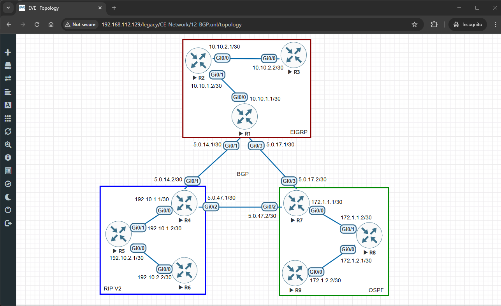
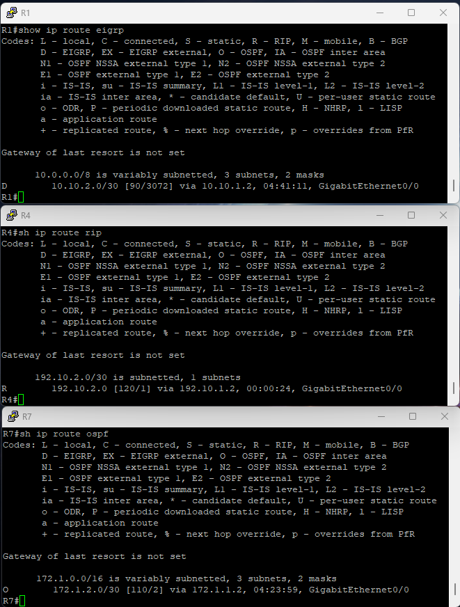
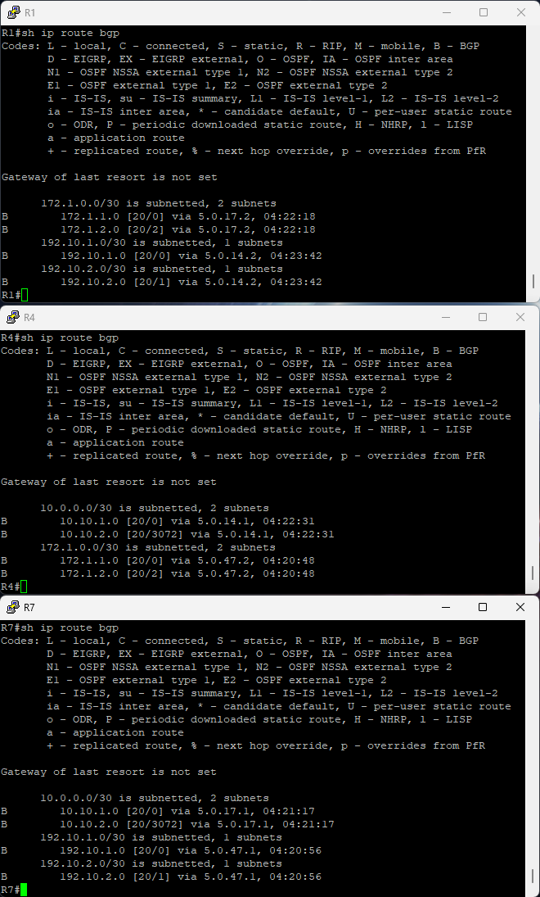
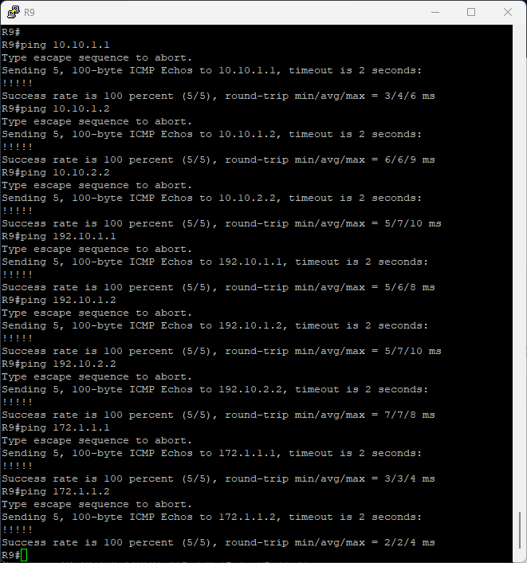

# 🚀 BGP Lab in EVE-NG

## 🎯 **Lab Objectives**

- 🔧 Configure **BGP** on routers.
- 🔧 Configure **IGP RIPv2, OSPF, EIGRP** on routers.
- 🔄 Establish **IGP and EGP** connections.
- 📶 Test **end-to-end connectivity** between different domains.

---

## 🛠 **Step 1: Set Up the Lab in EVE-NG**

### 📌 **Devices Used:**

- 📟 **Nine Cisco Routers (R1 - R9)**

### 🔌 **Network Topology & Connections:**

🟥 **EIGRP Domain**

- **R1 (Gi0/0) ↔ R2 (Gi0/0) 📟 10.10.1.1/30 ↔ 10.10.1.2/30**
- **R1 (Gi0/1) ↔ R3 (Gi0/0) 📟 10.10.2.1/30 ↔ 10.10.2.2/30**

🟦 **RIP v2 Domain**

- **R4 (Gi0/0) ↔ R5 (Gi0/0) 📟 192.10.1.1/30 ↔ 192.10.1.2/30**
- **R5 (Gi0/1) ↔ R6 (Gi0/0) 📟 192.10.2.1/30 ↔ 192.10.2.2/30**

🟩 **OSPF Domain**

- **R7 (Gi0/0) ↔ R8 (Gi0/0) 📟 172.1.1.1/30 ↔ 172.1.1.2/30**
- **R8 (Gi0/1) ↔ R9 (Gi0/0) 📟 172.1.2.1/30 ↔ 172.1.2.2/30**

🟧 **BGP Backbone**

- **R1 (Gi0/3) ↔ R4 (Gi0/1) 📟 5.0.14.1/30 ↔ 5.0.14.2/30**
- **R1 (Gi0/2) ↔ R7 (Gi0/1) 📟 5.0.17.1/30 ↔ 5.0.17.2/30**
- **R4 (Gi0/2) ↔ R7 (Gi0/2) 📟 5.0.47.1/30 ↔ 5.0.47.2/30**

📌 **Diagram:**


---

## 🔹 **Step 2: Configure IP Addresses and EIGRP on Routers**

### 📟 **On R1 (IP & EIGRP)**

#### Configure IP Addresses

```bash
enable
configure terminal
hostname R1
interface gigabitEthernet 0/0
 ip address 10.10.1.1 255.255.255.252
 no shutdown
 exit

interface gigabitEthernet 0/2
 ip address 5.0.17.1 255.255.255.252
 no shutdown
 exit

interface gigabitEthernet 0/3
 ip address 5.0.14.1 255.255.255.252
 no shutdown
 exit
```

#### Configure EIGRP

```bash
router eigrp 100
 network 10.10.1.0 0.0.0.3
 no auto-summary
 exit
 ```

### 📟 **On R2 (IP & EIGRP)**

#### Configure IP Addresses

```bash
enable
configure terminal
hostname R2
interface gigabitEthernet 0/0
 ip address 10.10.1.2 255.255.255.252
 no shutdown
 exit

interface gigabitEthernet 0/1
 ip address 10.10.2.1 255.255.255.252
 no shutdown
 exit
```

#### Configure EIGRP

```bash
router eigrp 100
 network 10.10.1.0 0.0.0.3
 network 10.10.2.0 0.0.0.3
 no auto-summary
 exit
 ```

 ### 📟 **On R3 (IP & EIGRP)**

#### Configure IP Addresses

```bash
enable
configure terminal
hostname R3
interface gigabitEthernet 0/0
 ip address 10.10.2.2 255.255.255.252
 no shutdown
 exit
```

#### Configure EIGRP

```bash
router eigrp 100
 network 10.10.2.0 0.0.0.3
 no auto-summary
 exit
 ```

### 📟 **On R4 (IP & RIPv2)**

#### Configure IP Addresses

```bash
enable
configure terminal
hostname R4
interface gigabitEthernet 0/0
 ip address 192.10.1.1 255.255.255.252
 no shutdown
 exit

interface gigabitEthernet 0/1
 ip address 5.0.14.2 255.255.255.252
 no shutdown
 exit

interface gigabitEthernet 0/2
 ip address 5.0.47.1 255.255.255.252
 no shutdown
 exit
```
#### Configure RIPv2

```bash
router rip
version 2
network 192.10.1.0
no auto-summary
```

### 📟 **On R5 (IP & RIPv2)**

#### Configure IP Addresses

```bash
enable
configure terminal
hostname R5
interface gigabitEthernet 0/0
 ip address 192.10.2.1 255.255.255.252
 no shutdown
 exit

interface gigabitEthernet 0/1
 ip address 192.10.1.2 255.255.255.252
 no shutdown
 exit

```

#### Configure RIPv2

```bash
router rip
version 2
network 192.10.1.0
network 192.10.2.0
no auto-summary
```

### 📟 **On R6 (IP & RIPv2)**

#### Configure IP Addresses

```bash
enable
configure terminal
hostname R6
interface gigabitEthernet 0/0
 ip address 192.10.2.2 255.255.255.252
 no shutdown
 exit

```
#### Configure RIPv2

```bash
router rip
version 2
network 192.10.2.0
no auto-summary
```

### 📟 **On R7 (IP & OSPF)**

#### Configure IP Addresses

```bash
enable
configure terminal
hostname R7
interface gigabitEthernet 0/0
 ip address 172.1.1.1 255.255.255.252
 no shutdown
 exit

interface gigabitEthernet 0/1
 ip address 5.0.17.2 255.255.255.252
 no shutdown
 exit

interface gigabitEthernet 0/2
 ip address 5.0.47.2 255.255.255.252
 no shutdown
 exit
```

#### Configure OSPF

```bash
router ospf 1
network 172.1.1.0 0.0.0.3 area 0
exit
```

### 📟 **On R8 (IP & OSPF)**

#### Configure IP Addresses

```bash
enable
configure terminal
hostname R8
interface gigabitEthernet 0/0
 ip address 172.1.2.1 255.255.255.252
 no shutdown
 exit

interface gigabitEthernet 0/1
 ip address 172.1.1.2 255.255.255.252
 no shutdown
 exit

```

#### Configure OSPF

```bash
router ospf 1
network 172.1.1.0 0.0.0.3 area 0
network 172.1.2.0 0.0.0.3 area 0
exit
```

### 📟 **On R8 (IP & OSPF)**

#### Configure IP Addresses

```bash
enable
configure terminal
hostname R9
interface gigabitEthernet 0/0
 ip address 172.1.2.2 255.255.255.252
 no shutdown
 exit

```

#### Configure OSPF

```bash
router ospf 1
network 172.1.2.0 0.0.0.3 area 0
exit
```

- 

✅ **IP addressing and IGP protocol are now configured on all routers.**

---

### 📟 **On R1 (BGP)**

```bash
enable
configure terminal
router bgp 65000
 neighbor 5.0.14.2 remote-as 65001
 neighbor 5.0.17.2 remote-as 65002
 exit
```

### 📟 **On R4 (BGP)**

```bash
enable
configure terminal
router bgp 65001
 neighbor 5.0.14.1 remote-as 65000
 neighbor 5.0.47.2 remote-as 65002
 exit
```

### 📟 **On R7 (BGP)**

```bash
enable
configure terminal
router bgp 65002
 neighbor 5.0.17.1 remote-as 65000
 neighbor 5.0.47.1 remote-as 65001
 exit
```

## 🔹 **Step 3: Verify BGP Configuration**

### 📜 **Check BGP Neighbors**

```bash
show ip bgp summary
```

📌 **This command will show BGP peer status.**

### 📜 **Check BGP Routes**

```bash
show ip route bgp
```

📌 **Displays learned BGP routes.**
- 

✅ **If BGP peers are established and routes are present, BGP is working correctly.**

---

## 🔹 **Step 4: Test Connectivity**

#### 📡 **From R9 to R1 - R8**

```bash
ping 10.10.1.1  
ping 10.10.1.2
ping 10.10.2.2

ping 192.10.1.1
ping 192.10.1.2
ping 192.10.2.2

ping 172.1.1.1
ping 172.1.1.2
```

- 

✅ **If pings are successful, BGP is routing traffic correctly!**

---
