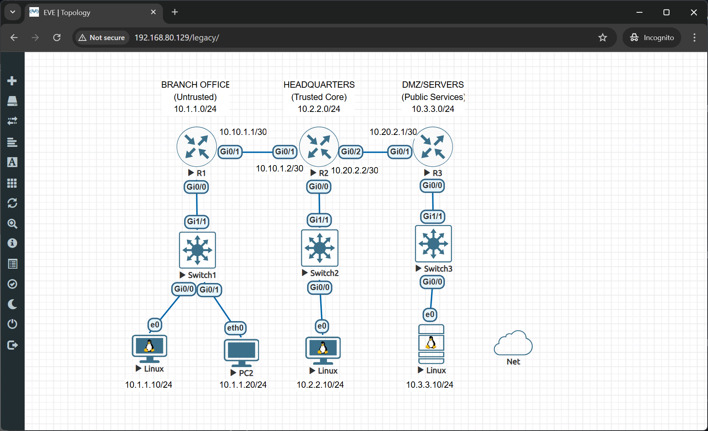

# 🔒 Access Control Lists (ACLs) Security Lab

> Complete hands-on lab covering standard ACLs, extended ACLs, named ACLs, and advanced filtering techniques for network security and traffic control.

## 👤 Author

- [@alfaXphoori](https://www.github.com/alfaXphoori)

---

## 📋 Table of Contents

1. [Lab Objectives](#lab-objectives)
2. [Prerequisites](#prerequisites)
3. [Lab Topology](#lab-topology)
4. [Creating the Lab](#creating-the-lab)
5. [ACL Fundamentals](#acl-fundamentals)
6. [Basic Router & PC Configuration](#basic-router--pc-configuration)
7. [Standard ACL Configuration](#standard-acl-configuration)
8. [Extended ACL Configuration](#extended-acl-configuration)
9. [Named ACL Configuration](#named-acl-configuration)
10. [ACL Placement & Best Practices](#acl-placement--best-practices)
11. [Testing & Verification](#testing--verification)
12. [Troubleshooting](#troubleshooting)
13. [Summary & Next Steps](#summary--next-steps)

---

## 🎯 Lab Objectives

> **Purpose:** Master Access Control Lists for network security, traffic filtering, and policy enforcement.

### By the end of this lab, you will:

- ✅ Understand ACL types and use cases
- ✅ Configure standard ACLs (filter by source IP)
- ✅ Configure extended ACLs (filter by protocol, port, source, destination)
- ✅ Create named ACLs for better management
- ✅ Apply ACLs to router interfaces (inbound/outbound)
- ✅ Implement permit and deny rules
- ✅ Understand implicit deny all rule
- ✅ Use wildcard masks correctly
- ✅ Verify ACL functionality with ping and telnet
- ✅ Troubleshoot ACL misconfigurations

---

## ✅ Prerequisites

> **Purpose:** Ensure you have necessary knowledge and resources.

### Required Knowledge

| Topic | Why It Matters | Reference |
|-------|---------------|---------  |
| **IP Addressing** | ACLs filter based on IP | 04_Basic Switch Lab |
| **Router Configuration** | ACLs applied on routers | 08_Basic_Routing Lab |
| **TCP/UDP Ports** | Extended ACLs filter ports | Networking fundamentals |
| **Network Traffic Flow** | Understand inbound/outbound | Previous labs |

### Required Resources

- ✅ EVE-NG installed and running
- ✅ Cisco router images available (IOSv)
- ✅ VPCS virtual PCs available
- ✅ Access to EVE-NG web interface
- ✅ Completed basic routing labs (recommended)

---

## 📊 Lab Topology

> **Purpose:** Three-router network with multiple security zones requiring traffic filtering.



```
     BRANCH OFFICE              HEADQUARTERS              DMZ/SERVERS
     (Untrusted)                (Trusted Core)            (Public Services)
     10.1.1.0/24                10.2.2.0/24               10.3.3.0/24

         R1                         R2                        R3
    ┌─────────┐                ┌─────────┐              ┌─────────┐
    │ Gi0/1   │───────────────►│ Gi0/1   │              │         │
    │10.10.1.1│  10.10.1.0/30  │10.10.1.2│              │         │
    │         │                │         │              │         │
    │         │                │ Gi0/2   │─────────────►│ Gi0/1   │
    │         │                │10.20.2.2│ 10.20.2.0/30 │10.20.2.1│
    │ Gi0/0   │                │ Gi0/0   │              │ Gi0/0   │
    └────┬────┘                └────┬────┘              └────┬────┘
         │                          │                        │
      Gi1/1                      Gi1/1                    Gi1/1
         │                          │                        │
    ┌────┴────┐                ┌────┴────┐              ┌────┴────┐
    │ Switch1 │                │ Switch2 │              │ Switch3 │
    └──┬───┬──┘                └────┬────┘              └────┬────┘
       │   │                        │                        │
   Gi0/0 Gi0/1                   Gi0/0                    Gi0/0
       │   │                        │                        │
      PC1 PC2                      PC3                    Web_Sv────►Internet
   .10/24 .20/24                 .10/24                   .10/24     (Net)

Security Policies:
├─ Branch can access HQ HTTP/HTTPS only
├─ HQ can access all networks
├─ DMZ web server accessible from outside on specific ports only
└─ Telnet/SSH restricted to admin network only
```

### Topology Details

#### Network A - Branch Office (Untrusted)

| Device | Interface | IP Address | Subnet Mask | Role |
|--------|-----------|-----------|-------------|------|
| **R1** | Gi0/0 | 10.1.1.1 | 255.255.255.0 | Branch LAN gateway |
| **R1** | Gi0/1 | 10.10.1.1 | 255.255.255.252 | Link to R2 (HQ) |
| **R1** | Gi1/1 | - | - | Link to Switch1 |
| **Switch1** | - | - | - | Branch LAN switch |
| **PC1** | ens3 | 10.1.1.10 | 255.255.255.0 | Branch client |
| **PC2** | eth0 | 10.1.1.20 | 255.255.255.0 | Branch client |

#### Network B - Headquarters (Trusted)

| Device | Interface | IP Address | Subnet Mask | Role |
|--------|-----------|-----------|-------------|------|
| **R2** | Gi0/0 | 10.2.2.1 | 255.255.255.0 | HQ LAN gateway |
| **R2** | Gi0/1 | 10.10.1.2 | 255.255.255.252 | Link to R1 (Branch) |
| **R2** | Gi0/2 | 10.20.2.2 | 255.255.255.252 | Link to R3 (DMZ) |
| **R2** | Gi1/1 | - | - | Link to Switch2 |
| **Switch2** | - | - | - | HQ LAN switch |
| **PC3** | ens3 | 10.2.2.10 | 255.255.255.0 | HQ admin client |

#### Network C - DMZ (Public Servers)

| Device | Interface | IP Address | Subnet Mask | Role |
|--------|-----------|-----------|-------------|------|
| **R3** | Gi0/0 | 10.3.3.1 | 255.255.255.0 | DMZ LAN gateway |
| **R3** | Gi0/1 | 10.20.2.1 | 255.255.255.252 | Link to R2 (HQ) |
| **R3** | Gi1/1 | - | - | Link to Switch3 |
| **Switch3** | - | - | - | DMZ LAN switch |
| **Web_Sv** | ens3/e1 | 10.3.3.10 | 255.255.255.0 | Web/DNS Server |

---

## 🔧 Creating the Lab

> **Purpose:** Set up the three-router ACL security topology in EVE-NG.

### Step 1: Create a New Lab

**What:** Create the lab project for ACL configuration.

**How to:**
1. Log into EVE-NG web interface
2. Click **Add Lab**
3. Enter lab details:
   - **Lab Name**: `ACL_Security_Lab`
   - **Lab Description**: `Access Control Lists for Network Security`
   - **Lab Version**: `1.0`
4. Click **Create**

---

### Step 2: Add Router Nodes

**What:** Add three Cisco routers for multi-zone security.

**How to:**
1. Click **Add Node**
2. Select **Cisco** → **IOSv** (router)
3. Add three routers:
   - **R1** (Branch router)
   - **R2** (HQ Core router)
   - **R3** (DMZ router)
4. Click **Save**

---

### Step 3: Add Switch Nodes

**What:** Add three Cisco switches for LAN connectivity.

**How to:**
1. Click **Add Node**
2. Select **Cisco** → **IOSvL2** (switch)
3. Add three switches:
   - **Switch1** (Branch LAN)
   - **Switch2** (HQ LAN)
   - **Switch3** (DMZ LAN)
4. Configure each switch:
   - **Name**: Switch1, Switch2, Switch3
   - **Image**: vios_l2-adventerprisek9-m
5. Click **Save**

---

### Step 4: Add PC and Server Nodes

**What:** Add virtual PCs and web server for testing.

**How to:**
1. Click **Add Node**
2. Select **Linux** → **VPCS** (for simple testing)
   - **Alternative**: Use **Linux** → **Linux** (Alpine/Ubuntu) for full Linux features
3. Add PCs:
   - **PC1, PC2** (Branch clients) - Use VPCS
   - **PC3** (HQ admin client) - Use VPCS or Linux
   - **Web_Sv** (DMZ web server) - Use VPCS or Linux (recommended for running actual web services)
4. Click **Save**

> **💡 Note:** 
> - **VPCS**: Lightweight, supports basic ICMP only (~1MB RAM)
> - **Linux VM**: Full features (HTTP server, telnet, SSH), requires more resources (~256MB+ RAM)

---

### Step 5: Connect All Devices

**What:** Create network connections between all devices.

**Connection List:**

| From Device | Interface | To Device | Interface | Purpose |
|-------------|-----------|-----------|-----------|---------|
| **R1** | Gi0/1 | **R2** | Gi0/1 | Branch-to-HQ WAN link |
| **R2** | Gi0/2 | **R3** | Gi0/1 | HQ-to-DMZ WAN link |
| **R1** | Gi1/1 | **Switch1** | Gi0/0 | Branch router to switch |
| **R2** | Gi1/1 | **Switch2** | Gi0/0 | HQ router to switch |
| **R3** | Gi1/1 | **Switch3** | Gi0/0 | DMZ router to switch |
| **Switch1** | Gi0/1 | **PC1** | eth0/ens3 | Branch client 1 |
| **Switch1** | Gi0/2 | **PC2** | eth0 | Branch client 2 |
| **Switch2** | Gi0/1 | **PC3** | eth0/ens3 | HQ admin client |
| **Switch3** | Gi0/1 | **Web_Sv** | e1/ens3 | DMZ web server |

> **💡 Tip:** Switches allow proper LAN simulation with multiple devices per network.

---

### Step 6: Start All Devices

**What:** Power on all routers, switches, and PCs.

**How to:**
1. Click **Start All** or start each device individually
2. Wait for devices to boot:
   - Routers: 1-2 minutes
   - Switches: 30-60 seconds
   - PCs: instant
3. Verify all devices show "Running" status

---

## 📚 ACL Fundamentals

> **Purpose:** Understand ACL concepts before configuration.

### What are Access Control Lists?

**ACLs** are ordered lists of rules that control network traffic by:
- ✅ **Permitting** or **denying** packets based on criteria
- ✅ Filtering traffic at router interfaces
- ✅ Implementing security policies
- ✅ Controlling routing updates
- ✅ Defining interesting traffic (for VPNs, NAT, etc.)

---

### ACL Types Comparison

| Type | Number Range | Filters By | Use Case |
|------|--------------|-----------|----------|
| **Standard ACL** | 1-99, 1300-1999 | Source IP only | Simple filtering, close to destination |
| **Extended ACL** | 100-199, 2000-2699 | Source, Dest, Protocol, Port | Complex filtering, close to source |
| **Named ACL** | N/A (uses names) | Same as standard/extended | Easier to manage and modify |

---

### Wildcard Masks Explained

**Wildcard masks** are inverse subnet masks used in ACLs:

| Subnet Mask | Wildcard Mask | Meaning |
|-------------|---------------|---------|
| 255.255.255.255 | 0.0.0.0 | Match exact host |
| 255.255.255.0 | 0.0.0.255 | Match entire /24 network |
| 255.255.0.0 | 0.0.255.255 | Match entire /16 network |
| 255.0.0.0 | 0.255.255.255 | Match entire /8 network |

**Rules:**
- `0` = must match exactly
- `255` = don't care (any value)

**Examples:**
```
10.1.1.10 0.0.0.0       → Match only 10.1.1.10
10.1.1.0 0.0.0.255      → Match 10.1.1.0 - 10.1.1.255
0.0.0.0 255.255.255.255 → Match ANY IP (same as "any")
```

---

### ACL Processing Rules

1. **Top-down processing** - Rules evaluated in order
2. **First match wins** - Processing stops at first match
3. **Implicit deny all** - Traffic not matched is denied
4. **One ACL per interface per direction** - Can't apply multiple
5. **Inbound vs Outbound** - Choose direction carefully

---

### ACL Placement Best Practices

```
┌──────────────────────────────────────────────────────┐
│  Standard ACLs: Place CLOSE TO DESTINATION           │
│  (filters by source only, avoid blocking too early)  │
├──────────────────────────────────────────────────────┤
│  Extended ACLs: Place CLOSE TO SOURCE                │
│  (filters specifically, block early to save bandwidth)│
└──────────────────────────────────────────────────────┘
```

---

## ⚙️ Basic Router & PC Configuration

> **Purpose:** Configure IP addresses and routing before applying ACLs.

### Step 1: Router IP Configuration

**What:** Configure IP addresses on all router interfaces and enable routing.

**R1 Configuration:**

```bash
enable
configure terminal

hostname R1

# Configure Branch network interface
interface GigabitEthernet0/0
 ip address 10.1.1.1 255.255.255.0
 no shutdown
 exit

# Configure WAN link to R2
interface GigabitEthernet0/1
 ip address 10.10.1.1 255.255.255.252
 no shutdown
 exit

# Configure routing (OSPF)
router ospf 1
 network 10.1.1.0 0.0.0.255 area 0
 network 10.10.1.0 0.0.0.3 area 0
 exit

write memory
```

**R2 Configuration:**

```bash
enable
configure terminal

hostname R2

# Configure HQ network interface
interface GigabitEthernet0/0
 ip address 10.2.2.1 255.255.255.0
 no shutdown
 exit

# Configure WAN link to R1
interface GigabitEthernet0/1
 ip address 10.10.1.2 255.255.255.252
 no shutdown
 exit

# Configure WAN link to R3
interface GigabitEthernet0/2
 ip address 10.20.2.2 255.255.255.252
 no shutdown
 exit

# Configure routing (OSPF)
router ospf 1
 network 10.2.2.0 0.0.0.255 area 0
 network 10.10.1.0 0.0.0.3 area 0
 network 10.20.2.0 0.0.0.3 area 0
 exit

write memory
```

**R3 Configuration:**

```bash
enable
configure terminal

hostname R3

# Configure DMZ network interface
interface GigabitEthernet0/0
 ip address 10.3.3.1 255.255.255.0
 no shutdown
 exit

# Configure WAN link to R2
interface GigabitEthernet0/1
 ip address 10.20.2.1 255.255.255.252
 no shutdown
 exit

# Configure routing (OSPF)
router ospf 1
 network 10.3.3.0 0.0.0.255 area 0
 network 10.20.2.0 0.0.0.3 area 0
 exit

write memory
```

---

### Step 2: PC IP Configuration

**What:** Configure IP addresses and default gateways on all PCs.

**PC1 Configuration (Branch Client):**

**Option 1: Using VPCS**
```bash
ip 10.1.1.10/24 10.1.1.1
save
```

**Option 2: Using Linux (if using Linux VM instead of VPCS)**
```bash
# Configure IP address
sudo ip addr add 10.1.1.10/24 dev ens3

# Add default gateway
sudo ip route add default via 10.1.1.1 dev ens3

# Verify configuration
ip addr show ens3
ip route show

# Make persistent (Ubuntu/Debian)
sudo nano /etc/netplan/00-installer-config.yaml
# Add:
# network:
#   ethernets:
#     ens3:
#       addresses:
#         - 10.1.1.10/24
#       routes:
#         - to: default
#           via: 10.1.1.1
#   version: 2

# Apply changes
sudo netplan apply
```

**PC2 Configuration (Branch Client):**

```bash
ip 10.1.1.20/24 10.1.1.1
save
```

**PC3 Configuration (HQ Admin):**

**Option 1: Using VPCS**
```bash
ip 10.2.2.10/24 10.2.2.1
save
```

**Option 2: Using Linux (if using Linux VM instead of VPCS)**
```bash
# Configure IP address
sudo ip addr add 10.2.2.10/24 dev ens3

# Add default gateway
sudo route add default gw 10.2.2.1 ens3

# Verify configuration
ip addr show ens3
ip route show

# Make persistent (Ubuntu/Debian)
sudo nano /etc/netplan/00-installer-config.yaml
# Add:
# network:
#   ethernets:
#     ens3:
#       addresses:
#         - 10.2.2.10/24
#       routes:
#         - to: default
#           via: 10.2.2.1
#   version: 2

# Apply changes
sudo netplan apply
```

**Web_Sv Configuration (Web/DNS Server):**

**Option 1: Using VPCS**
```bash
ip 10.3.3.10/24 10.3.3.1
save
```

**Option 2: Using Linux (if using Linux VM for Web Server)**
```bash
# Obtain an IP address via DHCP on internal interface (ens3)
# use dhclient or dhcpcd depending on distribution
sudo dhclient ens3

# Verify configuration
ip addr show ens3
ip route show

# Verify configuration
ip addr show ens3
ip route show

# Make persistent (Ubuntu/Debian)
sudo nano /etc/netplan/00-installer-config.yaml
# Add:
# network:
#   ethernets:
#     ens3:
#       addresses:
#         - 10.3.3.10/24
#       routes:
#         - to: default
#           via: 10.3.3.1
#   version: 2

# Apply changes
sudo netplan apply

# Configure Debian sources.list (for Debian Stretch archive)
sudo nano /etc/apt/sources.list
# Add the following lines:
# deb https://archive.debian.org/debian/ stretch main contrib
# deb-src https://archive.debian.org/debian/ stretch main contrib

# Or use command to append directly:
echo "deb https://archive.debian.org/debian/ stretch main contrib" | sudo tee /etc/apt/sources.list
echo "deb-src https://archive.debian.org/debian/ stretch main contrib" | sudo tee -a /etc/apt/sources.list

# Optional: Install web server
sudo apt update
sudo apt install apache2 -y
sudo systemctl start apache2
sudo systemctl enable apache2
```

> **💡 Note:** Web_Sv interface:
> - **ens3 (e1)**: Connected to Switch3 (10.3.3.10/24) - Internal network

---

### Step 3: Verify Basic Connectivity

**What:** Test network connectivity before applying ACLs.

**Test from PC1:**

```bash
# Ping local gateway (R1)
ping 10.1.1.1

# Ping HQ network (PC3)
ping 10.2.2.10

# Ping DMZ network (Web_Sv)
ping 10.3.3.10

# All should succeed before ACLs are applied
```

**Test from R1:**

```bash
# Verify OSPF neighbors
show ip ospf neighbor

# Verify routing table
show ip route

# Should see routes to all networks
```

**Test from Web_Sv (if using Linux):**

```bash
# Verify internal interface
ping -c 3 10.3.3.1

# Verify routing
ip route show

# Check interface
ip addr show ens3

# Expected:
# ens3: 10.3.3.10/24 (static)
```

**Expected Results:**
- ✅ All routers can ping each other
- ✅ All PCs can ping their gateways
- ✅ All PCs can ping across networks
- ✅ OSPF adjacencies established

> **⚠️ Important:** Document this baseline connectivity. After applying ACLs, some pings will fail by design.

---

## 🔒 Standard ACL Configuration

> **Purpose:** Configure source-based filtering using standard ACLs.

### Scenario 1: Block Specific Host from Branch

**Requirement:** Block PC1 (10.1.1.10) from accessing HQ network, but allow PC2.

**R2 Configuration:**

```bash
# Access R2 console
enable
configure terminal

# Create standard ACL 10
access-list 10 deny 10.1.1.10 0.0.0.0
access-list 10 permit any

# Apply ACL to interface (inbound from R1)
interface GigabitEthernet0/1
 ip access-group 10 in
 exit

# Save configuration
write memory
```

**Verification:**

```bash
# Show ACL configuration
show access-lists

# Show ACL on interface
show ip interface GigabitEthernet0/1

# Expected output:
# Access List 10 is applied (10 deny 10.1.1.10, permit any)
```

**Test from PC1:**
```bash
# From PC1 console
ping 10.2.2.10
# Should fail (blocked by ACL)
```

**Test from PC2:**
```bash
# From PC2 console
ping 10.2.2.10
# Should succeed (permitted by ACL)
```

---

### Scenario 2: Allow Only Specific Network

**Requirement:** Allow only HQ network (10.2.2.0/24) to access DMZ servers.

**R3 Configuration:**

```bash
enable
configure terminal

# Create standard ACL 20
access-list 20 permit 10.2.2.0 0.0.0.255
# Implicit deny all (no need to write it)

# Apply ACL to DMZ network interface (outbound)
interface GigabitEthernet0/0
 ip access-group 20 out
 exit

write memory
```

---

## 🛡️ Extended ACL Configuration

> **Purpose:** Configure granular filtering with protocol, port, source, and destination.

### Scenario 3: Allow Only HQ to Access Web Server

**Requirement:** Only HQ network (10.2.2.0/24) can access Web_Sv (10.3.3.10), block all other networks from accessing DMZ web server.

**R3 Configuration (close to destination):**

```bash
enable
configure terminal

# Create extended ACL 100
# Permit HTTP (port 80) from HQ only
access-list 100 permit tcp 10.2.2.0 0.0.0.255 host 10.3.3.10 eq 80

# Permit HTTPS (port 443) from HQ only
access-list 100 permit tcp 10.2.2.0 0.0.0.255 host 10.3.3.10 eq 443

# Permit ICMP for troubleshooting
access-list 100 permit icmp any host 10.3.3.10

# Deny everything else (implicit, but can be explicit)
access-list 100 deny ip any any

# Apply ACL inbound on DMZ interface
interface GigabitEthernet0/0
 ip access-group 100 in
 exit

write memory
```

---

### Scenario 4: Restrict Telnet Access

**Requirement:** Only HQ admin PC (10.2.2.10) can telnet to any router.

**R1, R2, R3 Configuration (apply on all routers):**

```bash
enable
configure terminal

# Create extended ACL 101
# Permit telnet from admin PC only
access-list 101 permit tcp host 10.2.2.10 any eq 23

# Deny telnet from all other sources
access-list 101 deny tcp any any eq 23

# Permit all other traffic
access-list 101 permit ip any any

# Apply to VTY lines (not interface - special case)
line vty 0 4
 access-class 101 in
 exit

write memory
```

---

### Scenario 5: DMZ Server Access Control

**Requirement:** 
- Web server (10.3.3.10) accessible on HTTP (80) and HTTPS (443) from anywhere
- Web server accessible on DNS (53) from anywhere
- Block all other inbound traffic to DMZ

**R3 Configuration:**

```bash
enable
configure terminal

# Extended ACL 110 for inbound DMZ traffic
# Allow HTTP/HTTPS to web server from anywhere
access-list 110 permit tcp any host 10.3.3.10 eq 80
access-list 110 permit tcp any host 10.3.3.10 eq 443

# Allow DNS to web server from anywhere
access-list 110 permit udp any host 10.3.3.10 eq 53

# Allow ICMP for troubleshooting
access-list 110 permit icmp any any

# Deny all other traffic (implicit)

# Apply ACL to DMZ interface (inbound to DMZ)
interface GigabitEthernet0/0
 ip access-group 110 in
 exit

write memory
```

---

## 📝 Named ACL Configuration

> **Purpose:** Use descriptive names for easier ACL management and modification.

### Scenario 6: Named ACL for Branch Security

**Requirement:** Replace numbered ACL with named ACL for better readability.

**R1 Configuration:**

```bash
enable
configure terminal

# Remove old numbered ACL if exists
no access-list 100

# Create named extended ACL
ip access-list extended BRANCH_TO_HQ_FILTER
 remark *** Allow web traffic only ***
 permit tcp 10.1.1.0 0.0.0.255 10.2.2.0 0.0.0.255 eq 80
 permit tcp 10.1.1.0 0.0.0.255 10.2.2.0 0.0.0.255 eq 443
 remark *** Allow ICMP for diagnostics ***
 permit icmp any any
 remark *** Deny all other traffic ***
 deny ip any any
 exit

# Apply named ACL to interface
interface GigabitEthernet0/1
 ip access-group BRANCH_TO_HQ_FILTER out
 exit

write memory
```

---

### Named ACL Advantages

✅ **Descriptive names** - `BRANCH_TO_HQ_FILTER` vs `100`
✅ **Add/remove specific lines** - Can edit without recreating entire ACL
✅ **Documentation** - Use `remark` statements
✅ **Sequence numbers** - Reorder rules easily

---

### Modifying Named ACLs

**Add a new rule:**

```bash
ip access-list extended BRANCH_TO_HQ_FILTER
 15 permit tcp 10.1.1.0 0.0.0.255 10.2.2.0 0.0.0.255 eq 22
 exit
```

**Remove a specific rule:**

```bash
ip access-list extended BRANCH_TO_HQ_FILTER
 no 15
 exit
```

**View with sequence numbers:**

```bash
show ip access-lists BRANCH_TO_HQ_FILTER
```

---

## 🎓 ACL Placement & Best Practices

> **Purpose:** Learn optimal ACL placement strategies.

### Rule Summary

| ACL Type | Place Close To | Reason |
|----------|---------------|--------|
| **Standard** | Destination | Filters only source, avoid blocking too early |
| **Extended** | Source | Specific filtering, save bandwidth |

### Example Placement

```
     PC1 ──► [R1] ──────► [R2] ──────► [R3] ──► Server
    Source          Transit         Transit      Dest

Standard ACL:  Place on R3 (near server)
Extended ACL:  Place on R1 (near PC1)
```

---

### Best Practices Checklist

- ✅ **Most specific rules first** - Order from specific to general
- ✅ **Use named ACLs** - Easier to manage
- ✅ **Document with remarks** - Explain purpose of rules
- ✅ **Test before deployment** - Verify with ping/telnet
- ✅ **Monitor traffic** - Use `show access-lists` to see hit counts
- ✅ **Avoid implicit deny** - Add explicit permits first
- ✅ **One ACL per direction** - Inbound OR outbound per interface
- ✅ **Backup configs** - Save before and after changes

---

## ✅ Testing & Verification

> **Purpose:** Verify ACL functionality after applying security policies using VPCS commands.

### VPCS Commands Reference

**What:** Essential VPCS commands for testing ACLs in EVE-NG.

| Command | Purpose | Example |
|---------|---------|---------|
| `ping <ip>` | Test ICMP connectivity | `ping 10.2.2.10` |
| `ping <ip> -c <count>` | Ping with packet count | `ping 10.2.2.10 -c 5` |
| `trace <ip>` | Traceroute to destination | `trace 10.3.3.10` |
| `show ip` | Display PC IP configuration | `show ip` |
| `arp` | Show ARP table | `arp` |
| `show` | Display all settings | `show` |

> **💡 Note:** VPCS supports basic ICMP only. For port testing, use router commands or enable telnet on routers.

---

### Linux Commands Reference (for Linux VMs)

**What:** Advanced testing commands available when using Linux instead of VPCS.

| Command | Purpose | Example |
|---------|---------|---------|
| `ping <ip>` | Test ICMP connectivity | `ping -c 5 10.2.2.10` |
| `traceroute <ip>` | Trace route to destination | `traceroute 10.3.3.10` |
| `curl http://<ip>:<port>` | Test HTTP access | `curl http://10.3.3.10:80` |
| `telnet <ip> <port>` | Test TCP port connectivity | `telnet 10.3.3.10 80` |
| `nc -zv <ip> <port>` | Scan specific port | `nc -zv 10.3.3.10 80` |
| `nmap <ip>` | Scan all open ports | `nmap 10.3.3.10` |
| `wget http://<ip>` | Download from web server | `wget http://10.3.3.10` |
| `dig @<dns_ip> <domain>` | Test DNS query | `dig @10.3.3.10 example.com` |

**Installing required tools on Linux:**
```bash
sudo apt update
sudo apt install traceroute curl telnet netcat nmap wget dnsutils -y
```

> **💡 Use Case:** Linux VMs provide full port testing capabilities for Extended ACL scenarios.

---

### Step 1: Testing Scenario 1 (Standard ACL)

**Scenario:** Block PC1 (10.1.1.10) from HQ, allow PC2 (10.1.1.20).

**Configuration Applied:**
- R2: Standard ACL 10 denying 10.1.1.10

**Test from PC1 (Should FAIL):**

```bash
# Open PC1 console in EVE-NG
# Test ping to HQ network
ping 10.2.2.10

# Expected output:
# 10.2.2.10 icmp_seq=1 timeout
# 10.2.2.10 icmp_seq=2 timeout
# 10.2.2.10 icmp_seq=3 timeout
# 10.2.2.10 icmp_seq=4 timeout
# 10.2.2.10 icmp_seq=5 timeout
```

**Test from PC2 (Should SUCCEED):**

```bash
# Open PC2 console in EVE-NG
# Test ping to HQ network
ping 10.2.2.10

# Expected output:
# 84 bytes from 10.2.2.10 icmp_seq=1 ttl=62 time=20.123 ms
# 84 bytes from 10.2.2.10 icmp_seq=2 ttl=62 time=15.456 ms
# 84 bytes from 10.2.2.10 icmp_seq=3 ttl=62 time=18.789 ms
# 84 bytes from 10.2.2.10 icmp_seq=4 ttl=62 time=16.234 ms
# 84 bytes from 10.2.2.10 icmp_seq=5 ttl=62 time=17.567 ms
```

**Verify on R2:**

```bash
# Check ACL hit counts
show access-lists 10

# Expected output:
# Standard IP access list 10
#     10 deny   10.1.1.10 (5 matches)
#     20 permit any (5 matches)
```

**✅ Result:** PC1 blocked, PC2 allowed - ACL working correctly!

---

### Step 2: Testing Scenario 2 (Standard ACL - Network Filtering)

**Scenario:** Only HQ network (10.2.2.0/24) can access DMZ servers.

**Configuration Applied:**
- R3: Standard ACL 20 permitting 10.2.2.0/24

**Test from PC3 (HQ - Should SUCCEED):**

```bash
# Open PC3 console
# Test ping to DMZ Web Server
ping 10.3.3.10

# Expected: Success
# 84 bytes from 10.3.3.10 icmp_seq=1 ttl=62 time=...ms
```

**Test from PC1 (Branch - Should FAIL):**

```bash
# Open PC1 console
# Test ping to DMZ Web Server
ping 10.3.3.10

# Expected: Timeout
# 10.3.3.10 icmp_seq=1 timeout
```

**Test from PC2 (Branch - Should FAIL):**

```bash
# Open PC2 console
ping 10.3.3.10

# Expected: Timeout
```

**✅ Result:** Only HQ can access DMZ - ACL working correctly!

---

### Step 3: Testing Scenario 3 (Extended ACL - Web Server Access)

**Scenario:** Only HQ network (10.2.2.0/24) can access Web_Sv, all other networks blocked.

**Configuration Applied:**
- R3: Extended ACL 100 on Gi0/0 (inbound to DMZ)

**Test from PC3/HQ (Should SUCCEED):**

```bash
# Open PC3 console
# HQ network is permitted to access Web_Sv
ping 10.3.3.10

# Expected: Success (ICMP permitted)
# 84 bytes from 10.3.3.10 icmp_seq=1 ttl=62 time=...ms
```

**Test from PC1/Branch (Should FAIL - denied by ACL):**

```bash
# Open PC1 console
ping 10.3.3.10

# Expected: Timeout (Branch network denied)
# 10.3.3.10 icmp_seq=1 timeout
```

**Test from PC2/Branch (Should FAIL):**

```bash
# Open PC2 console
ping 10.3.3.10

# Expected: Timeout
```

> **💡 Note:** VPCS can only test ICMP. To test HTTP/HTTPS port filtering, you would need to:
> 1. Use telnet from router to test port access, OR
> 2. Run actual web server on Web_Sv, OR  
> 3. Use `debug ip packet` on R3 to see denied traffic

**Verify ACL hits on R3:**

```bash
# On R3, check ACL statistics after testing

show access-lists 100

# Expected to see:
# Extended IP access list 100
#     10 permit tcp 10.2.2.0 0.0.0.255 host 10.3.3.10 eq www (0 matches)
#     20 permit tcp 10.2.2.0 0.0.0.255 host 10.3.3.10 eq 443 (0 matches)
#     30 permit icmp any host 10.3.3.10 (10 matches from PC3)
#     40 deny ip any any (10 matches from PC1/PC2)
```

**Simulate Port Traffic from Router (Advanced):**

```bash
# From R2 (to simulate HQ network access):
telnet 10.3.3.10 80 /source-interface Gi0/0
# Should be allowed (source 10.2.2.1)

# From R1 (to simulate Branch network access):
telnet 10.3.3.10 80 /source-interface Gi0/0
# Should be blocked (source 10.1.1.1)
```

**✅ Result:** Only HQ network can access Web_Sv, Branch network blocked!

---

### Step 4: Testing Scenario 4 (VTY Access Control)

**Scenario:** Only PC3 (10.2.2.10) can telnet to routers.

**Configuration Applied:**
- All routers: ACL 101 on VTY lines

**Prerequisites:**

```bash
# On each router, enable telnet first:
enable
configure terminal
line vty 0 4
 password cisco
 login
 transport input telnet
 access-class 101 in
 exit
```

**Test from PC3 (Should SUCCEED if telnet available):**

> **⚠️ VPCS Limitation:** Standard VPCS doesn't support telnet client. Use router instead.

**Test from R2 (simulating PC3 source):**

```bash
# From R2 console:
telnet 10.10.1.1 /source-interface GigabitEthernet0/0
# Uses 10.2.2.1 as source (close to PC3 network)

# Expected: Connection successful if ACL allows 10.2.2.0/24
```

**Test from R1 (simulating PC1 source):**

```bash
# From R1 console:
telnet 10.10.1.2 /source-interface GigabitEthernet0/0
# Uses 10.1.1.1 as source (Branch network)

# Expected: Connection refused or timeout
# % Connection refused by remote host
```

**Verify on any router:**

```bash
show access-lists 101

# Expected:
# Extended IP access list 101
#     10 permit tcp host 10.2.2.10 any eq telnet (2 matches)
#     20 deny tcp any any eq telnet (1 match)
#     30 permit ip any any (1000 matches)
```

**✅ Result:** Only designated admin IPs can access VTY lines.

---

### Step 5: Testing Scenario 5 (DMZ Server Protection)

**Scenario:** 
- Web server (10.3.3.10): HTTP/HTTPS/DNS from anywhere
- All other inbound traffic blocked

**Configuration Applied:**
- R3: Extended ACL 110 on DMZ interface

**Test ICMP to Web Server (Should SUCCEED - ICMP permitted):**

```bash
# From PC1 (Branch)
ping 10.3.3.10

# Expected: Success (ICMP allowed in ACL 110)
# 84 bytes from 10.3.3.10 icmp_seq=1 ttl=62 time=...ms

# From PC2 (Branch)
ping 10.3.3.10

# Expected: Success

# From PC3 (HQ)
ping 10.3.3.10

# Expected: Success
```

**Verify ACL hits on R3:**

```bash
show access-lists 110

# Expected:
# Extended IP access list 110
#     10 permit tcp any host 10.3.3.10 eq www (0 matches)
#     20 permit tcp any host 10.3.3.10 eq 443 (0 matches)
#     30 permit udp any host 10.3.3.10 eq domain (0 matches)
#     40 permit icmp any any (15 matches)
```

**✅ Result:** ICMP works, HTTP/HTTPS/DNS ports accessible (need web server for full test).

---

### Step 6: Testing Scenario 6 (Named ACL)

**Scenario:** Named ACL `BRANCH_TO_HQ_FILTER` replacing numbered ACL 100.

**Configuration Applied:**
- R1: Named ACL applied to Gi0/1

**Test from PC1:**

```bash
# ICMP should work (permitted in named ACL)
ping 10.2.2.10

# Expected: Success
# 84 bytes from 10.2.2.10 icmp_seq=1 ttl=62 time=...ms
```

**Test from PC2:**

```bash
ping 10.2.2.10

# Expected: Success
```

**Verify Named ACL on R1:**

```bash
show ip access-lists BRANCH_TO_HQ_FILTER

# Expected output with sequence numbers:
# Extended IP access list BRANCH_TO_HQ_FILTER
#     10 remark *** Allow web traffic only ***
#     20 permit tcp 10.1.1.0 0.0.0.255 10.2.2.0 0.0.0.255 eq www
#     30 permit tcp 10.1.1.0 0.0.0.255 10.2.2.0 0.0.0.255 eq 443
#     40 remark *** Allow ICMP for diagnostics ***
#     50 permit icmp any any (10 matches)
#     60 remark *** Deny all other traffic ***
#     70 deny ip any any (0 matches)
```

**✅ Result:** Named ACL works identically to numbered ACL but easier to manage!

---

### Step 7: Comprehensive Testing Matrix

**What:** Complete test matrix for all scenarios.

| From PC | To Network | Scenario | Expected Result | VPCS Command |
|---------|-----------|----------|-----------------|--------------|
| PC1 | HQ (10.2.2.10) | Scenario 1 | ❌ FAIL | `ping 10.2.2.10` |
| PC2 | HQ (10.2.2.10) | Scenario 1 | ✅ PASS | `ping 10.2.2.10` |
| PC1 | DMZ (10.3.3.10) | Scenario 2 | ❌ FAIL | `ping 10.3.3.10` |
| PC3 | DMZ (10.3.3.10) | Scenario 2 | ✅ PASS | `ping 10.3.3.10` |
| PC3 | DMZ Web (10.3.3.10) | Scenario 3 | ✅ PASS | `ping 10.3.3.10` |
| PC1 | DMZ Web (10.3.3.10) | Scenario 3 | ❌ FAIL | `ping 10.3.3.10` |
| PC1 | DMZ Web (10.3.3.10) | Scenario 5 | ✅ PASS (ICMP) | `ping 10.3.3.10` |
| PC3 | DMZ Web (10.3.3.10) | Scenario 5 | ✅ PASS | `ping 10.3.3.10` |

---

### Step 8: Advanced Testing with Traceroute

**What:** Use VPCS traceroute to verify routing path and ACL placement.

**Test path from PC1 to HQ:**

```bash
# From PC1 console
trace 10.2.2.10

# Expected output (if ACL blocks):
# trace to 10.2.2.10, 8 hops max, press Ctrl+C to stop
#  1   10.1.1.1   5.123 ms  3.456 ms  4.789 ms
#  2   *   *   *
#  3   *   *   *
# (stops at R2 because ACL blocks)

# If ACL allows:
# trace to 10.2.2.10, 8 hops max
#  1   10.1.1.1   5.123 ms  3.456 ms  4.789 ms
#  2   10.10.1.2   8.234 ms  7.567 ms  8.891 ms
#  3   10.2.2.10   12.345 ms  11.678 ms  13.012 ms
```

**Test path from PC3 to DMZ:**

```bash
# From PC3 console
trace 10.3.3.10

# Expected output (should complete):
# trace to 10.3.3.10, 8 hops max
#  1   10.2.2.1   4.123 ms  3.456 ms  5.789 ms
#  2   10.20.2.1   9.234 ms  8.567 ms  10.891 ms
#  3   10.3.3.10   14.345 ms  13.678 ms  15.012 ms
```

**✅ Use Case:** Traceroute helps identify where ACLs are blocking traffic.

---

### Step 9: Real-Time ACL Monitoring

**What:** Monitor ACL hits in real-time during testing.

**On any router with ACLs:**

```bash
# Clear counters before testing
clear access-list counters

# From another window, ping from VPCS
# (e.g., from PC1: ping 10.2.2.10)

# Watch counters increment
show access-lists

# Refresh multiple times to see changes
# Or use:
show access-lists | include matches
```

**Example output:**

```
R2#show access-lists 10
Standard IP access list 10
    10 deny   10.1.1.10 (12 matches)  ← Incrementing!
    20 permit any (25 matches)        ← Also incrementing!
```

---

### Step 10: Troubleshooting Failed Tests

**Problem:** Ping times out unexpectedly.

**Troubleshooting steps:**

1. **Verify PC IP configuration:**
   ```bash
   # On VPCS
   show ip
   
   # Expected: Correct IP and gateway
   # NAME        : PC1
   # IP/MASK     : 10.1.1.10/24
   # GATEWAY     : 10.1.1.1
   ```

2. **Verify gateway reachable:**
   ```bash
   ping 10.1.1.1
   # Should succeed
   ```

3. **Check routing on routers:**
   ```bash
   # On R1
   show ip route
   # Should see routes to all networks
   ```

4. **Verify ACL configuration:**
   ```bash
   show access-lists
   show ip interface <interface>
   ```

5. **Check ACL direction:**
   ```bash
   show ip interface Gi0/1
   # Look for:
   # Inbound  access list is...
   # Outbound access list is...
   ```

6. **Enable debugging (carefully):**
   ```bash
   # On router where ACL is applied
   debug ip packet detail
   # Generate traffic, then:
   undebug all
   ```

**✅ Result:** Systematic troubleshooting identifies ACL issues quickly!

---

### Step 2: Verification Commands

**Show all ACLs:**

```bash
show access-lists
```

**Show specific ACL:**

```bash
show access-lists 10
show ip access-lists BRANCH_TO_HQ_FILTER
```

**Show ACLs on interface:**

```bash
show ip interface GigabitEthernet0/1
```

**Show ACL statistics:**

```bash
show access-lists
# Look for "(X matches)" after each rule
```

**Clear ACL counters:**

```bash
clear access-list counters
# Or specific:
clear access-list counters 10
```

---

## 🔧 Troubleshooting

> **Purpose:** Diagnose and fix common ACL issues.

### Common Problems & Solutions

#### Problem 1: Traffic Still Blocked After Permitting

**Symptoms:**
- Added permit rule but traffic still fails
- Ping/connection times out

**Possible Causes:**

1. **Rule order wrong** - Deny rule before permit
   ```bash
   # WRONG ORDER:
   access-list 100 deny ip any any
   access-list 100 permit tcp any any eq 80
   # Deny matches first, permit never evaluated
   
   # CORRECT ORDER:
   access-list 100 permit tcp any any eq 80
   access-list 100 deny ip any any
   ```

2. **Wildcard mask incorrect**
   ```bash
   # WRONG (subnet mask instead of wildcard):
   access-list 10 permit 10.1.1.0 255.255.255.0
   
   # CORRECT:
   access-list 10 permit 10.1.1.0 0.0.0.255
   ```

3. **Applied to wrong interface or direction**
   ```bash
   # Check interface:
   show ip interface Gi0/1
   
   # Should show:
   # Inbound access list is 10
   # OR
   # Outbound access list is 10
   ```

**Solution:**
```bash
# Remove ACL from interface
interface GigabitEthernet0/1
 no ip access-group 100 in
 exit

# Delete and recreate ACL in correct order
no access-list 100
access-list 100 permit tcp any any eq 80
access-list 100 deny ip any any

# Reapply correctly
interface GigabitEthernet0/1
 ip access-group 100 in
 exit
```

---

#### Problem 2: Entire Network Blocked

**Symptoms:**
- Applied ACL, now nothing works
- All pings fail

**Cause:** Forgot to add permit rule, hit implicit deny all

**Solution:**
```bash
# Check ACL:
show access-lists 10

# If only deny rules or empty:
# Add permit statement
access-list 10 permit any

# Or remove ACL from interface temporarily:
interface Gi0/1
 no ip access-group 10 in
 exit
```

---

#### Problem 3: Can't Modify Standard/Extended Numbered ACL

**Symptoms:**
- Need to insert rule in middle
- Can't reorder without deleting entire ACL

**Solution:** Convert to named ACL:

```bash
# Old numbered ACL:
access-list 100 permit tcp any any eq 80
access-list 100 deny ip any any

# Convert to named:
no access-list 100

ip access-list extended WEB_FILTER
 10 permit tcp any any eq 80
 20 permit tcp any any eq 443
 30 deny ip any any
 exit

# Now can insert at sequence 15:
ip access-list extended WEB_FILTER
 15 permit tcp any any eq 22
 exit
```

---

#### Problem 4: Return Traffic Blocked

**Symptoms:**
- Outbound works, inbound fails
- TCP connections don't complete

**Cause:** ACL blocks return packets

**Solution:** Use `established` keyword for TCP:

```bash
# Allow outbound connections and return traffic:
access-list 110 permit tcp 10.1.1.0 0.0.0.255 any
access-list 110 permit tcp any 10.1.1.0 0.0.0.255 established
# "established" matches TCP packets with ACK or RST flags
```

---

### Debugging Commands

**Enable ACL logging:**

```bash
access-list 100 deny ip any any log
# Or for named ACL:
ip access-list extended TEST
 deny ip any any log
 exit
```

**View logged ACL violations:**

```bash
show logging
# Look for ACL deny messages
```

**Test ACL matching without applying:**

```bash
# Use packet tracer (on some IOS versions):
debug ip packet detail
```

**Monitor ACL hits in real-time:**

```bash
# Before test:
clear access-list counters

# Run test traffic

# Check which rules matched:
show access-lists
# Look for (X matches)
```

---

## 📈 Summary & Next Steps

> **Purpose:** Consolidate learning and plan advancement.

### What You've Learned

✅ **ACL Types**
- Standard ACLs (source IP only)
- Extended ACLs (protocol, port, source, destination)
- Named ACLs (better management)

✅ **Configuration Skills**
- Create and apply ACLs
- Use wildcard masks correctly
- Place ACLs optimally
- Modify and troubleshoot ACLs

✅ **Security Concepts**
- Permit and deny rules
- Implicit deny all
- Inbound vs outbound filtering
- Traffic flow control

---

### Real-World Applications

| Industry | ACL Use Case |
|----------|--------------|
| **Enterprise** | Segment departments, restrict server access |
| **ISP** | Filter customer traffic, prevent attacks |
| **Government** | Enforce security policies, protect classified networks |
| **Finance** | PCI compliance, protect payment systems |
| **Healthcare** | HIPAA compliance, protect patient data |

---

### Security Best Practices Learned

1. ✅ **Deny by default** - Use implicit deny, permit what's needed
2. ✅ **Least privilege** - Grant minimum access required
3. ✅ **Defense in depth** - Multiple security layers
4. ✅ **Document everything** - Use remarks in named ACLs
5. ✅ **Regular audits** - Review ACLs periodically
6. ✅ **Test thoroughly** - Verify before production
7. ✅ **Monitor logs** - Track denied traffic

---

### Common Interview Questions

**Q1: What's the difference between standard and extended ACLs?**
> Standard ACLs filter by source IP only (1-99). Extended ACLs filter by source, destination, protocol, and port (100-199).

**Q2: Where should you place standard vs extended ACLs?**
> Standard ACLs close to destination (filter broadly). Extended ACLs close to source (filter specifically).

**Q3: What is the implicit deny all?**
> At the end of every ACL is an invisible "deny any any" rule. Traffic not explicitly permitted is blocked.

**Q4: How do you allow return traffic for TCP?**
> Use the `established` keyword: `permit tcp any any established` matches packets with ACK/RST flags.

**Q5: Can you reorder rules in a numbered ACL?**
> No, must delete and recreate. Use named ACLs for better management (sequence numbers).

---

### Next Steps

Now that you've mastered ACLs, continue your security journey:

#### Immediate Next Lab: **14_HSRP_Redundancy**
- Configure gateway redundancy
- Test failover scenarios
- Ensure high availability

#### Related Advanced Topics:

1. **Firewall Concepts** (Lab 15)
   - Stateful inspection
   - Zone-based firewalls
   - Application layer filtering

2. **NAT with ACLs** (Lab 20)
   - Define NAT pools
   - Policy-based NAT
   - ACLs for interesting traffic

3. **VPN Access Control** (Future)
   - Crypto ACLs
   - VPN traffic filtering
   - Remote access security

4. **QoS with ACLs** (Lab 19)
   - Class maps
   - Traffic classification
   - Policy enforcement

---

### Practice Scenarios

Try these on your own:

1. **DMZ Hardening**
   - Create DMZ with web/DB servers
   - Allow HTTP/HTTPS from outside
   - Allow DB access from web tier only
   - Block all other traffic

2. **Guest Network Isolation**
   - Create guest VLAN
   - Allow internet access only
   - Block access to internal networks
   - Rate limit bandwidth

3. **Management Plane Security**
   - Restrict SSH/Telnet to admin subnet
   - Block SNMP from untrusted networks
   - Allow NTP to specific servers only

---

### Certification Alignment

This lab covers topics from:

- ✅ **CompTIA Network+** - ACL fundamentals, security filtering
- ✅ **Cisco CCNA** - Standard/extended ACLs, wildcard masks, placement
- ✅ **CCNP Security** - Advanced ACL techniques, optimization

---

### Additional Resources

**Cisco Documentation:**
- [ACL Configuration Guide](https://www.cisco.com/c/en/us/support/docs/security/ios-firewall/23602-confaccesslists.html)
- [Wildcard Mask Calculator](https://www.calculator.net/ip-subnet-calculator.html)

**Practice:**
- Packet Tracer ACL labs
- GNS3 advanced scenarios
- Real equipment configuration

---

## 🏆 Congratulations!

You've completed the **Access Control Lists (ACLs) Security Lab**!

You can now:
- ✅ Secure networks with ACLs
- ✅ Filter traffic based on multiple criteria
- ✅ Implement security policies
- ✅ Troubleshoot ACL issues
- ✅ Design multi-zone secure networks

**You're now 13/28 labs complete!** 🎉

Continue to **[Lab 14: HSRP Redundancy](../14_HSRP_Redundancy/Readme.md)** to ensure high availability.

---

## 📞 Support

Questions or issues? 
- Open an issue on GitHub
- Review the troubleshooting section
- Check Cisco documentation

---

**Remember:** Security is not a product, it's a process. Keep practicing! 🔒
