# 🌐 NAT/PAT Configuration Lab

> Hands-on lab for configuring PAT (NAT Overload) and Port Forwarding on Cisco routers in EVE-NG, enabling Internet access for internal hosts and inbound access to internal servers.

## 👤 Author

- [@alfaXphoori](https://www.github.com/alfaXphoori)

---

## 📋 Table of Contents

1. [Lab Objectives](#lab-objectives)
2. [NAT Concepts](#nat-concepts)
3. [Lab Topology](#lab-topology)
4. [Device Configuration](#device-configuration)
5. [End Device Configuration](#end-device-configuration)
6. [NAT/PAT Configuration on R1](#natpat-configuration-on-r1)
7. [Verification & Testing](#verification--testing)
8. [Troubleshooting](#troubleshooting)
9. [Summary](#summary)

---

## 🎯 Lab Objectives

By the end of this lab, you will be able to:

- ✅ Explain NAT terminology (inside/outside, local/global)
- ✅ Configure PAT (NAT Overload) for Internet access
- ✅ Configure Port Forwarding for inbound server access
- ✅ Verify NAT translations using `show` commands
- ✅ Troubleshoot common NAT issues

---

## 📚 NAT Concepts

### Terminology

| Term | Definition |
|------|-----------|
| **Inside Local** | Private IP of internal host |
| **Inside Global** | Public IP representing the internal host to the outside |
| **Outside Local** | External host IP as seen from inside |
| **Outside Global** | Actual public IP of the external host |
| **Inside Interface** | Router interface facing the internal (private) network |
| **Outside Interface** | Router interface facing the Internet (public) |

### NAT Types

| Type | Description | Use Case |
|------|-------------|----------|
| **Static NAT** | One-to-one fixed mapping | Servers needing a dedicated public IP |
| **Dynamic NAT** | Pool-based temporary mapping | Multiple hosts using a pool of public IPs |
| **PAT (Overload)** | Many-to-one with port translation | Internet access for all internal hosts |
| **Port Forwarding** | Map external port to internal IP:port | Hosting services behind NAT |

### How PAT Works

```
Internal Network              NAT Router (R1)             Internet
──────────────────────────────────────────────────────────────────
PC1: 50.0.0.10:55001   →   <WAN_IP>:10001   →   8.8.8.8:80
PC2: 60.0.0.10:55002   →   <WAN_IP>:10002   →   8.8.8.8:80

Result: Multiple internal hosts share one public WAN IP using different ports.
```

---

## 📊 Lab Topology

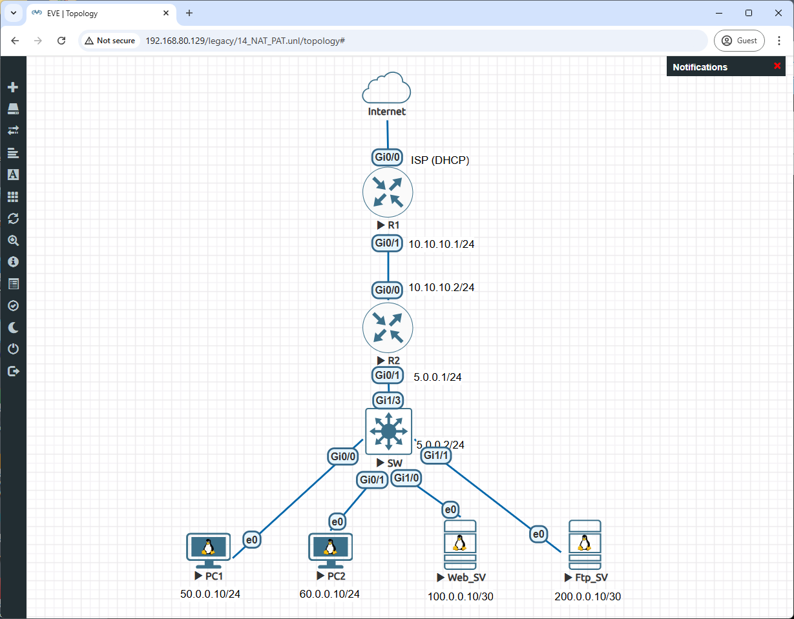

### Device Roles

| Device | Role | OS |
|--------|------|----|
| **R1** | Edge Router + NAT Gateway | Cisco IOSv |
| **R2** | Core Router (Transit) | Cisco IOSv |
| **SW** | Layer 3 Switch (Gateway for hosts) | Cisco IOSvL2 |
| **PC1** | Internal Client | Linux Slax |
| **PC2** | Internal Client | Linux Slax |
| **Web_SV** | Internal Web Server | Linux Slax |
| **Ftp_SV** | Internal FTP Server | Linux Slax |

### Interface & IP Address Table

#### WAN / Core Links

| Device | Interface | IP Address | Connected To |
|--------|-----------|-----------|--------------|
| **R1** | Gi0/0 | DHCP (WAN) | ISP / Internet |
| **R1** | Gi0/1 | 10.10.10.1/24 | R2 Gi0/0 |
| **R2** | Gi0/0 | 10.10.10.2/24 | R1 Gi0/1 |
| **R2** | Gi0/1 | 5.0.0.1/24 | SW Gi1/3 |
| **SW** | Gi1/3 | 5.0.0.2/24 | R2 Gi0/1 |

#### LAN Links (SW to End Devices)

| Device | Interface | IP Address | Gateway |
|--------|-----------|-----------|---------|
| **SW** | Gi0/0 | 50.0.0.1/24 | — (gateway for PC1) |
| **SW** | Gi0/1 | 60.0.0.1/24 | — (gateway for PC2) |
| **SW** | Gi1/0 | 100.0.0.9/30 | — (gateway for Web_SV) |
| **SW** | Gi1/1 | 200.0.0.9/30 | — (gateway for Ftp_SV) |
| **PC1** | ens3 | 50.0.0.10/24 | 50.0.0.1 |
| **PC2** | ens3 | 60.0.0.10/24 | 60.0.0.1 |
| **Web_SV** | ens3 | 100.0.0.10/30 | 100.0.0.9 |
| **Ftp_SV** | ens3 | 200.0.0.10/30 | 200.0.0.9 |

### Port Forwarding Rules (on R1)

| Service | Inside Local | Inside Global |
|---------|-------------|--------------|
| HTTP (Web_SV) | 100.0.0.10:80 | `<WAN_IP>`:80 |
| FTP (Ftp_SV) | 200.0.0.10:21 | `<WAN_IP>`:21 |

---

## ⚙️ Device Configuration

### R1 — Edge Router & NAT Gateway

R1 connects to the ISP via DHCP (Gi0/0) and to R2 via Gi0/1. It performs PAT (NAT Overload) so all internal traffic exits through the WAN IP, and Port Forwarding to expose Web_SV and Ftp_SV.

```bash
enable
configure terminal
hostname R1

! WAN interface (outside NAT)
interface GigabitEthernet0/0
 description WAN to ISP
 ip address dhcp
 ip nat outside
 no shutdown
exit

! LAN interface (inside NAT)
interface GigabitEthernet0/1
 description LAN to R2
 ip address 10.10.10.1 255.255.255.0
 ip nat inside
 no shutdown
exit

! PAT: allow all traffic to use WAN IP
access-list 1 permit any
ip nat inside source list 1 interface GigabitEthernet0/0 overload

! Port forwarding: HTTP → Web_SV
ip nat inside source static tcp 100.0.0.10 80 interface GigabitEthernet0/0 80

! Port forwarding: FTP → Ftp_SV
ip nat inside source static tcp 200.0.0.10 21 interface GigabitEthernet0/0 21

! OSPF
router ospf 1
 network 10.10.10.0 0.0.0.255 area 0
 default-information originate
exit

end
write memory
```

> **Verify WAN IP:** `show ip interface brief` — check Gi0/0 has an IP from DHCP.

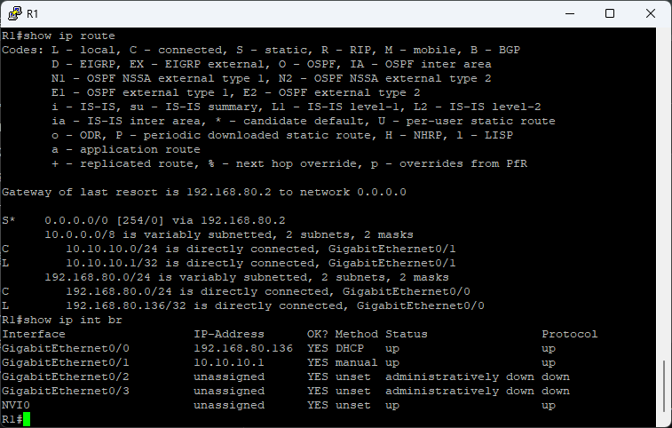

---

### R2 — Core Router

R2 routes between R1 and SW using OSPF.

```bash
enable
configure terminal
hostname R2

interface GigabitEthernet0/0
 description Link to R1
 ip address 10.10.10.2 255.255.255.0
 no shutdown
exit

interface GigabitEthernet0/1
 description Link to SW
 ip address 5.0.0.1 255.255.255.0
 no shutdown
exit

router ospf 1
 network 10.10.10.0 0.0.0.255 area 0
 network 5.0.0.0 0.0.0.255 area 0
exit

end
write memory
```

> **Verify:** `show ip ospf neighbor` — should see R1 in FULL state.

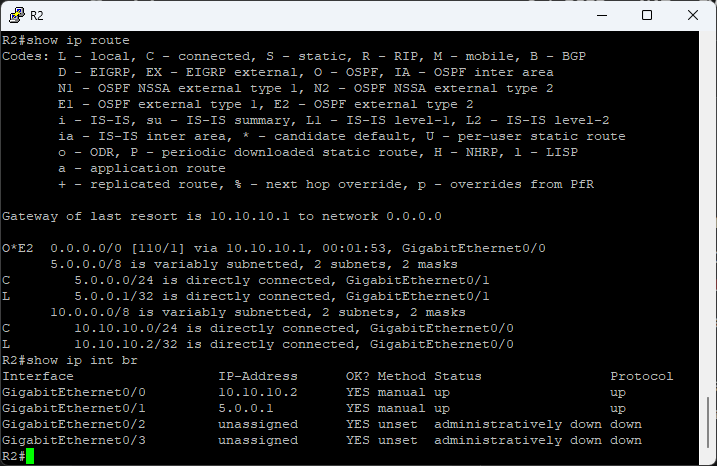

---

### SW — Layer 3 Switch

SW acts as the default gateway for all end devices and runs OSPF to advertise their subnets.

```bash
enable
configure terminal
hostname SW

ip routing

! Uplink to R2
interface GigabitEthernet1/3
 description Link to R2
 no switchport
 ip address 5.0.0.2 255.255.255.0
 no shutdown
exit

! Gateway for PC1
interface GigabitEthernet0/0
 description Gateway for PC1
 no switchport
 ip address 50.0.0.1 255.255.255.0
 no shutdown
exit

! Gateway for PC2
interface GigabitEthernet0/1
 description Gateway for PC2
 no switchport
 ip address 60.0.0.1 255.255.255.0
 no shutdown
exit

! Gateway for Web_SV (/30 subnet: .9 = gateway, .10 = server)
interface GigabitEthernet1/0
 description Gateway for Web_SV
 no switchport
 ip address 100.0.0.9 255.255.255.252
 no shutdown
exit

! Gateway for Ftp_SV (/30 subnet: .9 = gateway, .10 = server)
interface GigabitEthernet1/1
 description Gateway for Ftp_SV
 no switchport
 ip address 200.0.0.9 255.255.255.252
 no shutdown
exit

! OSPF: advertise all LAN subnets
router ospf 1
 network 5.0.0.0 0.0.0.255 area 0
 network 50.0.0.0 0.0.0.255 area 0
 network 60.0.0.0 0.0.0.255 area 0
 network 100.0.0.8 0.0.0.3 area 0
 network 200.0.0.8 0.0.0.3 area 0
exit

end
write memory
```

> **Verify:** `show ip route` — should see `O*E2` default route via 5.0.0.1.

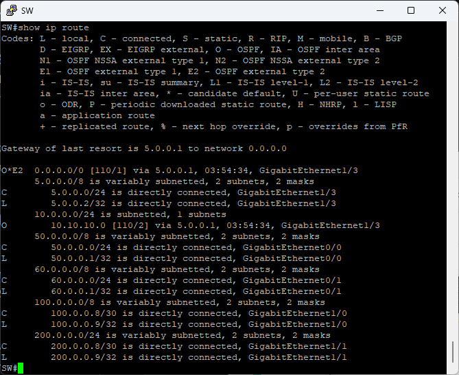

---

## 🖥️ End Device Configuration

### PC1 — 50.0.0.10/24

```bash
ifconfig ens3 50.0.0.10 netmask 255.255.255.0 up
route add default gw 50.0.0.1
echo "nameserver 8.8.8.8" > /etc/resolv.conf
```

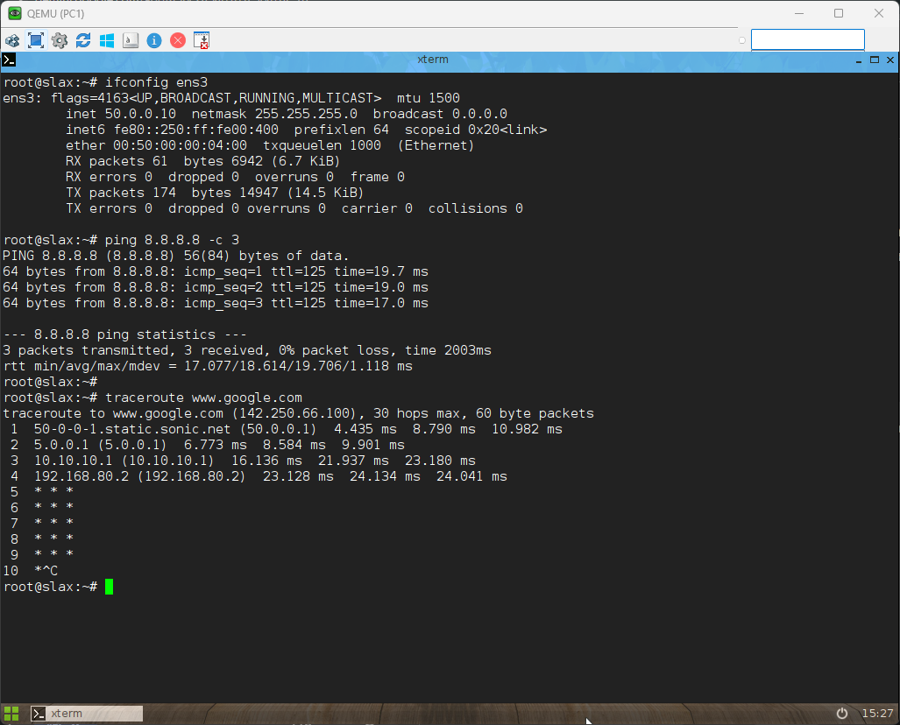

---

### PC2 — 60.0.0.10/24

```bash
ifconfig ens3 60.0.0.10 netmask 255.255.255.0 up
route add default gw 60.0.0.1
echo "nameserver 8.8.8.8" > /etc/resolv.conf
```

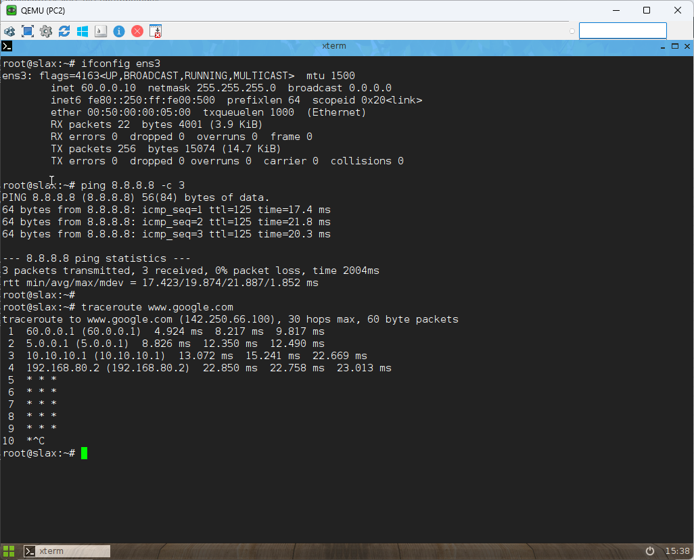

---

### Web_SV — 100.0.0.10/30

#### 1. Network Configuration

```bash
ifconfig ens3 100.0.0.10 netmask 255.255.255.252 up
route add default gw 100.0.0.9
echo "nameserver 8.8.8.8" > /etc/resolv.conf
```

#### 2. Install & Start Apache Web Server

```bash
sudo apt update
sudo apt install apache2 -y
sudo systemctl start apache2
sudo systemctl status apache2
```

#### 3. Set Custom HTML Page

```bash
echo "<html><body><h1>KSU EN CE</h1><p>IP: 100.0.0.10 | Port: 80</p></body></html>" | tee /var/www/html/index.html
```

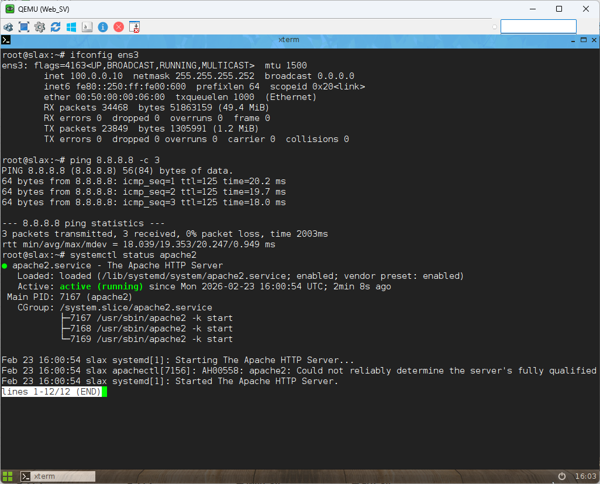

---

### Ftp_SV — 200.0.0.10/30

#### 1. Network Configuration

```bash
ifconfig ens3 200.0.0.10 netmask 255.255.255.252 up
route add default gw 200.0.0.9
echo "nameserver 8.8.8.8" > /etc/resolv.conf
```

#### 2. Install & Start FTP Server

```bash
apt-get update
apt-get install -y vsftpd
adduser ftpuser
passwd ftpuser
echo "test file from Ftp_SV" > /home/ftpuser/test.txt
/etc/init.d/vsftpd start
```

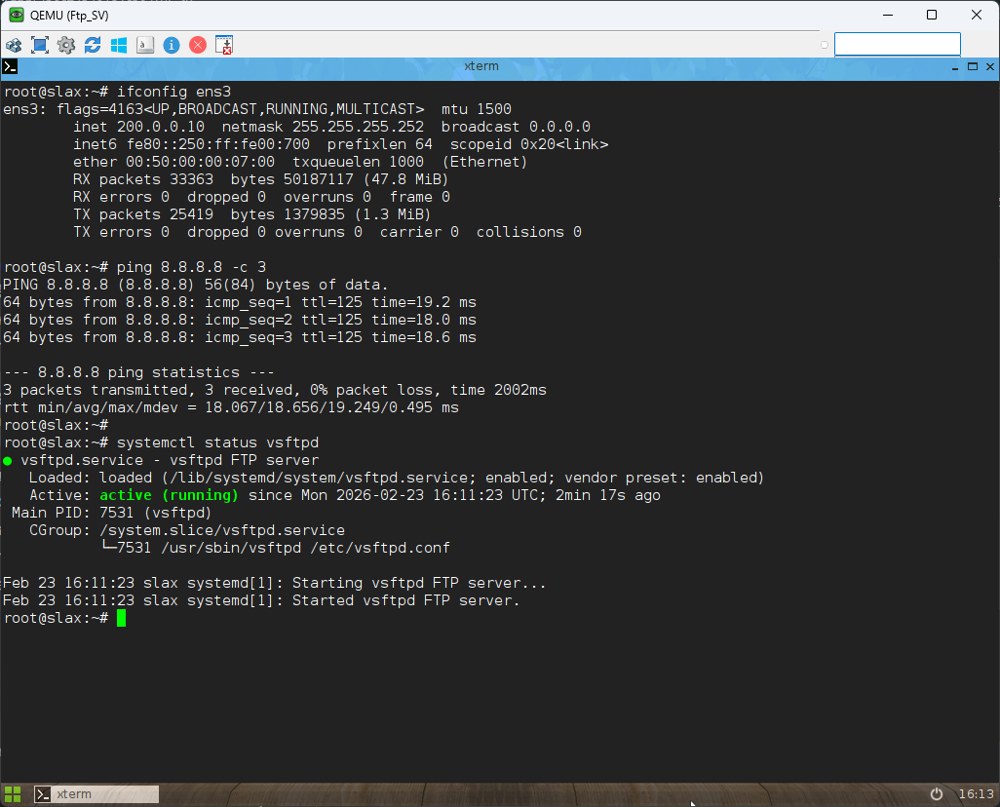

---

## ✅ Verification & Testing

### 1. Check NAT Translations

```bash
show ip nat translations
```

Expected output after traffic:

```
Pro  Inside global          Inside local           Outside local    Outside global
tcp  192.168.80.136:80      100.0.0.10:80          ---              ---
tcp  192.168.80.136:21      200.0.0.10:21          ---              ---
icmp 192.168.80.136:1024    50.0.0.10:1024         8.8.8.8:1024     8.8.8.8:1024
```

- Port-forward entries appear immediately after configuration.
- PAT entries appear only when traffic is generated.

---

### 2. Check NAT Statistics

```bash
show ip nat statistics
```

| Field | Expected Value |
|-------|---------------|
| Outside interfaces | GigabitEthernet0/0 |
| Inside interfaces | GigabitEthernet0/1 |
| Hits | Increases as traffic passes |
| Misses | Should be 0 or very low |

---

### 3. Outbound Test — PAT (PC1 / PC2 → Internet)

On **PC1** or **PC2**:

```bash
ping -c 4 8.8.8.8
ping -c 4 google.com
```

On **R1** immediately after:

```bash
show ip nat translations
# Look for icmp entries with 50.0.0.10 or 60.0.0.10 translated to WAN IP
```

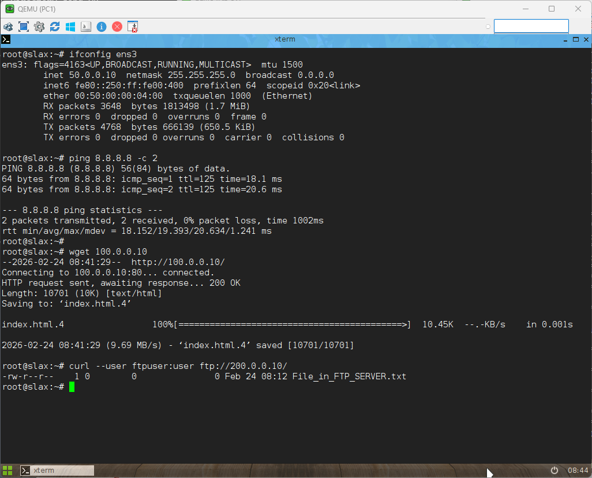
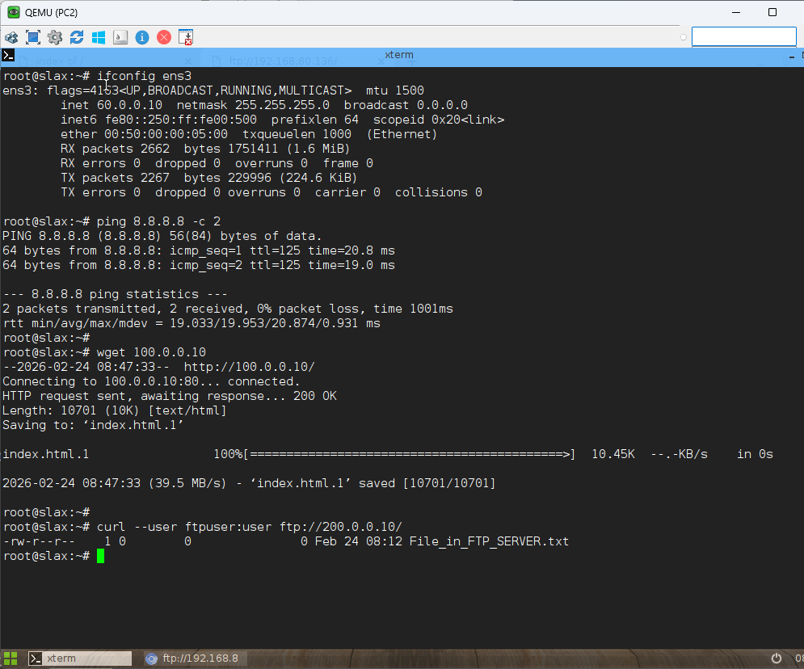

---

### 4. Inbound Test — Port Forwarding (External → Servers)

**Test Web Server from PC1:**

```bash
curl http://100.0.0.10       # Direct access (internal)
curl http://<WAN_IP>         # Via port forwarding
```

**Test FTP Server from PC1:**

```bash
ftp 200.0.0.10              # Direct access (internal)
ftp <WAN_IP>                # Via port forwarding
# Login: ftpuser / <password>
# Commands: ls, get test.txt, quit
```

On **R1** after inbound test:

```bash
show ip nat translations
# Should show tcp entries for port 80 and port 21
```

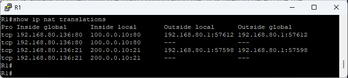

---

### 5. Debug NAT (Optional)

```bash
debug ip nat
! Generate traffic from PC1, watch console output
! Example: NAT*: s=50.0.0.10->192.168.80.136, d=8.8.8.8 [123]
undebug all
```

> ⚠️ Use debug only during testing — it generates significant console output.

---

## 🔧 Troubleshooting

### NAT Not Translating Traffic

```bash
! 1. Check inside/outside interface assignment
show run | section interface
! Look for: ip nat inside / ip nat outside

! 2. Check ACL permits traffic
show access-lists 1

! 3. Check default route exists on R1
show ip route
! Expected: S* 0.0.0.0/0 via <ISP gateway>

! 4. Check NAT config
show run | include ip nat

! 5. Check hits counter (if 0, traffic is not reaching NAT)
show ip nat statistics
```

---

### Port Forwarding Not Working

```bash
! 1. Confirm port-forward entry exists
show ip nat translations | include :80
show ip nat translations | include :21

! 2. Confirm service is listening on server
! On Web_SV: netstat -tuln | grep :80
! On Ftp_SV: netstat -tuln | grep :21

! 3. Test internal access first (if this fails, it's a routing issue, not NAT)
! From PC1: curl http://100.0.0.10
```

---

### Clear Stuck NAT Entries

```bash
clear ip nat translation *
```

> Clears active sessions but does not remove static port-forward configuration.

---

### Adjust NAT Timeouts

```bash
ip nat translation timeout 600          ! 10 min (default 24h)
ip nat translation tcp-timeout 3600     ! 1 hour
ip nat translation udp-timeout 300      ! 5 min
```

---

## 📝 Summary

### Configuration Reference

```bash
! Mark interfaces
ip nat inside           ! on LAN-facing interface
ip nat outside          ! on WAN-facing interface

! PAT (all internal hosts share WAN IP)
access-list 1 permit any
ip nat inside source list 1 interface GigabitEthernet0/0 overload

! Port Forwarding (inbound to specific server)
ip nat inside source static tcp <inside-ip> <inside-port> interface GigabitEthernet0/0 <public-port>

! Verification
show ip nat translations
show ip nat statistics
clear ip nat translation *
debug ip nat
```

### What You Configured

| Feature | Detail |
|---------|--------|
| **PAT** | PC1 and PC2 share R1's WAN IP for Internet access |
| **Port Forward HTTP** | External port 80 → Web_SV (100.0.0.10:80) |
| **Port Forward FTP** | External port 21 → Ftp_SV (200.0.0.10:21) |
| **Routing** | OSPF across R1, R2, SW — default route from R1 via DHCP |

---

### Next Steps

| Lab | Topic |
|-----|-------|
| **Lab 15** | DHCP Configuration |
| **Lab 16** | DNS Configuration |
| **Lab 17** | VPN Configuration |

---

## 📖 References

- [Cisco NAT Configuration Guide](https://www.cisco.com/c/en/us/td/docs/ios-xml/ios/ipaddr_nat/configuration/xe-16/nat-xe-16-book.html)
- [RFC 1918 — Private Address Space](https://tools.ietf.org/html/rfc1918)
- [RFC 3022 — Traditional NAT](https://tools.ietf.org/html/rfc3022)


