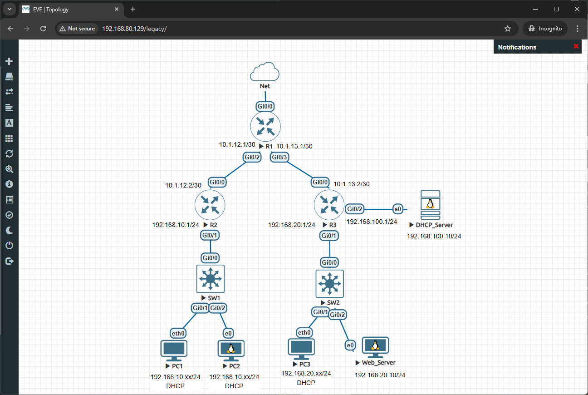
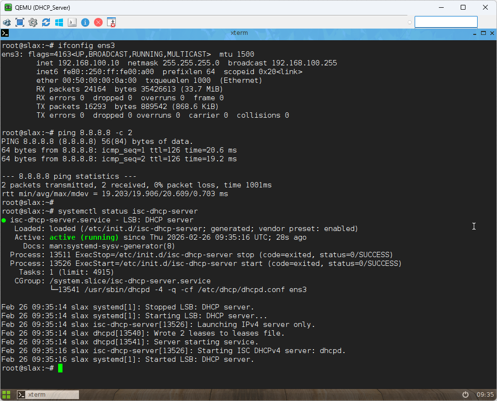
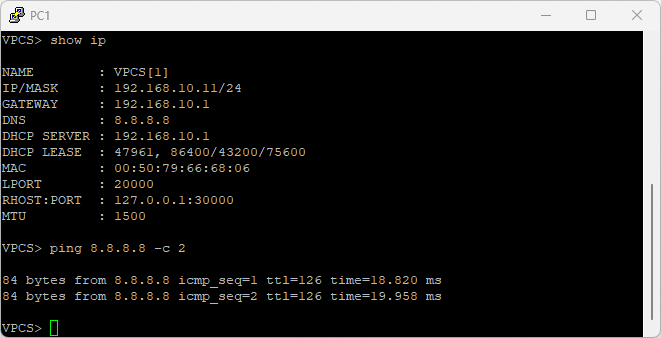
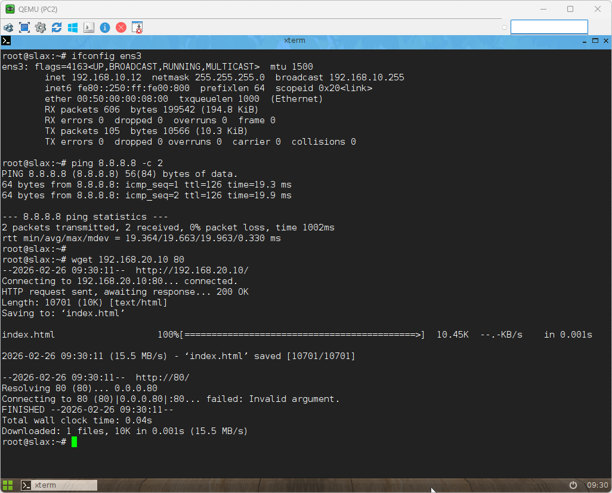
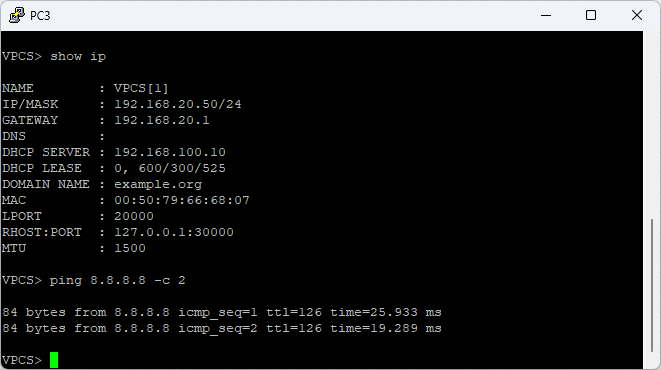
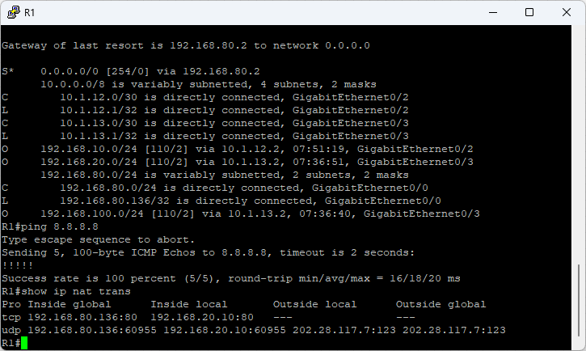
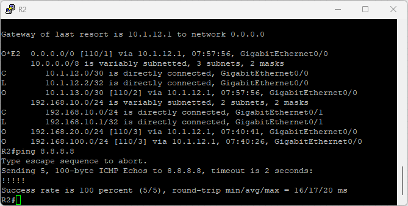
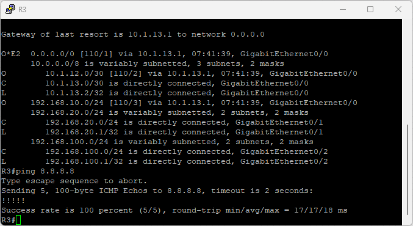
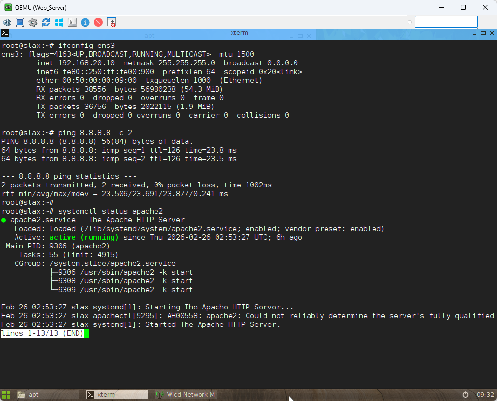

---
# 🖧 Hybrid DHCP & Fixed Web Server Lab

> Complete hands-on lab to configure hybrid DHCP (local + relay), NAT, and fixed web server in a multi-site topology.

## 👤 Author

- [@alfaXphoori](https://www.github.com/alfaXphoori)

---

## 📋 Table of Contents

1. [Lab Objectives](#lab-objectives)
2. [Prerequisites](#prerequisites)
3. [DHCP Fundamentals](#dhcp-fundamentals)
4. [IP Addressing Plan](#ip-addressing-plan)
5. [Lab Topology](#lab-topology)
6. [Creating the Lab](#creating-the-lab)
7. [Step-by-Step Configuration](#step-by-step-configuration)
8. [Verification & Testing](#verification--testing)
9. [Troubleshooting](#troubleshooting)
10. [Summary & Next Steps](#summary--next-steps)

---

## 🎯 Lab Objectives

> **Purpose:** Master hybrid DHCP (local + relay), NAT, port forwarding, and web server setup in a multi-site environment.

### By the end of this lab, you will:

- ✅ Configure local DHCP on router
- ✅ Configure DHCP relay to Linux server
- ✅ Set up NAT and port forwarding (PAT)
- ✅ Deploy a fixed IP web server
- ✅ Test end-to-end connectivity and services

---

## ✅ Prerequisites

> **Purpose:** Ensure you have necessary knowledge and resources.

### Required Knowledge

| Topic | Why It Matters | Reference |
|-------|---------------|-----------|
| **IP Addressing** | DHCP assigns IP addresses dynamically | 04_Basic Switch Lab |
| **Router Configuration** | DHCP configured on routers | 08_Basic_Routing Lab |
| **Routing Protocols** | OSPF for multi-site routing | 10_OSPF_Lab |
| **NAT Configuration** | NAT for Internet access | 14_NAT_Configuration Lab |

### Required Resources

- ✅ EVE-NG installed and running
- ✅ Cisco router images available (IOSv)
- ✅ Linux VMs for DHCP and Web Server
- ✅ Access to EVE-NG web interface
- ✅ Understanding of DHCP concepts (discover/offer/request/ack)

---

## 📚 DHCP Fundamentals

> **Purpose:** Understand DHCP concepts before configuration.

### What is DHCP?

**Dynamic Host Configuration Protocol (DHCP)** automatically assigns IP addresses and network settings to devices, enabling:
- ✅ **Automatic IP assignment** - No manual configuration needed
- ✅ **Centralized management** - All IP settings from one server
- ✅ **Address reuse** - IPs are recycled when devices disconnect
- ✅ **Error prevention** - Reduces IP conflicts

---

### DHCP Terminology

| Term | Definition |
|------|-----------|
| **DHCP Discover** | Client broadcasts to find DHCP server |
| **DHCP Offer** | Server offers an IP address to client |
| **DHCP Request** | Client requests the offered IP |
| **DHCP Ack** | Server acknowledges and assigns the IP |
| **Lease Time** | How long the IP is valid before renewal |
| **IP Helper** | Router forwards DHCP broadcasts across networks |

---

### DHCP Relay (IP Helper)

When clients and DHCP servers are on different subnets, the router must forward DHCP broadcasts using `ip helper-address`.

---

## 🗺️ IP Addressing Plan

- **Transit Links:**
  - R1 <-> R2: `10.1.12.0/30`
  - R1 <-> R3: `10.1.13.0/30`
- **Site 1 (R2 LAN):**
  - `192.168.10.0/24` (Gateway: `192.168.10.1` @ R2 Gi0/1)
- **Site 2 (R3 LAN):**
  - `192.168.20.0/24` (Gateway: `192.168.20.1` @ R3 Gi0/1)
  - Web Server: `192.168.20.10` (Fixed IP)
- **DHCP Server Zone (R3 Gi0/2):**
  - `192.168.100.0/24` (Gateway: `192.168.100.1` @ R3 Gi0/2)
  - Linux DHCP: `192.168.100.10`

---

## 🖼️ Lab Topology

### Official EVE-NG Topology


```
         [Internet]
             |
           [R1]
         /      \
      [R2]    [R3]
      |         |   \
   [SW1]    [SW2]  [Linux DHCP]
     |         |         |
   [PC1/2]   [PC3]   [Web Server]
```

### Detailed Device Connections
| From Device | Interface | To Device | Interface | IP Subnet |
|-------------|-----------|-----------|-----------|-----------|
| R1 | Gi0/0 | Net | - | DHCP (Internet) |
| R1 | Gi0/2 | R2 | Gi0/0 | 10.1.12.0/30 |
| R1 | Gi0/3 | R3 | Gi0/0 | 10.1.13.0/30 |
| R2 | Gi0/1 | SW1 | - | 192.168.10.0/24 |
| R3 | Gi0/1 | SW2 | - | 192.168.20.0/24 |
| R3 | Gi0/2 | DHCP_Server | ens3 | 192.168.100.0/24 |
| SW1 | Gi0/1 | PC1 | eth0 | DHCP Client |
| SW1 | Gi0/2 | PC2 | eth0 | DHCP Client |
| SW2 | Gi0/1 | PC3 | eth0 | DHCP Client |
| SW2 | Gi0/2 | Web_Server | ens3 | 192.168.20.10/24 |

### Topology Details

#### Transit Links

| Device | Interface | IP Address | Subnet Mask | Role |
|--------|-----------|-----------|-------------|------|
| **R1** | Gi0/2 | 10.1.12.1 | 255.255.255.252 | Link to R2 |
| **R1** | Gi0/3 | 10.1.13.1 | 255.255.255.252 | Link to R3 |
| **R2** | Gi0/0 | 10.1.12.2 | 255.255.255.252 | Link to R1 |
| **R3** | Gi0/0 | 10.1.13.2 | 255.255.255.252 | Link to R1 |

#### Site 1 (R2 LAN)

| Device | Interface | IP Address | Subnet Mask | Role |
|--------|-----------|-----------|-------------|------|
| **R2** | Gi0/1 | 192.168.10.1 | 255.255.255.0 | Gateway for Site 1 |
| **SW1** | - | - | - | Layer 2 Switch |
| **PC1, PC2** | eth0/ens3 | DHCP | 255.255.255.0 | DHCP Clients |

#### Site 2 (R3 LAN)

| Device | Interface | IP Address | Subnet Mask | Role |
|--------|-----------|-----------|-------------|------|
| **R3** | Gi0/1 | 192.168.20.1 | 255.255.255.0 | Gateway for Site 2 |
| **SW2** | - | - | - | Layer 2 Switch |
| **PC3** | eth0/ens3 | DHCP | 255.255.255.0 | DHCP Client |
| **Web_Server** | ens3 | 192.168.20.10 | 255.255.255.0 | Fixed IP Web Server |

#### DHCP Server Zone

| Device | Interface | IP Address | Subnet Mask | Role |
|--------|-----------|-----------|-------------|------|
| **R3** | Gi0/2 | 192.168.100.1 | 255.255.255.0 | Gateway for DHCP Zone |
| **Linux DHCP** | ens3 | 192.168.100.10 | 255.255.255.0 | DHCP Server |

#### WAN/Internet

| Device | Interface | IP Address | Subnet Mask | Role |
|--------|-----------|-----------|-------------|------|
| **R1** | Gi0/0 | DHCP (from ISP) | (from ISP) | WAN Connection |

---

## 🔧 Creating the Lab

### Step 1: Create a New Lab

1. Log into EVE-NG web interface
2. Click **Add Lab**
3. Enter lab details:
   - **Lab Name**: `DHCP_Hybrid_Lab`
   - **Lab Description**: `Hybrid DHCP (Local + Relay) with Fixed Web Server`
   - **Lab Version**: `1.0`
4. Click **Create**

### Step 2: Add Router Nodes

1. Click **Add Node**
2. Select **Cisco** → **IOSv** (router)
3. Add three routers:
   - **R1** (Edge router with NAT)
   - **R2** (Site 1 router with local DHCP)
   - **R3** (Site 2 router with DHCP relay)
4. Click **Save**

### Step 3: Add Switch and PC Nodes

1. Click **Add Node**
2. Add **Switch** (IOSvL2 or unmanaged switch) - SW1, SW2
3. Add **PC nodes**:
   - **PC1, PC2** (Linux Slax for Site 1)
   - **PC3** (Linux Slax for Site 2)
   - **Linux DHCP** (Linux for DHCP server)
   - **Web_Server** (Linux for web server)
4. Click **Save**

### Step 4: Connect All Devices

| From Device | Interface | To Device | Interface | Purpose |
|-------------|-----------|-----------|-----------|---------|
| **R1** | Gi0/0 | **WAN** | - | Internet (DHCP) |
| **R1** | Gi0/2 | **R2** | Gi0/0 | Transit Link |
| **R1** | Gi0/3 | **R3** | Gi0/0 | Transit Link |
| **R2** | Gi0/1 | **SW1** | - | Site 1 LAN |
| **R3** | Gi0/1 | **SW2** | - | Site 2 LAN |
| **R3** | Gi0/2 | **Linux DHCP** | ens3 | DHCP Server Zone |
| **SW1** | - | **PC1, PC2** | eth0/ens3 | Site 1 Clients |
| **SW2** | - | **PC3** | eth0/ens3 | Site 2 Client |
| **SW2** | - | **Web_Server** | ens3 | Web Server |

### Step 5: Start All Devices

1. Click **Start All**
2. Wait for devices to boot (1-2 minutes for routers)
3. Verify all devices show "Running" status

---

## 🛠️ Step-by-Step Configuration

### 🔴 1. R1 Configuration (Edge Router & NAT)

R1 acts as the Edge Router connecting the internal network to the Internet (ISP), serving as the NAT/PAT gateway and advertising the default route to other routers.

#### Configuration Commands

```shell
enable
configure terminal
hostname R1

! 1. Configure WAN Interface (Internet-facing)
interface GigabitEthernet0/0
 description WAN to ISP (DHCP)
 ip address dhcp
 ip nat outside
 no shutdown
exit

! 2. Configure Link to R2
interface GigabitEthernet0/2
 description Link to R2
 ip address 10.1.12.1 255.255.255.252
 ip nat inside
 no shutdown
exit

! 3. Configure Link to R3
interface GigabitEthernet0/3
 description Link to R3
 ip address 10.1.13.1 255.255.255.252
 ip nat inside
 no shutdown
exit

! 4. Configure NAT Overload (PAT)
access-list 1 permit 192.168.0.0 0.0.255.255
access-list 1 permit 10.0.0.0 0.255.255.255
ip nat inside source list 1 interface GigabitEthernet0/0 overload

! 5. Configure Port Forwarding for Web Server
ip nat inside source static tcp 192.168.20.10 80 interface GigabitEthernet0/0 80

! 6. Configure OSPF Routing
router ospf 1
 network 10.1.12.0 0.0.0.3 area 0
 network 10.1.13.0 0.0.0.3 area 0
 default-information originate
exit

end
write memory
```

### 🔵 2. R2 Configuration (Local DHCP Server)

R2 acts as the Site 1 router, providing local DHCP service for the 192.168.10.0/24 LAN and routing traffic to the Internet via R1.

#### Configuration Commands

```shell
enable
configure terminal
hostname R2

! 1. Configure Link to R1
interface GigabitEthernet0/0
 description Link to R1
 ip address 10.1.12.2 255.255.255.252
 no shutdown
exit

! 2. Configure Link to SW1 (LAN)
interface GigabitEthernet0/1
 description LAN to Site 1
 ip address 192.168.10.1 255.255.255.0
 no shutdown
exit

! 3. Configure Local DHCP Server for Site 1
ip dhcp excluded-address 192.168.10.1 192.168.10.10

ip dhcp pool SITE1_LAN
 network 192.168.10.0 255.255.255.0
 default-router 192.168.10.1
 dns-server 8.8.8.8
exit

! 4. Configure OSPF Routing
router ospf 1
 network 10.1.12.0 0.0.0.3 area 0
 network 192.168.10.0 0.0.0.255 area 0
exit

end
write memory
```

---


### 🟢 3. R3 Configuration (DHCP Relay)

R3 acts as the Site 2 router, forwarding DHCP requests from the 192.168.20.0/24 LAN to the Linux DHCP server at 192.168.100.10, and routing traffic between sites.

#### Configuration Commands

```shell
enable
configure terminal
hostname R3

! 1. Configure Link to R1
interface GigabitEthernet0/0
 description Link to R1
 ip address 10.1.13.2 255.255.255.252
 no shutdown
exit

! 2. Configure Link to SW2 (LAN) + DHCP Relay
interface GigabitEthernet0/1
 description LAN to Site 2
 ip address 192.168.20.1 255.255.255.0
 ip helper-address 192.168.100.10
 no shutdown
exit

! 3. Configure Link to Linux DHCP Server
interface GigabitEthernet0/2
 Description DHCP Server Zone
 ip address 192.168.100.1 255.255.255.0
 no shutdown
exit

! 4. Configure OSPF Routing
router ospf 1
 network 10.1.13.0 0.0.0.3 area 0
 network 192.168.20.0 0.0.0.255 area 0
 network 192.168.100.0 0.0.0.255 area 0
exit

end
write memory
```

---


### 🟠 4. Linux DHCP Server Configuration

The Linux DHCP server provides IP address assignments for the Site 2 LAN (192.168.20.0/24) and listens on the 192.168.100.0/24 network.

#### Configuration Commands

```shell
# 1. Basic network configuration
ifconfig ens3 192.168.100.10 netmask 255.255.255.0 up
route add default gw 192.168.100.1
echo "nameserver 8.8.8.8" > /etc/resolv.conf

# 2. Install DHCP server package
apt-get update
apt-get install -y isc-dhcp-server

# 3. Configure DHCP scopes
nano /etc/dhcp/dhcpd.conf
# --- Paste this configuration ---
subnet 192.168.100.0 netmask 255.255.255.0 {}
subnet 192.168.20.0 netmask 255.255.255.0 {
  range 192.168.20.50 192.168.20.200;
  option routers 192.168.20.1;
  option domain-name-servers 8.8.8.8;
}

# 4. Set DHCP server network interface
nano /etc/default/isc-dhcp-server
# --- Update this line ---
INTERFACESv4="ens3"
INTERFACESv6=""

# 5. Restart DHCP service
systemctl restart isc-dhcp-server
systemctl enable isc-dhcp-server
```

---


### 🟣 5. Web_Server Configuration (Fixed IP)

The Web Server provides a static HTTP service at 192.168.20.10, accessible both locally and via NAT port forwarding from the Internet.

#### Configuration Commands

```shell
# 1. Basic network configuration
ifconfig ens3 192.168.20.10 netmask 255.255.255.0 up
route add default gw 192.168.20.1
echo "nameserver 8.8.8.8" > /etc/resolv.conf

# 2. Install Apache web server
apt-get update
apt-get install -y apache2

# 3. Create default web page
nano /var/www/html/index.html
# --- Paste this content ---
<h1>CE EN KSU</h1><h3>IP: 192.168.20.10 | Port: 80</h3>

# 4. Start and enable Apache service
systemctl start apache2
systemctl enable apache2
```

---


### 🟤 6. Client PC Configuration (Linux Slax - DHCP Client)

This configuration works for PC1, PC2 (Site 1) and PC3 (Site 2) — just change the network details as needed.

#### Configuration Commands

```shell
# 1. Clear any existing IP address
ifconfig ens3 0.0.0.0
# Alternative command: dhclient -r ens3

# 2. Request new IP address via DHCP
dhclient ens3

# 3. Verify received IP configuration
ifconfig ens3

# 4. Check default gateway and test Internet connectivity
route -n
ping 8.8.8.8 -c 2
```

---


---

## 🔎 Verification & Testing

- **Site 1:**
  - PC1/PC2: `dhclient ens3` → Get IP `192.168.10.x` from R2
- **Site 2:**
  - PC3: `dhclient ens3` → Get IP `192.168.20.50+` from Linux DHCP (via R3 relay)
- **Web Server Internal:**
  - `curl http://192.168.20.10` → See Apache web page
- **Internet:**
  - `ping 8.8.8.8` from any PC (NAT via R1)
- **Web Server External:**
  - Open browser on Host → `http://<WAN_IP_R1>` → See Apache web page (PAT)

---
## 📊 Lab Test Results & Screenshots

### 1. DHCP Server Status

```bash
root@slax:~# systemctl status isc-dhcp-server
● isc-dhcp-server.service - LSB: DHCP server
   Loaded: loaded (/etc/init.d/isc-dhcp-server; generated; vendor preset: enabled)
   Active: active (running) since Thu 2026-02-26 09:35:16 UTC; 28s ago
```

### 2. PC1 (Site 1) DHCP Lease

```bash
VPCS> show ip
NAME            : VPCS[1]
IP/MASK         : 192.168.10.11/24
GATEWAY         : 192.168.10.1
DNS             : 8.8.8.8
DHCP SERVER     : 192.168.10.1
```

### 3. PC2 (Site 1) Connectivity & Web Test

```bash
root@slax:~# wget http://192.168.20.10
--2026-02-26 09:30:11--  http://192.168.20.10/
Connecting to 192.168.20.10:80... connected.
HTTP request sent, awaiting response... 200 OK
Length: 10701 (10K) [text/html]
Saving to: 'index.html'
```

### 4. PC3 (Site 2) DHCP Lease

```bash
VPCS> show ip
NAME            : VPCS[1]
IP/MASK         : 192.168.20.50/24
GATEWAY         : 192.168.20.1
DHCP SERVER     : 192.168.100.10
```

### 5. R1 Routing & NAT Translations

```bash
R1# show ip route
S*      0.0.0.0/0 [254/0] via 192.168.80.2
        10.0.0.0/8 is variably subnetted, 4 subnets, 2 masks
C        10.1.12.0/30 is directly connected, GigabitEthernet0/2
L        10.1.12.1/32 is directly connected, GigabitEthernet0/2
C        10.1.13.0/30 is directly connected, GigabitEthernet0/3
L        10.1.13.1/32 is directly connected, GigabitEthernet0/3
O        192.168.10.0/24 [110/2] via 10.1.12.2, 07:51:19, GigabitEthernet0/2
O        192.168.20.0/24 [110/2] via 10.1.13.2, 07:36:51, GigabitEthernet0/3
C        192.168.80.0/24 is directly connected, GigabitEthernet0/0
L        192.168.80.136/32 is directly connected, GigabitEthernet0/0
O        192.168.100.0/24 [110/2] via 10.1.13.2, 07:36:40, GigabitEthernet0/3

R1# show ip nat trans
Pro Inside global         Inside local          Outside local         Outside global
tcp 192.168.80.136:80     192.168.20.10:80         ---                   ---
udp 192.168.80.136:60955 192.168.20.10:60955 202.28.117.7:123 202.28.117.7:123
```

### 6. R2 Routing Table

```bash
R2# show ip route
O*E2  0.0.0.0/0 [110/1] via 10.1.12.1, 07:57:56, GigabitEthernet0/0
        10.0.0.0/8 is variably subnetted, 3 subnets, 2 masks
C        10.1.12.0/30 is directly connected, GigabitEthernet0/0
L        10.1.12.2/32 is directly connected, GigabitEthernet0/0
O        10.1.13.0/30 [110/2] via 10.1.12.1, 07:57:56, GigabitEthernet0/0
O        192.168.10.0/24 is variably subnetted, 2 subnets, 2 masks
C        192.168.10.0/24 is directly connected, GigabitEthernet0/1
L        192.168.10.1/32 is directly connected, GigabitEthernet0/1
O        192.168.20.0/24 [110/3] via 10.1.12.1, 07:40:41, GigabitEthernet0/0
O        192.168.100.0/24 [110/3] via 10.1.12.1, 07:40:26, GigabitEthernet0/0
```

### 7. R3 Routing Table

```bash
R3# show ip route
O*E2  0.0.0.0/0 [110/1] via 10.1.13.1, 07:41:39, GigabitEthernet0/0
        10.0.0.0/8 is variably subnetted, 3 subnets, 2 masks
O        10.1.12.0/30 [110/2] via 10.1.13.1, 07:41:39, GigabitEthernet0/0
C        10.1.13.0/30 is directly connected, GigabitEthernet0/0
L        10.1.13.2/32 is directly connected, GigabitEthernet0/0
O        192.168.10.0/24 [110/3] via 10.1.13.1, 07:41:39, GigabitEthernet0/0
C        192.168.20.0/24 is directly connected, GigabitEthernet0/1
L        192.168.20.1/32 is directly connected, GigabitEthernet0/1
C        192.168.100.0/24 is directly connected, GigabitEthernet0/2
L        192.168.100.1/32 is directly connected, GigabitEthernet0/2
```

### 8. Web Server Status

```bash
root@slax:~# systemctl status apache2
● apache2.service - The Apache HTTP Server
   Loaded: loaded (/lib/systemd/system/apache2.service; enabled; vendor preset: enabled)
   Active: active (running) since Thu 2026-02-26 02:53:27 UTC; 6h ago
```

---
## �️ Troubleshooting

### Issue 1: Site 1 Clients Not Getting IP

**Symptoms:** PC1/PC2 cannot get IP from R2.

**Checklist:**
```bash
# On R2
show ip dhcp binding
show ip dhcp pool SITE1_LAN
show ip interface GigabitEthernet0/1

# Verify DHCP is enabled
show run | include dhcp
```

---

### Issue 2: Site 2 Clients Not Getting IP

**Symptoms:** PC3 cannot get IP from Linux DHCP server.

**Checklist:**
```bash
# On R3
show ip interface GigabitEthernet0/1
show run | include helper-address

# Should see: ip helper-address 192.168.100.10

# On Linux DHCP Server
systemctl status isc-dhcp-server
cat /var/log/syslog | grep dhcpd
```

---

### Issue 3: Web Server Not Accessible from Outside

**Symptoms:** Cannot access web server via R1 WAN IP.

**Checklist:**
```bash
# On R1
show ip nat translations
show run | include static tcp

# Should see: ip nat inside source static tcp 192.168.20.10 80 interface GigabitEthernet0/0 80

# Verify Apache is running
# On Web_Server
systemctl status apache2
netstat -tuln | grep :80
```

---

### Issue 4: OSPF Neighbors Not Forming

**Symptoms:** Routers cannot reach each other.

**Checklist:**
```bash
# On each router
show ip ospf neighbor
show ip route

# Verify interfaces are up
show ip interface brief
```

---

## 📝 Summary & Next Steps

### What You Learned

✅ **DHCP Fundamentals**
- DHCP process (Discover/Offer/Request/Ack)
- Local DHCP configuration on Cisco routers
- DHCP Relay (IP Helper) configuration

✅ **Hybrid DHCP Architecture**
- Local DHCP for Site 1 (R2)
- DHCP Relay to Linux server for Site 2 (R3)
- Multiple DHCP scopes management

✅ **Fixed IP Configuration**
- Static IP assignment for web server
- Apache web server setup

✅ **NAT and Port Forwarding**
- PAT for Internet access
- Port forwarding for web server access

✅ **Troubleshooting**
- DHCP binding verification
- NAT translation verification
- OSPF neighbor verification

---

### Key Commands Reference

```bash
# Cisco DHCP
show ip dhcp binding
show ip dhcp pool <name>
show ip dhcp conflict
ip dhcp excluded-address <start> <end>
ip dhcp pool <name>
 network <network> <mask>
 default-router <gateway>
 dns-server <dns>

# DHCP Relay
ip helper-address <dhcp-server-ip>

# NAT/PAT
show ip nat translations
show ip nat statistics
ip nat inside source static tcp <inside-ip> <port> <interface> <port>

# Routing
show ip ospf neighbor
show ip route

# Linux DHCP
systemctl status isc-dhcp-server
systemctl restart isc-dhcp-server
tail -f /var/log/syslog
```

---

### What's Next?

**Recommended progression:**

```
You completed: Lab 15 - Hybrid DHCP Configuration ✓

Next labs:
├─ Lab 16: DNS Services (3-4h)
│  └─ Configure DNS server and records
│
├─ Lab 17: Integrated Services (4-5h)
│  └─ Combine DHCP, DNS, NAT in one lab
│
└─ TIER 1 Complete → Job Ready! 🎉
```

---

## 🎓 Practice Exercises

**Exercise 1: Basic DHCP Setup**
- Configure local DHCP on R2 for Site 1
- Verify PC1/PC2 receive correct IP addresses
- Test Internet connectivity from Site 1 clients

**Exercise 2: DHCP Relay Configuration**
- Configure DHCP relay on R3 for Site 2
- Verify PC3 receives IP addresses from the Linux DHCP server
- Test cross-site connectivity

**Exercise 3: NAT & Port Forwarding**
- Verify PAT is working for all internal clients
- Test external access to the web server via R1's WAN IP

**Exercise 4: Troubleshooting Lab**
- Intentionally break a DHCP configuration
- Use verification commands to identify and fix the issue
- Document your troubleshooting process

---

## 📝 Summary & Next Steps

### What You Learned

✅ **DHCP Fundamentals**
- DHCP process (Discover/Offer/Request/Ack)
- Local DHCP configuration on Cisco routers
- DHCP Relay (IP Helper) configuration

✅ **Hybrid DHCP Architecture**
- Local DHCP for Site 1 (R2)
- DHCP Relay to Linux server for Site 2 (R3)
- Multiple DHCP scopes management

✅ **Fixed IP Configuration**
- Static IP assignment for web server
- Apache web server setup

✅ **NAT and Port Forwarding**
- PAT for Internet access
- Port forwarding for web server access

✅ **Troubleshooting**
- DHCP binding verification
- NAT translation verification
- OSPF neighbor verification

---

### Key Commands Reference

```bash
# Cisco DHCP
show ip dhcp binding
show ip dhcp pool <name>
show ip dhcp conflict
ip dhcp excluded-address <start> <end>
ip dhcp pool <name>
 network <network> <mask>
 default-router <gateway>
 dns-server <dns>

# DHCP Relay
ip helper-address <dhcp-server-ip>

# NAT/PAT
show ip nat translations
show ip nat statistics
ip nat inside source static tcp <inside-ip> <port> <interface> <port>

# Routing
show ip ospf neighbor
show ip route

# Linux DHCP
systemctl status isc-dhcp-server
systemctl restart isc-dhcp-server
tail -f /var/log/syslog
```

---

### What's Next?

**Recommended progression:**

```
You completed: Lab 15 - Hybrid DHCP Configuration ✓

Next labs:
├─ Lab 16: DNS Services (3-4h)
│  └─ Configure DNS server and records
│
├─ Lab 17: Integrated Services (4-5h)
│  └─ Combine DHCP, DNS, NAT in one lab
│
└─ TIER 1 Complete → Job Ready! 🎉
```

**Career Impact:**
- ✅ DHCP is ESSENTIAL skill for any network role
- ✅ Used in 99% of enterprise networks
- ✅ Interview question staple
- ✅ Daily task for network engineers

---

## 📞 Additional Resources

- [Cisco DHCP Configuration Guide](https://www.cisco.com/c/en/us/td/docs/ios-xml/ios/ipaddr_dhcp/configuration/xe-16/dhcp-xe-16-book.html)
- [RFC 2131 - Dynamic Host Configuration Protocol](https://tools.ietf.org/html/rfc2131)
- [RFC 3046 - DHCP Relay Agent Information Option](https://tools.ietf.org/html/rfc3046)

---

**Remember:** Always verify your DHCP configurations with `show ip dhcp binding` and test connectivity end-to-end before moving on to production environments! 🚀
