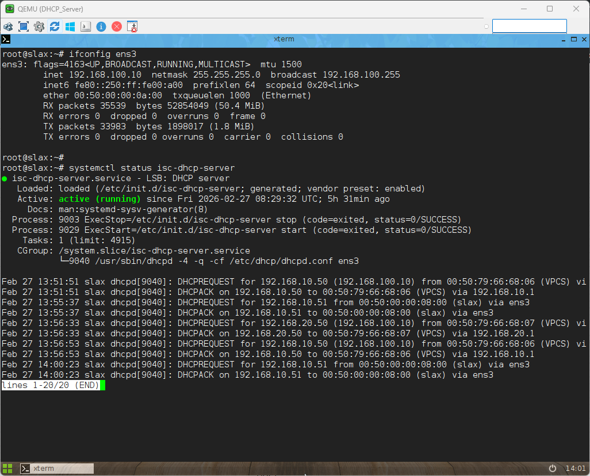
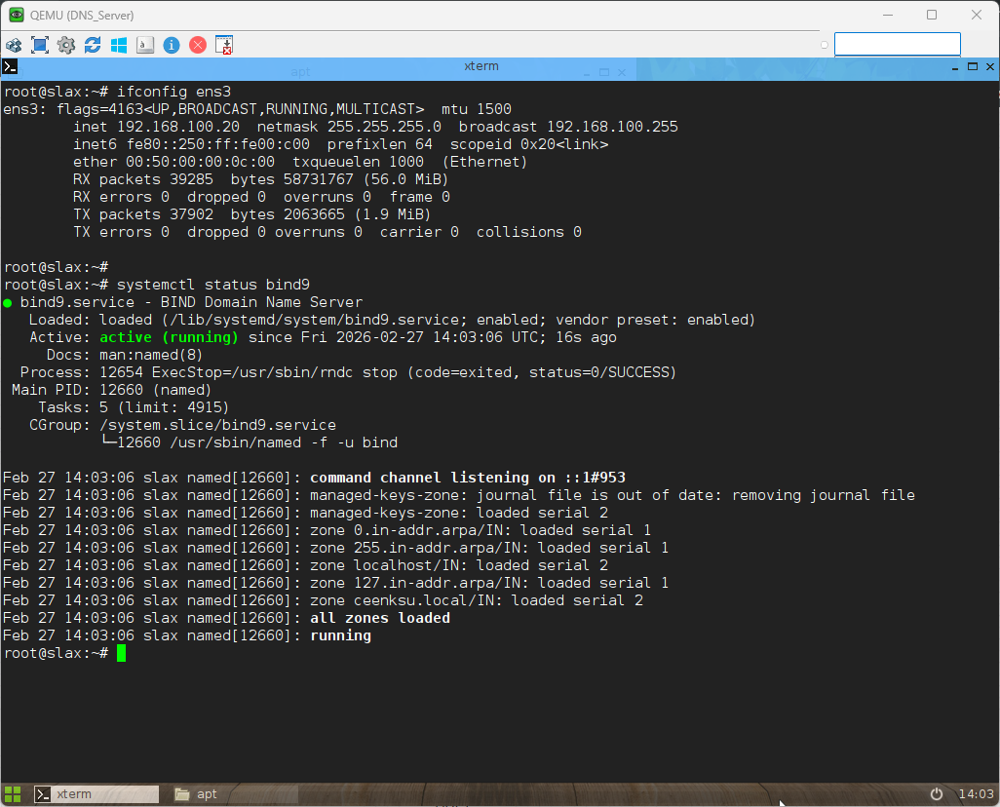
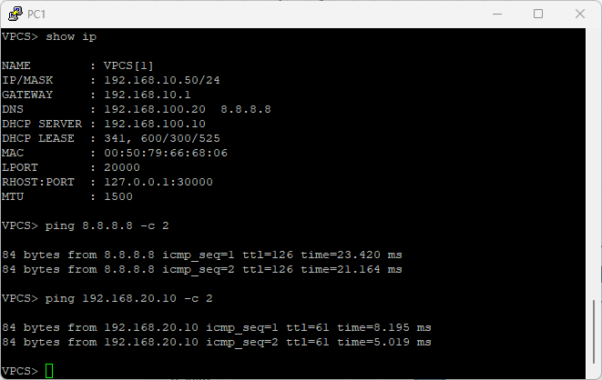
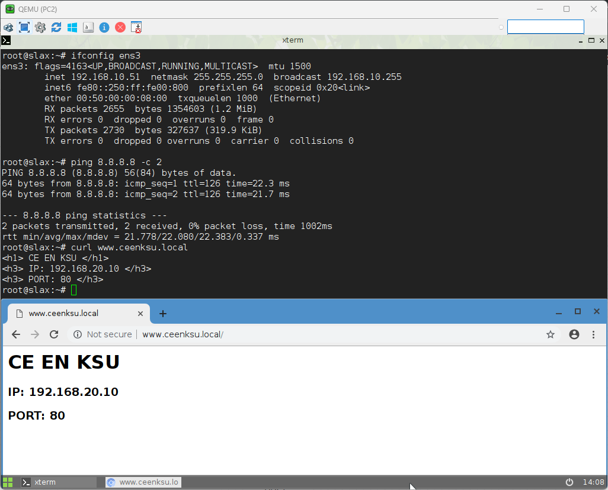
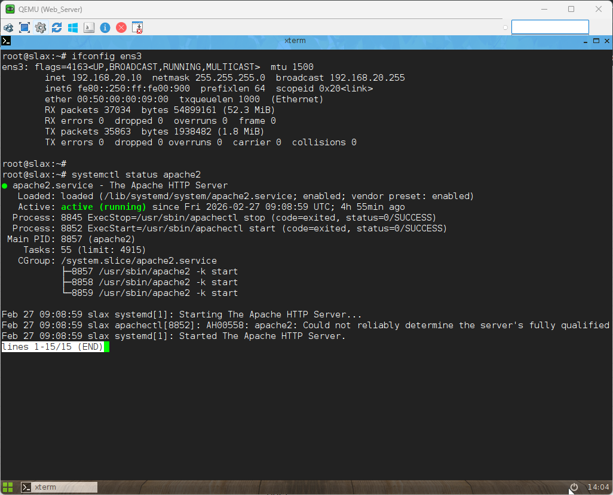
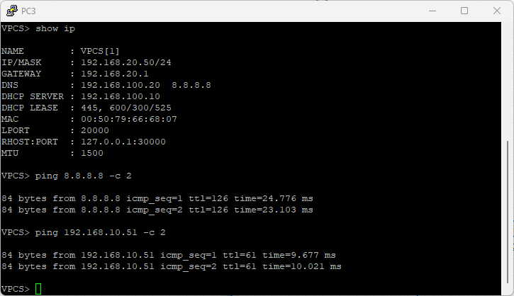
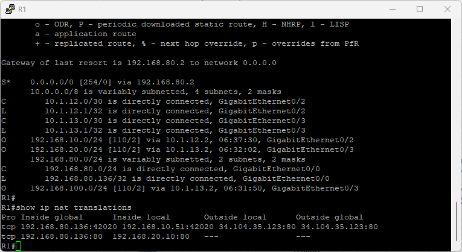
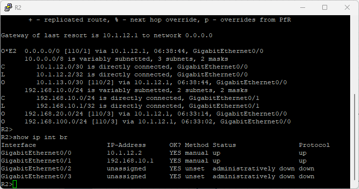
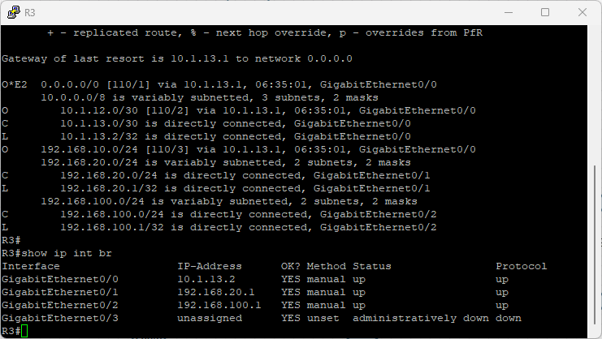

# 🖧 Centralized Linux DHCP & DNS Servers Lab

> Complete hands-on lab covering centralized DHCP and DNS configuration in a multi-site network topology.

## 👤 Author

- [@alfaXphoori](https://www.github.com/alfaXphoori)

---

## 📋 Table of Contents

1. [Lab Objectives](#lab-objectives)
2. [Prerequisites](#prerequisites)
3. [DHCP & DNS Fundamentals](#dhcp--dns-fundamentals)
4. [IP Addressing Plan](#ip-addressing-plan)
5. [Lab Topology](#lab-topology)
6. [Creating the Lab](#creating-the-lab)
7. [Step-by-Step Configuration](#step-by-step-configuration)
8. [Verification & Testing](#verification--testing)
9. [Troubleshooting](#troubleshooting)
10. [Summary & Next Steps](#summary--next-steps)

---

## 🎯 Lab Objectives

> **Purpose:** Master centralized DHCP and DNS configuration for multi-site networks.

### By the end of this lab, you will:

- ✅ Understand DHCP and DNS concepts
- ✅ Configure a centralized Linux DHCP server
- ✅ Configure a centralized Linux DNS server (BIND9)
- ✅ Set up DHCP relay on Cisco routers
- ✅ Integrate DHCP and DNS with NAT port forwarding
- ✅ Test DNS resolution from internal clients
- ✅ Troubleshoot DHCP and DNS issues
- ✅ Combine DHCP, DNS, and NAT in a complete environment

---

## ✅ Prerequisites

> **Purpose:** Ensure you have necessary knowledge and resources.

### Required Knowledge

| Topic | Why It Matters | Reference |
|-------|---------------|-----------|
| **IP Addressing** | DHCP/DNS uses IP addresses | 04_Basic Switch Lab |
| **Router Configuration** | Basic Cisco IOS commands | 08_Basic_Routing Lab |
| **NAT Configuration** | NAT works with DHCP/DNS | 14_NAT_Configuration Lab |

### Required Resources

- ✅ EVE-NG installed and running
- ✅ Cisco router images available (IOSv)
- ✅ Linux VMs for DHCP/DNS servers
- ✅ Access to EVE-NG web interface

---

## 📚 DHCP & DNS Fundamentals

> **Purpose:** Understand DHCP and DNS concepts before configuration.

### What is DHCP?

**Dynamic Host Configuration Protocol (DHCP)** automatically assigns IP addresses and network settings to devices.

**Domain Name System (DNS)** translates human-readable domain names to machine-readable IP addresses.

---

## 🗺️ IP Addressing Plan

### 🗺️ แผนผัง IP Address (IP Addressing Plan)

- **R1 (Edge Router):**
  - Gi0/0: DHCP (WAN)
  - Gi0/2: 10.1.12.1/30 (ต่อกับ R2)
  - Gi0/3: 10.1.13.1/30 (ต่อกับ R3)

- **R2 (Site 1):**
  - Gi0/0: 10.1.12.2/30
  - Gi0/1: 192.168.10.1/24 (Gateway PC1, PC2)

- **R3 (Site 2 & Server Gateway):**
  - Gi0/0: 10.1.13.2/30
  - Gi0/1: 192.168.20.1/24 (Gateway PC3, Web_Server)
  - Gi0/2: 192.168.100.1/24 (Gateway ของวง Server)

- **Servers (เชื่อมผ่าน SW3):**
  - DHCP_Server: 192.168.100.10/24
  - DNS_Server: 192.168.100.20/24

- **Site 2 (เชื่อมผ่าน SW2):**
  - Web_Server: 192.168.20.10/24

---

## 🖼️ Lab Topology

### Official EVE-NG Topology


```
         [Internet]
             |
           [R1]
         /      \
      [R2]    [R3]
      |         |   \
   [SW1]    [SW2]  [SW3]
     |         |         |
   [PC1/2]   [PC3]   [Servers]
```

### Detailed Device Connections
| From Device | Interface | To Device | Interface | IP Subnet |
|-------------|-----------|-----------|-----------|-----------|
| R1 | Gi0/0 | Net | - | DHCP (Internet) |
| R1 | Gi0/2 | R2 | Gi0/0 | 10.1.12.0/30 |
| R1 | Gi0/3 | R3 | Gi0/0 | 10.1.13.0/30 |
| R2 | Gi0/1 | SW1 | - | 192.168.10.0/24 |
| R3 | Gi0/1 | SW2 | - | 192.168.20.0/24 |
| R3 | Gi0/2 | SW3 | - | 192.168.100.0/24 |
| SW1 | Gi0/1 | PC1 | eth0 | DHCP Client |
| SW1 | Gi0/2 | PC2 | eth0 | DHCP Client |
| SW2 | Gi0/1 | PC3 | eth0 | DHCP Client |
| SW3 | Gi0/1 | DHCP_Server | eth0 | DHCP Server |
| SW3 | Gi0/2 | DNS_Server | eth0 | DNS Server |
| SW3 | Gi0/3 | Web_Server | eth0 | Web Server |

---

## 🔧 Creating the Lab

### Step 1: Create a New Lab

1. Log into EVE-NG web interface
2. Click **Add Lab**
3. Enter lab details:
   - **Lab Name**: `Centralized_DHCP_DNS_Lab
   - **Lab Description**: `Centralized Linux DHCP & DNS Servers`
   - **Lab Version**: `1.0`
4. Click **Create**

### Step 2: Add Router Nodes

1. Click **Add Node**
2. Select **Cisco** → **IOSv** (router)
3. Add three routers:
   - **R1** (Edge router with NAT)
   - **R2** (Site 1 router)
   - **R3** (Site 2 router)
4. Click **Save**

### Step 3: Add Switch and PC Nodes

1. Click **Add Node**
2. Add **Switch** (IOSvL2 or unmanaged switch) - SW1, SW2, SW3
3. Add **PC nodes**:
   - **PC1, PC2** (Linux Slax for Site 1)
   - **PC3** (Linux Slax for Site 2)
   - **DHCP_Server** (Linux for DHCP server)
   - **DNS_Server** (Linux for DNS server)
   - **Web_Server** (Linux for web server)
4. Click **Save**

### Step 4: Connect All Devices

Follow the connection list in the [Lab Topology](#lab-topology) section above.

### Step 5: Start All Devices

1. Click **Start All**
2. Wait for devices to boot (1-2 minutes for routers)
3. Verify all devices show "Running" status

---

## 🛠️ Step-by-Step Configuration

### 🔴 1. R1 Configuration (Edge Router & NAT)

```shell
enable
configure terminal
hostname R1

! 1. WAN Interface
interface GigabitEthernet0/0
 ip address dhcp
 ip nat outside
 no shutdown
exit

! 2. Link to R2
interface GigabitEthernet0/2
 ip address 10.1.12.1 255.255.255.252
 ip nat inside
 no shutdown
exit

! 3. Link to R3
interface GigabitEthernet0/3
 ip address 10.1.13.1 255.255.255.252
 ip nat inside
 no shutdown
exit

! 4. NAT Overload & Port Forwarding
access-list 1 permit 192.168.0.0 0.0.255.255
access-list 1 permit 10.0.0.0 0.255.255.255
ip nat inside source list 1 interface GigabitEthernet0/0 overload
ip nat inside source static tcp 192.168.20.10 80 interface GigabitEthernet0/0 80

! 5. OSPF
router ospf 1
 network 10.1.12.0 0.0.0.3 area 0
 network 10.1.13.0 0.0.0.3 area 0
 default-information originate
exit
end
write memory
```

### 🔵 2. R2 Configuration (DHCP Relay Site 1)

```shell
enable
configure terminal
hostname R2

interface GigabitEthernet0/0
 ip address 10.1.12.2 255.255.255.252
 no shutdown
exit

interface GigabitEthernet0/1
 ip address 192.168.10.1 255.255.255.252
 ip helper-address 192.168.100.10
 no shutdown
exit

router ospf 1
 network 10.1.12.0 0.0.0.3 area 0
 network 192.168.10.0 0.0.0.255 area 0
exit
end
write memory
```

### 🟢 3. R3 Configuration (DHCP Relay Site 2 & Server Gateway)

```shell
enable
configure terminal
hostname R3

interface GigabitEthernet0/0
 ip address 10.1.13.2 255.255.255.252
 no shutdown
exit

! Interface to Web Server & PC3
interface GigabitEthernet0/1
 ip address 192.168.20.1 255.255.255.252
 ip helper-address 192.168.100.10
 no shutdown
exit

! Interface to Server Zone
interface GigabitEthernet0/2
 ip address 192.168.100.1 255.255.255.252
 no shutdown
exit

router ospf 1
 network 10.1.13.0 0.0.0.3 area 0
 network 192.168.20.0 0.0.0.255 area 0
 network 192.168.100.0 0.0.0.255 area 0
exit
end
write memory
```

### 🟠 4. Linux DHCP Server Configuration (192.168.100.10)

```shell
# 1. Basic network configuration
ifconfig eth0 192.168.100.10 netmask 255.255.255.0 up
route add default gw 192.168.100.1
echo "nameserver 8.8.8.8" > /etc/resolv.conf

# 2. Install DHCP Server
apt-get update
apt-get install -y isc-dhcp-server

# 3. Configure DHCP Pool
nano /etc/dhcp/dhcpd.conf
# --- Paste this configuration ---
subnet 192.168.100.0 netmask 255.255.255.0 {}

subnet 192.168.10.0 netmask 255.255.255.0 {
  range 192.168.10.50 192.168.10.200;
  option routers 192.168.10.1;
  option domain-name-servers 192.168.100.20, 8.8.8.8;
}

subnet 192.168.20.0 netmask 255.255.255.0 {
  range 192.168.20.50 192.168.20.200;
  option routers 192.168.20.1;
  option domain-name-servers 192.168.100.20, 8.8.8.8;
}

# 4. Set DHCP Server Interface
nano /etc/default/isc-dhcp-server
# --- Edit this line ---
INTERFACESv4="eth0"
INTERFACESv6=""

# 5. Restart DHCP Service
systemctl restart isc-dhcp-server
systemctl enable isc-dhcp-server

# 6. Verify DHCP Server Status
systemctl status isc-dhcp-server

# 7. Troubleshooting Commands
# Check configuration syntax
dhcpd -t -cf /etc/dhcp/dhcpd.conf
# View detailed logs
journalctl -xeu isc-dhcp-server
tail -n 50 /var/log/syslog | grep dhcpd
# View DHCP leases
cat /var/lib/dhcp/dhcpd.leases
```

### 🟣 5. Linux DNS Server Configuration (192.168.100.20)

```shell
# 1. Basic network configuration
ifconfig eth0 192.168.100.20 netmask 255.255.255.0 up
route add default gw 192.168.100.1
echo "nameserver 8.8.8.8" > /etc/resolv.conf

# 2. Install BIND9 DNS Server
apt-get update
apt-get install -y bind9 bind9utils dnsutils

# 3. Configure Zone File
nano /etc/bind/named.conf.local
# --- Add this zone ---
zone "ceenksu.local" {
    type master;
    file "/etc/bind/db.ceenksu.local";
};

# 4. Create Zone Database
nano /etc/bind/db.ceenksu.local
# --- Paste this configuration ---
$TTL    604800
@       IN      SOA     ns.ceenksu.local. admin.ceenksu.local. (
                  2         ; Serial
             604800         ; Refresh
              86400         ; Retry
            2419200         ; Expire
             604800 )       ; Negative Cache TTL
;
@       IN      NS      ns.ceenksu.local.
ns      IN      A       192.168.100.20
www     IN      A       192.168.20.10

# 5. Restart BIND9 Service
systemctl restart bind9
systemctl enable bind9

# 6. Verify DNS Server Status
systemctl status bind9
```

### 🟡 6. Web Server Configuration (192.168.20.10)

```shell
# 1. Basic network configuration
ifconfig eth0 192.168.20.10 netmask 255.255.255.0 up
route add default gw 192.168.20.1
echo "nameserver 8.8.8.8" > /etc/resolv.conf

# 2. Install Apache Web Server
apt-get update
apt-get install -y apache2

# 3. Create default web page
nano /var/www/html/index.html
# --- Paste this content ---
<h1>CE EN KSU</h1><h3>IP: 192.168.20.10 | Port: 80</h3>

# 4. Start Apache Service
systemctl start apache2
systemctl enable apache2

# 5. Verify Web Server Status
systemctl status apache2
```

---

## 🔎 Verification & Testing

### 1. Verify DHCP Server Status
```bash
# On DHCP_Server
systemctl status isc-dhcp-server
```

### 2. Verify DNS Server Status
```bash
# On DNS_Server
systemctl status bind9
```

### 3. Test Client IP & DNS Configuration
```bash
# On PC1/PC2/PC3
dhclient -r ens3
dhclient ens3
ifconfig ens3
cat /etc/resolv.conf
```

### 4. Test Web Server via DNS
```bash
# On PC1/PC2/PC3
curl http://www.ceenksu.local
```

### 5. Test Internet Connectivity
```bash
# On PC1/PC2/PC3
ping -c 2 8.8.8.8
```

---

## 📊 Lab Test Results & Screenshots

### 1. DHCP Server Status

```bash
root@slax:~# systemctl status isc-dhcp-server
● isc-dhcp-server.service - LSB: DHCP server
   Loaded: loaded (/etc/init.d/isc-dhcp-server; generated; vendor preset: enabled)
   Active: active (running) since Fri 2026-02-27 08:29:32 UTC; 5h 31min ago
```

### 2. DNS Server Status (BIND9)

```bash
root@slax:~# systemctl status bind9
● bind9.service - BIND Domain Name Server
   Loaded: loaded (/lib/systemd/system/bind9.service; enabled; vendor preset: enabled)
   Active: active (running) since Fri 2026-02-27 14:03:06 UTC; 16s ago
Feb 27 14:03:06 slax named[12660]: all zones loaded
Feb 27 14:03:06 slax named[12660]: running
```

### 3. PC1 IP Configuration (Site 1)

```bash
VPCS> show ip
NAME            : VPCS[1]
IP/MASK         : 192.168.10.50/24
GATEWAY         : 192.168.10.1
DNS             : 192.168.100.20  8.8.8.8
DHCP SERVER     : 192.168.100.10
```

### 4. PC2 Web Test & Browser Access


```bash
root@slax:~# curl www.ceenksu.local
<h1>CE EN KSU</h1><h3>IP: 192.168.20.10 | Port: 80</h3>
```

### 5. PC3 IP Configuration (Site 2)

```bash
VPCS> show ip
NAME            : VPCS[1]
IP/MASK         : 192.168.20.50/24
GATEWAY         : 192.168.20.1
DNS             : 192.168.100.20  8.8.8.8
DHCP SERVER     : 192.168.100.10
```

### 6. R1 Routing & NAT Translations


```bash
R1# show ip route
S*      0.0.0.0/0 [254/0] via 192.168.80.2
        10.0.0.0/8 is variably subnetted, 4 subnets, 2 masks
C        10.1.12.0/30 is directly connected, GigabitEthernet0/2
L        10.1.12.1/32 is directly connected, GigabitEthernet0/2
C        10.1.13.0/30 is directly connected, GigabitEthernet0/3
L        10.1.13.1/32 is directly connected, GigabitEthernet0/3
O        192.168.10.0/24 [110/2] via 10.1.12.2, 06:37:30, GigabitEthernet0/2
O        192.168.20.0/24 [110/2] via 10.1.13.2, 06:32:02, GigabitEthernet0/3
C        192.168.80.0/24 is directly connected, GigabitEthernet0/0
L        192.168.80.136/32 is directly connected, GigabitEthernet0/0
O        192.168.100.0/24 [110/2] via 10.1.13.2, 06:31:50, GigabitEthernet0/3

R1# show ip nat translations
Pro Inside global         Inside local          Outside local         Outside global
tcp 192.168.80.136:42020 192.168.10.51:42020 34.104.35.123:80 34.104.35.123:80
tcp 192.168.80.136:80    192.168.20.10:80     ---                   ---
```

### 7. R2 Interface Status

```bash
R2> show ip int br
Interface                  IP-Address      OK? Method Status                Protocol
GigabitEthernet0/0         10.1.12.2       YES manual up                    up
GigabitEthernet0/1         192.168.10.1    YES manual up                    up
GigabitEthernet0/2         unassigned      YES unset  administratively down down
GigabitEthernet0/3         unassigned      YES unset  administratively down down
```

### 8. R3 Interface Status

```bash
R3# show ip int br
Interface                  IP-Address      OK? Method Status                Protocol
GigabitEthernet0/0         10.1.13.2       YES manual up                    up
GigabitEthernet0/1         192.168.20.1    YES manual up                    up
GigabitEthernet0/2         192.168.100.1   YES manual up                    up
GigabitEthernet0/3         unassigned      YES unset  administratively down down
```

### 9. Web Server Status

```bash
root@slax:~# systemctl status apache2
● apache2.service - The Apache HTTP Server
   Loaded: loaded (/lib/systemd/system/apache2.service; enabled; vendor preset: enabled)
   Active: active (running) since Fri 2026-02-27 09:08:59 UTC; 4h 55min ago
```

---

## 🛠️ Troubleshooting

### Issue 1: DHCP Server Not Responding

**Symptoms:** Clients cannot get IP addresses.

**Checklist:**
```bash
# On DHCP Server
systemctl status isc-dhcp-server
journalctl -xeu isc-dhcp-server
```

---

### Issue 2: DNS Server Not Responding

**Symptoms:** Clients cannot resolve domain names.

**Checklist:**
```bash
# On DNS Server
systemctl status bind9
named-checkconf
```

---

### Issue 3: OSPF Neighbors Not Forming

**Symptoms:** Routers cannot reach each other.

**Checklist:**
```bash
# On each router
show ip ospf neighbor
show ip route
```

---

## 🎓 Practice Exercises

**Exercise 1: Basic Centralized DHCP & DNS Setup
- Configure centralized DHCP and DNS servers
- Verify clients receive correct IP and DNS settings
- Test DNS resolution and web access

**Exercise 2: Additional DNS Records
- Add more DNS records for additional services
- Test reverse DNS lookups

**Exercise 3: Troubleshooting Lab
- Intentionally break a configuration
- Use verification commands to identify and fix the issue

---

## 📝 Summary & Next Steps

### What You Learned

✅ **DHCP & DNS Fundamentals**
- Centralized DHCP and DNS configuration
- DHCP relay on Cisco routers
- DNS record types and zone files

✅ **Network Integration**
- DHCP-DNS integration
- NAT and DNS compatibility

✅ **Troubleshooting**
- Verification commands for DHCP and DNS
- Common issues and fixes

---

### Key Commands Reference

```bash
# DHCP Server
systemctl status isc-dhcp-server
dhcpd -t -cf /etc/dhcp/dhcpd.conf

# DNS Server
systemctl status bind9
named-checkconf
named-checkzone <zone> <file>

# DNS Verification
nslookup <domain>
host <domain>
dig <domain>

# Network Verification
show ip route
show ip ospf neighbor
ifconfig eth0
route -n
```

---

### What's Next?

**Recommended progression:**

```
You completed: Lab 16 - Centralized Linux DHCP & DNS Servers ✓

Next labs:
├─ Lab 17: Integrated Services (4-5h)
│  └─ Combine DHCP, DNS, NAT in one environment
│
├─ Lab 18: Firewall Configuration (4-5h)
│  └─ Add security policies to your network
│
└─ TIER 1 Complete → Job Ready! 🎉
```

**Career Impact:**
- ✅ DHCP & DNS are ESSENTIAL skills for any network role
- ✅ Used in 100% of enterprise networks
- ✅ Interview question staple
- ✅ Daily task for network engineers

---

## 📞 Additional Resources

- [BIND9 Documentation](https://bind9.readthedocs.io/)
- [Cisco DHCP Configuration Guide](https://www.cisco.com/c/en/us/support/docs/ip/dynamic-host-configuration-protocol-dhcp/116099-configdhcp-00.html)
- [RFC 2131 - Dynamic Host Configuration Protocol](https://tools.ietf.org/html/rfc2131)
- [RFC 1034 - DOMAIN NAMES - CONCEPTS AND FACILITIES](https://tools.ietf.org/html/rfc1034)

---

**Remember:** Always validate your DHCP and DNS configurations before restarting services!🚀