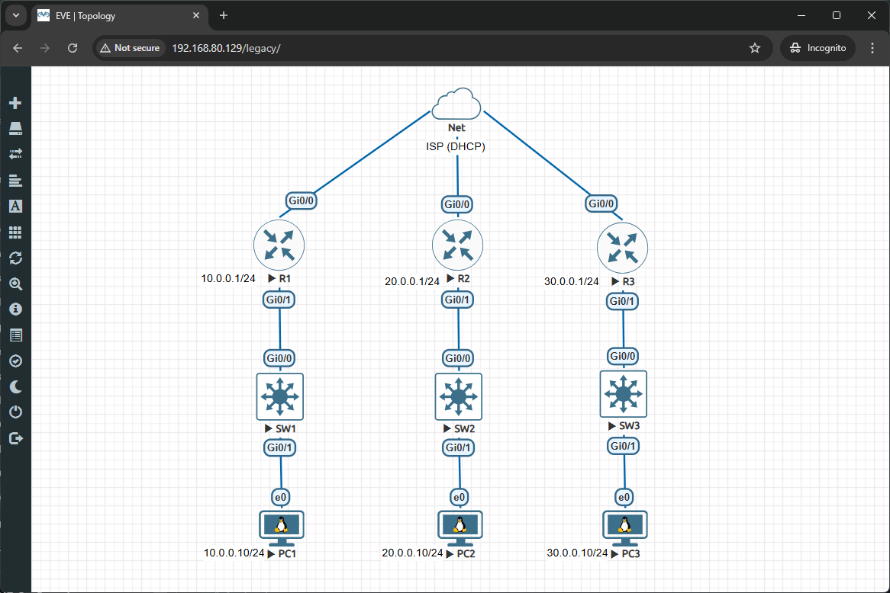
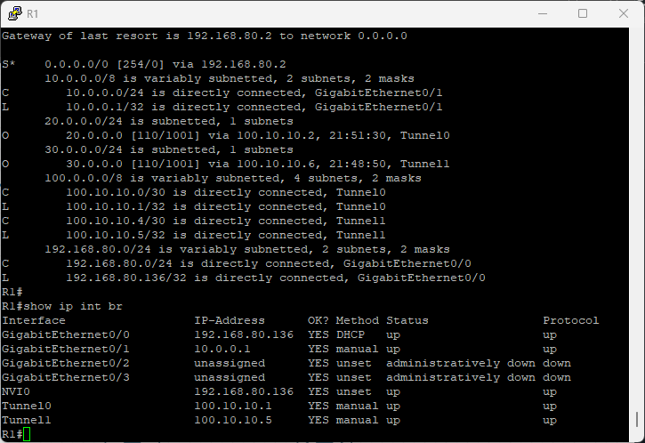
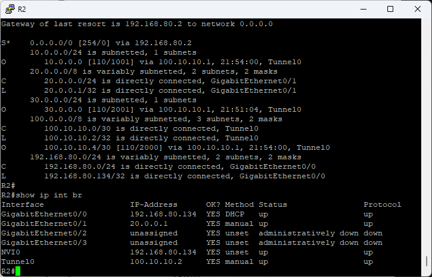
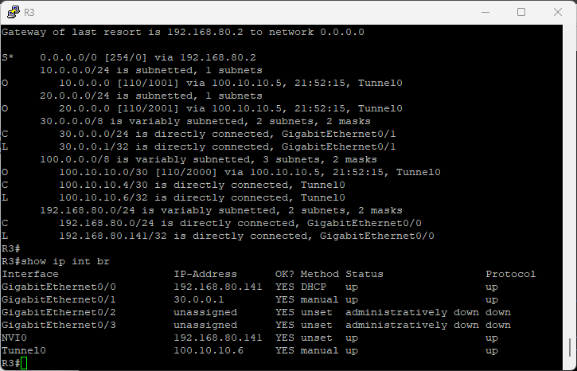
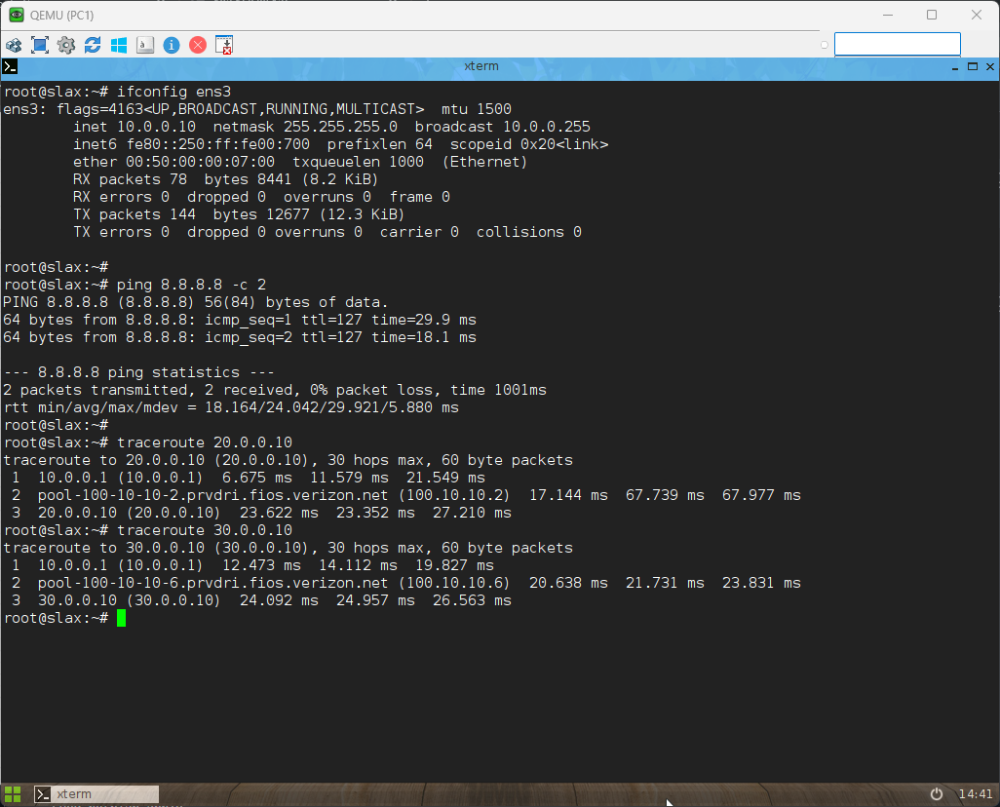
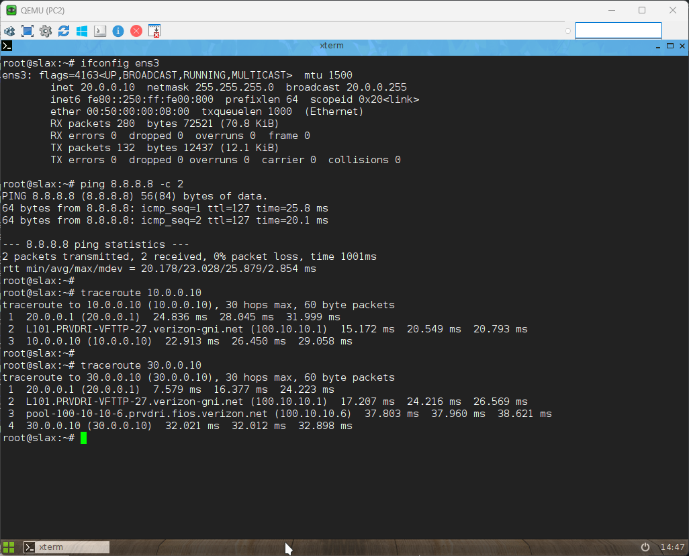
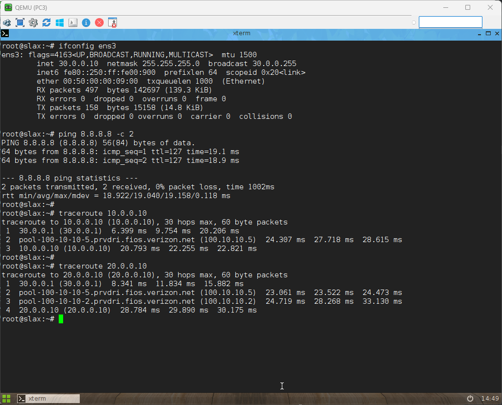

# 🛜 Hub-and-Spoke VPN over DHCP WAN (NAT Exemption & GRE Tunnel) Lab

> Complete hands-on lab to configure Hub-and-Spoke VPN with GRE tunnels, DHCP WAN, NAT PAT, and NAT exemption for split tunnel VPN.

## 👤 Author

- [@alfaXphoori](https://www.github.com/alfaXphoori)

---

## 📋 Table of Contents

1. [Lab Objectives](#lab-objectives)
2. [Prerequisites](#prerequisites)
3. [Lab Topology & IP Plan](#lab-topology--ip-plan)
4. [Basic Device Configuration (ISP DHCP & LAN)](#basic-device-configuration-isp-dhcp--lan)
5. [NAT Configuration & NAT Exemption](#nat-configuration--nat-exemption)
6. [Verify WAN IP Addresses](#verify-wan-ip-addresses)
7. [GRE Tunnel & OSPF Configuration](#gre-tunnel--ospf-configuration)
8. [Verification & Testing](#verification--testing)
9. [Troubleshooting](#troubleshooting)
10. [Summary & Next Steps](#summary--next-steps)

---

## 🎯 Lab Objectives (Advanced Objectives)

> **Purpose:** Configure hub-and-spoke VPN with DHCP WAN, NAT exemption, and OSPF over GRE tunnels.

By the end of this lab, you will:
- ✅ Configure routers to receive public IP addresses automatically via DHCP from ISP
- ✅ Enable PAT (NAT Overload) for Internet access from local LANs
- ✅ Configure NAT Exemption (Split Tunnel) using Access Lists to prevent VPN traffic from being NATted
- ✅ Create Hub-and-Spoke GRE Tunnels with R1 as the Hub connecting to R2 and R3 (Spokes)
- ✅ Run OSPF over the tunnel interfaces to advertise all subnets across the VPN
- ✅ Verify end-to-end connectivity between remote sites and Internet access

---

## ✅ Prerequisites

> **Purpose:** Ensure you have all necessary knowledge and resources.

### Required Knowledge
| Topic | Why It Matters | Reference |
|-------|---------------|---------|
| Cisco IOS Basic Configuration | Navigate and configure router interfaces | Previous labs |
| NAT Configuration | Understand PAT and inside/outside interfaces | 14_NAT_Configuration lab |
| OSPF Routing | Basic OSPF area and network configuration | 10_OSPF_Lab lab |
| Access Lists | Filter traffic and define NAT exemption rules | 13_ACL_Security lab |

### Required Equipment
- 3x Cisco IOS Routers (R1, R2, R3)
- 3x Cisco Switches (SW1, SW2, SW3)
- 3x Virtual PCs (PC1, PC2, PC3)
- 1x ISP DHCP Cloud (Internet Cloud)
- All necessary Ethernet cables

---

## 🗺️ Lab Topology & IP Plan

```
[ ISP (DHCP Cloud) ]
              /         |          \
        (Gi0/0)      (Gi0/0)      (Gi0/0)
         [ R1 ]       [ R2 ]       [ R3 ]
    (Site 1 - Hub)  (Site 2)     (Site 3)
          | Gi0/1      | Gi0/1      | Gi0/1
    10.0.0.1/24    20.0.0.1/24  30.0.0.1/24
          |            |            |
       [ SW1 ]      [ SW2 ]      [ SW3 ]
          |            |            |
       [ PC1 ]      [ PC2 ]      [ PC3 ]
     10.0.0.10    20.0.0.10    30.0.0.10
```



**Tunnel IPs:**
- R1 <-> R2 : 100.10.10.0/30 (R1=.1, R2=.2)
- R1 <-> R3 : 100.10.10.4/30 (R1=.5, R3=.6)

---

## 🔴 1. Basic Device Configuration (ISP DHCP & LAN)

We will configure the WAN interface to receive IP from ISP via DHCP, and set up the local LAN interfaces.

### At R1 (Site 1 - Hub):

```ios
enable
configure terminal
hostname R1

no router ospf 1

! ตั้งค่า WAN รับ IP จาก ISP อัตโนมัติ
interface GigabitEthernet0/0
 ip address dhcp
 no shutdown
exit

! ตั้งค่า LAN
interface GigabitEthernet0/1
 ip address 10.0.0.1 255.255.255.0
 no shutdown
exit
```

### At R2 (Site 2 - Spoke 1):

```ios
enable
configure terminal
hostname R2

no router ospf 1

interface GigabitEthernet0/0
 ip address dhcp
 no shutdown
exit

interface GigabitEthernet0/1
 ip address 20.0.0.1 255.255.255.0
 no shutdown
exit
```

### At R3 (Site 3 - Spoke 2):

```ios
enable
configure terminal
hostname R3

no router ospf 1

interface GigabitEthernet0/0
 ip address dhcp
 no shutdown
exit

interface GigabitEthernet0/1
 ip address 30.0.0.1 255.255.255.0
 no shutdown
exit
```

---

## 🟡 2. NAT Configuration & NAT Exemption

Switches will act as simple L2 switches (no special configuration needed). We will configure NAT on routers to allow Internet access, and use ACLs to exempt VPN traffic from NAT.

### At R1 (Site 1):
```ios
interface GigabitEthernet0/0
 ip nat outside
exit
interface GigabitEthernet0/1
 ip nat inside
exit

! ห้ามทำ NAT ถ้าปลายทางคือวง 20.x หรือ 30.x (ให้ผ่านเข้า VPN)
ip access-list extended ACL_NAT_SITE1
 deny   ip 10.0.0.0 0.0.0.255 20.0.0.0 0.0.0.255
 deny   ip 10.0.0.0 0.0.0.255 30.0.0.0 0.0.0.255
 permit ip 10.0.0.0 0.0.0.255 any                     
exit

ip nat inside source list ACL_NAT_SITE1 interface GigabitEthernet0/0 overload
```

### At R2 (Site 2):
```ios
interface GigabitEthernet0/0
 ip nat outside
exit
interface GigabitEthernet0/1
 ip nat inside
exit

! ห้ามทำ NAT ถ้าปลายทางคือวง 10.x หรือ 30.x
ip access-list extended ACL_NAT_SITE2
 deny   ip 20.0.0.0 0.0.0.255 10.0.0.0 0.0.0.255
 deny   ip 20.0.0.0 0.0.0.255 30.0.0.0 0.0.0.255
 permit ip 20.0.0.0 0.0.0.255 any
exit

ip nat inside source list ACL_NAT_SITE2 interface GigabitEthernet0/0 overload
```

### At R3 (Site 3):
```ios
interface GigabitEthernet0/0
 ip nat outside
exit
interface GigabitEthernet0/1
 ip nat inside
exit

! ห้ามทำ NAT ถ้าปลายทางคือวง 10.x หรือ 20.x
ip access-list extended ACL_NAT_SITE3
 deny   ip 30.0.0.0 0.0.0.255 10.0.0.0 0.0.0.255
 deny   ip 30.0.0.0 0.0.0.255 20.0.0.0 0.0.0.255
 permit ip 30.0.0.0 0.0.0.255 any
exit

ip nat inside source list ACL_NAT_SITE3 interface GigabitEthernet0/0 overload
```

---

## 🔍 3. Verify WAN IP Addresses

Since the WAN interface receives IP via DHCP, you need to check the public IP address of each router before configuring the VPN.

On each router, run:
```ios
show ip interface brief
```

Take note of the public IP address of `GigabitEthernet0/0` for R1, R2, and R3 - you will need this for the GRE tunnel configuration.

---

## 🟢 4. GRE Tunnel & OSPF Configuration

### At R1 (Hub):
R1 will have 2 tunnel interfaces to connect to both R2 and R3:
```ios
! Tunnel 0 (ไปหา R2)
interface Tunnel0
 ip address 100.10.10.1 255.255.255.252
 tunnel source GigabitEthernet0/0
 tunnel destination [IP_WAN_ของ_R2]    <--- เปลี่ยนเป็น IP จริงที่เช็คมา
exit

! Tunnel 1 (ไปหา R3)
interface Tunnel1
 ip address 100.10.10.5 255.255.255.252
 tunnel source GigabitEthernet0/0
 tunnel destination [IP_WAN_ของ_R3]    <--- เปลี่ยนเป็น IP จริงที่เช็คมา
exit

! รัน OSPF คลุมทั้งหมด
router ospf 1
 router-id 1.1.1.1
 network 100.10.10.0 0.0.0.255 area 0
 network 10.0.0.0 0.0.0.255 area 0
exit
```

### At R2 (Spoke 1):
Only 1 tunnel interface back to R1:
```ios
interface Tunnel0
 ip address 100.10.10.2 255.255.255.252
 tunnel source GigabitEthernet0/0
 tunnel destination [IP_WAN_ของ_R1]    <--- เปลี่ยนเป็น IP จริงที่เช็คมา
exit

router ospf 1
 router-id 2.2.2.2
 network 100.10.10.0 0.0.0.255 area 0
 network 20.0.0.0 0.0.0.255 area 0
exit
```

### At R3 (Spoke 2):
Only 1 tunnel interface back to R1:
```ios
interface Tunnel0
 ip address 100.10.10.6 255.255.255.252
 tunnel source GigabitEthernet0/0
 tunnel destination [IP_WAN_ของ_R1]    <--- เปลี่ยนเป็น IP จริงที่เช็คมา
exit

router ospf 1
 router-id 3.3.3.3
 network 100.10.10.0 0.0.0.255 area 0
 network 30.0.0.0 0.0.0.255 area 0
exit
```

---

## ✅ 5. Verification & Testing

### Configure PC IP Addresses
On each PC, open the terminal and run these commands:
- **PC1 (Site 1):**
  
  ```bash
  ifconfig eth0 10.0.0.10 netmask 255.255.255.0 up
  route add default gw 10.0.0.1
  ```
- **PC2 (Site 2):**
  
  ```bash
  ifconfig eth0 20.0.0.10 netmask 255.255.255.0 up
  route add default gw 20.0.0.1
  ```
- **PC3 (Site 3):**
  
  ```bash
  ifconfig eth0 30.0.0.10 netmask 255.255.255.0 up
  route add default gw 30.0.0.1
  ```

### Test Internet Access
From any PC (PC1, PC2, PC3), ping Google's public DNS to verify NAT is working:
```bash
ping 8.8.8.8
```
You should see successful replies if Internet access is configured correctly.

### Test VPN Connectivity Between Remote Sites
From **PC2 (Site 2)**, ping PC3 (Site 3) to verify the VPN tunnel is working:
```bash
ping -c 4 30.0.0.10
```

### Verify Tunnel Path with Traceroute
To confirm traffic is going through the VPN tunnel (not directly over the Internet), run traceroute from PC2 to PC3:
```bash
traceroute 30.0.0.10
```
The output should show hops through the tunnel subnets (e.g., 100.10.10.1, 100.10.10.6) instead of public ISP IP addresses.

---

## ❌ Troubleshooting

1. **Cannot get DHCP IP on WAN interface:**
   - Verify the interface is not shutdown (`no shutdown`)
   - Check that the ISP cloud is connected correctly
   - Run `debug ip dhcp client` to troubleshoot DHCP issues

2. **NAT not working for Internet access:**
   - Verify inside/outside interface configuration with `show ip nat translations`
   - Check that the ACL is correctly excluding VPN subnets

3. **VPN tunnel not coming up:**
   - Verify the tunnel destination IP matches the remote router's public WAN IP
   - Check that OSPF is advertising the tunnel subnets with `show ip ospf neighbor`
   - Verify GRE tunnel is up with `show interface tunnel0`

4. **No connectivity between remote sites:**
   - Check that OSPF routes are present with `show ip route ospf`
   - Verify that NAT exemption is correctly configured

---

## 📝 Summary & Next Steps

In this lab, you successfully configured:
- DHCP WAN interfaces on all routers to receive public IP addresses automatically
- PAT NAT for Internet access from local LANs
- NAT Exemption (Split Tunnel) to prevent VPN traffic from being NATted
- Hub-and-Spoke GRE tunnels with R1 as the central hub
- OSPF over the tunnel interfaces to advertise all subnets across the VPN
- Verified end-to-end connectivity between remote sites and Internet access

### Next Steps
- Try configuring IPsec encryption for GRE tunnels to add security
- Experiment with different OSPF area designs
- Add additional spoke sites to the hub router