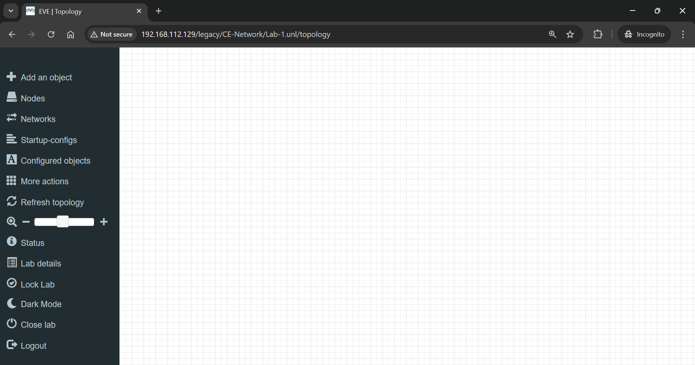
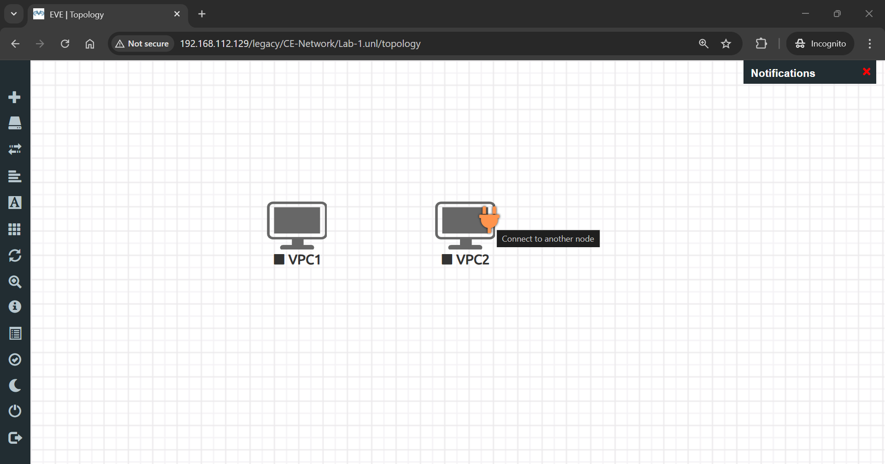
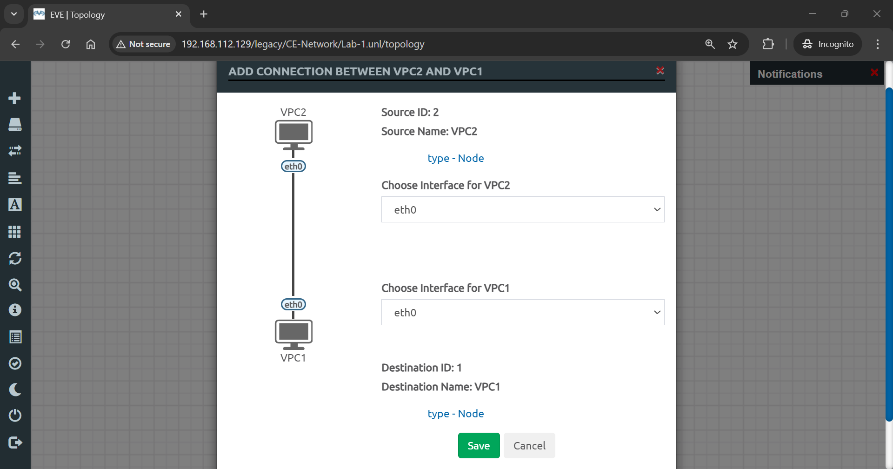

## EVE-NG Web Gui
1. Main shows the file manager
- 

2. Management shows the User management
    - You can add and delete use on this.
- 

3. System shows the system status & log
    - You can stop all nodes on this.
- 

4. Information shows the information of EVE-NG
- 

## Create Node
1. Add Folder
    - Enter the folder name and add it.
- 

2. Add New Lab
    - Enter the CE-Network and click the 'Add New Lab' icon.
- 
    - Add lab information.
- 
    - Finish Adding the Lab.
- 

3. Add New Object
    - Right-click and choose 'Node'.
- 
    - Choose 'Virtual PC'.
- 
    - Config Node. You can change the node name, icon, and number of nodes.
- 
    - Now you can see two pc on display.
- 
    - Connect two PCs by clicking the orange plug and dropping it on the other PC.
- 
    - If you are successful, the configuration connection page will pop up, and you can choose an interface to connect between VPCs.
- 
    - You can add text, shapes, and pictures by right-clicking and selecting the icon
- 
    - Start the VPC by right-clicking and selecting 'Start'.
- 
    - Click the VPC icon to remote into the VPC. A pop-up will appear, allowing you to click 'Open SSH'.
- 
    - Now, you have remotely connected to the VPC via PuTTY. You can configure the IP address using the following code.
```bash
ip 192.168.1.101 255.255.255.0 192.168.1.1
```
- 
    - Now, you can verify the connectivity between the two VPCs using ping.
```bash
ping 192.168.1.101
```
- 
    - Once you finish the lab, stop the VPC and close it.
- 