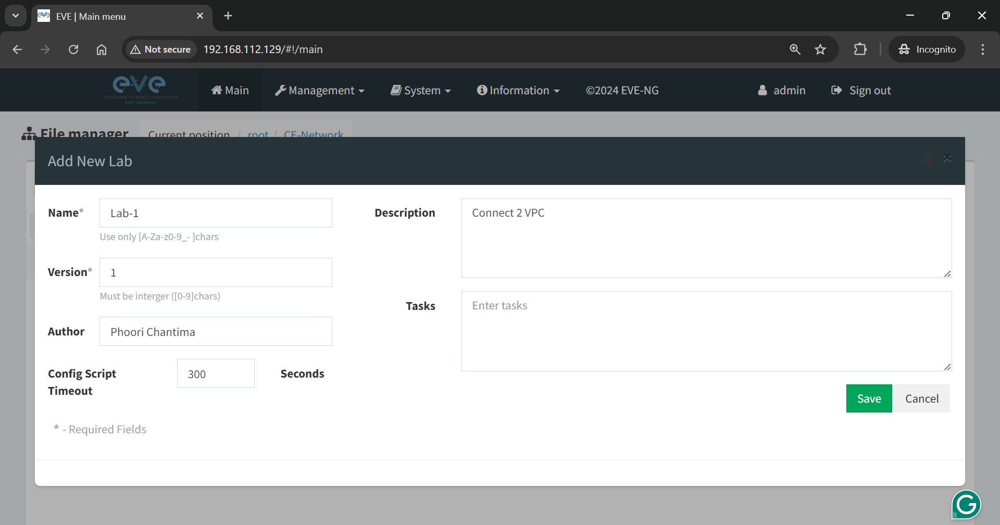
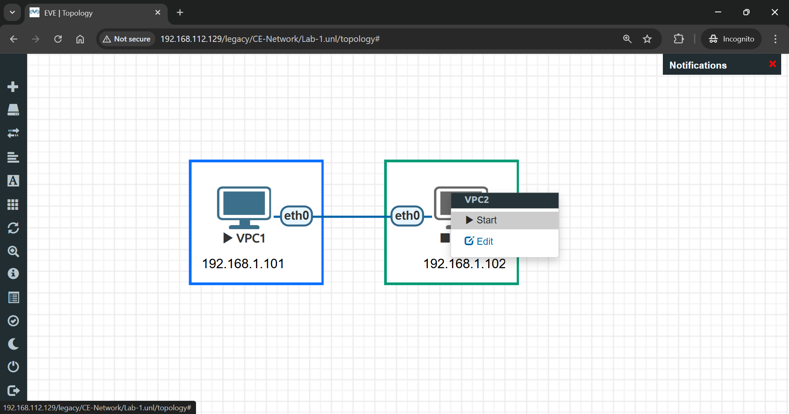
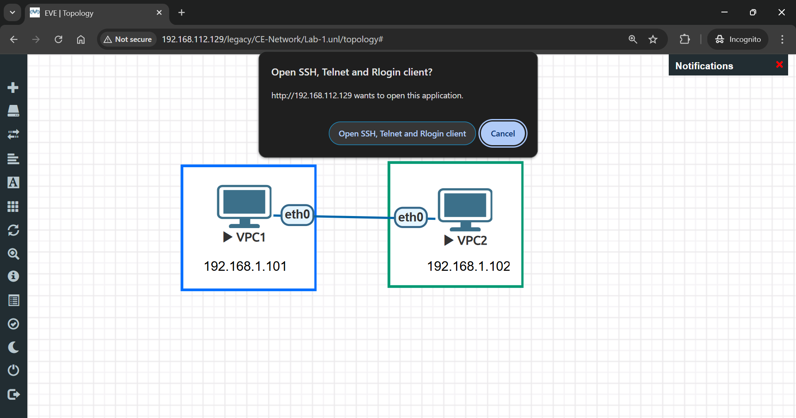

## 🌐 EVE-NG Web GUI

### 🔹 1. Main - File Manager
- Displays the **file manager** for managing labs and configurations.
- 

### 🔹 2. Management - User Management
- Add and delete users in **User Management**.
- 

### 🔹 3. System - Status & Logs
- View **system status** and logs.
- Stop all running nodes from this panel.
- 

### 🔹 4. Information - EVE-NG Details
- Displays **EVE-NG system information**.
- 

---

## 🛠 Create Node in EVE-NG

### 🔹 1. Add Folder
- Enter the **folder name** and add it.
- 

### 🔹 2. Add New Lab
1️⃣ Enter **CE-Network** and click **'Add New Lab'**.
- 
2️⃣ Fill in the **lab information**.
- 
3️⃣ Finish **adding the lab**.
- 

### 🔹 3. Add New Object (Node)
1️⃣ Right-click and select **'Node'**.
- 
2️⃣ Choose **'Virtual PC'**.
- 
3️⃣ Configure the node (change name, icon, and number of nodes).
- 
4️⃣ Two Virtual PCs should now be displayed.
- 
5️⃣ Connect **two PCs** by clicking the **orange plug** and dropping it on the other PC.
- 
6️⃣ A **configuration connection page** will pop up. Choose an interface to connect between VPCs.
- 

### 🎨 Customization
- Add **text, shapes, and pictures** by right-clicking and selecting the corresponding icon.
- 

### 🔹 4. Start & Connect to Virtual PCs
1️⃣ Start the VPC by **right-clicking and selecting 'Start'**.
- 
2️⃣ Click the **VPC icon** to open a **remote session**.
- A **pop-up** will appear, allowing you to click **'Open SSH'**.
- 

### 🔹 5. Configure VPC IP Address
```bash
ip 192.168.1.101 255.255.255.0 192.168.1.1
```
- 

### 🔹 6. Verify Connectivity
- **Ping the other VPC** to test the connection.
```bash
ping 192.168.1.101
```
- 

### 🔹 7. Stop and Close the Lab
- Once you finish the lab, **stop the VPC and close it**.
- 

✅ **Lab setup and verification completed successfully!** 🚀
