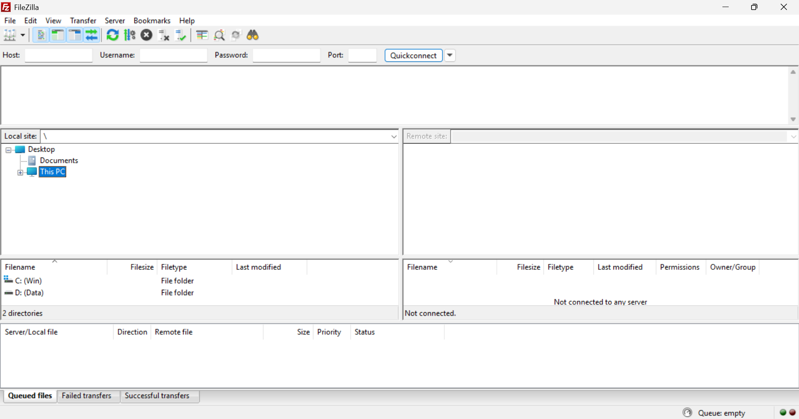
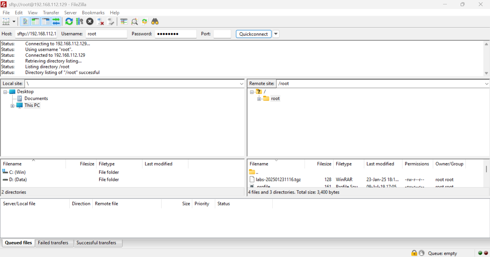
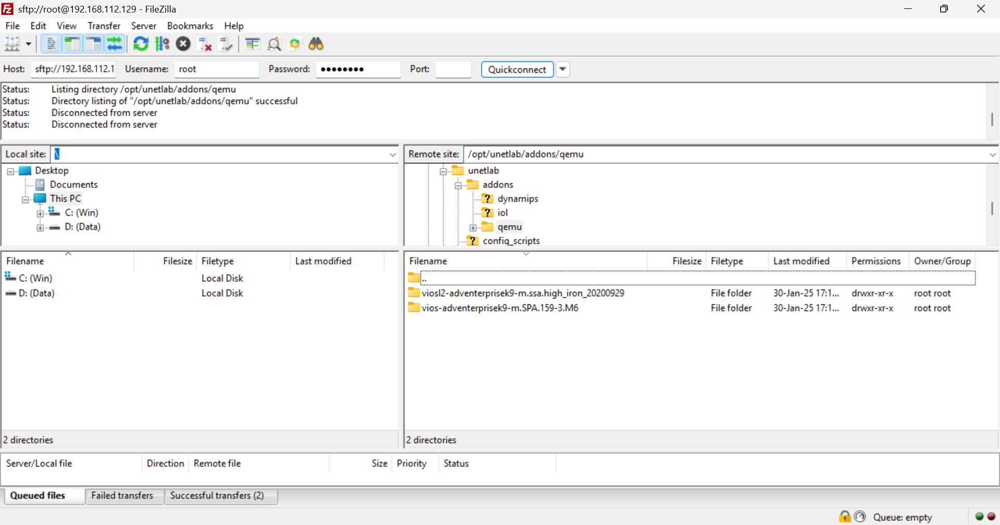
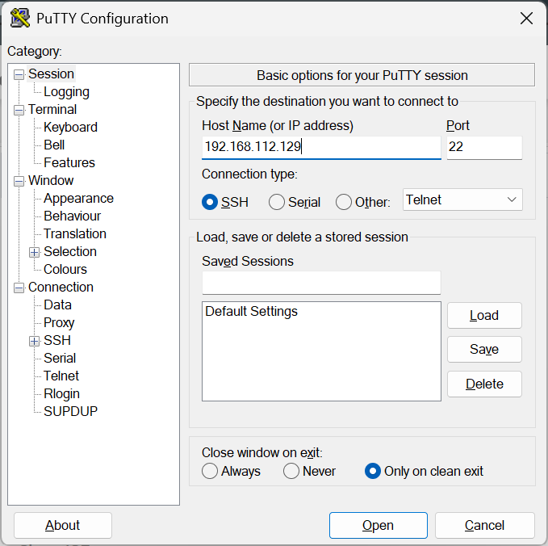
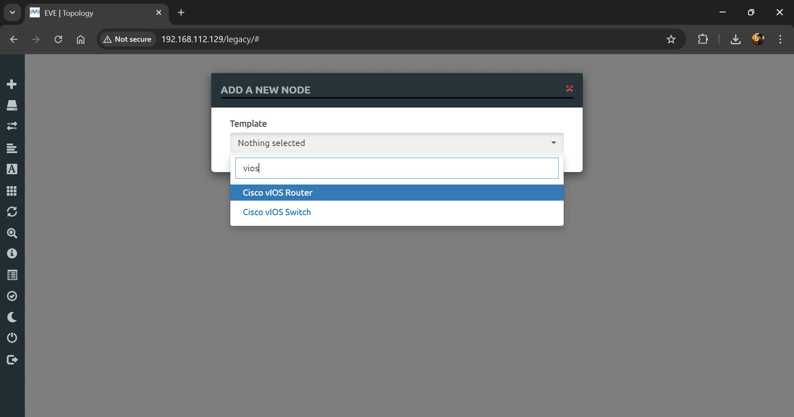

## 🖧 Add Router & Switch

### 🔹 1. Download & Install FTP Software
- 🔗 [FileZilla](https://filezilla-project.org)
- 

### 🔹 2. Connect to EVE-NG Server via FTP
- Use the **IP address** to connect to the EVE-NG server on **port 22**.
- 

### 🔹 3. Download & Unzip Router and Switch Files
- 📥 [Download Files](https://drive.google.com/drive/folders/1-PfBdcoa2BJnFKN_nMBsjHqRNQ2H4avU?usp=sharing)

### 🔹 4. Upload Files to the EVE-NG Server
1️⃣ Navigate to the **Dynamips Directory** on the remote site.
```bash
/opt/unetlab/addons/qemu
```
2️⃣ Drag and drop the **router & switch files**.
- 

### 🔹 5. Connect to EVE-NG Server via SSH (Using PuTTY)
1️⃣ Open **PuTTY** and enter the EVE-NG **IP address**.
- 
2️⃣ Log in and execute the following command:
```bash
/opt/unetlab/wrappers/unl_wrapper -a fixpermissions
```
- 

### 🔹 6. Verify Successful Installation
1️⃣ Open your **browser**, enter the **EVE-NG IP address**, and connect to the **EVE-NG site**.
2️⃣ Click **'Add New Node'** and verify that **Cisco IOL and IOS** are highlighted in **blue**.
- 

✅ **Installation and configuration are complete!** 🚀
