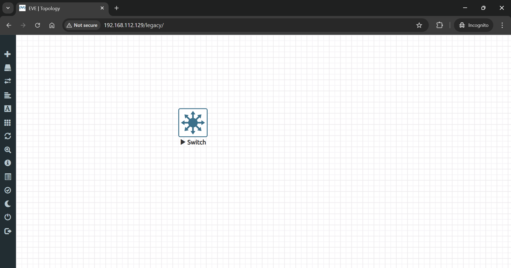
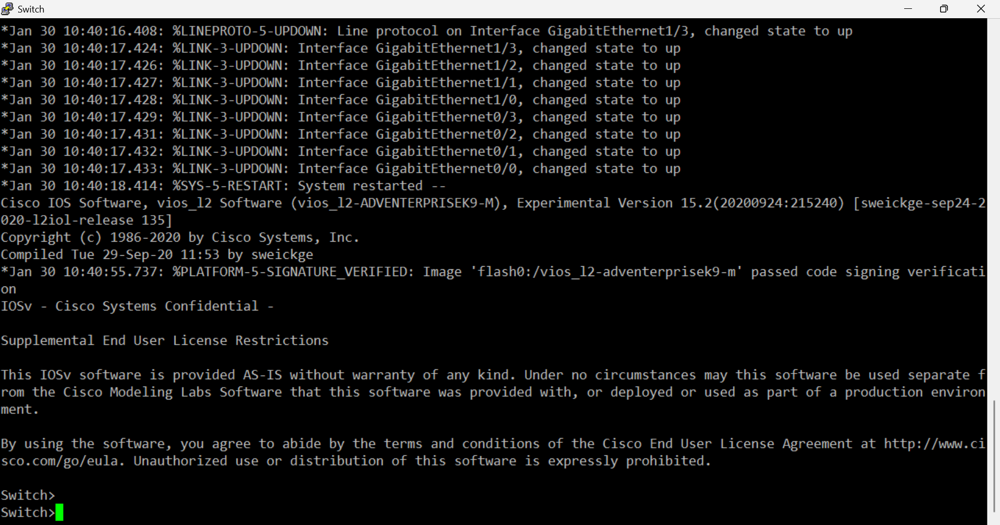

## 🖧 Switch Basic Configuration

### 1️⃣ Add Switch Nodes

- 

### 2️⃣ Launch PuTTY and Configure Settings

- 

### 3️⃣ Switch Commands

## 🔹 Basic Switch Commands

### 🛠 Enter Privileged Mode

```bash
enable
```

### 🛠 Configure Terminal Mode

```bash
configure terminal
```

### 🛠 Set Hostname

```bash
hostname SW1
```

### 🛠 Set Password for Console Access

```bash
line console 0
password cisco
login
exit
```

### 🛠 Set Privileged EXEC Mode Password

```bash
enable secret cisco1234
```

### 🛠 Set a Banner Message

```bash
banner motd $
--------------------------------------------
Switch 1 : Cisco 9200 : Floor 1 : CE Tower
--------------------------------------------
$
```

## 🔹 Management IP & SSH Configuration

### 🛠 Assign an IP Address to VLAN 1 for Remote Access

```bash
interface vlan 1
ip address 192.168.1.100 255.255.255.0
no shutdown
exit
```

### 🛠 Set Default Gateway

```bash
ip default-gateway 192.168.1.1
```

### 🛠 Enable SSH

```bash
ip domain-name example.com
crypto key generate rsa
```

### 🛠 Create an SSH User

```bash
username admin privilege 15 secret admin1234
```

### 🛠 Configure SSH on VTY Lines

```bash
line vty 0 4
transport input ssh
login local
exit
```

### 🛠 Save Configuration

```bash
write memory
```

✅ **Switch configuration is now complete and secured with SSH access.**
