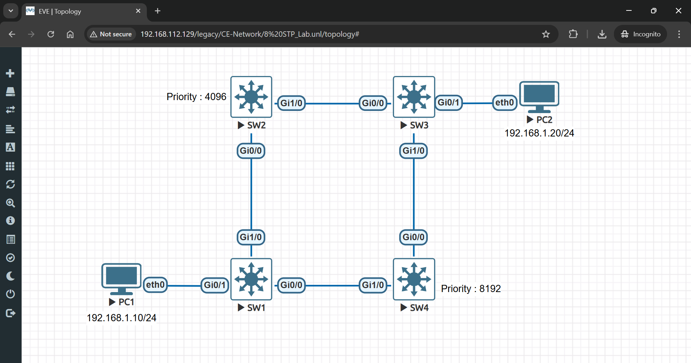
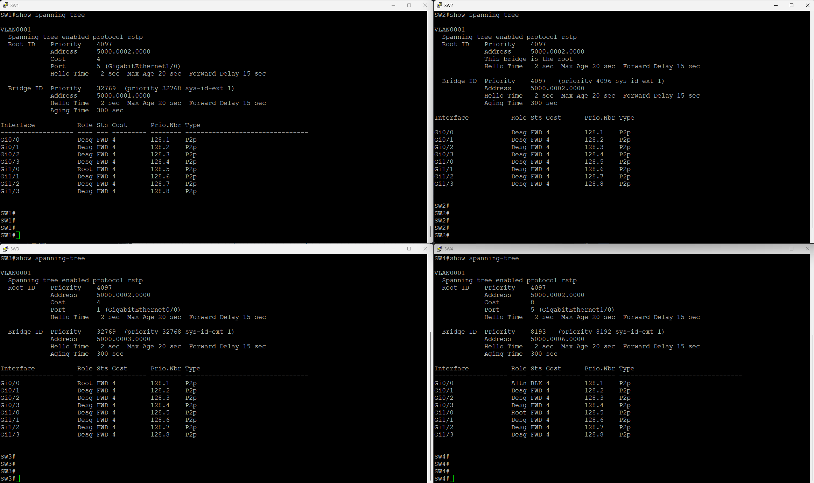

# 🚀 Spanning Tree Protocol (STP) Lab in EVE-NG

## 🔹 Lab Objectives

- **Understand loop prevention in Layer 2 networks**  
- **Configure Rapid PVST+ on Cisco switches**  
- **Modify root bridge priority to control STP behavior**

---

## 🛠 Step 1: Set Up the Lab in EVE-NG

- 1️⃣ Open **EVE-NG**.
- 2️⃣ Create a **New Lab** (e.g., "STP_Lab").
- 3️⃣ **Add Devices**:
  - **Four Cisco Switches (SW1, SW2, SW3, SW4)**
  - **Two Virtual PCs (PC1 & PC2)**
- 4️⃣ **Connect Devices**:
  - 🔌 **PC1 → SW1 (GigabitEthernet 0/1)**
  - 🔌 **PC2 → SW3 (GigabitEthernet 0/1)**
  - 🔌 **SW1 → SW2 (GigabitEthernet 1/0 → GigabitEthernet 0/0)**
  - 🔌 **SW2 → SW3 (GigabitEthernet 1/0 → GigabitEthernet 0/0)**
  - 🔌 **SW3 → SW4 (GigabitEthernet 1/0 → GigabitEthernet 0/0)**
  - 🔌 **SW4 → SW1 (GigabitEthernet 1/0 → GigabitEthernet 0/0) [Loop Connection]**
- 5️⃣ **Diagram**:
  - 

---

## 🔹 Step 2: Enable Spanning Tree on Switches

### 🔹 **On All Switches (SW1, SW2, SW3, SW4)**

```bash
enable
configure terminal
spanning-tree mode rapid-pvst
exit
```

✅ **This enables Rapid PVST+ on all switches.**

---

## 🔹 Step 3: Modify Root Bridge Priority

### 🔹 **Set SW2 as the Root Bridge**

```bash
interface vlan 1
spanning-tree vlan 1 priority 4096
exit
```

### 🔹 **Set SW4 as the Secondary Root Bridge**

```bash
interface vlan 1
spanning-tree vlan 1 priority 8192
exit
```

✅ **SW2 is now the root bridge, and SW4 is the secondary.**

---

## 🔹 Step 4: Verify Spanning Tree Configuration

### 📋 **Check STP Status on SW1 and SW3**

```bash
show spanning-tree
```

✅ **This command displays root bridge information and port roles.**

---

## 🔹 Step 5: Test Loop Prevention

### 🔹 **Check Blocked Ports on SW3**

```bash
show spanning-tree blockedports
```

✅ **At least one port should be in a blocking state to prevent loops.**

### 🔹 **Disconnect an Active Link and Observe STP Convergence**

```bash
show spanning-tree
```
- 
✅ **STP should automatically adjust the network topology.**

---

## 🔹 Step 6: Configure PCs and Test Connectivity

### 🖥 **On PC1**

```bash
ip 192.168.1.10 255.255.255.0 192.168.1.1
```

### 🖥 **On PC2**

```bash
ip 192.168.1.20 255.255.255.0 192.168.1.1
```

✅ **Both PCs are now in the same network segment.**

### 🔹 **Test Connectivity Between PCs**

#### **From PC1, ping PC2**

```bash
ping 192.168.1.20
```

#### **From PC2, ping PC1**

```bash
ping 192.168.1.10
```

- 
✅ **If successful, the network and STP configuration are functioning correctly!**

---
