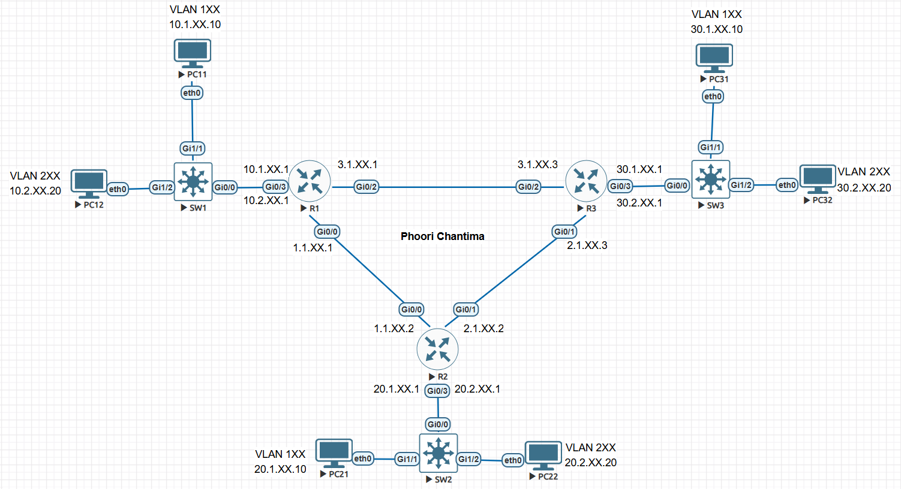
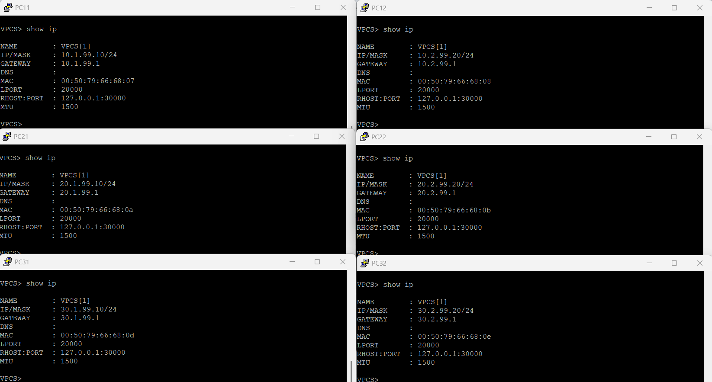
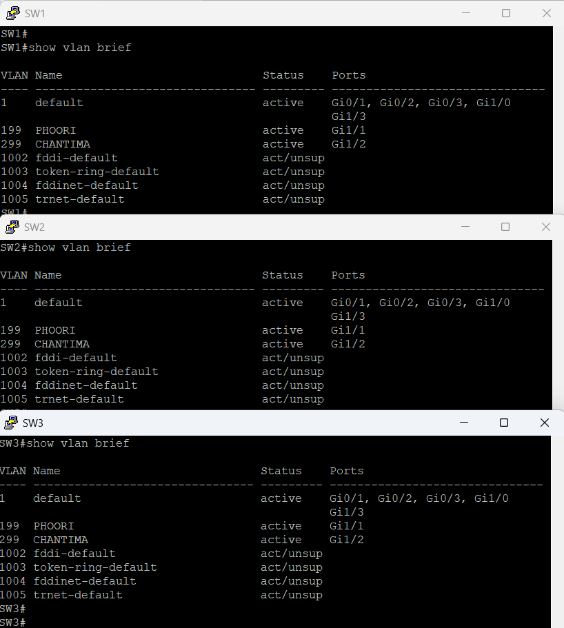
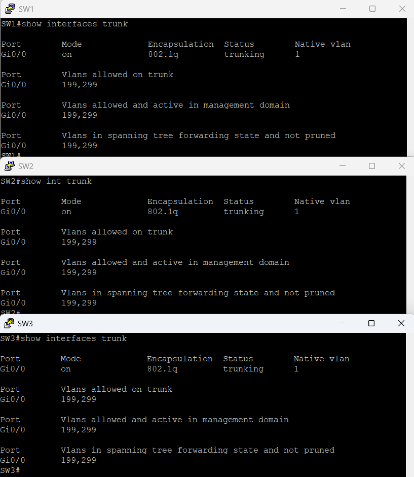
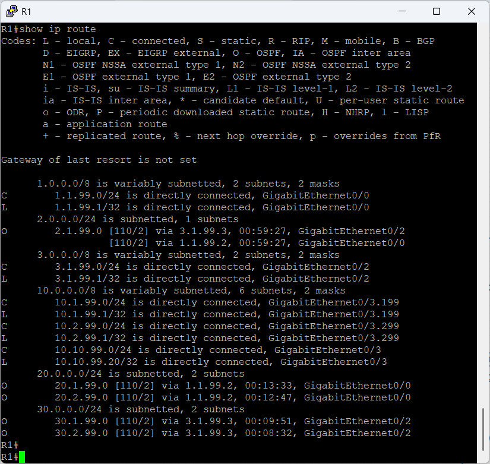
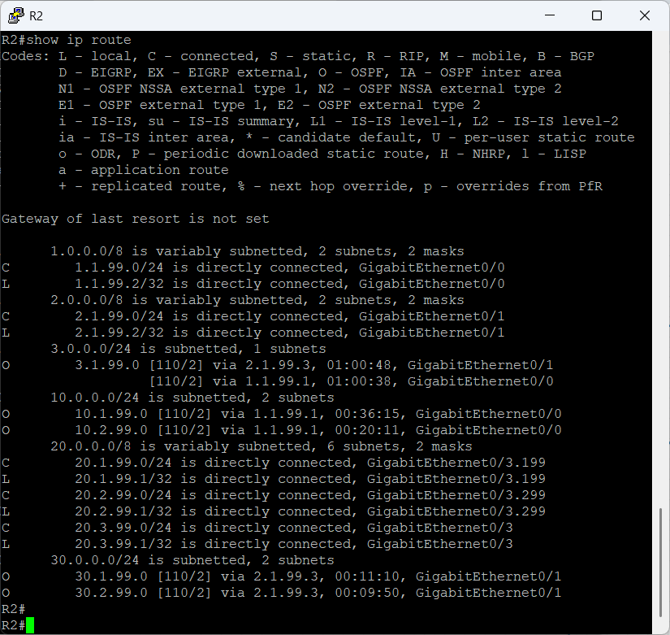
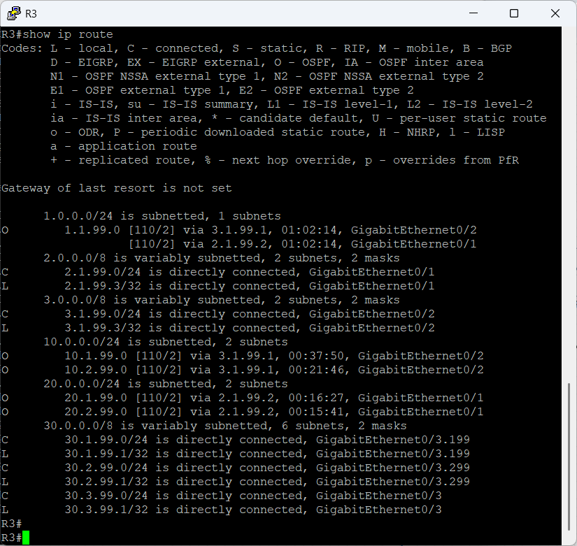
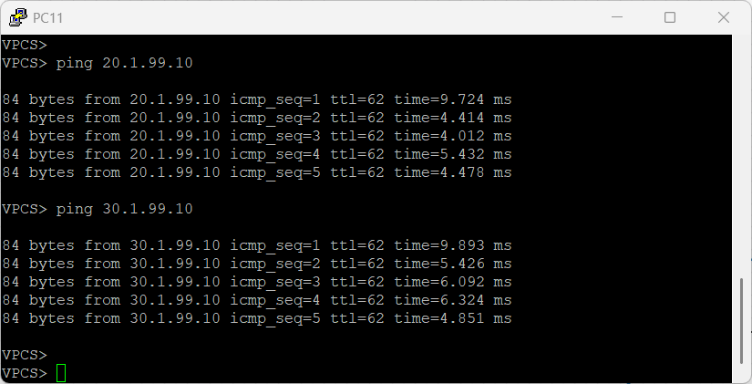
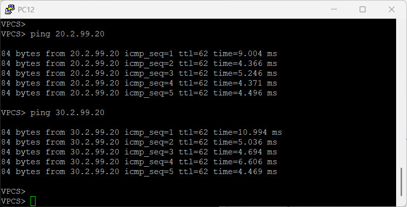

# 🚀 ข้อสอบปฏิบัติรายวิชา การสื่อสารข้อมูลและเครือข่ายคอมพิวเตอร์

📚 **คณะวิศวกรรมศาสตร์และเทคโนโลยีอุตสาหกรรม**  
💻 **สาขาวิศวกรรมคอมพิวเตอร์**  
🏫 **มหาวิทยาลัยกาฬสินธุ์**

---

## 📌 คำชี้แจง

✅ **นักศึกษาต้องดำเนินการต่อวงจรและตั้งค่าระบบเครือข่ายตามที่กำหนด**  
💻 **ใช้ซอฟต์แวร์จำลองเครือข่าย EVE-NG**  
📜 **ให้นำส่งไฟล์ภาพผลลัพธ์การทดสอบเครือข่าย ทั้งหมด 9 ข้อ**  
🔢 **คะแนนเต็ม 20 คะแนน**  
⏰ **ส่งงานภายในเวลาที่กำหนด 13.00 วันที่ 22/10/2025**  
📋 **ส่งคำตอบผ่าน Google Form:** [🔗 คลิกที่นี่](https://forms.gle/y3Gbu9YovdmbBQgb7)

---

## 🖧 รายละเอียดเครือข่าย

### 🛠 1. โครงสร้างเครือข่าย

ดูไดอะแกรมเครือข่าย: 

**อุปกรณ์ที่ใช้ในการสอบ:**
- 🌐 **เราเตอร์ (Router) 3 ตัว:** R1, R2, R3
- 🔌 **สวิตช์ (Switch) 3 ตัว:** SW1, SW2, SW3
- 🖥 **พีซี (PC) 6 เครื่อง:** PC11, PC12, PC21, PC22, PC31, PC32

**📡 Routing Protocol:**
- ใช้ **OSPF (Open Shortest Path First)** สำหรับ Dynamic Routing
- OSPF Area 0 (Backbone Area)

### 📌 2. การกำหนด IP Address และ VLAN

**📋 กฎการกำหนดค่า:**
- 🆔 **XX** = เลขที่นักศึกษา (01-08)
- 🏢 **VLAN 1XX** = ชื่อจริง (First Name) ของนักศึกษา
- 🏭 **VLAN 2XX** = นามสกุล (Last Name) ของนักศึกษา

**ตัวอย่าง IP Address (XX = เลขที่นักศึกษา):**
- PC11: **10.1.XX.10/24**, Gateway: **10.1.XX.1**
- PC12: **10.2.XX.20/24**, Gateway: **10.2.XX.1**
- PC21: **20.1.XX.10/24**, Gateway: **20.1.XX.1**
- PC22: **20.2.XX.20/24**, Gateway: **20.2.XX.1**
- PC31: **30.1.XX.10/24**, Gateway: **30.1.XX.1**
- PC32: **30.2.XX.20/24**, Gateway: **30.2.XX.1**

**ตัวอย่างเฉพาะ (นักศึกษาเลขที่ 01):**
- PC11: 10.1.**01**.10/24, Gateway: 10.1.**01**.1
- PC12: 10.2.**01**.20/24, Gateway: 10.2.**01**.1
- VLAN **101** name = **THANATORN**
- VLAN **201** name = **ONTONGLANG**

---

## 📝 โจทย์ปฏิบัติ

### 1️⃣ การกำหนด IP Address ให้กับ PC ทุกเครื่อง (4 คะแนน)

📌 **กำหนด IP Address, Subnet Mask และ Default Gateway ให้กับ PC ทุกเครื่อง**

**ขั้นตอนการดำเนินการ:**
- 🏷 **กำหนด IP Address** ให้กับ PC11, PC12, PC21, PC22, PC31, PC32
- 🔧 **กำหนด Subnet Mask** ให้ถูกต้องตามโจทย์
- 🗺 **ตั้งค่า Default Gateway** สำหรับแต่ละ PC

**คำสั่งที่ใช้ตรวจสอบ:**
```
show ip
```

**การส่งงาน:**
- ✅ **ข้อ 1:** แนบภาพแคปหน้าจอคำสั่ง `show ip` ของ PC ทุกเครื่อง (PC11, PC12, PC21, PC22, PC31, PC32)

**ตัวอย่างภาพ:** 

---

### 2️⃣ การตั้งค่า VLAN บน Switch (3 คะแนน)

📌 **สร้าง VLAN และกำหนด port ให้ถูกต้องตามโจทย์**

**ขั้นตอนการดำเนินการ:**
- 🏢 **สร้าง VLAN 1XX (ชื่อจริง)** และ **VLAN 2XX (นามสกุล)** โดย XX = เลขที่นักศึกษา
- 🔌 **กำหนด Access Port** สำหรับเชื่อมต่อ PC แต่ละตัว
- 🏷 **ตั้งชื่อ VLAN** ให้ตรงกับชื่อจริงและนามสกุลของนักศึกษา (ภาษาอังกฤษตัวพิมพ์ใหญ่)

**ตัวอย่าง (นักศึกษาเลขที่ 01):**
- VLAN 101 name = THANATORN
- VLAN 201 name = ONTONGLANG

**คำสั่งที่ใช้ตรวจสอบ:**
```
show vlan brief
```

**การส่งงาน:**
- ✅ **ข้อ 2:** แนบภาพแคปหน้าจอคำสั่ง `show vlan brief` ของ Switch ทั้ง 3 ตัว (SW1, SW2, SW3)

**ตัวอย่างภาพ:** 

---

### 3️⃣ การตั้งค่า Trunk Port บน Switch (3 คะแนน)

📌 **กำหนด Trunk Port สำหรับเชื่อมต่อระหว่าง Switch และ Router**

**ขั้นตอนการดำเนินการ:**
- 🔄 **กำหนด Trunk Port** บน interface Gi0/0 ของ Switch ทั้ง 3 ตัว
- 🌐 **อนุญาต VLAN 1XX และ 2XX** ผ่าน trunk (XX = เลขที่นักศึกษา)
- 📡 **ตั้งค่า encapsulation 802.1q**

**ตัวอย่าง (นักศึกษาเลขที่ 01):**
- `switchport trunk allowed vlan 101,201`

**คำสั่งที่ใช้ตรวจสอบ:**
```
show interfaces trunk
```

**การส่งงาน:**
- ✅ **ข้อ 3:** แนบภาพแคปหน้าจอคำสั่ง `show interfaces trunk` ของ Switch ทั้ง 3 ตัว (SW1, SW2, SW3)

**ตัวอย่างภาพ:** 

---

### 4️⃣ การตั้งค่า Routing Table บน Router R1 (1.2 คะแนน)

📌 **ตรวจสอบ Routing Table ของ Router R1 ที่ใช้ OSPF**

**ขั้นตอนการตั้งค่า OSPF บน R1:**
```
router ospf 1
network 10.1.XX.0 0.0.0.255 area 0
network 10.2.XX.0 0.0.0.255 area 0
network 1.1.XX.0 0.0.0.3 area 0
network 2.1.XX.0 0.0.0.3 area 0
exit
```

**คำสั่งที่ใช้ตรวจสอบ:**
```
show ip route
show ip ospf neighbor
show ip protocols
```

**การส่งงาน:**
- ✅ **ข้อ 4:** แนบภาพแคปหน้าจอคำสั่ง `show ip route` ของ Router R1

**ตัวอย่างภาพ:** 

---

### 5️⃣ การตั้งค่า Routing Table บน Router R2 (1.2 คะแนน)

📌 **ตรวจสอบ Routing Table ของ Router R2 ที่ใช้ OSPF**

**ขั้นตอนการตั้งค่า OSPF บน R2:**
```
router ospf 1
network 20.1.XX.0 0.0.0.255 area 0
network 20.2.XX.0 0.0.0.255 area 0
network 1.1.XX.0 0.0.0.3 area 0
network 2.2.XX.0 0.0.0.3 area 0
exit
```

**คำสั่งที่ใช้ตรวจสอบ:**
```
show ip route
show ip ospf neighbor
show ip protocols
```

**การส่งงาน:**
- ✅ **ข้อ 5:** แนบภาพแคปหน้าจอคำสั่ง `show ip route` ของ Router R2

**ตัวอย่างภาพ:** 

---

### 6️⃣ การตั้งค่า Routing Table บน Router R3 (1.2 คะแนน)

📌 **ตรวจสอบ Routing Table ของ Router R3 ที่ใช้ OSPF**

**ขั้นตอนการตั้งค่า OSPF บน R3:**
```
router ospf 1
network 30.1.XX.0 0.0.0.255 area 0
network 30.2.XX.0 0.0.0.255 area 0
network 2.1.XX.0 0.0.0.3 area 0
network 2.2.XX.0 0.0.0.3 area 0
exit
```

**คำสั่งที่ใช้ตรวจสอบ:**
```
show ip route
show ip ospf neighbor
show ip protocols
```

**การส่งงาน:**
- ✅ **ข้อ 6:** แนบภาพแคปหน้าจอคำสั่ง `show ip route` ของ Router R3

**ตัวอย่างภาพ:** 

---

### 7️⃣ การทดสอบ Ping ภายใน VLAN 1 (1.2 คะแนน)

📌 **ทดสอบการเชื่อมต่อระหว่าง PC ที่อยู่ใน VLAN 1XX (ชื่อจริง)**

**ขั้นตอนการทดสอบ:**
- 📡 **PC11 ping PC21** (VLAN 1XX - ชื่อจริง)
- 📡 **PC11 ping PC31** (VLAN 1XX - ชื่อจริง)

**คำสั่งที่ใช้ทดสอบ:**
```
ping <IP-Address>
```

**การส่งงาน:**
- ✅ **ข้อ 7:** แนบภาพแคปหน้าจอการ ping จาก PC11 ไปยัง PC ที่อยู่ใน VLAN 1XX

**ตัวอย่างภาพ:** 

---

### 8️⃣ การทดสอบ Ping ภายใน VLAN 2 (1.2 คะแนน)

📌 **ทดสอบการเชื่อมต่อระหว่าง PC ที่อยู่ใน VLAN 2XX (นามสกุล)**

**ขั้นตอนการทดสอบ:**
- 📡 **PC12 ping PC22** (VLAN 2XX - นามสกุล)
- 📡 **PC12 ping PC32** (VLAN 2XX - นามสกุล)

**คำสั่งที่ใช้ทดสอบ:**
```
ping <IP-Address>
```

**การส่งงาน:**
- ✅ **ข้อ 8:** แนบภาพแคปหน้าจอการ ping จาก PC12 ไปยัง PC ที่อยู่ใน VLAN 2XX

**ตัวอย่างภาพ:** 

---

### 9️⃣ การต่อวงจรเครือข่ายใน EVE-NG (4 คะแนน)

📌 **แสดงโครงสร้างเครือข่ายที่ต่อสายเคเบิลเสร็จสมบูรณ์**

**การส่งงาน:**
- ✅ **ข้อ 9:** แนบภาพแคปหน้าจอของโครงสร้างเครือข่ายใน EVE-NG ที่แสดงการเชื่อมต่อทั้งหมด

**ตัวอย่างภาพ:** 

---

## ✅ การส่งงาน

### 📤 ไฟล์ที่ต้องส่ง

📌 **นักศึกษาต้อง Capture รูปจากหน้าคอมพิวเตอร์ในหัวข้อต่างๆ และส่งตามลิ้งที่กำหนดให้**

**รายการภาพที่ต้องส่ง:**

| 🔢 ข้อที่ | 📝 รายการ | 🖥️ อุปกรณ์ | 📋 คำสั่ง/รายละเอียด |
|---------|----------|------------|---------------------|
| 1 | IP Address Configuration | PC11, PC12, PC21, PC22, PC31, PC32 | show ip |
| 2 | VLAN Configuration | SW1, SW2, SW3 | show vlan brief |
| 3 | Trunk Configuration | SW1, SW2, SW3 | show interfaces trunk |
| 4 | Routing Table R1 | R1 | show ip route |
| 5 | Routing Table R2 | R2 | show ip route |
| 6 | Routing Table R3 | R3 | show ip route |
| 7 | Ping Test VLAN 1 | PC11 | ping PC21, ping PC31 |
| 8 | Ping Test VLAN 2 | PC12 | ping PC22, ping PC32 |
| 9 | Network Topology | EVE-NG | ภาพโครงสร้างเครือข่ายโดยรวม |

### 📋 รูปแบบการส่งงาน
- 📋 **ส่งผ่าน Google Form:** [🔗 คลิกที่นี่เพื่อส่งงาน](https://forms.gle/y3Gbu9YovdmbBQgb7)
- 📸 **ส่งภาพแคปหน้าจอแต่ละข้อตามที่กำหนด (ทั้งหมด 9 ข้อ)**
- ⏰ **ส่งภายในเวลาที่กำหนด** (ไม่รับงานที่ส่งช้า)

---

## 🎯 เกณฑ์การให้คะแนน

| 🔢 ข้อที่ | 📝 รายการ | 🎯 คะแนน |
|---------|----------|---------|
| 1 | การกำหนด IP Address ให้กับ PC ทุกเครื่อง | 4 คะแนน |
| 2 | การตั้งค่า VLAN บน Switch | 3 คะแนน |
| 3 | การตั้งค่า Trunk Port บน Switch | 3 คะแนน |
| 4 | การตั้งค่า Routing Table บน Router R1 | 1.2 คะแนน |
| 5 | การตั้งค่า Routing Table บน Router R2 | 1.2 คะแนน |
| 6 | การตั้งค่า Routing Table บน Router R3 | 1.2 คะแนน |
| 7 | การทดสอบ Ping ภายใน VLAN 1 | 1.2 คะแนน |
| 8 | การทดสอบ Ping ภายใน VLAN 2 | 1.2 คะแนน |
| 9 | การต่อวงจรเครือข่ายใน EVE-NG | 4 คะแนน |
| | **รวมคะแนนทั้งหมด** | **20 คะแนน** |

### 📊 รายละเอียดการให้คะแนนแต่ละข้อ

**ข้อ 1 (4 คะแนน) - PC Configuration:**
- ✅ กำหนด IP Address ถูกต้องทั้ง 6 เครื่อง = 2 คะแนน
- ✅ กำหนด Subnet Mask ถูกต้อง = 1 คะแนน
- ✅ กำหนด Default Gateway ถูกต้อง = 1 คะแนน

**ข้อ 2 (3 คะแนน) - VLAN Configuration:**
- ✅ สร้าง VLAN 1XX (ชื่อจริง) และ VLAN 2XX (นามสกุล) โดย XX = เลขที่นักศึกษา = 1.5 คะแนน
- ✅ กำหนด port ให้ถูกต้องตาม VLAN = 1 คะแนน
- ✅ แคปหน้าจอครบทั้ง 3 Switch = 0.5 คะแนน

**ข้อ 3 (3 คะแนน) - Trunk Configuration:**
- ✅ ตั้งค่า trunk port บน Gi0/0 = 1.5 คะแนน
- ✅ อนุญาต VLAN 1XX, 2XX ผ่าน trunk (XX = เลขที่นักศึกษา) = 1 คะแนน
- ✅ แคปหน้าจอครบทั้ง 3 Switch = 0.5 คะแนน

**ข้อ 4 (1.2 คะแนน) - Router R1:**
- ✅ แสดง routing table ของ R1 พร้อม OSPF routes = 1.2 คะแนน

**ข้อ 5 (1.2 คะแนน) - Router R2:**
- ✅ แสดง routing table ของ R2 พร้อม OSPF routes = 1.2 คะแนน

**ข้อ 6 (1.2 คะแนน) - Router R3:**
- ✅ แสดง routing table ของ R3 พร้อม OSPF routes = 1.2 คะแนน

**ข้อ 7 (1.2 คะแนน) - Ping VLAN 1:**
- ✅ PC11 ping ไปยัง PC ใน VLAN 1XX สำเร็จ = 1.2 คะแนน

**ข้อ 8 (1.2 คะแนน) - Ping VLAN 2:**
- ✅ PC12 ping ไปยัง PC ใน VLAN 2XX สำเร็จ = 1.2 คะแนน

**ข้อ 9 (4 คะแนน) - Network Topology:**
- ✅ แสดงโครงสร้างเครือข่ายที่ต่อครบถ้วน = 4 คะแนน

### 📊 รายละเอียดการหักคะแนน

- ❌ **ไม่ส่งภาพประกอบ** - หัก 100% ของข้อนั้น
- ❌ **ภาพไม่ชัดเจน/อ่านไม่ได้** - หัก 50% ของข้อนั้น
- ❌ **ตั้งค่าไม่ถูกต้อง** - หัก 50-100% ของข้อนั้น (ขึ้นกับความผิดพลาด)
- ❌ **ส่งงานล่าช้า** - ไม่รับงาน (0 คะแนน)
- ❌ **ตรวจสอบพบว่า Copy งานทั้งหมดของเพื่อนส่ง ** - หัก 100% ทั้งผู้รับและให้ Copy (0 คะแนน)

### ✨ คำสั่งที่ควรจำ

**คำสั่งสำหรับ PC (VPCS):**
```
# ตั้งค่า IP Address (XX = เลขที่นักศึกษา)
ip <IP-Address> <Gateway> <Subnet-Bits>

# ตัวอย่างนักศึกษาเลขที่ 01:
# PC11 (VLAN 101 - THANATORN)
ip 10.1.1.10 10.1.1.1 24

# PC12 (VLAN 201 - ONTONGLANG)
ip 10.2.1.20 10.2.1.1 24

# แสดงข้อมูล IP
show ip

# ทดสอบ Ping
ping <IP-Address>
```

**คำสั่งสำหรับ Switch - VLAN:**
```
# เข้าสู่โหมด config
enable
configure terminal

# สร้าง VLAN (ตัวอย่างนักศึกษาเลขที่ 01)
vlan 101
name THANATORN
exit

vlan 201
name ONTONGLANG
exit

# กำหนด Access Port
interface gigabitEthernet1/1
switchport mode access
switchport access vlan 101
exit

interface gigabitEthernet1/2
switchport mode access
switchport access vlan 201
exit

# ตรวจสอบ VLAN
show vlan brief
show interfaces status
```

**คำสั่งสำหรับ Switch - Trunk:**
```
# ตั้งค่า Trunk Port (ตัวอย่างนักศึกษาเลขที่ 01)
interface gigabitEthernet0/0
switchport trunk encapsulation dot1q
switchport mode trunk
switchport trunk allowed vlan 101,201
exit

# ตรวจสอบ Trunk
show interfaces trunk
```

**คำสั่งสำหรับ Router:**
```
# กำหนด IP บน Interface
interface <interface-id>
ip address <ip-address> <subnet-mask>
no shutdown
exit

# Sub-interface สำหรับ Inter-VLAN (ตัวอย่างนักศึกษาเลขที่ 01)
interface gigabitEthernet0/0.101
encapsulation dot1Q 101
ip address 10.1.1.1 255.255.255.0
exit

interface gigabitEthernet0/0.201
encapsulation dot1Q 201
ip address 10.2.1.1 255.255.255.0
exit

# ตรวจสอบ Routing Table
show ip route
show ip interface brief
show ip protocols
```

**คำสั่งสำหรับ OSPF Routing:**
```
# ตั้งค่า OSPF (ตัวอย่างนักศึกษาเลขที่ 01)
router ospf 1
network 10.1.1.0 0.0.0.255 area 0
network 10.2.1.0 0.0.0.255 area 0
network 1.1.1.0 0.0.0.3 area 0
network 2.1.1.0 0.0.0.3 area 0
exit

# ตรวจสอบ OSPF
show ip ospf neighbor
show ip ospf interface
show ip ospf database
show ip protocols
```

### ⚠️ ข้อผิดพลาดที่พบบ่อย

1. ❌ **VLAN ID ผิด** - ต้องใช้ VLAN 1XX และ 2XX โดย XX = เลขที่นักศึกษา (เช่น 101, 201)
2. ❌ **ชื่อ VLAN ผิด** - ต้องใช้ชื่อจริงและนามสกุลภาษาอังกฤษตัวพิมพ์ใหญ่ทั้งหมด
3. ❌ **IP Address ไม่ตรง** - ต้องใช้ 10.1.XX.10 ไม่ใช่ 10.1.99.10 (XX = เลขที่นักศึกษา)
4. ❌ **Gateway ไม่ถูกต้อง** - Gateway ต้องลงท้ายด้วย .1 เช่น 10.1.01.1
5. ❌ **Trunk Port ไม่ทำงาน** - ตรวจสอบ encapsulation dot1q และ allowed vlan 1XX,2XX
6. ❌ **Inter-VLAN Routing ไม่ทำงาน** - ตรวจสอบ sub-interface Gi0/0.1XX และ Gi0/0.2XX
7. ❌ **PC ไม่มี Default Gateway** - PC จะ ping ข้าม network ไม่ได้
8. ❌ **ลืมเปิด Interface** - ใช้คำสั่ง `no shutdown` บน Router sub-interface
9. ❌ **OSPF Neighbor ไม่ขึ้น** - ตรวจสอบ network statement และ area number
10. ❌ **Wildcard Mask ผิด** - เช่น /24 = 0.0.0.255, /30 = 0.0.0.3

### 💡 เทคนิคการทำข้อสอบ

**ลำดับการทำงานที่แนะนำ:**

1. **เริ่มจากการต่อวงจร** - ต่อสายเคเบิลให้ถูกต้องตามโจทย์
2. **ตั้งค่า Interface บน Router** - กำหนด IP Address สำหรับ WAN links
3. **ตั้งค่า Sub-interface บน Router** - สำหรับ Inter-VLAN Routing
4. **ตั้งค่า OSPF บน Router ทั้ง 3 ตัว** - ประกาศ network ทั้งหมดใน Area 0
5. **ตรวจสอบ OSPF Neighbor** - ใช้ `show ip ospf neighbor` เพื่อยืนยัน
6. **ตั้งค่า Switch** - สร้าง VLAN และกำหนด Access/Trunk port
7. **ตั้งค่า PC** - กำหนด IP Address, Subnet Mask และ Gateway
8. **ทดสอบ Ping** - ทดสอบภายใน VLAN และข้าม VLAN
9. **แคปหน้าจอ** - แคปภาพตามรายการที่กำหนดใน 9 ข้อ
10. **ตรวจสอบความครบถ้วน** - ตรวจสอบว่าได้ภาพครบทั้ง 9 ข้อ
11. **ส่งงานผ่าน Google Form** - [https://forms.gle/y3Gbu9YovdmbBQgb7](https://forms.gle/y3Gbu9YovdmbBQgb7)

---

## 📋 รายชื่อนักศึกษาและ VLAN ที่กำหนด

📌 **การกำหนดค่าเครือข่ายสำหรับนักศึกษาแต่ละคน** 🖥️

### 🔢 กฎการกำหนด:
- **XX** = เลขที่นักศึกษา (01-08)
- **VLAN 1XX** = ชื่อจริง (First Name) ภาษาอังกฤษตัวพิมพ์ใหญ่
- **VLAN 2XX** = นามสกุล (Last Name) ภาษาอังกฤษตัวพิมพ์ใหญ่
- **IP Address**: 10.1.XX.10, 10.2.XX.20, 20.1.XX.10, ฯลฯ

### 👥 รายชื่อนักศึกษา:

| 🆔 เลขที่ | 👤 ชื่อ-นามสกุล | 🏢 VLAN 1XX | 🏭 VLAN 2XX | 📝 ตัวอย่าง IP |
|---------|------------------|-------------|-------------|----------------|
| **01** | นายธนธรณ์ อ่อนทองหลาง | VLAN 101<br>name: **THANATORN** | VLAN 201<br>name: **ONTONGLANG** | 10.1.**01**.10<br>10.2.**01**.20 |
| **02** | นายภูมิบดี ภูทองเพ็ชร | VLAN 102<br>name: **PHUMIBODEE** | VLAN 202<br>name: **PHUTHONGPHET** | 10.1.**02**.10<br>10.2.**02**.20 |
| **03** | นายวงศ์ชัยภัทร ดอนภิรมย์ | VLAN 103<br>name: **WONGCHAIPHAT** | VLAN 203<br>name: **DONPHIROM** | 10.1.**03**.10<br>10.2.**03**.20 |
| **04** | นายก้องภพ เดชพรรณา | VLAN 104<br>name: **KONGPHOP** | VLAN 204<br>name: **DETCHAPHANNA** | 10.1.**04**.10<br>10.2.**04**.20 |
| **05** | นายศิวากร พิมพะนิตย์ | VLAN 105<br>name: **SIWAKORN** | VLAN 205<br>name: **PHIMPHANIT** | 10.1.**05**.10<br>10.2.**05**.20 |
| **06** | นายอลงกรณ์ ไชยสา | VLAN 106<br>name: **ALONGKORN** | VLAN 206<br>name: **CHAISA** | 10.1.**06**.10<br>10.2.**06**.20 |
| **07** | นายชญานิน ฆารโสภณ | VLAN 107<br>name: **CHAYANIN** | VLAN 207<br>name: **KANSOPHON** | 10.1.**07**.10<br>10.2.**07**.20 |
| **08** | นายพสิษฐ์พล ระดาเขต | VLAN 108<br>name: **PASITPON** | VLAN 208<br>name: **RADAKHET** | 10.1.**08**.10<br>10.2.**08**.20 |

### 📝 ตัวอย่างการตั้งค่าสำหรับนักศึกษาเลขที่ 01:

**Router Configuration (Inter-VLAN Routing):**
```
interface GigabitEthernet0/0.101
 encapsulation dot1Q 101
 ip address 10.1.1.1 255.255.255.0
!
interface GigabitEthernet0/0.201
 encapsulation dot1Q 201
 ip address 10.2.1.1 255.255.255.0
!
! OSPF Configuration
router ospf 1
 network 10.1.1.0 0.0.0.255 area 0
 network 10.2.1.0 0.0.0.255 area 0
 network 1.1.1.0 0.0.0.3 area 0
 network 2.1.1.0 0.0.0.3 area 0
```

**Switch Configuration:**
```
vlan 101
 name THANATORN
vlan 201
 name ONTONGLANG
!
interface GigabitEthernet1/1
 switchport mode access
 switchport access vlan 101
!
interface GigabitEthernet1/2
 switchport mode access
 switchport access vlan 201
!
interface GigabitEthernet0/0
 switchport trunk encapsulation dot1q
 switchport mode trunk
 switchport trunk allowed vlan 101,201
```

**PC Configuration:**
```
# PC11 (VLAN 101)
ip 10.1.1.10 10.1.1.1 24

# PC12 (VLAN 201)
ip 10.2.1.20 10.2.1.1 24
```

**ตรวจสอบ OSPF:**
```
# ตรวจสอบ OSPF Neighbor
show ip ospf neighbor

# ตรวจสอบ OSPF Database
show ip ospf database

# ตรวจสอบ Routing Table
show ip route
```

---

## 🎉 ขอให้โชคดีในการสอบ!

💪 **เชื่อมั่นในตัวเอง ทำอย่างเต็มความสามารถ**  
📚 **ทบทวนเนื้อหาและฝึกฝนอย่างสม่ำเสมอ**  
🚀 **สู้ๆ นักศึกษาทุกคน!**

---

*📝 หมายเหตุ: เอกสารนี้อาจมีการปรับปรุงแก้ไข กรุณาตรวจสอบเวอร์ชันล่าสุดจากอาจารย์ผู้สอน*
