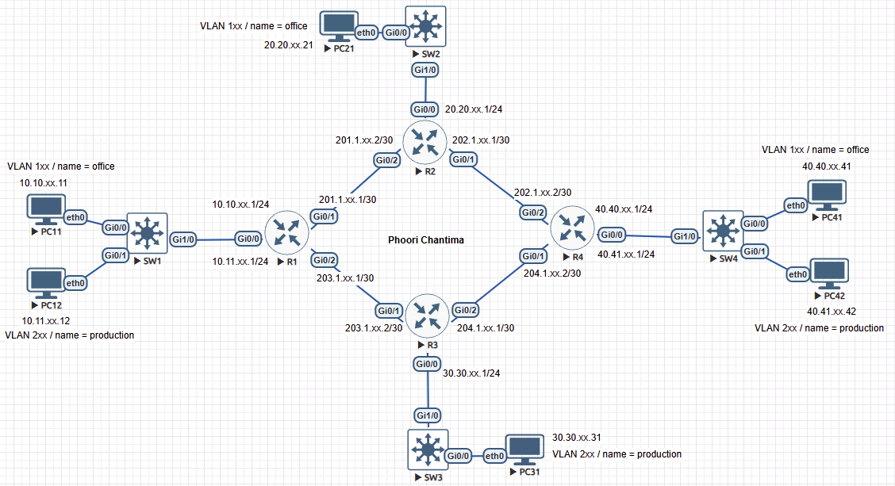

# 🚀 ข้อสอบปฏิบัติรายวิชา การสื่อสารข้อมูลและเครือข่ายคอมพิวเตอร์  

📚 **คณะวิศวกรรมศาสตร์และเทคโนโลยีอุตสาหกรรม**  
💻 **สาขาวิศวกรรมคอมพิวเตอร์**  
🏫 **มหาวิทยาลัยกาฬสินธุ์**  

---

## 📌 คำชี้แจง  

✅ **นักศึกษาต้องดำเนินการตั้งค่าและทดสอบระบบเครือข่ายตามที่กำหนด**  
💻 **ใช้ซอฟต์แวร์จำลองเครือข่าย EVE-NG**  
📜 **ให้นำส่งไฟล์ภาพผลลัพธ์การทดสอบเครือข่าย**  
🔢 **คะแนนเต็ม 20 คะแนน**  
📅 **ส่งงานภายในวันที่ 13 มีนาคม 2568 เวลา 16.30 น.**  
📋 **ส่งคำตอบผ่าน Google Form:** [🔗 คลิกที่นี่](https://docs.google.com/forms/d/e/1FAIpQLSdv5IBi28UWKMLvxCVtFmCQIpaFxDhEXtGt84cDBOqomCZb1w/viewform?usp=dialog)  

---

## **🖧 รายละเอียดเครือข่าย**

### **🛠 1. โครงสร้างเครือข่าย**

- 🌐 **เราเตอร์ (Router) 4 ตัว** ได้แก่ **R1, R2, R3, R4**  
- 🔌 **สวิตช์ (Switch) 4 ตัว** ได้แก่ **SW1, SW2, SW3, SW4**  
- 🖥 **พีซี (PC) 6 เครื่อง** ได้แก่ **PC11, PC12, PC21, PC31, PC41, PC42**  
- 📡 **แต่ละ PC ถูกกำหนดให้อยู่ใน VLAN ที่แตกต่างกัน**  
- 

### **📌 2. VLAN และ IP Address**

- 🏢 **VLAN 1xx** → name **Office**  
- 🏭 **VLAN 2xx** → name **Production**  

| 🖥 อุปกรณ์ | 🌐 VLAN | 🏷 IP Address |
|------------|--------|--------------|
| PC11 | VLAN 1xx (Office) | 10.10.xx.11 |
| PC12 | VLAN 2xx (Production) | 10.11.xx.12 |
| PC21 | VLAN 1xx (Office) | 20.20.xx.21 |
| PC31 | VLAN 2xx (Production) | 30.30.xx.31 |
| PC41 | VLAN 1xx (Office) | 40.40.xx.41 |
| PC42 | VLAN 2xx (Production) | 40.41.xx.42 |

- **🔀 Router Interconnections**
  - 🔗 **R1 ↔ R2:** `201.1.xx.1/30 ↔ 201.1.xx.2/30`
  - 🔗 **R2 ↔ R4:** `202.1.xx.1/30 ↔ 202.1.xx.2/30`
  - 🔗 **R1 ↔ R3:** `203.1.xx.1/30 ↔ 203.1.xx.2/30`
  - 🔗 **R3 ↔ R4:** `204.1.xx.1/30 ↔ 204.1.xx.2/30`

---

## **📝 โจทย์ปฏิบัติ**

### **1️⃣ เชื่อมต่อโครงสร้างเครือข่าย โดยใช้โปรแกรมจำลอง EVE-NG (2 คะแนน)**

📌 **นักศึกษาต้องสร้างโครงสร้างเครือข่ายให้เหมือนกับที่กำหนด**  

- 🏗 **ตั้งค่าโครงสร้างเครือข่ายให้สมบูรณ์**  
- 🖼 **แนบภาพแคปหน้าจอของโครงสร้างที่สร้างใน EVE-NG**  

---

### **2️⃣ การตั้งค่า VLAN (3 คะแนน)**

📌 **ตั้งค่า VLAN บนอุปกรณ์ Switch ให้ถูกต้องตามที่กำหนด**  

- 🏢 **VLAN 1xx (Office)** บนอุปกรณ์ที่กำหนด  
- 🏭 **VLAN 2xx (Production)** บนอุปกรณ์ที่กำหนด  
- 🔄 **ตั้งค่า Trunking ระหว่าง Switch และ Router**  
- 🔧 **ใช้คำสั่ง `show vlan brief` เพื่อตรวจสอบ**  

---

### **3️⃣ ตั้งค่า Inter-VLAN Routing (4 คะแนน)**

📌 **กำหนดการตั้งค่า Router-on-a-stick (ROAS) บน Router**  

- 🌐 **กำหนด Sub-interface สำหรับ VLAN 1xx และ 2xx**  
- 🛠 **กำหนด Default Gateway สำหรับแต่ละ VLAN**  
- 📡 **ใช้คำสั่ง `ping` เพื่อตรวจสอบการเชื่อมต่อระหว่าง VLAN**  

---

### **4️⃣ การกำหนด Dynamic Routing (5 คะแนน)**

📌 **ตั้งค่า Dynamic Routing Protocol บน Router**  

- 🔀 **กำหนดเส้นทางแบบไดนามิก **  
- 🗺 **ใช้คำสั่ง `show ip route` ตรวจสอบเส้นทางเครือข่าย**  

---

### **5️⃣ การกำหนด IP Address PCs (3 คะแนน)**

📌 **คำนวณและกำหนดหมายเลข IP Address ที่ถูกต้อง**  
- 🏷 **กำหนด IP Address ให้ถูกต้องตามข้อกำหนด**  
- 🗺 **ใช้คำสั่ง `show ip` ตรวจสอบ** 

---

### **6️⃣ การทดสอบการเชื่อมต่อเครือข่าย (3 คะแนน)**

📌 **ทดสอบความถูกต้องของการตั้งค่าโดยใช้คำสั่งต่างๆ**  

- 📡 **ใช้ `ping` ทดสอบการเชื่อมต่อระหว่าง PC**  
- 🖥 **แนบภาพผลลัพธ์ของคำสั่งทดสอบ**  

---

## ✅ **📤 การส่งงาน**

📌 **🔹 นักศึกษาต้องแนบไฟล์ดังต่อไปนี้:**  

- 🖼️ **ภาพแคปหน้าจอของโครงสร้างเครือข่ายใน EVE-NG**  
- 📸 **ภาพผลลัพธ์ของคำสั่งต่างๆ**  
- 🗂️ **รวมไฟล์ภาพทั้งหมด และส่งเป็นไฟล์รูปแบบ PDF, DOC, JPEG หรือ PNG**  

- 📋 **📑 ตัวอย่างไฟล์ส่งออก:** [📄 PDF_File](src/99_Phoori.pdf)
- 🖼️ **รูปแบบการส่งภาพผลลัพธ์**

| 🔢 ข้อที่ | 🖥️ อุปกรณ์ | 📝 คำสั่ง |
|------|---------|----------------|
| 1 | Diagram เครือข่าย | ภาพเครือข่ายโดยรวม |
| 2 | SW1, SW2, SW3, SW4 | show vlan br |
| 2 | SW1, SW2, SW3, SW4 | show int trunk |
| 3 | R1 | ping 10.10.xx.11 |
| 3 | R1 | ping 10.11.xx.12 |
| 3 | R2 | ping 20.20.xx.21 |
| 3 | R3 | ping 30.30.xx.31 |
| 3 | R4 | ping 40.40.xx.41 |
| 3 | R4 | ping 40.41.xx.42 |
| 4 | R1, R2, R3, R4 | show ip route |
| 5 | PC11, PC12, PC21, PC31, PC41, PC42 | show ip |
| 6 | PC11 | ping 20.20.xx.21 |
| 6 | PC11 | ping 40.40.xx.41 |
| 6 | PC12 | ping 30.30.xx.31 |
| 6 | PC12 | ping 40.41.xx.42 |

- 📋 **ส่งคำตอบผ่าน Google Form:** [🔗 คลิกที่นี่](https://docs.google.com/forms/d/e/1FAIpQLSdv5IBi28UWKMLvxCVtFmCQIpaFxDhEXtGt84cDBOqomCZb1w/viewform?usp=dialog)  

---

# 🎯 **สรุปคะแนน**

| 📝 รายการ | 🎯 คะแนน |
|-----------|---------|
| เชื่อมต่อโครงสร้างเครือข่าย | 2 คะแนน |
| การตั้งค่า VLAN | 3 คะแนน |
| ตั้งค่า Inter-VLAN Routing | 4 คะแนน |
| การกำหนด Dynamic Routing | 5 คะแนน |
| คำนวณ Subnet และกำหนด IP Address | 3 คะแนน |
| การทดสอบการเชื่อมต่อเครือข่าย | 3 คะแนน |
| **รวมคะแนน** | **20 คะแนน** |

---
## 📋 รายชื่อนักศึกษาและ Routing Protocol 
- **กำหนด xx เลขที่ของนักศึกษา เช่น 10.10.xx.11 -> 10.10.1.11 (จักรี เลขที่ 1)**
| 🆔 เลขที่ | 👤 ชื่อ-นามสกุล | 🔀 Routing Protocol |
|------|--------------------|----------------|
| 1 | นายจักรี นาสีแสน | OSPF |
| 2 | นายภูวนาท มาตสะอาด | EIGRP |
| 3 | นายชมภูศักดิ์ ดวงมาลัย | RIP |
| 4 | นางสาวสลินทิพย์ จันทะวงษ์ | OSPF |
| 5 | นางสาวสโรชา จันทะวงษ์ | EIGRP |
| 6 | นายพชร ม่วงมูลตรี | RIP |
| 7 | นางสาวจิตติมา ทรงวงค์เกต | OSPF |
| 8 | นายวรโชติ ปอคีรีบารมี | EIGRP |
| 9 | นายชวัลวิชญ์ สืบสายสิงห์ | RIP |
| 10 | นายกิตติเดช อิ่มรักษา | OSPF |
| 11 | นายธนโชติ สลีสองสม | EIGRP |
| 12 | นายณัฐพัฒน์ สุวรรณโท | RIP |
| 13 | นายพีรทัศน์ สายเเสน | OSPF |
| 14 | นางสาวสุรางคนา จันทร์เสละ | EIGRP |
| 15 | นางสาวธัญชนก สุวรรณ | RIP |
| 16 | นางสาวจุฑามาส ศรีมุม | OSPF |
| 17 | นายปิ่นมนัส ไพบูลย์ | EIGRP |
| 18 | นายภูตะวัน เทศธรรม | RIP |
| 19 | นายรัฐนันท์ สุนทะศักดิ์ | OSPF |

🚀 **📚 ขอให้นักศึกษาทุกคนโชคดีในการสอบ!** 🎉