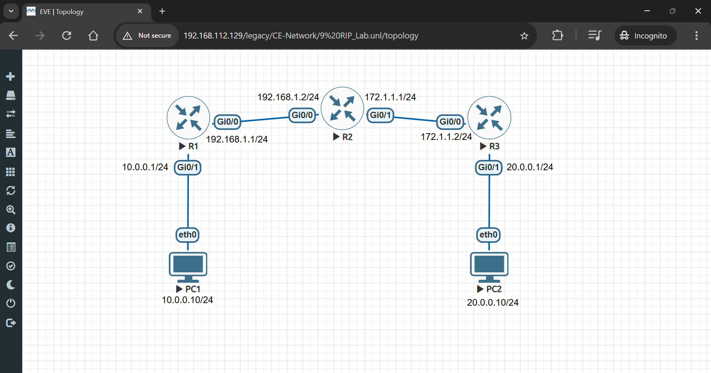

# 🚀 Dynamic Routing with RIP Lab in EVE-NG

## 🔹 Lab Objectives

- **Configure RIP v2 between routers**  
- **Verify routing tables**  
- **Prevent routing loops**

---

## 🛠 Step 1: Set Up the Lab in EVE-NG

- 1️⃣ Open **EVE-NG**.
- 2️⃣ Create a **New Lab** (e.g., "RIP_Lab").
- 3️⃣ **Add Devices**:
  - **Three Cisco Routers (R1, R2, R3)**
  - **Two Virtual PCs (PC1 & PC2)**
- 4️⃣ **Connect Devices**:
  - 🔌 **PC1 → R1 (GigabitEthernet 0/1)**
  - 🔌 **PC2 → R3 (GigabitEthernet 0/1)**
  - 🔌 **R1 → R2 (GigabitEthernet 0/0 → GigabitEthernet 0/0)**
  - 🔌 **R2 → R3 (GigabitEthernet 1/0 → GigabitEthernet 0/0)**
- 5️⃣ **Diagram**:
  - 

---

## 🔹 Step 2: Configure IP Addresses on Routers

### 🔹 **On R1**

```bash
enable
configure terminal
interface gigabitEthernet 0/0
ip address 192.168.1.1 255.255.255.0
no shutdown
exit

interface gigabitEthernet 0/1
ip address 10.0.0.1 255.255.255.0
no shutdown
exit
```

### 🔹 **On R2**

```bash
enable
configure terminal
interface gigabitEthernet 0/0
ip address 192.168.1.2 255.255.255.0
no shutdown
exit

interface gigabitEthernet 0/1
ip address 172.1.1.1 255.255.255.0
no shutdown
exit
```

### 🔹 **On R3**

```bash
enable
configure terminal
interface gigabitEthernet 0/0
ip address 172.1.1.2 255.255.255.0
no shutdown
exit

interface gigabitEthernet 0/1
ip address 20.0.0.1 255.255.255.0
no shutdown
exit
```

✅ **IP addressing is now configured on all routers.**

---

## 🔹 Step 3: Configure RIP v2 on All Routers

### 🔹 **On R1**

```bash
enable
configure terminal
router rip
version 2
network 192.168.1.0
network 10.0.0.0
no auto-summary
exit
```

### 🔹 **On R2**

```bash
enable
configure terminal
router rip
version 2
network 192.168.1.0
network 172.1.1.0
no auto-summary
exit
```

### 🔹 **On R3**

```bash
enable
configure terminal
router rip
version 2
network 172.1.1.0
network 20.0.0.0
no auto-summary
exit
```

✅ **RIP v2 is now configured on all routers.**

---

## 🔹 Step 4: Verify RIP Routing

### 📋 **Check Routing Tables on Each Router**

```bash
show ip route rip
```
- 

✅ **This command will display learned RIP routes.**

---

## 🔹 Step 5: Prevent Routing Loops

### 🔹 **Enable Split Horizon on All Routers**

```bash
router rip
no validate-update-source
```

✅ **Split horizon prevents routing loops in RIP.**

### 🔹 **Enable Route Poisoning and Holddown Timers**

```bash
router rip
timers basic 30 180 120 240
```

✅ **This enhances RIP convergence and stability.**

---

## 🔹 Step 6: Configure PCs and Test Connectivity

### 🖥 **On PC1**

```bash
ip 10.0.0.10 255.255.255.0 10.0.0.1
```

### 🖥 **On PC2**

```bash
ip 20.0.0.10 255.255.255.0 20.0.0.1
```

✅ **Both PCs are now in their respective networks.**

### 🔹 **Test Connectivity Between PCs**

#### **From PC1, ping PC2**

```bash
ping 20.0.0.10
```

#### **From PC2, ping PC1**

```bash
ping 10.0.0.10
```

✅ **If successful, RIP routing is functioning correctly!**

---
