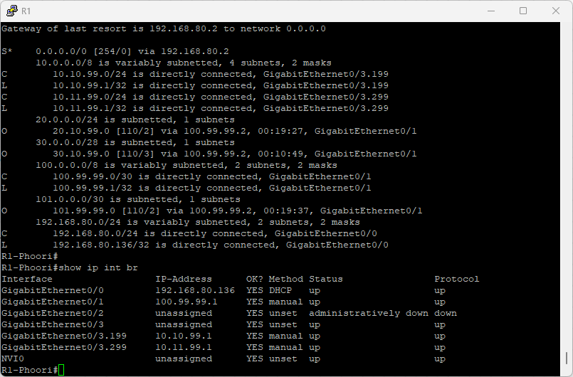
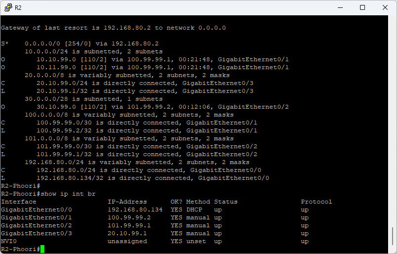
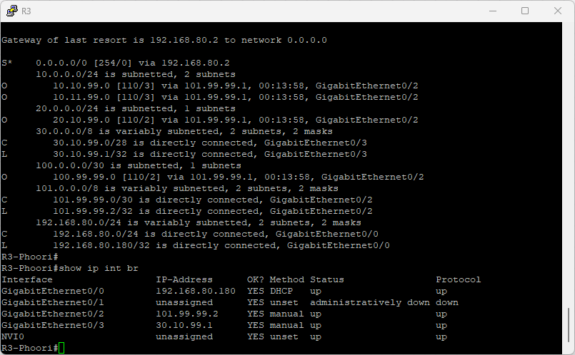
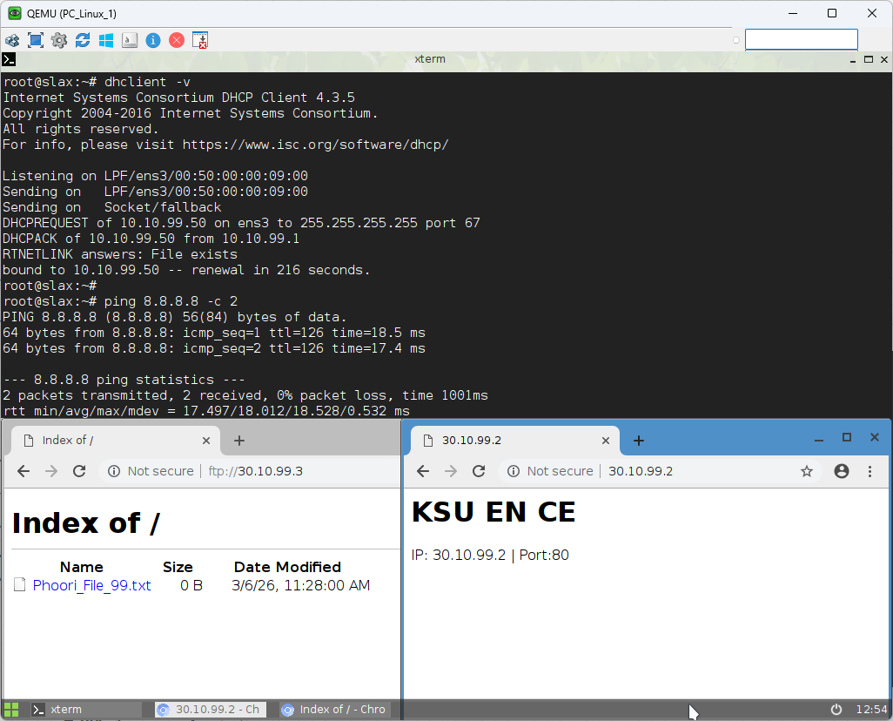
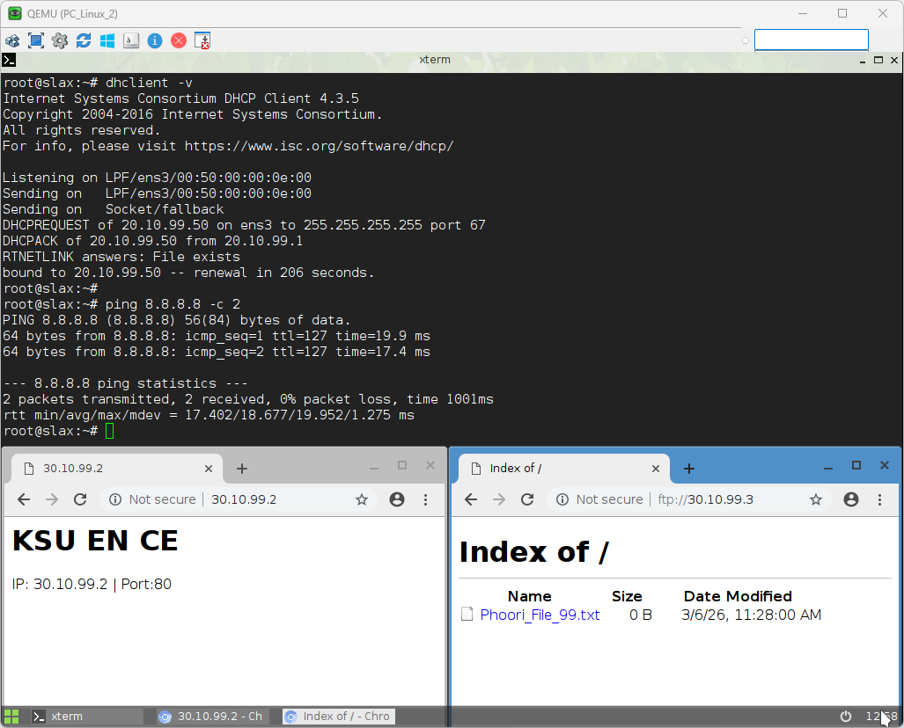
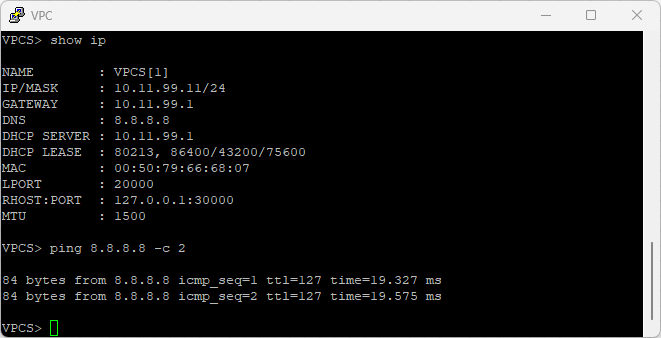
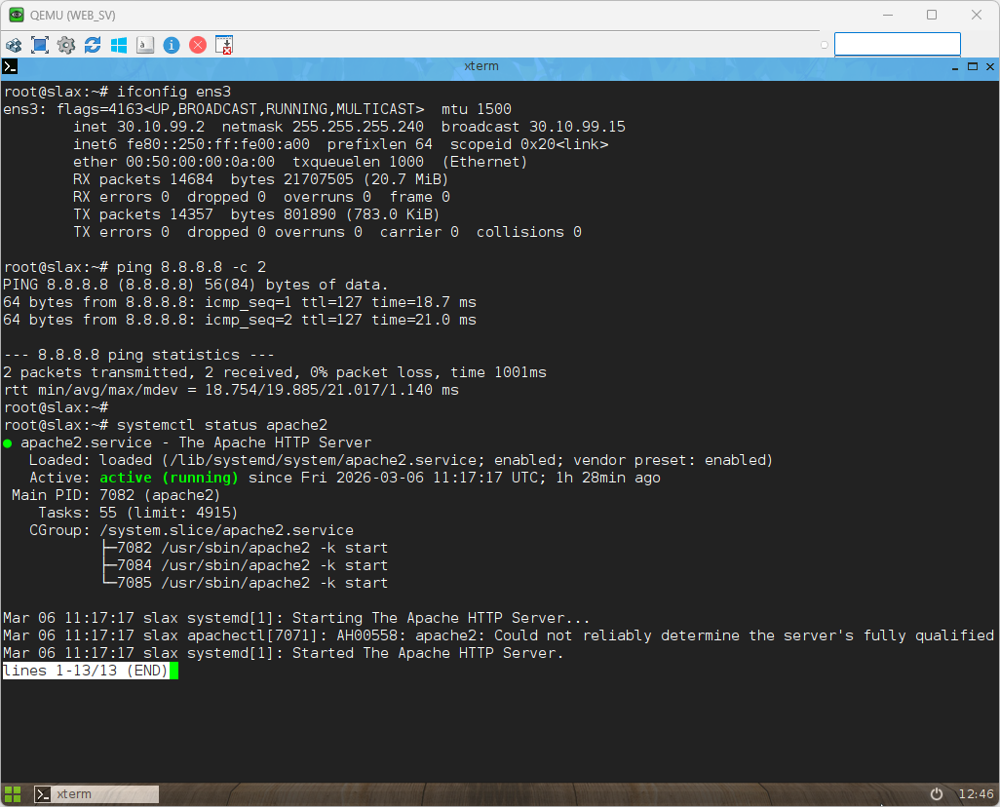
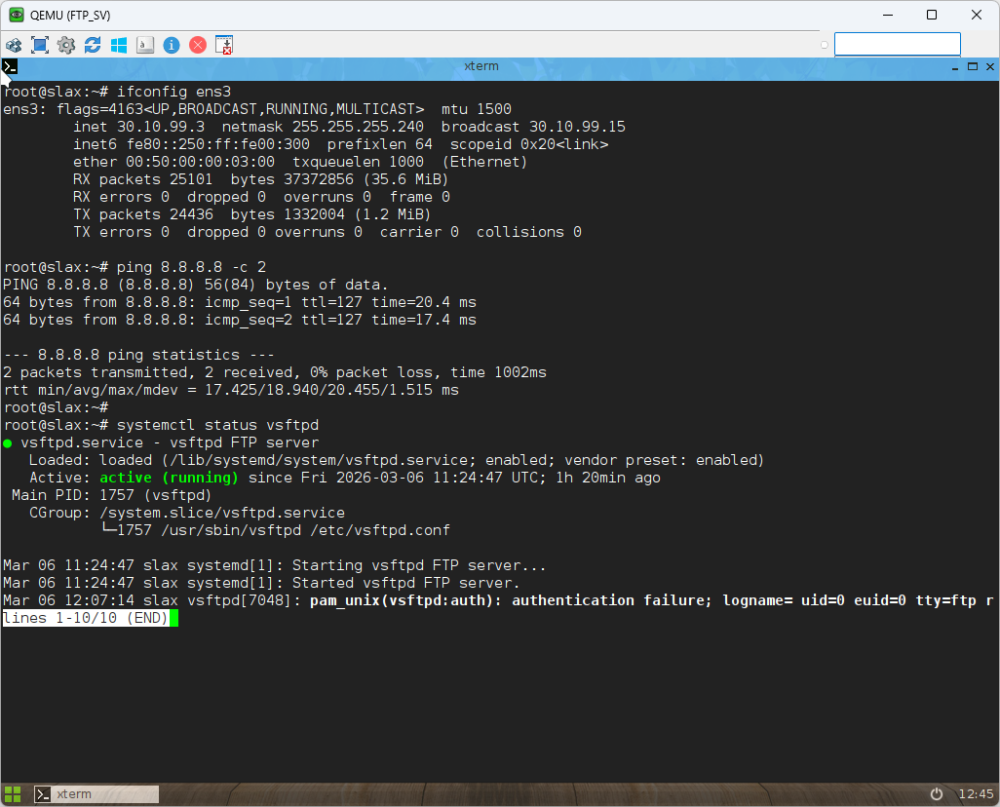
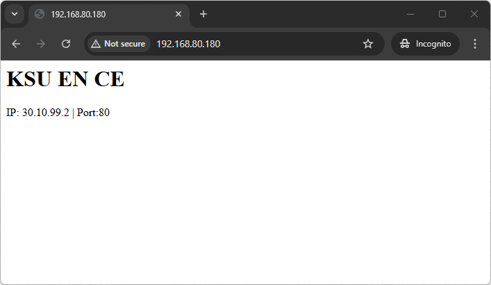

# 📝 ข้อสอบปฏิบัติ Network Engineering — EVE-NG

> **เวลาสอบ:** 3 ชั่วโมง | **คะแนนเต็ม:** 100 คะแนน
> **xx = เลขที่นักศึกษา 2 หลักสุดท้าย (Student Number)**

---

## 👤 ชื่อ-นามสกุล: _________________________________ รหัส: _________________

---

## 📊 Exam Topology (ภาพรวม)

```
                    ISP / Internet (Net)
           ┌──────────────┬──────────────┐
        Gi0/0          Gi0/0          Gi0/0
     ┌──────┐        ┌──────┐        ┌──────┐
     │  R1  ├─Gi0/1──┤  R2  ├─Gi0/2──┤  R3  │
     └──┬───┘  Gi0/1 └──┬───┘  Gi0/2 └──┬───┘
        │               │               │
     Gi0/3           Gi0/3           Gi0/3
 10.10.xx.1/24   20.10.xx.1/24   30.10.xx.1/28
 10.11.xx.1/24      (DHCP)          (Static)
 (Sub-Interfaces)     │                │
        │          ┌──┴──┐          ┌──┴──┐
     ┌──┴──┐       │ SW2 │          │ SW3 │
     │ SW1 │       └──┬──┘          └┬───┬┘
     └┬───┬┘       Gi0/1          Gi0/1  Gi0/2
  Gi0/1  Gi0/2        │               │      │
    │      │       PC_Linux_2      WEB_SV  FTP_SV
PC_Linux_1 VPC       (DHCP)    30.10.xx.2/28  30.10.xx.3/28
(VLAN1xx) (VLAN2xx)              (Static)    (Static)
  DHCP     DHCP
```


**WAN Point-to-Point Links:**

| Link | R (Left) | Interface | IP | Interface | R (Right) | IP |
|------|----------|-----------|----|-----------|-----------|----|
| R1↔R2 | R1 | Gi0/1 | `100.xx.xx.1/30` | Gi0/1 | R2 | `100.xx.xx.2/30` |
| R2↔R3 | R2 | Gi0/2 | `101.xx.xx.1/30` | Gi0/2 | R3 | `101.xx.xx.2/30` |

---

## 📋 IP Addressing Table

| Device | Interface | IP Address | Subnet | หมายเหตุ |
|--------|-----------|-----------|--------|---------|
| **R1** | Gi0/0 | DHCP จาก ISP | — | WAN → ISP/Internet |
| **R1** | Gi0/1 | `100.xx.xx.1/30` | /30 | WAN ↔ R2 |
| **R1** | Gi0/3.1xx | `10.10.xx.1/24` | /24 | LAN Gateway VLAN1xx + DHCP |
| **R1** | Gi0/3.2xx | `10.11.xx.1/24` | /24 | LAN Gateway VLAN2xx + DHCP |
| **R2** | Gi0/0 | DHCP จาก ISP | — | WAN → ISP/Internet |
| **R2** | Gi0/1 | `100.xx.xx.2/30` | /30 | WAN ↔ R1 |
| **R2** | Gi0/2 | `101.xx.xx.1/30` | /30 | WAN ↔ R3 |
| **R2** | Gi0/3 | `20.10.xx.1/24` | /24 | LAN Gateway + DHCP Server |
| **R3** | Gi0/0 | DHCP จาก ISP | — | WAN → ISP/Internet |
| **R3** | Gi0/2 | `101.xx.xx.2/30` | /30 | WAN ↔ R2 |
| **R3** | Gi0/3 | `30.10.xx.1/28` | /28 | LAN Gateway (Static) |
| **PC_Linux_1** | e0 | DHCP | /24 | VLAN1xx บน SW1 |
| **VPC** | eth0 | DHCP | /24 | VLAN2xx บน SW1 |
| **PC_Linux_2** | e0 | DHCP | /24 | บน SW2 |
| **WEB_SV** | e0 | `30.10.xx.2/28` | /28 | Static, บน SW3 Gateway=30.10.xx.1 |
| **FTP_SV** | e0 | `30.10.xx.3/28` | /28 | Static, บน SW3 Gateway=30.10.xx.1 |

### VLAN Table (SW1 เท่านั้น)

| VLAN ID | Name | หมายเหตุ |
|---------|------|---------|
| 1xx | Member | PC_Linux_1 — xx = Student Number (เช่น นักศึกษา 01 → VLAN 101) |
| 2xx | Customer | VPC — xx = Student Number |

### Connection Table

| From | Interface | To | Interface | Type |
|------|-----------|----|-----------|------|
| R1 | Gi0/0 | Net (ISP) | — | Internet WAN |
| R2 | Gi0/0 | Net (ISP) | — | Internet WAN |
| R3 | Gi0/0 | Net (ISP) | — | Internet WAN |
| R1 | Gi0/1 | R2 | Gi0/1 | Routed WAN 100.xx.xx.0/30 |
| R2 | Gi0/2 | R3 | Gi0/2 | Routed WAN 101.xx.xx.0/30 |
| R1 | Gi0/3 | SW1 | Gi0/0 | Trunk (Inter-VLAN Routing) |
| R2 | Gi0/3 | SW2 | Gi0/0 | LAN 20.10.xx.0/24 |
| R3 | Gi0/3 | SW3 | Gi0/0 | LAN Static 30.10.xx.0/28 |
| SW1 | Gi0/1 | PC_Linux_1 | e0 | Access VLAN1xx |
| SW1 | Gi0/2 | VPC | eth0 | Access VLAN2xx |
| SW2 | Gi0/1 | PC_Linux_2 | e0 | Access |
| SW3 | Gi0/1 | WEB_SV | e0 | Access (Static IP) |
| SW3 | Gi0/2 | FTP_SV | e0 | Access (Static IP) |

---

---

# ส่วนที่ 1 — Basic Device Configuration (10 คะแนน)

> **อ้างอิง:** Lab 03_Switch Config, 04_Basic Switch

## Task 1.1: ตั้งค่าพื้นฐานบน Router และ Switch ทุกตัว (8 คะแนน)

กำหนดค่าต่อไปนี้บน **R1, R2, R3** และ **SW1, SW2, SW3**:

| การตั้งค่า | ค่าที่ต้องการ |
|-----------|-------------|
| Hostname | ชื่อตามแผนผัง (`R1`, `R2`, `R3`, `R4`, `SW1`…) |
| Enable secret | `cisco123` |
| Console password | `console123` |
| VTY password | `vty123` |
| Banner MOTD | `Authorized Access Only` |

```bash
enable
configure terminal
hostname R1
enable secret cisco123
line console 0
 password console123
 login
line vty 0 4
 password vty123
 login
banner motd # Authorized Access Only #
end
write memory
```

**เกณฑ์:** อุปกรณ์ละ 1 คะแนน × 6 = 6 คะแนน

---

## Task 1.2: บันทึกและตรวจสอบ (4 คะแนน)

```bash
copy running-config startup-config
show running-config
```

**ตอบบนกระดาษ:**
1. คำสั่ง show ที่แสดง IOS version และ hostname คือ? `___________`

---

---

# ส่วนที่ 2 — IP Addressing (10 คะแนน)

> **อ้างอิง:** Lab 08_Basic_Routing

## Task 2.1: กำหนด IP บน Router ทุกตัว (10 คะแนน)

ตั้งค่า IP ตาม IP Addressing Table บนทุก interface (**ยกเว้น** Gi0/0 ที่รับ DHCP จาก ISP):

```bash
! ตัวอย่างบน R1 — WAN + Sub-Interfaces (Inter-VLAN)
interface GigabitEthernet0/1
 ip address 100.xx.xx.1 255.255.255.252
 no shutdown

interface GigabitEthernet0/3
 no ip address
 no shutdown

interface GigabitEthernet0/3.1xx
 encapsulation dot1Q 1xx
 ip address 10.10.xx.1 255.255.255.0

interface GigabitEthernet0/3.2xx
 encapsulation dot1Q 2xx
 ip address 10.11.xx.1 255.255.255.0
```

```bash
! ตัวอย่างบน R3
interface GigabitEthernet0/2
 ip address 101.xx.xx.2 255.255.255.252
 no shutdown

interface GigabitEthernet0/3
 ip address 30.10.xx.1 255.255.255.240
 no shutdown
```

**ตรวจสอบ:**
```bash
show ip interface brief
```







**เกณฑ์:** R1 = 4 คะแนน (รวม sub-interfaces) | R2 = 3 คะแนน | R3 = 3 คะแนน

---

---

# ส่วนที่ 3 — VLAN Configuration (10 คะแนน)

> **อ้างอิง:** Lab 05_VLAN

## Task 3.1: สร้าง VLAN บน SW1 (2 คะแนน)

สร้าง VLAN ต่อไปนี้บน **SW1**:

| VLAN ID | Name |
|---------|------|
| 1xx | Member |
| 2xx | Customer |

```bash
! บน SW1 (แทน xx ด้วยรหัสนักศึกษา เช่น xx=01 → VLAN 101, VLAN 201)
vlan 1xx
 name Member
vlan 2xx
 name Customer
```

---

## Task 3.2: กำหนด Access Port บน SW1 (2 คะแนน)

| Interface | VLAN | Device |
|-----------|------|--------|
| Gi0/1 | 1xx | PC_Linux_1 |
| Gi0/2 | 2xx | VPC |

```bash
interface GigabitEthernet0/1
 switchport mode access
 switchport access vlan 1xx
 no shutdown

interface GigabitEthernet0/2
 switchport mode access
 switchport access vlan 2xx
 no shutdown
```

---

## Task 3.3: ตั้งค่า Trunk Port บน SW1 (2 คะแนน)

ตั้งค่า Gi0/0 บน SW1 เป็น trunk port เชื่อมต่อไป R1:

```bash
! บน SW1
interface GigabitEthernet0/0
 switchport trunk encapsulation dot1q
 switchport mode trunk
 no shutdown
```

---

## Task 3.4: Inter-VLAN Routing บน R1 (2 คะแนน)

ตั้งค่า sub-interfaces บน R1 Gi0/3 เพื่อ Router-on-a-Stick:

```bash
! บน R1
interface GigabitEthernet0/3
 no ip address
 no shutdown

interface GigabitEthernet0/3.1xx
 encapsulation dot1Q 1xx
 ip address 10.10.xx.1 255.255.255.0

interface GigabitEthernet0/3.2xx
 encapsulation dot1Q 2xx
 ip address 10.11.xx.1 255.255.255.0
```

---

## Task 3.5: ตรวจสอบ (2 คะแนน)

```bash
show vlan brief
show interfaces switchport
show ip interface brief
```

**ตอบบนกระดาษ:**
1. VLAN ID ของ PC_Linux_1 คืออะไร? `___________`
2. VLAN ID ของ VPC คืออะไร? `___________`

---

---

# ส่วนที่ 4 — DHCP Server (10 คะแนน)

> **อ้างอิง:** Lab 15_DHCP

## Task 4.1: ตั้งค่า DHCP Pool บน R1, R2, R3 (8 คะแนน)

| Router | Pool Name | Network | Gateway | DNS |
|--------|-----------|---------|---------|-----|
| R1 | VLAN1xx_POOL | 10.10.xx.0/24 | 10.10.xx.1 | 30.10.xx.2 |
| R1 | VLAN2xx_POOL | 10.11.xx.0/24 | 10.11.xx.1 | 30.10.xx.2 |
| R2 | LAN_R2 | 20.10.xx.0/24 | 20.10.xx.1 | 30.10.xx.2 |

```bash
! บน R1 — VLAN1xx Pool
ip dhcp excluded-address 10.10.xx.1 10.10.xx.10
ip dhcp pool VLAN1xx_POOL
 network 10.10.xx.0 255.255.255.0
 default-router 10.10.xx.1
 dns-server 30.10.xx.2
 lease 1

! บน R1 — VLAN2xx Pool
ip dhcp excluded-address 10.11.xx.1 10.11.xx.10
ip dhcp pool VLAN2xx_POOL
 network 10.11.xx.0 255.255.255.0
 default-router 10.11.xx.1
 dns-server 30.10.xx.2
 lease 1

! บน R2
ip dhcp excluded-address 20.10.xx.1 20.10.xx.10
ip dhcp pool LAN_R2
 network 20.10.xx.0 255.255.255.0
 default-router 20.10.xx.1
 dns-server 30.10.xx.2
 lease 1
```

**เกณฑ์:** R1 = 4 คะแนน (2 pools) | R2 = 4 คะแนน

---

## Task 4.2: ทดสอบ DHCP (2 คะแนน)

บน PC_Linux_1 หรือ PC_Linux_2:
```bash
# Linux
dhclient eth0 && ip a show eth0

# VPCS
dhcp
show ip
```







**เกณฑ์:** PC ได้รับ IP ในช่วงที่กำหนด: 2 คะแนน

---

---

# ส่วนที่ 5 — Static Routing (5 คะแนน)

> **อ้างอิง:** Lab 08_Basic_Routing

## Task 5.1: ตั้งค่า Static Route (4 คะแนน)

เพิ่ม static route ให้ R1 รู้จัก network ของ R2, R3, R4 และในทางกลับกัน:

```bash
! บน R1 — route ไปยัง R2 LAN และ R3 LAN
ip route 20.10.xx.0 255.255.255.0 100.xx.xx.2
ip route 30.10.xx.0 255.255.255.240 100.xx.xx.2
ip route 101.xx.xx.0 255.255.255.252 100.xx.xx.2

! บน R2 — route ไปยัง R1 LANs และ R3 LAN
ip route 10.10.xx.0 255.255.255.0 100.xx.xx.1
ip route 10.11.xx.0 255.255.255.0 100.xx.xx.1
ip route 30.10.xx.0 255.255.255.240 101.xx.xx.2

! บน R3 — route ไปยัง R1 LANs และ R2 LAN
ip route 10.10.xx.0 255.255.255.0 101.xx.xx.1
ip route 10.11.xx.0 255.255.255.0 101.xx.xx.1
ip route 20.10.xx.0 255.255.255.0 101.xx.xx.1
```

**เกณฑ์:** static route ถูกต้องครบ: 4 คะแนน

---

## Task 5.2: ตรวจสอบ (1 คะแนน)

```bash
show ip route
ping 30.10.xx.2 source 10.10.xx.1
```

**ตอบบนกระดาษ:**
- รหัสที่ปรากฏหน้า static route ใน routing table คือ? `___________`

---

---

# ส่วนที่ 6 — Dynamic Routing — OSPF (10 คะแนน)

> **อ้างอิง:** Lab 10_OSPF_Lab

## Task 6.1: แทนที่ Static Route ด้วย OSPF (8 คะแนน)

**ลบ static route เดิมก่อน** แล้วตั้งค่า OSPF บน R1, R2, R3:

| Router | Process ID | Area | Networks ที่ Advertise |
|--------|-----------|------|----------------------|
| R1 | 1 | 0 | 100.xx.xx.0/30, 10.10.xx.0/24, 10.11.xx.0/24 |
| R2 | 1 | 0 | 100.xx.xx.0/30, 101.xx.xx.0/30, 20.10.xx.0/24 |
| R3 | 1 | 0 | 101.xx.xx.0/30, 30.10.xx.0/28 |

```bash
! บน R1
router ospf 1
 network 100.xx.xx.0 0.0.0.3 area 0
 network 10.10.xx.0 0.0.0.255 area 0
 network 10.11.xx.0 0.0.0.255 area 0
 default-information originate
```

**เกณฑ์:** R1 = 3 | R2 = 3 | R3 = 2 คะแนน

---

## Task 6.2: ตรวจสอบ OSPF (2 คะแนน)

```bash
show ip ospf neighbor
show ip route ospf
```

**ตอบบนกระดาษ:**
1. OSPF Neighbor State ที่สมบูรณ์คืออะไร? `___________`
2. R1 เห็น route ไปยัง 30.10.xx.0/28 ผ่าน next-hop IP ใด? `___________`

---

---

# ส่วนที่ 7 — NAT/PAT (10 คะแนน)

> **อ้างอิง:** Lab 14_NAT_Configuration

## Task 7.1: กำหนด Inside/Outside บน R1–R3 (2 คะแนน)

| Router | Interface | NAT Role |
|--------|-----------|----------|
| R1 | Gi0/0 | `ip nat outside` |
| R1 | Gi0/1, Gi0/3.1xx, Gi0/3.2xx | `ip nat inside` |
| R2 | Gi0/0 | `ip nat outside` |
| R2 | Gi0/1, Gi0/2, Gi0/3 | `ip nat inside` |
| R3 | Gi0/0 | `ip nat outside` |
| R3 | Gi0/2, Gi0/3 | `ip nat inside` |

---

## Task 7.2: ตั้งค่า PAT (NAT Overload) บนทุก Router (6 คะแนน)

```bash
! บน R1 — permit ทั้ง 2 VLANs
access-list 1 permit 10.10.xx.0 0.0.0.255
access-list 1 permit 10.11.xx.0 0.0.0.255

ip nat inside source list 1 interface GigabitEthernet0/0 overload
```

**เกณฑ์:** R1 = 2 | R2 = 2 | R3 = 2 คะแนน

---

## Task 7.3: ทดสอบ (2 คะแนน)

```bash
! จาก PC_Linux_1 ping ออก Internet
ping 8.8.8.8

! ตรวจสอบบน R1
show ip nat translations
show ip nat statistics
```

---

---

# ส่วนที่ 8 — ACL Security (10 คะแนน)

> **อ้างอิง:** Lab 13_ACL_Security

## Task 8.1: Standard ACL — จำกัด VLAN2xx ไม่ให้เข้าถึง R3 LAN (4 คะแนน)

สร้าง ACL บน **R1** เพื่อ Block VPC (VLAN2xx, 10.11.xx.0/24) ไม่ให้ ping ไปที่ `30.10.xx.0/28`:

```bash
access-list 20 deny   10.11.xx.0 0.0.0.255
access-list 20 permit any

interface GigabitEthernet0/3.2xx
 ip access-group 20 in
```

**เกณฑ์:** ACL สร้างถูก: 2 | Apply ถูก direction: 2 คะแนน

---

## Task 8.2: Extended ACL — อนุญาตเฉพาะ HTTP/HTTPS ไปยัง WEB_SV (4 คะแนน)

อนุญาตให้ PC_Linux_1 (VLAN1xx) เข้า WEB_SV (`30.10.xx.2`) เฉพาะ port 80 และ 443:

```bash
access-list 110 permit tcp 10.10.xx.0 0.0.0.255 host 30.10.xx.2 eq 80
access-list 110 permit tcp 10.10.xx.0 0.0.0.255 host 30.10.xx.2 eq 443
access-list 110 deny   ip  10.10.xx.0 0.0.0.255 host 30.10.xx.2
access-list 110 permit ip any any
```

**เกณฑ์:** ACL ถูกต้องครบ: 4 คะแนน

---

## Task 8.3: ตรวจสอบ (2 คะแนน)

```bash
show access-lists
show ip interface GigabitEthernet0/3
```

---

---

# ส่วนที่ 9 — WEB Server & FTP Server (10 คะแนน)

> อ้างอิง: การตั้งค่า Static IP บน Linux Server

## Task 9.1: ตั้งค่า Static IP บน WEB_SV และ FTP_SV (4 คะแนน)

**WEB_SV** (`30.10.xx.2/28`):
```bash
# บน Linux (Debian/Ubuntu)
ip addr add 30.10.xx.2/28 dev eth0
ip route add default via 30.10.xx.1
```

**FTP_SV** (`30.10.xx.3/28`):
```bash
ip addr add 30.10.xx.3/28 dev eth0
ip route add default via 30.10.xx.1
```

---

## Task 9.2: ทดสอบ WEB Service (4 คะแนน)

จาก WEB_SV ตรวจสอบว่า Apache/Nginx ทำงาน:
```bash
# ตรวจสอบ service
systemctl status apache2
# หรือ
systemctl status nginx

# Test จาก PC_Linux_1
curl http://30.10.xx.2
```

**เกณฑ์:** WEB_SV เข้าถึงได้จาก PC ใน LAN: 4 คะแนน

---

## Task 9.3: ทดสอบ Connectivity (2 คะแนน)

```bash
! จาก PC_Linux_1 ping ไปยัง WEB_SV และ FTP_SV
ping 30.10.xx.2
ping 30.10.xx.3
```





---

---

# ส่วนที่ 10 — DNS Server (10 คะแนน)

> อ้างอิง: Lab 16_DNS

## Task 10.1: ติดตั้งและตั้งค่า DNS บน WEB_SV (4 คะแนน)

ติดตั้ง dnsmasq เพื่อ resolve ชื่อ:

| Hostname | IP |
|----------|----|  
| web.local | 30.10.xx.2 |
| ftp.local | 30.10.xx.3 |

```bash
# บน WEB_SV
apt-get install dnsmasq -y

# แก้ไข /etc/dnsmasq.conf
address=/web.local/30.10.xx.2
address=/ftp.local/30.10.xx.3

# เริ่ม service
systemctl start dnsmasq
systemctl enable dnsmasq
```



---

## Task 10.2: อัปเดต DHCP Pools ให้ชี้ DNS ไปที่ WEB_SV (4 คะแนน)

ตรวจสอบว่า DHCP pool ทุกตัวมี dns-server ชี้ 30.10.xx.2 (ตั้งค่าแล้วใน Section 4):

```bash
! ตรวจสอบบน R1 และ R2
show ip dhcp pool
show running-config | include dns-server
```

**เกณฑ์:** DNS ติดตั้งบน WEB_SV: 2 | DHCP ชี้ DNS ถูกต้อง: 2 คะแนน

---

## Task 10.3: ทดสอบ DNS (2 คะแนน)

```bash
# ทดสอบ DNS
nslookup web.local 30.10.xx.2
dig @30.10.xx.2 web.local
nslookup ftp.local 30.10.xx.2
```

**เกณฑ์:** DNS resolve ถูกต้องทั้ง 2 ชื่อ: 2 คะแนน

---

---

# ส่วนที่ 11 — BGP (5 คะแนน)

> **อ้างอิง:** Lab 12_BGP

## Task 11.1: ตั้งค่า eBGP ระหว่าง R1, R2, R3 และ ISP (4 คะแนน)

| Router | AS Number | Neighbor IP | Neighbor AS |
|--------|-----------|-------------|-------------|
| R1 | 65001 | (ISP Gi0/0) | 65000 |
| R2 | 65002 | (ISP Gi0/0) | 65000 |
| R3 | 65003 | (ISP Gi0/0) | 65000 |

```bash
! บน R1
router bgp 65001
 bgp router-id 1.1.1.1
 neighbor <ISP_IP> remote-as 65000
 network 10.10.xx.0 mask 255.255.255.0
 network 10.11.xx.0 mask 255.255.255.0
```

**เกณฑ์:** R1 BGP = 2 | R2 BGP = 2 คะแนน

---

## Task 11.2: ตรวจสอบ (1 คะแนน)

```bash
show ip bgp summary
show ip bgp
```

**ตอบบนกระดาษ:**
- BGP State ที่ established แสดงค่าตัวเลขอะไรใน `show ip bgp summary`? `___________`

---

---

# ส่วนที่ 12 — RIP Dynamic Routing (5 คะแนน)

> **อ้างอิง:** Lab 09_RIP_Lab

## Task 12.1: แทนที่ OSPF ด้วย RIPv2 (4 คะแนน)

**ลบ OSPF เดิมก่อน** แล้วตั้งค่า RIPv2 บน R1, R2, R3:

```bash
! ลบ OSPF
no router ospf 1

! ตั้งค่า RIPv2 บน R1
router rip
 version 2
 no auto-summary
 network 100.xx.xx.0
 network 10.10.xx.0
 network 10.11.xx.0
```

**เกณฑ์:** R1 = 1 | R2 = 2 | R3 = 1 คะแนน

---

## Task 12.2: ตรวจสอบ (1 คะแนน)

```bash
show ip rip database
show ip route rip
```

---

---

# 📋 สรุปคะแนน

| ส่วน | หัวข้อ | เต็ม | ได้ |
|-----|--------|------|-----|
| 1 | Basic Device Configuration | 10 | |
| 2 | IP Addressing | 10 | |
| 3 | VLAN Configuration | 10 | |
| 4 | DHCP Server (Router) | 10 | |
| 5 | Static Routing | 5 | |
| 6 | OSPF Dynamic Routing | 10 | |
| 7 | NAT/PAT | 10 | |
| 8 | ACL Security | 10 | |
| 9 | WEB & FTP Server | 10 | |
| 10 | DHCP/DNS Server | 10 | |
| 11 | BGP | 5 | |
| 12 | RIP Dynamic Routing | 5 | |
| **รวม** | | **100** | |

---

---

# 🔍 คำสั่ง Verify รวม

```bash
! ===== Basic =====
show running-config
show version
show ip interface brief

! ===== VLAN =====
show vlan brief
show interfaces switchport

! ===== Routing =====
show ip route
show ip route ospf
show ip route rip
show ip route static

! ===== Routing Protocols =====
show ip ospf neighbor
show ip rip database
show ip bgp summary

! ===== NAT =====
show ip nat translations
show ip nat statistics

! ===== DHCP =====
show ip dhcp binding
show ip dhcp pool

! ===== ACL =====
show access-lists
show ip interface
```

---

# ⚠️ เกณฑ์ตัดคะแนน

| สิ่งที่ผิด | หักคะแนน |
|-----------|---------|
| ไม่ `write memory` / `copy run start` | −2 คะแนนต่อ device |
| Interface ไม่ `no shutdown` | −1 คะแนนต่อ interface |
| Inside/Outside NAT สลับกัน | ส่วนที่ 7 = 0 คะแนน |
| ACL apply ผิด direction | −2 คะแนน |
| IP Address ผิด Subnet | −1 คะแนนต่อ interface |

---

> **โชคดีกับการสอบ!** 🎯
> [@alfaXphoori](https://www.github.com/alfaXphoori)

