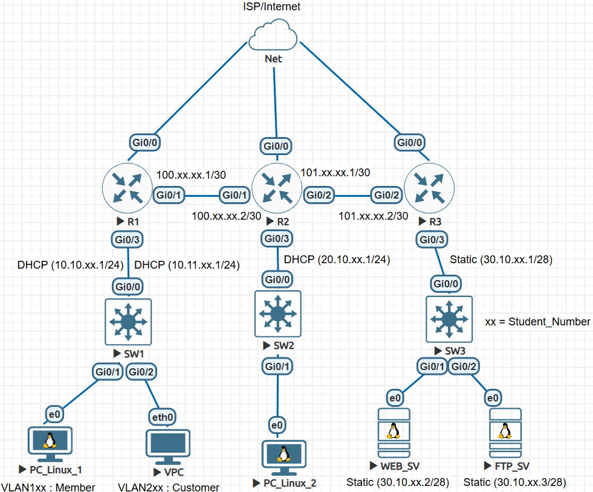

# 📝 ข้อสอบปฏิบัติ — Network Engineering (EVE-NG)

> ⏱️ **เวลาสอบ:** 3 ชั่วโมง &nbsp;|&nbsp; 🎯 **คะแนนเต็ม:** 20 คะแนน
>
> 📌 **หมายเหตุ:** `xx` = เลขที่นักศึกษา **2 หลักสุดท้าย** &nbsp;เช่น รหัส `...01` → `xx = 01`

---

## 👥 รายชื่อนักศึกษา

| เลขที่ | ชื่อ-นามสกุล | เลขที่ | ชื่อ-นามสกุล |
|:------:|-------------|:------:|-------------|
| 1 | นายอัธฑสัณ เอาะตะเมาะ | 11 | นายชนาธิป แก้วคำสอน |
| 2 | นายศักยริกข์ กาญจันดา | 12 | นางสาวกาญจนสุดา โยธพล |
| 3 | นายกฤตนัย ดอนแสง | 13 | นายธนวรรธน์ บุญรอด |
| 4 | นายดุลยฤทธิ์ บุญเรือน | 14 | นางสาวพัฒน์นรี เรืองดิษฐ |
| 5 | นายพงศกร แก้วจันทร์ | 15 | นางสาวมณีรัตน์ ศิริกุล |
| 6 | นายกิตติพัฒน์ ประชุมสาร | 16 | นายนภัสกร ทิมินกุล |
| 7 | นายธีรเทพ พันธ์ประดับ | 17 | นายรัฐภูมิ ผุดผ่อง |
| 8 | นายธรรมรัตน์ ไพลสาลี | 18 | นายภัคพล ทองจรัส |
| 9 | นายวิทวัส บุญแสนยศ | 19 | นายนภัสกรพรรณ พรมช่วย |
| 10 | นางสาวภัทรประภา วงศ์เมืองกลาง | 20 | นายก้องภพ เดชพรรณา |

---

## 📊 Topology ภาพรวม

```
                       ISP / Internet (Net)
              ┌──────────────┬──────────────┐
           Gi0/0          Gi0/0          Gi0/0
        ┌──────┐        ┌──────┐        ┌──────┐
        │  R1  ├─Gi0/1──┤  R2  ├─Gi0/2──┤  R3  │
        └──┬───┘  Gi0/1 └──┬───┘  Gi0/2 └──┬───┘
           │               │               │
        Gi0/3           Gi0/3           Gi0/3
    10.10.xx.1/24   20.10.xx.1/24   30.10.xx.1/28
    10.11.xx.1/24      (DHCP)          (Static)
    (Sub-Interfaces)     │                │
           │          ┌──┴──┐         ┌───┴───┐
        ┌──┴──┐       │ SW2 │         │  SW3  │
        │ SW1 │       └──┬──┘         └──┬──┬─┘
        └┬───┬┘       Gi0/1          Gi0/1  Gi0/2
     Gi0/1  Gi0/2        │              │       │
       │       │     PC_Linux_2     WEB_SV   FTP_SV
  PC_Linux_1  VPC      (DHCP)   30.10.xx.2/28  30.10.xx.3/28
  (VLAN1xx) (VLAN2xx)             (Static)     (Static)
    DHCP      DHCP
```



### WAN Point-to-Point Links

| Link | อุปกรณ์ (ซ้าย) | Interface | IP Address | Interface | อุปกรณ์ (ขวา) | IP Address |
|:----:|:--------------:|:---------:|:----------:|:---------:|:-------------:|:----------:|
| R1 ↔ R2 | R1 | Gi0/1 | `100.xx.xx.1/30` | Gi0/1 | R2 | `100.xx.xx.2/30` |
| R2 ↔ R3 | R2 | Gi0/2 | `101.xx.xx.1/30` | Gi0/2 | R3 | `101.xx.xx.2/30` |

---

## 📋 ตารางกำหนด IP Address

| Device | Interface | IP Address | Subnet | หมายเหตุ |
|:------:|:---------:|:----------:|:------:|---------|
| **R1** | Gi0/0 | DHCP จาก ISP | — | WAN → ISP/Internet |
| **R1** | Gi0/1 | `100.xx.xx.1/30` | /30 | WAN ↔ R2 |
| **R1** | Gi0/3.1xx | `10.10.xx.1/24` | /24 | Sub-interface — LAN Gateway VLAN1xx + DHCP |
| **R1** | Gi0/3.2xx | `10.11.xx.1/24` | /24 | Sub-interface — LAN Gateway VLAN2xx + DHCP |
| **R2** | Gi0/0 | DHCP จาก ISP | — | WAN → ISP/Internet |
| **R2** | Gi0/1 | `100.xx.xx.2/30` | /30 | WAN ↔ R1 |
| **R2** | Gi0/2 | `101.xx.xx.1/30` | /30 | WAN ↔ R3 |
| **R2** | Gi0/3 | `20.10.xx.1/24` | /24 | LAN Gateway + DHCP Server |
| **R3** | Gi0/0 | DHCP จาก ISP | — | WAN → ISP/Internet |
| **R3** | Gi0/2 | `101.xx.xx.2/30` | /30 | WAN ↔ R2 |
| **R3** | Gi0/3 | `30.10.xx.1/28` | /28 | LAN Gateway (Static) |
| **PC_Linux_1** | e0 | DHCP | /24 | VLAN1xx บน SW1 |
| **VPC** | eth0 | DHCP | /24 | VLAN2xx บน SW1 |
| **PC_Linux_2** | e0 | DHCP | /24 | บน SW2 |
| **WEB_SV** | e0 | `30.10.xx.2/28` | /28 | Static — บน SW3, Gateway = `30.10.xx.1` |
| **FTP_SV** | e0 | `30.10.xx.3/28` | /28 | Static — บน SW3, Gateway = `30.10.xx.1` |

### ตาราง VLAN (SW1 เท่านั้น)

| VLAN ID | Name | Device | ตัวอย่าง (xx = 01) |
|:-------:|:----:|:------:|:-----------------:|
| 1xx | Member | PC_Linux_1 | VLAN 101 |
| 2xx | Customer | VPC | VLAN 201 |

### ตาราง Connection

| จาก | Interface | ไปยัง | Interface | ประเภท |
|:---:|:---------:|:-----:|:---------:|-------|
| R1 | Gi0/0 | Net (ISP) | — | Internet WAN |
| R2 | Gi0/0 | Net (ISP) | — | Internet WAN |
| R3 | Gi0/0 | Net (ISP) | — | Internet WAN |
| R1 | Gi0/1 | R2 | Gi0/1 | Routed WAN — `100.xx.xx.0/30` |
| R2 | Gi0/2 | R3 | Gi0/2 | Routed WAN — `101.xx.xx.0/30` |
| R1 | Gi0/3 | SW1 | Gi0/0 | Trunk (Inter-VLAN Routing) |
| R2 | Gi0/3 | SW2 | Gi0/0 | LAN — `20.10.xx.0/24` |
| R3 | Gi0/3 | SW3 | Gi0/0 | LAN Static — `30.10.xx.0/28` |
| SW1 | Gi0/1 | PC_Linux_1 | e0 | Access VLAN1xx |
| SW1 | Gi0/2 | VPC | eth0 | Access VLAN2xx |
| SW2 | Gi0/1 | PC_Linux_2 | e0 | Access |
| SW3 | Gi0/1 | WEB_SV | e0 | Access (Static IP) |
| SW3 | Gi0/2 | FTP_SV | e0 | Access (Static IP) |

---

## ✅ Tasks ที่ต้องทำ

| # | Task | รายละเอียด |
|:-:|------|-----------|
| 1 | **ตั้งชื่ออุปกรณ์** | ตั้งชื่อทุก Device ในรูปแบบ `R1-ชื่อนักศึกษา`, `SW1-ชื่อนักศึกษา`, ... |
| 2 | **WAN Interface (DHCP)** | ตั้งค่า Gi0/0 ของ R1, R2, R3 ให้รับ IP จาก DHCP ของ ISP |
| 3 | **IP Addressing** | กำหนด IP Address และ Subnet Mask ตามตาราง IP Addressing Table |
| 4 | **VLAN บน SW1** | สร้าง VLAN1xx (Member) และ VLAN2xx (Customer) ตามตาราง VLAN Table |
| 5 | **Trunk Port** | ตั้งค่า Trunk Port บน Link ระหว่าง R1 (Gi0/3) ↔ SW1 (Gi0/0) |
| 6 | **DHCP — R1** | ตั้งค่า DHCP Pool สำหรับ VLAN1xx (`10.10.xx.0/24`) และ VLAN2xx (`10.11.xx.0/24`) |
| 7 | **DHCP — R2** | ตั้งค่า DHCP Pool สำหรับ LAN `20.10.xx.0/24` |
| 8 | **Static IP — R3 / WEB_SV / FTP_SV** | กำหนด IP แบบ Static ตามตาราง IP Addressing Table |
| 9 | **OSPF Routing** | ตั้งค่า OSPF บน R1, R2, R3 เพื่อให้ทุกเครือข่ายสามารถสื่อสารกันได้ |
| 10 | **NAT (PAT) — R1, R2, R3** | ตั้งค่า NAT Overload บนทุก Router เพื่อให้ LAN เข้าถึง Internet ได้ |
| 11 | **PAT Inbound — R3** | ตั้งค่า Port Forwarding บน R3 เพื่อให้เข้าถึง WEB_SV จากภายนอกได้ |

---

## 📤 การส่งงาน

ให้แนบ Screenshot พิสูจน์การทำงานของแต่ละอุปกรณ์ตามรายการด้านล่าง (ภาพละ **2 คะแนน** รวม **20 คะแนน**):

| # | อุปกรณ์ | ไฟล์รูปภาพ | คะแนน |
|:-:|---------|:---------:|:-----:|
| 1 | Router R1 | `imgs/R1.png` | 2 |
| 2 | Router R2 | `imgs/R2.png` | 2 |
| 3 | Router R3 | `imgs/R3.png` | 2 |
| 4 | Switch SW1 | `imgs/SW1.png` | 2 |
| 5 | PC_Linux_1 | `imgs/PC_1.png` | 2 |
| 6 | VPC | `imgs/VPC.png` | 2 |
| 7 | PC_Linux_2 | `imgs/PC_2.png` | 2 |
| 8 | WEB_SV | `imgs/WEB_SV.png` | 2 |
| 9 | FTP_SV | `imgs/FTP_SV.png` | 2 |
| 10 | Access Website จากภายนอก (Host) | `imgs/Host.png` | 2 |
| | | **รวม** | **20** |

> [!IMPORTANT]
> ⏰ **กำหนดส่งงาน:** วันที่ **11 มีนาคม 2569** ก่อนเวลา **12:15 น.**
>
> 📎 **ลิงก์ส่งงาน:** [คลิกที่นี่เพื่อส่งงาน](https://docs.google.com/forms/d/e/1FAIpQLSdLHUciaf3cJjiIDmuTo0gAaURIteK5Ts3W5YXX-_dOid8KYA/viewform?usp=dialog)


> **โชคดีกับการสอบ!** 🎯 &nbsp;—&nbsp; [@alfaXphoori](https://www.github.com/alfaXphoori)

