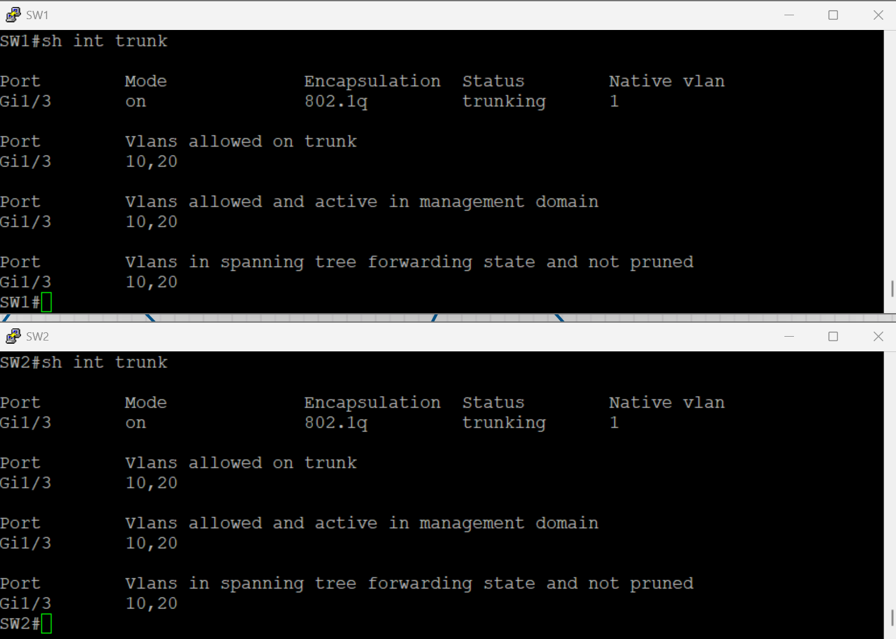
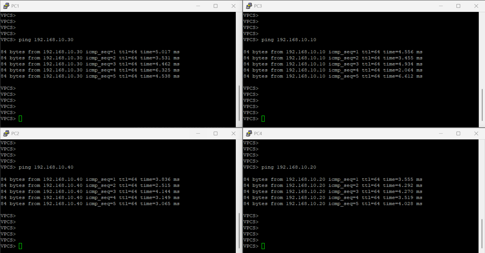

# 🖧 VLAN Configuration Lab in EVE-NG

## 🎯 Lab Objectives

- 📌 **Create VLANs and assign them to ports**  
- 📌 **Configure Trunk Ports between switches**  
- 📌 **Verify VLAN Configuration using `show vlan brief`**

---

## 🛠 Step 1: Set Up the Lab in EVE-NG

- 1️⃣ **Open EVE-NG**.
- 2️⃣ **Create a New Lab** (e.g., "VLAN_Lab").
- 3️⃣ **Add Network Devices**:
   - 🖧 **Two Cisco Switches (SW1, SW2)**
   - 🖥 **Four Virtual PCs (PC1, PC2, PC3, PC4)**
- 4️⃣ **Connect the Devices**:
   - 🔌 **PC1 → SW1 (GigabitEthernet 0/0)**
   - 🔌 **PC2 → SW1 (GigabitEthernet 0/1)**
   - 🔌 **PC3 → SW2 (GigabitEthernet 0/0)**
   - 🔌 **PC4 → SW2 (GigabitEthernet 0/1)**
   - 🔌 **SW1 → SW2 (GigabitEthernet 1/3) as Trunk**
- 5️⃣ **Diagram**:
   - 

---

## ⚙️ Step 2: Configure VLANs on SW1 and SW2

### 🔹 SW1 VLAN Configuration

#### 🏷️ Create VLANs

```bash
enable
configure terminal
vlan 10
name Sales
exit
vlan 20
name IT
exit
```

#### 🔌 Assign VLANs to Ports

```bash
interface gigabitEthernet 0/0
switchport mode access
switchport access vlan 10
exit

interface gigabitEthernet 0/1
switchport mode access
switchport access vlan 20
exit
```

### 🔹 SW2 VLAN Configuration

#### 🏷️ Create VLANs on SW2 (Same VLAN IDs)

```bash
enable
configure terminal
vlan 10
name Sales
exit
vlan 20
name IT
exit
```

#### 🔌 Assign VLANs to Ports

```bash
interface gigabitEthernet 0/0
switchport mode access
switchport access vlan 10
exit

interface gigabitEthernet 0/1
switchport mode access
switchport access vlan 20
exit
```

---

## 🔄 Step 3: Configure a Trunk Between SW1 and SW2

### 🔹 On SW1

```bash
interface gigabitEthernet 1/3
switchport trunk encapsulation dot1q
switchport mode trunk
switchport trunk allowed vlan 10,20
exit
```

### 🔹 On SW2

```bash
interface gigabitEthernet 1/3
switchport trunk encapsulation dot1q
switchport mode trunk
switchport trunk allowed vlan 10,20
exit
```

✅ **The trunk link allows VLAN 10 & VLAN 20 to communicate across switches.**

---

## 🔍 Step 4: Verify VLAN Configuration

### 📋 Check VLANs on Both Switches

```bash
show vlan brief
```
- 
✅ **You should see VLAN 10 & VLAN 20 assigned to ports.**

### 📋 Check Trunk Ports

```bash
show interfaces trunk
```
- 
✅ **Confirms that Gi1/3 is operating as a trunk.**

---

## 🌐 Step 5: Test Connectivity

### 🖥 **On PC1, assign an IP address (VLAN 10)**

```bash
ip 192.168.10.10 255.255.255.0 192.168.10.1
```

### 🖥 **On PC3, assign an IP address (VLAN 10)**

```bash
ip 192.168.10.30 255.255.255.0 192.168.10.1
```
### 🖥 **On PC2, assign an IP address (VLAN 20)**

```bash
ip 192.168.10.20 255.255.255.0 192.168.10.1
```

### 🖥 **On PC4, assign an IP address (VLAN 20)**

```bash
ip 192.168.10.40 255.255.255.0 192.168.10.1
```

### 📡 **Test Connectivity with Ping**

- **PC1 ↔ PC3 (VLAN 10) - Success** ✅
- **PC2 ↔ PC4 (VLAN 20) - Success** ✅
- **PC1 ↔ PC2 / PC3 ↔ PC4 - Should Fail** ❌

```bash
ping 192.168.10.20
```
- 
✅ **If successful, VLAN communication is working correctly.**

---