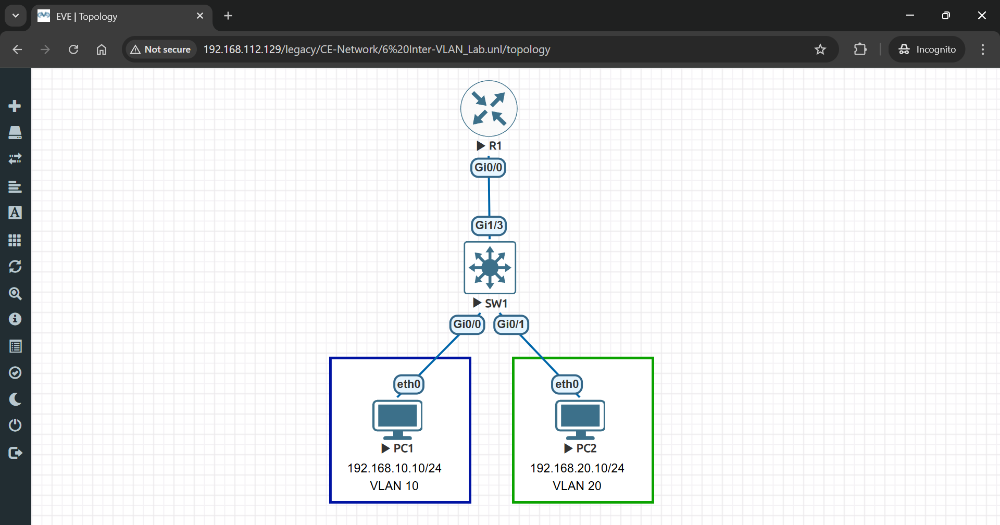

# 🚀 Inter-VLAN Routing Lab in EVE-NG

## 🔹 Lab Objectives

- **Create VLANs on the switch**  
- **Configure trunking between the switch and router**  
- **Set up subinterfaces on the router for Inter-VLAN Routing**  
- **Assign IP addresses to PCs**  
- **Test connectivity using ping**

---

## 🛠 Step 1: Set Up the Lab in EVE-NG

- 1️⃣ Open **EVE-NG**.
- 2️⃣ Create a **New Lab** (e.g., "Inter-VLAN_Lab").
- 3️⃣ **Add Devices**:
   - **One Cisco Router (R1)**
   - **One Cisco Switch (SW1)**
   - **Two Virtual PCs (PC1 & PC2)**
- 4️⃣ **Connect Devices**:
   - 🔌 **PC1 → SW1 (GigabitEthernet 0/0)**
   - 🔌 **PC2 → SW1 (GigabitEthernet 0/1)**
   - 🔌 **SW1 → R1 (GigabitEthernet 1/3) as a trunk link**
- 5️⃣ **Diagram**:
   - 

---

## 🔹 Step 2: Configure VLANs on SW1

### 1️⃣ Create VLANs
```bash
enable
configure terminal
vlan 10
name Sales
exit
vlan 20
name IT
exit
```

### 2️⃣ Assign VLANs to Ports
```bash
interface gigabitEthernet 0/0
switchport mode access
switchport access vlan 10
exit

interface gigabitEthernet 0/1
switchport mode access
switchport access vlan 20
exit
```

### 3️⃣ Verify VLAN Configuration
```bash
show vlan brief
```
- 

### 4️⃣ Configure a Trunk Link to R1
```bash
interface gigabitEthernet 1/3
switchport trunk encapsulation dot1q
switchport mode trunk
switchport trunk allowed vlan 10,20
exit
```
### 5️⃣ Verify Trunk Configuration
```bash
show interfaces trunk
```
- 

✅ **Now, the router can receive VLAN-tagged traffic from SW1.**

---

## 🔹 Step 3: Configure Router-on-a-Stick (RoaS) on R1

### 1️⃣ Configure Subinterfaces
```bash
enable
configure terminal
interface gigabitEthernet 0/0.10
encapsulation dot1Q 10
ip address 192.168.10.1 255.255.255.0
exit

interface gigabitEthernet 0/0.20
encapsulation dot1Q 20
ip address 192.168.20.1 255.255.255.0
exit

interface gigabitEthernaet 0/0
no shutdown
exit
```
### 2️⃣ Verify Router Subinterfaces
```bash
show ip interface brief
```
- 

✅ **Now, the router is ready to route between VLANs.**

---

## 🔹 Step 4: Assign IP Addresses to PCs

### 🖥 **On PC1 (VLAN 10)**
```bash
ip 192.168.10.10 255.255.255.0 192.168.10.1
```

### 🖥 **On PC2 (VLAN 20)**
```bash
ip 192.168.20.10 255.255.255.0 192.168.20.1
```

✅ **Each PC is assigned an IP within its VLAN subnet.**

---

## 🔹 Step 5: Test Inter-VLAN Connectivity

1️⃣ **From PC1, ping PC2**:
```bash
ping 192.168.20.10
```

2️⃣ **From PC2, ping PC1**:
```bash
ping 192.168.10.10
```

- 
✅ **If successful, VLAN communication is working!**

---
