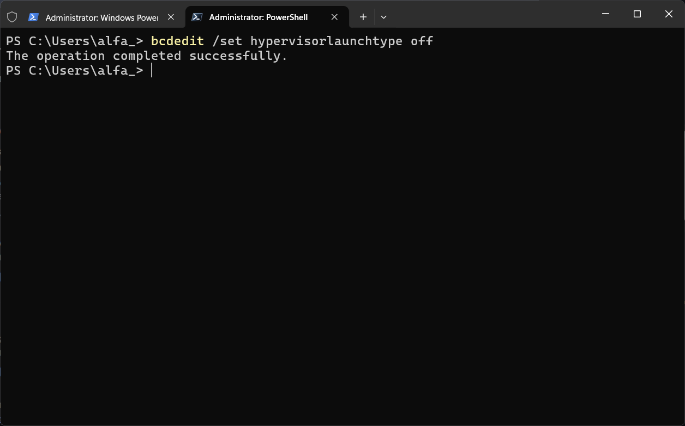
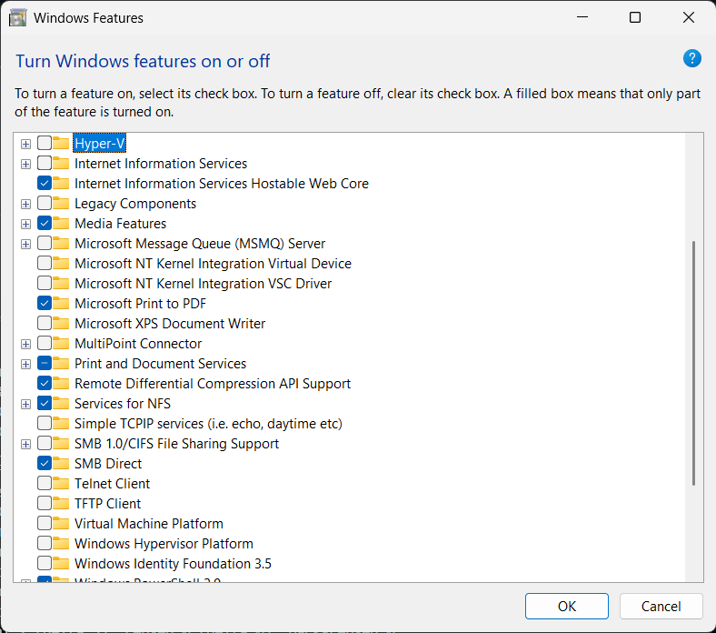
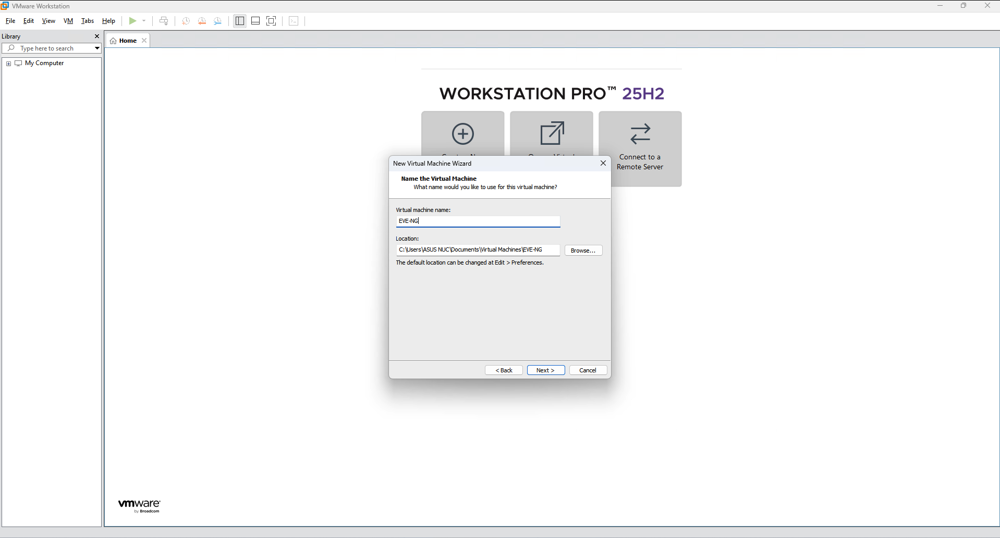
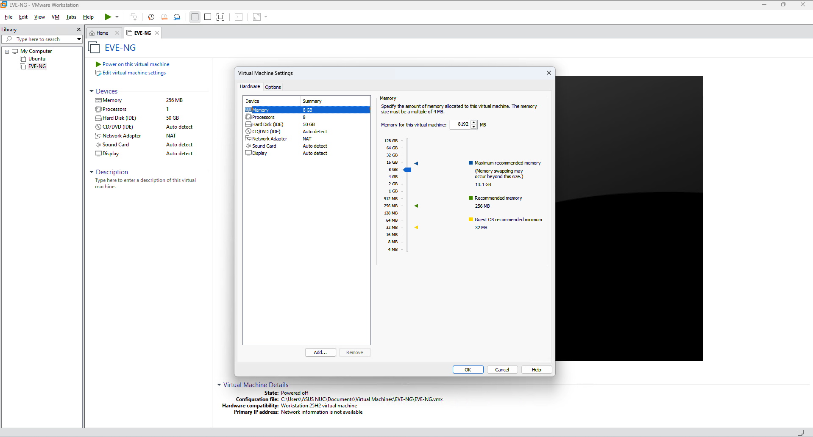
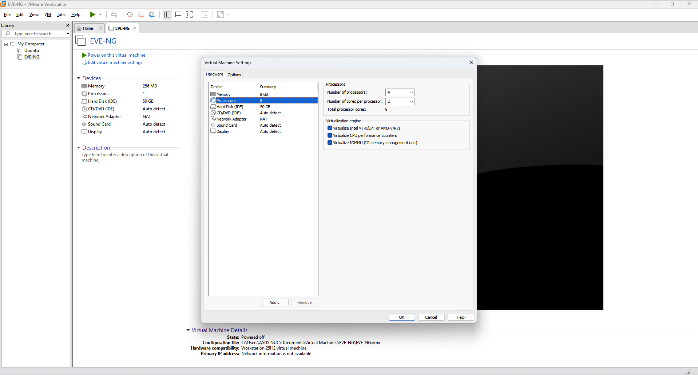
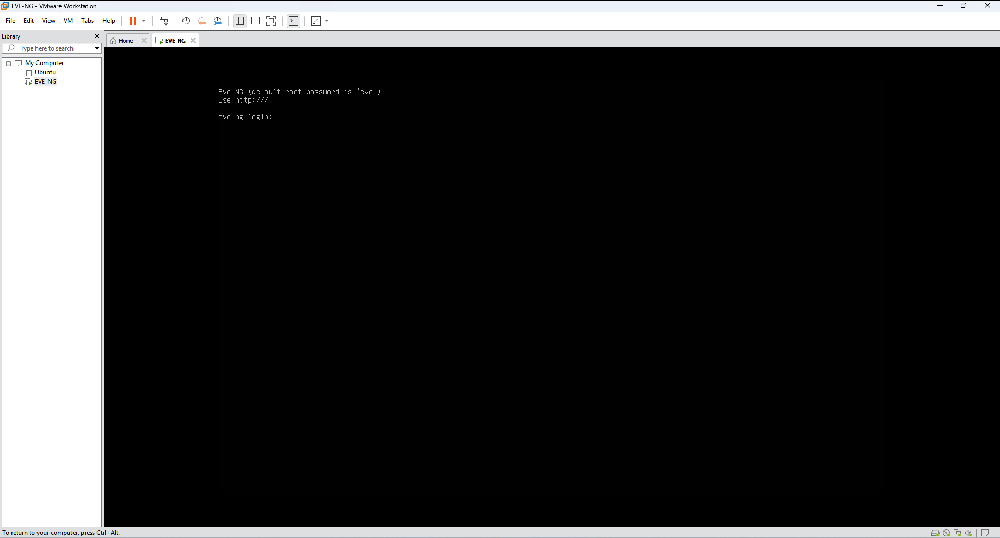
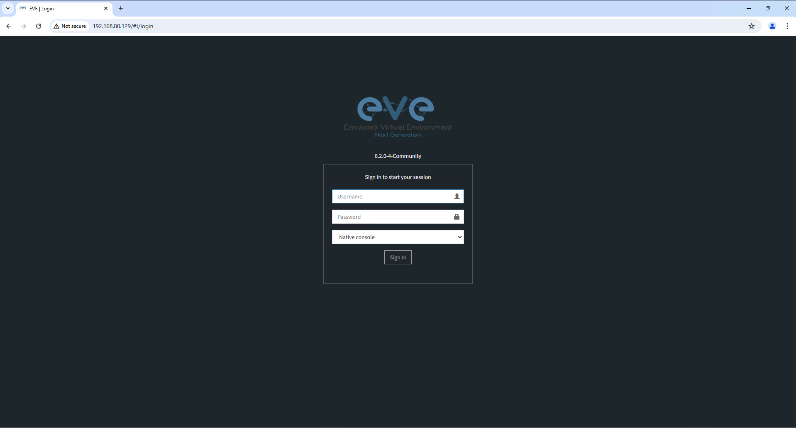

# 🚀 Lab 00: EVE-NG Installation on VMware

> Install and configure EVE-NG on VMware Workstation, preparing Windows for virtualization.

## 👤 Author

- [@alfaXphoori](https://www.github.com/alfaXphoori)

---

## 📋 Lab Info
| Item | Detail |
|------|--------|
| **Phase** | 0 - Installation |
| **Level** | ⭐ Beginner |
| **Status** | ✅ Done |
| **Est. Time** | 45-60 minutes |

---

## 🎯 Lab Objectives
- ✅ Prepare Windows environment for virtualization
- ✅ Disable Hyper-V and conflicting Windows features
- ✅ Create and configure VMware virtual machine
- ✅ Install EVE-NG operating system
- ✅ Access EVE-NG web interface

---

## ✅ Prerequisites
| Item | Details |
|------|--------|
| **VMware Workstation** | [Download](https://drive.google.com/file/d/149EBZ2zX4P6vws69DXrD-YWwnsTeMJZw/view?usp=sharing) |
| **EVE-NG ISO** | [Download](https://www.eve-ng.net/index.php/download/) |
| **RAM** | 8 GB minimum |
| **Disk Space** | 60 GB free |

---

## 🗺️ Lab Topology
```
[ Windows Host ]
      |
      | VMware Workstation
      |
[ EVE-NG VM ]  ←── Bridged Network ──→ [ Host Browser ]
  4GB RAM          http://<VM-IP>
  50GB Disk
  2-4 CPU cores
```

---

## 🛠️ Configuration

### Windows — Disable Hypervisor (Run as Administrator)
```powershell
bcdedit /set hypervisorlaunchtype off
```

### Windows — Disable Windows Features
```
optionalfeatures → Uncheck:
  ☐ Hyper-V
  ☐ Virtual Machine Platform
  ☐ Windows Hypervisor Platform
```

### VMware — VM Settings
| Setting | Value |
|---------|-------|
| Guest OS | Other 64-bit |
| VM Name | EVE-NG |
| RAM | 4096 MB |
| CPU | 1 processor, 2-4 cores |
| Disk | 50-60 GB (single file) |
| Network | Bridged (VMnet0) |
| VT-x | ✅ Virtualize Intel VT-x/EPT |

### EVE-NG Post-Install Setup
```
Login:    root / eve
Hostname: eve-ng-lab
Domain:   lab.local
IP:       DHCP
```

---

## ✅ Verification
```bash
# In EVE-NG terminal — find IP address
ifconfig
ip addr show
```

```
# Browser on host machine
http://<EVE-NG-IP>
Username: admin
Password: eve
```

---

## 📷 Screenshots














---

## 📝 Summary
EVE-NG installed on VMware with Windows Hyper-V disabled, VM configured with 4GB+ RAM and VT-x enabled. Web interface accessible at `http://<VM-IP>` with `admin/eve`.