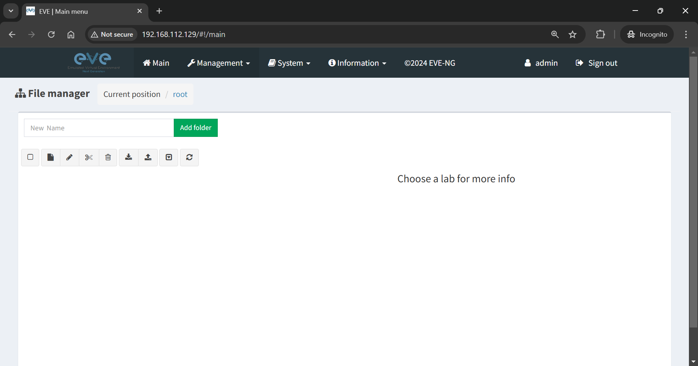
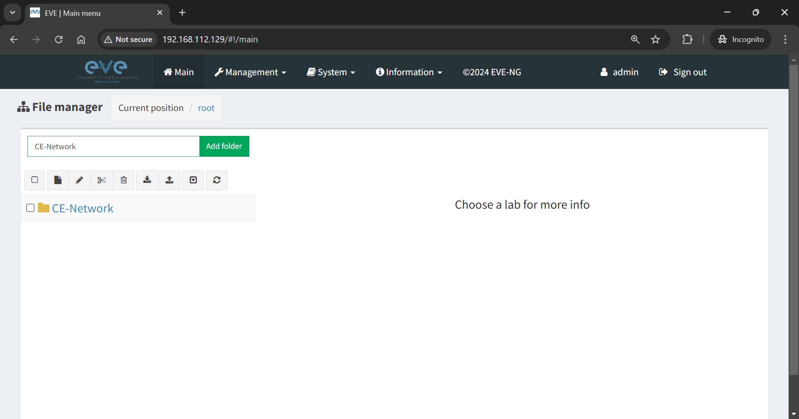
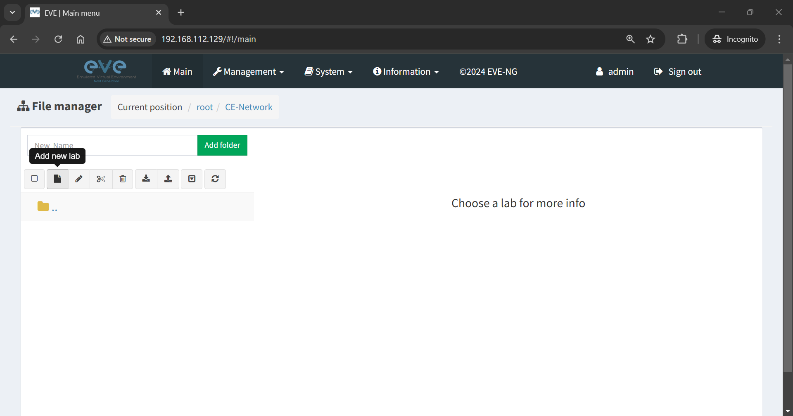
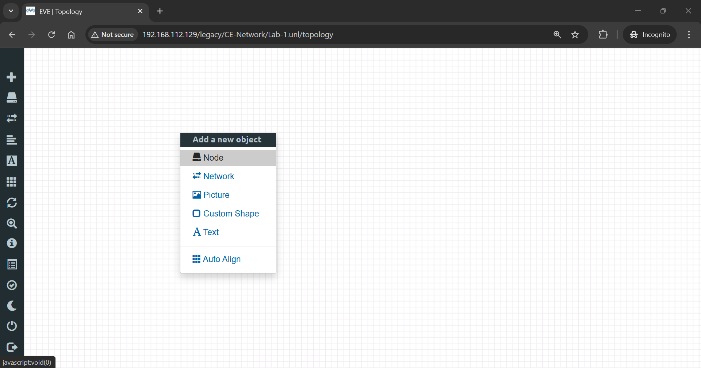
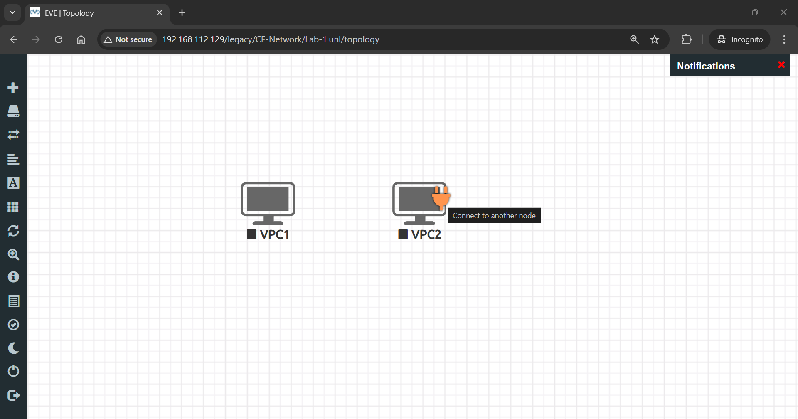
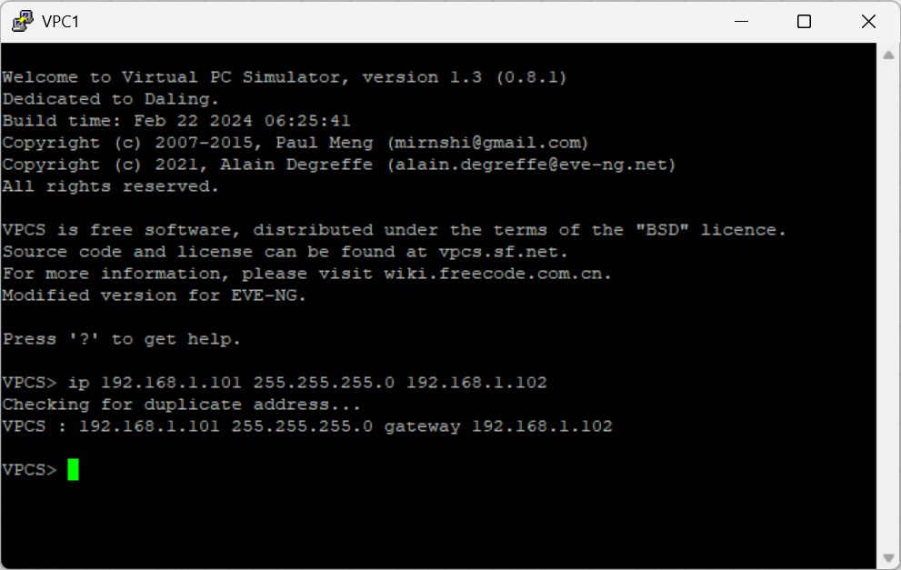
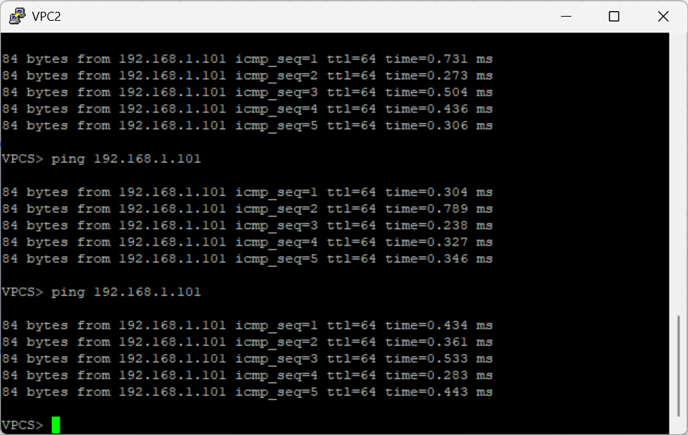

# 🌐 Lab 01: EVE-NG Web GUI & First Lab

> Navigate the EVE-NG web interface and create your first network lab with virtual PCs.

## 👤 Author

- [@alfaXphoori](https://www.github.com/alfaXphoori)

---

## 📋 Lab Info
| Item | Detail |
|------|--------|
| **Phase** | 0 - Installation |
| **Level** | ⭐ Beginner |
| **Status** | ✅ Done |
| **Est. Time** | 30 minutes |

---

## 🎯 Lab Objectives
- ✅ Navigate the EVE-NG web interface (Main, Management, System, Information)
- ✅ Create folders and labs in the file manager
- ✅ Add and connect Virtual PC (VPCS) nodes
- ✅ Configure IP addresses on VPCS
- ✅ Test network connectivity with ping

---

## ✅ Prerequisites
| Topic | Reference |
|-------|----------|
| EVE-NG Installation | Lab 00 |
| Basic IP Addressing | Networking Fundamentals |

---

## 🗺️ Lab Topology
```
[ PC1 ] ────────────────────── [ PC2 ]
192.168.1.101/24           192.168.1.102/24
```

---

## 🛠️ Configuration

### PC1
```bash
ip 192.168.1.101 255.255.255.0 192.168.1.1
```

### PC2
```bash
ip 192.168.1.102 255.255.255.0 192.168.1.1
```

### EVE-NG Web Interface Login
```
URL:      http://<EVE-NG-IP>
Username: admin
Password: eve
```

---

## ✅ Verification
```bash
# From PC1 — ping PC2
ping 192.168.1.102

# From PC2 — ping PC1
ping 192.168.1.101

# Show PC IP config
show ip
```

---

## 📷 Screenshots














---

## 📝 Summary
Created first EVE-NG lab with two VPCS nodes connected and configured with static IPs. Verified bidirectional connectivity with ping.