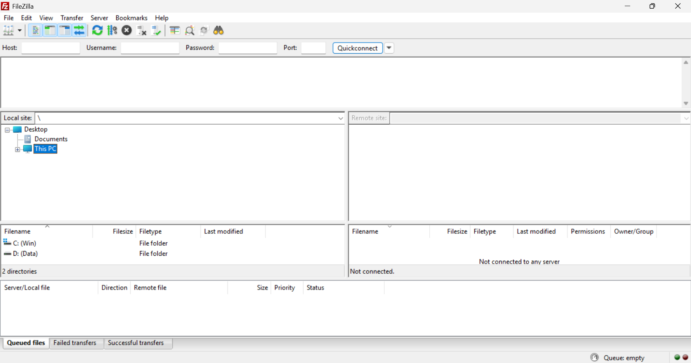
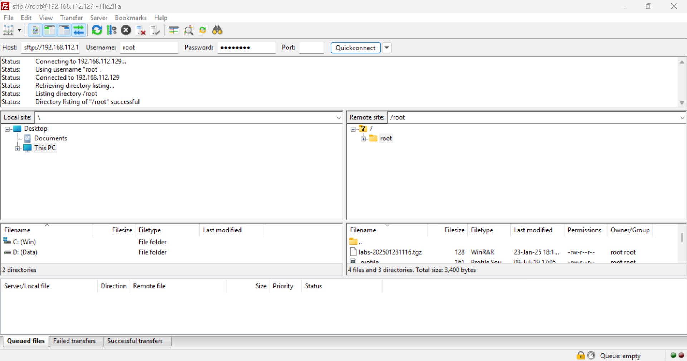
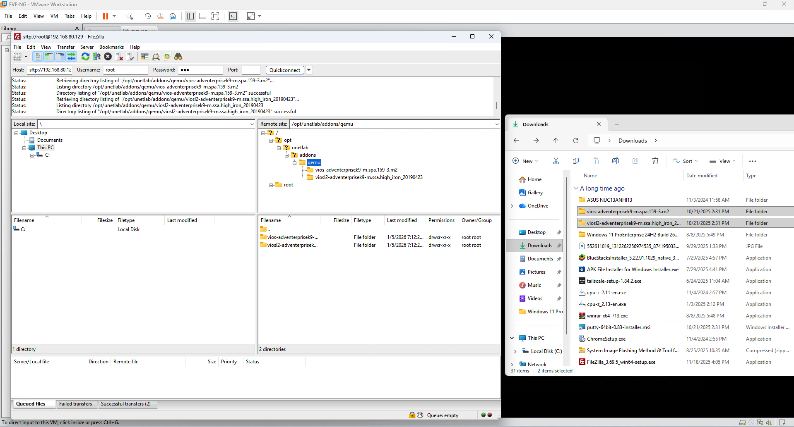
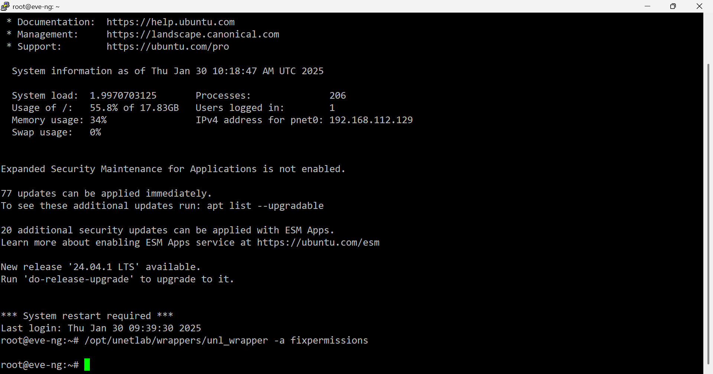
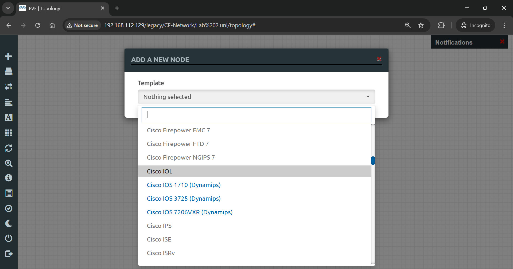

# 🖧 Lab 02: Add Router & Switch to EVE-NG

> Download, upload, and install Cisco router and switch images in EVE-NG via SFTP.

## 👤 Author

- [@alfaXphoori](https://www.github.com/alfaXphoori)

---

## 📋 Lab Info
| Item | Detail |
|------|--------|
| **Phase** | 0 - Installation |
| **Level** | ⭐ Beginner |
| **Status** | ✅ Done |
| **Est. Time** | 30-45 minutes |

---

## 🎯 Lab Objectives
- ✅ Download Cisco IOSv router and IOSvL2 switch images
- ✅ Upload images to EVE-NG via SFTP (FileZilla)
- ✅ Fix file permissions with `unl_wrapper`
- ✅ Verify images appear in EVE-NG node selection menu

---

## ✅ Prerequisites
| Topic | Reference |
|-------|----------|
| EVE-NG Installation | Lab 00 |
| FileZilla SFTP Client | [filezilla-project.org](https://filezilla-project.org) |
| Cisco Images | [Google Drive](https://drive.google.com/drive/folders/14ENNfWrLGDTylXUmcRXCpSXpMo0-dni5?usp=sharing) |

---

## 🗺️ Lab Topology
```
[ Windows Host ]
      |
      | FileZilla SFTP (port 22)
      |
[ EVE-NG VM /opt/unetlab/addons/qemu/ ]
      |
      | unl_wrapper -a fixpermissions
      |
[ Node Selection Menu — Cisco IOSv / IOSvL2 ✅ ]
```

| Image | EVE-NG Node |
|-------|------------|
| vios-adventerprisek9-m | Cisco IOSv (Router) |
| viosl2-adventerprisek9-m | Cisco IOSvL2 (Switch) |

---

## 🛠️ Configuration

### FileZilla — SFTP Connection
```
Host:     <EVE-NG-IP>
Port:     22
Username: root
Password: <root password>
Remote:   /opt/unetlab/addons/qemu/
```

### SSH — Fix Permissions
```bash
/opt/unetlab/wrappers/unl_wrapper -a fixpermissions
```

---

## ✅ Verification
```bash
# List installed images
ls -la /opt/unetlab/addons/qemu/

# Check EVE-NG service
systemctl status eve-ng
```

```
# In EVE-NG Web UI:
Add New Node → Cisco IOSv / IOSvL2 should appear in BLUE (available)
```

---

## 📷 Screenshots












---

## 📝 Summary
Cisco IOSv and IOSvL2 images uploaded to EVE-NG via FileZilla SFTP. File permissions fixed with `unl_wrapper`. Images verified as available (blue) in the EVE-NG node selection menu.