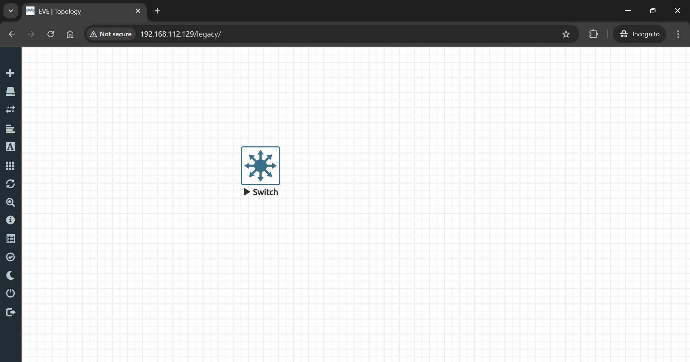
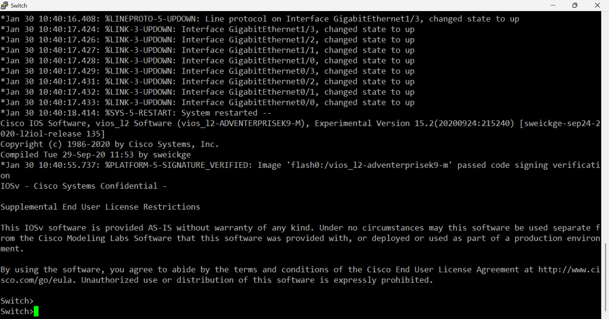

# 🖧 Lab 03: Switch Basic Configuration

> Configure Cisco switch with hostname, passwords, management IP, and SSH access.

## 👤 Author

- [@alfaXphoori](https://www.github.com/alfaXphoori)

---

## 📋 Lab Info
| Item | Detail |
|------|--------|
| **Phase** | 0 - Installation |
| **Level** | ⭐ Beginner |
| **Status** | ✅ Done |
| **Est. Time** | 30-45 minutes |

---

## 🎯 Lab Objectives
- ✅ Add Cisco IOSvL2 switch node to EVE-NG lab
- ✅ Connect via console (PuTTY)
- ✅ Configure hostname, passwords, and MOTD banner
- ✅ Assign management IP to VLAN 1
- ✅ Enable SSH with RSA key and local user

---

## ✅ Prerequisites
| Topic | Reference |
|-------|----------|
| EVE-NG Installation | Lab 00 |
| Cisco Switch Images | Lab 02 |
| PuTTY SSH Client | [putty.org](https://www.putty.org/) |

---

## 🗺️ Lab Topology
```
[ Host Machine ] ──SSH 192.168.1.100──▶ [ SW1 ]
                                       Cisco IOSvL2
                                       VLAN 1: 192.168.1.100/24
```

| Device | Interface | IP |
|--------|-----------|----|
| SW1 | VLAN 1 | 192.168.1.100/24 |
| Host | NIC | 192.168.1.x/24 |

---

## 🛠️ Configuration

### SW1 — Basic Setup
```bash
hostname SW1
enable secret cisco1234

line console 0
 password cisco
 login
exit

banner motd $
--------------------------------------------
Switch 1 : Cisco IOSvL2 : Lab Switch
--------------------------------------------
$

no ip domain-lookup
```

### SW1 — Management IP & SSH
```bash
interface vlan 1
 ip address 192.168.1.100 255.255.255.0
 no shutdown
exit

ip default-gateway 192.168.1.1
ip domain-name lab.local
crypto key generate rsa
! Enter 2048 when prompted

username admin privilege 15 secret admin1234

line vty 0 4
 transport input ssh
 login local
exit

write memory
```

---

## ✅ Verification
```bash
show running-config | include hostname
show running-config | include ssh
show ip interface vlan 1
```

```bash
# Expected output
hostname SW1
ip domain-name lab.local
ip ssh version 2
Vlan1 is up, line protocol is up
  Internet address is 192.168.1.100/24
```

---

## 📷 Screenshots




---

## 📝 Summary
Cisco IOSvL2 switch configured with hostname, console/enable passwords, management IP 192.168.1.100/24 on VLAN 1, and SSH enabled with local user authentication.