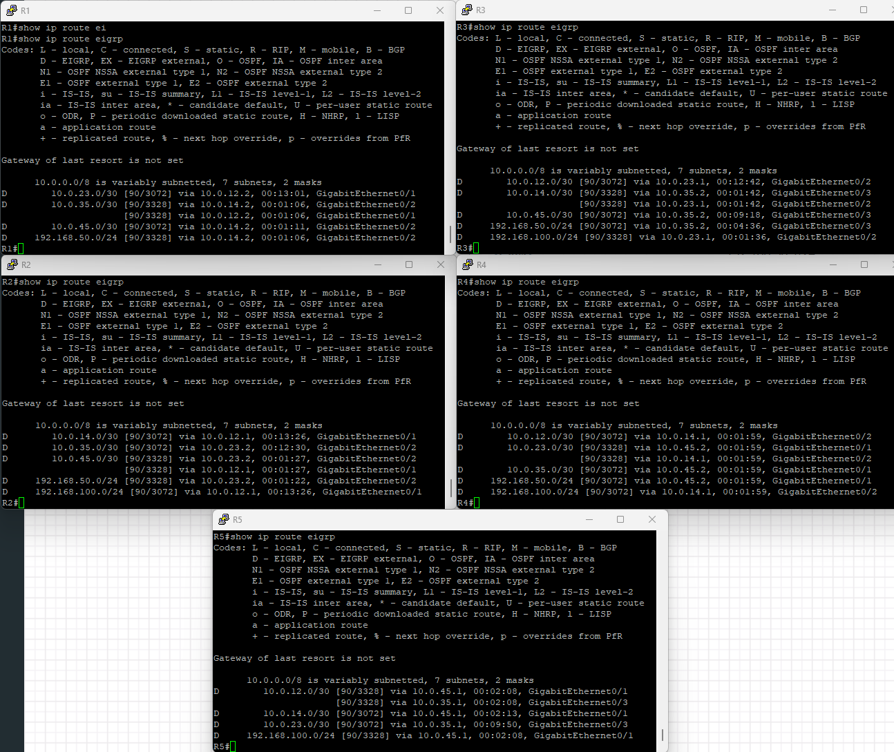

# 🚀 EIGRP Lab in EVE-NG

## 🎯 **Lab Objectives**

- 🔧 Configure **EIGRP** on all routers using only directly connected networks.
- 🔄 Verify **EIGRP neighbor relationships and routing tables**.
- 📶 Test **end-to-end connectivity** between PCs.

---

## 🛠 **Step 1: Set Up the Lab in EVE-NG**

### 📌 **Devices Used:**

- 📟 **Five Cisco Routers (R1, R2, R3, R4, R5)**
- 🖥 **Two Virtual PCs (PC1, PC2)**

### 🔌 **Network Topology & Connections:**

- **PC1** 🖥 ↔ **R1 (Gi0/0) 📟 **192.168.101 ↔ 192.168.100.1/24**
- **PC2** 🖥 ↔ **R5 (Gi0/0) 📟 **192.168.50.55 ↔ 192.168.50.1/24**
- **R1 (Gi0/1) ↔ R2 (Gi0/1)** 📟 **10.0.12.1/30 ↔ 10.0.12.2/30**
- **R1 (Gi0/2) ↔ R4 (Gi0/2)** 📟 **10.0.14.1/30 ↔ 10.0.14.2/30**
- **R2 (Gi0/2) ↔ R3 (Gi0/2)** 📟 **10.0.23.1/30 ↔ 10.0.23.2/30**
- **R3 (Gi0/3) ↔ R5 (Gi0/3)** 📟 **10.0.35.1/30 ↔ 10.0.35.2/30**
- **R4 (Gi0/1) ↔ R5 (Gi0/1)** 📟 **10.0.45.1/30 ↔ 10.0.45.2/30**

📌 **Diagram:**
- 

---

## 🔹 **Step 2: Configure IP Addresses and EIGRP on Routers**

### 📟 **On R1**

#### Configure IP Addresses

```bash
enable
configure terminal
hostname R1
interface gigabitEthernet 0/0
 ip address 192.168.100.1 255.255.255.0
 no shutdown
 exit

interface gigabitEthernet 0/1
 ip address 10.0.12.1 255.255.255.252
 no shutdown
 exit

interface gigabitEthernet 0/2
 ip address 10.0.14.1 255.255.255.252
 no shutdown
 exit
```

#### Configure EIGRP

```bash
router eigrp 100
 network 192.168.100.0 0.0.0.255
 network 10.0.12.0 0.0.0.3
 network 10.0.14.0 0.0.0.3
 no auto-summary
 exit
```

### 📟 **On R2**

#### Configure IP Addresses

```bash
enable
configure terminal
interface gigabitEthernet 0/1
 ip address 10.0.12.2 255.255.255.252
 no shutdown
 exit

interface gigabitEthernet 0/2
 ip address 10.0.23.1 255.255.255.252
 no shutdown
 exit

```

#### Configure EIGRP

```bash

router eigrp 100
 network 10.0.12.0 0.0.0.3
 network 10.0.23.0 0.0.0.3
 no auto-summary
 exit
```

### 📟 **On R3**
#### Configure IP Addresses
```bash
enable
configure terminal
interface gigabitEthernet 0/2
 ip address 10.0.23.2 255.255.255.252
 no shutdown
 exit

interface gigabitEthernet 0/3
 ip address 10.0.35.1 255.255.255.252
 no shutdown
 exit

```

#### Configure EIGRP

```bash

router eigrp 100
 network 10.0.23.0 0.0.0.3
 network 10.0.35.0 0.0.0.3
 no auto-summary
 exit
```

### 📟 **On R4**
#### Configure IP Addresses
```bash
enable
configure terminal
interface gigabitEthernet 0/2
 ip address 10.0.14.2 255.255.255.252
 no shutdown
 exit

interface gigabitEthernet 0/1
 ip address 10.0.45.1 255.255.255.252
 no shutdown
 exit
```

#### Configure EIGRP

```bash
router eigrp 100
 network 10.0.14.0 0.0.0.3
 network 10.0.45.0 0.0.0.3
 no auto-summary
 exit
```

### 📟 **On R5**
#### Configure IP Addresses
```bash
enable
configure terminal
interface gigabitEthernet 0/0
 ip address 192.168.50.1 255.255.255.0
 no shutdown
 exit

interface gigabitEthernet 0/1
 ip address 10.0.45.2 255.255.255.252
 no shutdown
 exit

interface gigabitEthernet 0/3
 ip address 10.0.35.2 255.255.255.252
 no shutdown
 exit
```

#### Configure EIGRP

```bash
router eigrp 100
 network 192.168.50.0 0.0.0.255
 network 10.0.45.0 0.0.0.3
 network 10.0.35.0 0.0.0.3
 no auto-summary
 exit
```

✅ **IP addressing and EIGRP are now configured on all routers.**

---

## 🔹 **Step 3: Verify EIGRP Configuration**

```bash
show ip eigrp neighbors
show ip route eigrp
```

- 

✅ **If neighbors are established and routes are present, EIGRP is working correctly.**

---

## 🔹 Step 4: Configure PCs and Test Connectivity

### 🖥 **On PC1**

```bash
ip 192.168.100.101 255.255.255.0 192.168.100.1
```

### 🖥 **On PC2**

```bash
ip 192.168.50.55 255.255.255.0 192.168.50.1
```

✅ **Both PCs are now in their respective networks.**

### 🔹 **Test Connectivity Between PCs**

#### **From PC1, ping PC2**

```bash
ping 192.168.50.55
```
- 

✅ **If pings are successful, EIGRP is routing traffic correctly!**
